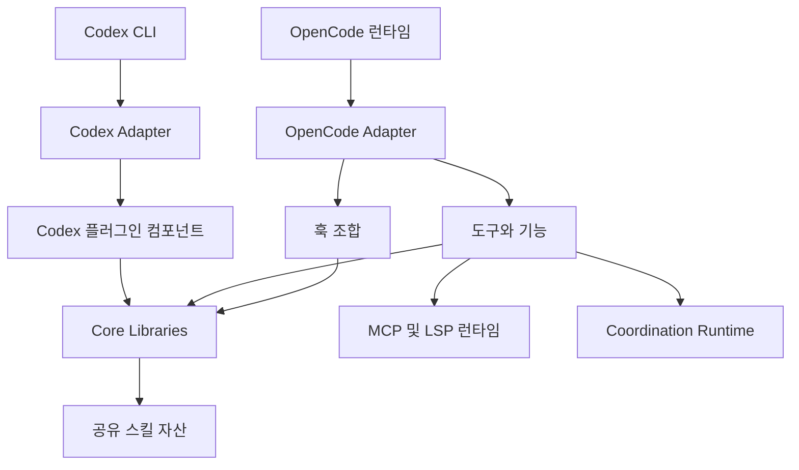

# oh-my-openagent — Wiki

ULTRAWORK MODE ENABLED!

# oh-my-opencode

`oh-my-opencode`는 OpenCode를 “배터리 포함형” 에이전트 하네스로 확장하는 플러그인입니다. 설정, 역할 기반 에이전트, 훅, 도구, MCP, LSP/AST 보조 기능, 병렬 백그라운드 실행, Team Mode까지 하나의 런타임으로 묶어 개발자가 더 구조적으로 AI 에이전트를 운용할 수 있게 합니다.

현재 저장소는 OpenCode 중심 플러그인에서 여러 하네스(OpenCode, Codex, Pi 등)를 지원하는 Agent OS 구조로 재편되는 중입니다. 기여를 시작한다면 먼저 `ROADMAP.md`를 읽고, OpenCode 쪽 변경은 [OpenCode Adapter](opencode-adapter.md), Codex Light 쪽 변경은 [Codex Adapter](codex-adapter.md)를 출발점으로 삼는 것이 좋습니다.



## 무엇을 하는 프로젝트인가

이 저장소의 기본 제품은 OpenCode 플러그인인 `oh-my-opencode`입니다. OpenCode 세션이 시작되면 플러그인은 설정을 읽고, 내장 에이전트와 도구를 구성하고, 훅 체인을 만든 뒤 OpenCode가 호출할 수 있는 플러그인 인터페이스를 제공합니다. 이 흐름은 [OpenCode Bootstrap And Interface](opencode-bootstrap-and-interface.md), [OpenCode Plugin Handlers](opencode-plugin-handlers.md), [OpenCode Hook Composition](opencode-hook-composition.md)에 나뉘어 설명되어 있습니다.

동시에 저장소는 Codex용 Light Edition인 `omo-codex`, 즉 LazyCodex도 포함합니다. LazyCodex는 Codex CLI에 플러그인 번들, 훅 컴포넌트, LSP/MCP 보조 기능, 설정 마이그레이션, 설치 텔레메트리를 배치합니다. 이 경로는 [Codex Installer And Telemetry](codex-installer-and-telemetry.md), [Codex Plugin Components](codex-plugin-components.md), [Codex Plugin Shared Runtime](codex-plugin-shared-runtime.md)를 함께 보면 전체 그림이 잡힙니다.

두 어댑터는 서로 다른 런타임 표면을 다루지만, 반복되는 판단과 유틸리티는 [Core Libraries](core-libraries.md)에 모여 있습니다. 예를 들어 `utils`, `rules-engine`, `skills-loader-core`, `model-core`, `delegate-core`, `telemetry-core` 같은 패키지는 하네스별 어댑터가 공통으로 쓰는 기반 로직을 제공합니다.

## 큰 구조

OpenCode 쪽의 중심은 `packages/omo-opencode`입니다. 이 계층은 플러그인 초기화, 설정 병합, 에이전트와 도구 등록, 훅 실행, CLI 명령, Team Mode, OpenClaw 연동을 OpenCode 런타임에 맞게 조립합니다. 기능 구현을 찾을 때는 먼저 [OpenCode Features](opencode-features.md), 도구 표면을 찾을 때는 [OpenCode Tools](opencode-tools.md), 명령 실행과 설치 흐름은 [OpenCode CLI](opencode-cli.md)를 보면 됩니다.

Codex 쪽의 중심은 `packages/omo-codex`입니다. 설치 시점에는 플러그인 캐시, 마켓플레이스 스냅샷, `config.toml`, 실행 파일 링크를 맞추고, 실행 시점에는 Codex 훅 이벤트를 받아 `comment-checker`, `rules`, `lsp`, `ulw-loop`, `telemetry` 같은 컴포넌트를 구동합니다.

언어 서버와 외부 도구 실행은 [MCP And LSP Runtime](mcp-and-lsp-runtime.md)이 담당합니다. `mcp-stdio-core`는 stdio JSON-RPC 루프를 제공하고, `lsp-tools-mcp`, `lsp-daemon`, `git-bash-mcp`, `mcp-client-core`가 그 위에서 실제 도구 호출과 프로세스 연결을 처리합니다.

여러 에이전트나 외부 채널을 함께 다루는 영역은 [Coordination Runtime](coordination-runtime.md)에 모여 있습니다. `team-core`는 Team Mode의 상태, 메일박스, 작업 큐, 워크트리를 관리하고, `openclaw-core`는 세션 이벤트를 외부 채널로 내보내거나 원격 답장을 다시 주입합니다. 공유 스킬 번들은 [shared skills source](shared-skills-source.md)를 통해 OpenCode와 Codex가 같은 구조로 소비합니다.

## 주요 실행 흐름

OpenCode 실행 흐름은 부팅에서 시작합니다. 플러그인 서버가 호출되면 설정 컨텍스트를 초기화하고, 사용자 및 프로젝트 설정을 병합한 뒤, 에이전트 정렬과 기능 플래그를 결정합니다. 이후 매니저, 도구, 훅을 생성하고 마지막으로 OpenCode 훅 핸들러를 노출합니다. 실제 요청이 들어오면 `chat.message`, `tool.execute.before`, `tool.execute.after`, `event`, `experimental.chat.messages.transform` 같은 훅이 조합되어 컨텍스트 주입, 도구 보호, 출력 후처리, 자동 복구를 수행합니다.

MCP OAuth 흐름은 외부 MCP 서버와 연결할 때 중요합니다. 로그인 요청은 인증 URL로 이동하고, 토큰을 받아 저장소 경로를 계산한 뒤, 서버 호스트와 리소스를 정규화해 안전하게 키를 만듭니다. 이 흐름은 OpenCode 기능 코드와 `mcp-client-core`의 설정 경로 해석이 함께 동작하는 대표적인 교차 모듈 흐름입니다.

컨텍스트 창 복구 흐름도 저장소의 성격을 잘 보여 줍니다. 이벤트 훅이 컨텍스트 한계 상황을 감지하면 중복 제거 복구를 시도하고, OpenCode 저장소 백엔드와 버전을 확인한 뒤, 필요한 경우 메시지 데이터를 정리합니다. 이 과정은 훅, 공유 유틸리티, 버전 감지 로직이 함께 맞물리는 경로입니다.

Codex 실행 흐름은 설치와 세션 실행으로 나뉩니다. 설치 단계에서는 `runCodexInstaller()`가 Codex 홈 아래에 플러그인과 마켓플레이스 메타데이터를 배치합니다. 세션 실행 단계에서는 Codex 훅 이벤트가 각 컴포넌트 CLI로 전달되고, 공통 런타임이 자동 업데이트와 설정 정합성을 유지합니다.

## 처음 빌드하고 확인하기

일반적인 개발 루프는 다음 스크립트에서 시작합니다.

```bash
bun install
bun run build
bun run typecheck
bun test
```

Codex Light 관련 변경을 다룬다면 다음 검증도 함께 봐야 합니다.

```bash
bun run build:codex-plugin
bun run build:codex-install
bun run test:codex
```

OpenCode 플러그인, Codex 플러그인, MCP 런타임, 스키마, 바이너리 산출물을 모두 확인해야 하는 경우에는 `build:all`, `build:binaries`, `build:schema`, `build:lsp-tools-mcp`, `build:lsp-daemon`, `build:git-bash-mcp`가 관련됩니다. 저장소 구조나 위키가 오래되었다면 `bun run gitnexus:analyze`와 `bun run gitnexus:wiki`로 코드 인덱스와 문서를 갱신할 수 있습니다.

## 읽는 순서

처음 온 개발자는 먼저 이 페이지로 전체 구조를 잡고, 제품 런타임을 기준으로 다음 문서를 이어 읽으면 됩니다. OpenCode 플러그인 동작을 바꾸려면 [OpenCode Adapter](opencode-adapter.md)에서 시작해 훅, 기능, 도구 문서로 내려가면 됩니다. Codex 설치나 LazyCodex 동작을 바꾸려면 [Codex Adapter](codex-adapter.md)를 먼저 보세요. 공통 로직을 고치려면 [Core Libraries](core-libraries.md)를 통해 어떤 코어 패키지가 책임을 갖는지 확인하고, 외부 도구나 언어 서버 호출 문제라면 [MCP And LSP Runtime](mcp-and-lsp-runtime.md)을 보면 됩니다.

웹사이트, 배포 스크립트, npm 릴리스, LazyCodex 마켓플레이스 동기화는 런타임 플러그인과 분리된 지원 계층입니다. 이 영역은 [Web And Automation Source](web-and-automation-source.md)가 안내합니다.

## 문서 인덱스

코드 그래프에 포함되지 않는 프로젝트 문서 목록은 [Documentation Index](documentation-index.md)에서 함께 확인합니다.
