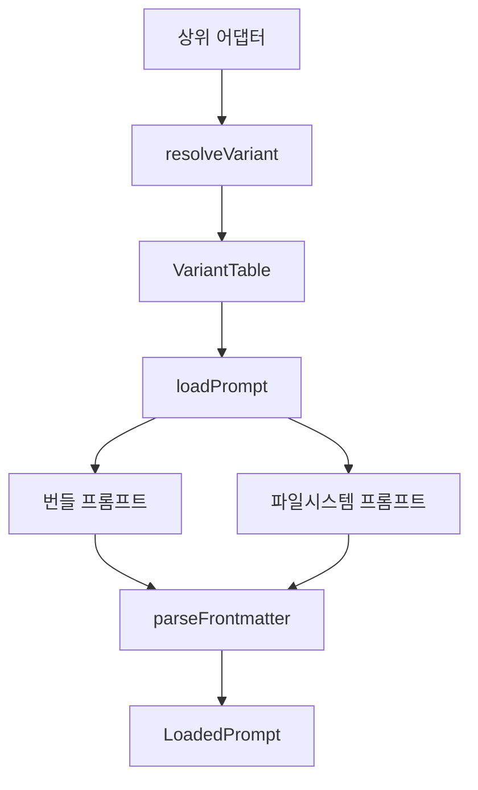

# prompts core

## prompts core 모듈

`packages/prompts-core`는 에이전트와 실행 모드가 사용할 프롬프트 원문을 한곳에서 관리하는 코어 모듈입니다. 이 모듈은 번들된 Markdown 프롬프트를 타입 안정적인 variant table로 노출하고, 모델 ID나 에이전트 이름을 기준으로 적절한 프롬프트 변형을 선택하며, 필요하면 파일시스템에서 프롬프트를 읽어 frontmatter와 본문을 분리해 반환합니다.

이 모듈은 특정 런타임이나 어댑터에 직접 의존하지 않습니다. 대신 `@oh-my-opencode/model-core`의 모델 판별 함수와 `@oh-my-opencode/utils`의 `parseFrontmatter`만 사용해, OpenCode 어댑터나 Codex 어댑터 같은 상위 계층이 동일한 프롬프트 로딩 규칙을 재사용할 수 있게 합니다.

## 공개 API

모듈의 public surface는 `packages/prompts-core/src/index.ts`에서 정의됩니다.

주요 export는 다음과 같습니다.

- `atlasPromptVariants`
- `prometheusPromptVariants`
- `ultraworkPromptVariants`
- `codexUltraworkPromptVariants`
- `ULTRAWORK_DEFAULT_PROMPT`
- `ULTRAWORK_GEMINI_PROMPT`
- `ULTRAWORK_GPT_PROMPT`
- `ULTRAWORK_PLANNER_PROMPT`
- `CODEX_ULTRAWORK_PROMPT`
- `HYPERPLAN_MODE_PROMPT`
- `TEAM_MODE_PROMPT`
- `resolveVariant`
- `loadPrompt`
- `loadPromptSync`
- `PromptFileNotFoundError`
- `PromptPathTraversalError`

타입 export는 다음 흐름을 구성합니다.

- `PromptSource`: 프롬프트 원천입니다. `FilesystemPromptSource` 또는 `BundledPromptSource`입니다.
- `VariantTable`: variant 이름을 `PromptSource`에 매핑하는 읽기 전용 테이블입니다.
- `LoadPromptInput`: 번들 프롬프트 입력과 파일시스템 프롬프트 입력의 union입니다.
- `LoadedPrompt<TFrontmatter>`: 로딩된 프롬프트의 frontmatter, 본문, 파일 경로, 파싱 상태를 담는 결과 타입입니다.
- `RuntimeInjection`, `SyncRuntimeInjection`: 프롬프트 본문 내 placeholder를 런타임 값으로 치환하기 위한 resolver 정의입니다.

## 전체 구조



상위 계층은 보통 다음 순서로 이 모듈을 사용합니다.

1. 사용할 프롬프트 묶음의 variant table을 고릅니다.
2. `resolveVariant()`로 모델과 에이전트에 맞는 variant 이름을 결정합니다.
3. variant table에서 `PromptSource`를 가져옵니다.
4. `loadPrompt()` 또는 `loadPromptSync()`로 frontmatter가 분리된 `LoadedPrompt`를 얻습니다.

## 프롬프트 variant 테이블

프롬프트 variant 테이블은 “프롬프트 이름별로 어떤 변형이 번들되어 있는가”를 표현합니다. 각 항목은 `BundledPromptSource` 형태이며 `kind`, `content`, `filePath`를 가집니다.

### `atlasPromptVariants`

`atlas-prompts.ts`는 Atlas 에이전트용 프롬프트 변형을 제공합니다.

지원하는 variant는 다음과 같습니다.

- `opus-4-7`
- `gpt`
- `gemini`
- `kimi-k2-7`
- `kimi`
- `default`

각 variant는 `packages/prompts-core/prompts/atlas/*.md` 파일의 번들된 내용을 가리킵니다. 예를 들어 `gpt`는 `packages/prompts-core/prompts/atlas/gpt.md`, `default`는 `packages/prompts-core/prompts/atlas/default.md`를 사용합니다.

### `prometheusPromptVariants`

`prometheus-prompts.ts`는 Prometheus용 프롬프트 variant table입니다.

현재는 `default` variant만 제공합니다.

```ts
export const prometheusPromptVariants = {
  default: {
    kind: "bundled",
    content: defaultPrompt,
    filePath: "packages/prompts-core/prompts/prometheus/default.md",
  },
} satisfies VariantTable
```

Prometheus는 variant resolver에서 특별 취급됩니다. `agentName`이 `prometheus`이고 variant table에 `planner`가 있으면 `planner`가 우선 선택됩니다. 다만 현재 `prometheusPromptVariants` 자체에는 `planner`가 없으므로 이 특례는 `planner` variant를 가진 다른 프롬프트 테이블과 조합될 때 의미가 있습니다.

### `ultraworkPromptVariants`

`ultrawork-prompts.ts`는 Ultrawork용 프롬프트를 두 방식으로 노출합니다.

첫째, 원문 문자열 상수입니다.

- `ULTRAWORK_DEFAULT_PROMPT`
- `ULTRAWORK_GEMINI_PROMPT`
- `ULTRAWORK_GPT_PROMPT`
- `ULTRAWORK_PLANNER_PROMPT`
- `CODEX_ULTRAWORK_PROMPT`

둘째, variant table입니다.

- `ultraworkPromptVariants`: `planner`, `gpt`, `gemini`, `default`
- `codexUltraworkPromptVariants`: `codex`

이 분리는 일반 Ultrawork 프롬프트와 Codex 전용 Ultrawork 프롬프트를 명시적으로 구분합니다. Codex 쪽 호출자는 `codexUltraworkPromptVariants`를 사용해 `codex` variant만 선택하게 만들 수 있습니다.

## 모델 기반 variant 선택

`variant-resolver.ts`의 핵심 함수는 `resolveVariant()`입니다.

```ts
export function resolveVariant(input: ResolveVariantInput): string
```

입력 타입은 다음과 같습니다.

```ts
export type ResolveVariantInput = {
  readonly modelID?: string
  readonly agentName?: string
  readonly variants: VariantTable
}
```

선택 순서는 명확합니다.

1. `variants`가 비어 있으면 `TypeError`를 던집니다.
2. `agentName`이 planner 에이전트이고 `planner` variant가 있으면 `planner`를 반환합니다.
3. `modelID`가 있으면 variant 이름 순서대로 모델 matcher를 적용합니다.
4. `default` variant가 있으면 `default`를 반환합니다.
5. 마지막 fallback으로 첫 번째 variant 이름을 반환합니다.

현재 planner 에이전트 이름은 `PLANNER_AGENT_NAMES`에 의해 `prometheus`로 고정되어 있습니다. 비교는 `agentName.toLowerCase()`로 수행됩니다.

모델 매칭은 `MODEL_MATCHERS`에 등록된 함수로 처리됩니다.

| variant | matcher |
| --- | --- |
| `gpt` | `isGptModel` |
| `gemini` | `isGeminiModel` |
| `kimi-k2-7` | `isKimiK27Model` |
| `kimi` | `isKimiK2Model` |
| `glm` | `isGlmModel` |
| `opus-4-7` | `isClaudeOpus47Model` |
| `minimax` | `isMiniMaxModel` |

`matchesModelVariant()`는 variant 이름에 대응하는 matcher가 없으면 `false`를 반환합니다. 따라서 variant table에 임의의 이름을 추가할 수는 있지만, 모델 ID 기반 자동 선택을 원한다면 `MODEL_MATCHERS`에도 해당 이름을 등록해야 합니다.

```ts
const MODEL_MATCHERS: Readonly<Record<string, ModelMatcher>> = {
  gpt: isGptModel,
  gemini: isGeminiModel,
  "kimi-k2-7": isKimiK27Model,
  kimi: isKimiK2Model,
  glm: isGlmModel,
  "opus-4-7": isClaudeOpus47Model,
  minimax: isMiniMaxModel,
}
```

## 프롬프트 로딩

`loader.ts`는 번들 프롬프트와 파일시스템 프롬프트를 같은 결과 타입으로 정규화합니다.

### `loadPrompt()`

`loadPrompt()`는 overload를 사용합니다.

```ts
export function loadPrompt<TFrontmatter = Record<string, unknown>>(
  input: LoadBundledPromptInput
): LoadedPrompt<TFrontmatter>

export function loadPrompt<TFrontmatter = Record<string, unknown>>(
  input: LoadFilesystemPromptInput
): Promise<LoadedPrompt<TFrontmatter>>
```

번들 프롬프트는 이미 문자열로 import되어 있으므로 동기적으로 처리됩니다. 파일시스템 프롬프트는 `node:fs/promises`의 `readFile()`을 사용하므로 `Promise`를 반환합니다.

실제 분기는 `isLoadBundledPromptInput()`으로 결정됩니다.

```ts
function isLoadBundledPromptInput(input: LoadPromptInput): input is LoadBundledPromptInput {
  return input.source.kind === "bundled"
}
```

주의할 점은 `FilesystemPromptSource`의 `kind`가 optional이라는 점입니다.

```ts
export type FilesystemPromptSource = {
  readonly kind?: "filesystem"
  readonly baseDir: string
}
```

따라서 `source.kind !== "bundled"`인 입력은 파일시스템 프롬프트로 처리됩니다.

### `loadPromptSync()`

`loadPromptSync()`는 번들 프롬프트 전용 동기 API입니다.

```ts
export function loadPromptSync<TFrontmatter = Record<string, unknown>>(
  input: LoadBundledPromptInput
): LoadedPrompt<TFrontmatter>
```

내부에서는 `loadBundledPrompt()`만 호출합니다. 파일시스템 입력은 받지 않으므로, 디스크 I/O가 필요한 경로에서는 `loadPrompt()`를 사용해야 합니다.

## 번들 프롬프트 처리

번들 프롬프트는 `loadBundledPrompt()`에서 처리됩니다.

```ts
function loadBundledPrompt<TFrontmatter = Record<string, unknown>>(
  input: LoadBundledPromptInput
): LoadedPrompt<TFrontmatter>
```

처리 순서는 다음과 같습니다.

1. `input.source.content`를 `parseFrontmatter<TFrontmatter>()`에 전달합니다.
2. frontmatter가 제거된 `parsed.body`에 `applyRuntimeInjectionsSync()`를 적용합니다.
3. `LoadedPrompt<TFrontmatter>`를 반환합니다.

반환 객체는 다음 필드를 포함합니다.

```ts
{
  frontmatter: parsed.data,
  body,
  hadFrontmatter: parsed.hadFrontmatter,
  parseError: parsed.parseError,
  filePath: input.source.filePath,
}
```

`filePath`는 실제 런타임에서 파일을 읽는 데 쓰이지 않지만, 디버깅과 오류 보고에서 어떤 번들 프롬프트가 사용되었는지 추적하기 위한 메타데이터로 유지됩니다.

## 파일시스템 프롬프트 처리

파일시스템 프롬프트는 `loadFilesystemPrompt()`에서 처리됩니다.

```ts
async function loadFilesystemPrompt<TFrontmatter = Record<string, unknown>>(
  input: LoadFilesystemPromptInput
): Promise<LoadedPrompt<TFrontmatter>>
```

처리 순서는 다음과 같습니다.

1. `resolvePromptFilePath(input.source.baseDir, input.name, input.variant)`로 실제 경로를 계산합니다.
2. `readPromptFile(input.name, input.variant, filePath)`로 Markdown 파일을 읽습니다.
3. `parseFrontmatter<TFrontmatter>(content)`로 frontmatter와 body를 분리합니다.
4. `applyRuntimeInjections(parsed.body, input.inject ?? [])`로 비동기 runtime injection을 적용합니다.
5. `LoadedPrompt<TFrontmatter>`를 반환합니다.

파일 경로는 다음 규칙으로 만들어집니다.

```ts
const filePath = resolve(resolvedBaseDir, promptName, `${variant}.md`)
```

즉 `baseDir` 아래에 프롬프트 이름 디렉터리가 있고, 그 안에 variant 이름의 Markdown 파일이 있다고 가정합니다.

예를 들어 다음 입력은:

```ts
await loadPrompt({
  source: { baseDir: "/repo/prompts" },
  name: "atlas",
  variant: "gpt",
})
```

다음 파일을 읽으려 합니다.

```text
/repo/prompts/atlas/gpt.md
```

## 경로 탈출 방지

파일시스템 프롬프트는 사용자 또는 프로젝트 설정과 연결될 수 있으므로 경로 검증이 중요합니다. `resolvePromptFilePath()`는 `baseDir` 바깥으로 나가는 경로를 차단합니다.

```ts
function resolvePromptFilePath(baseDir: string, promptName: string, variant: string): string {
  const resolvedBaseDir = resolve(baseDir)
  const filePath = resolve(resolvedBaseDir, promptName, `${variant}.md`)
  const relativePath = relative(resolvedBaseDir, filePath)
  if (relativePath.startsWith("..") || isAbsolute(relativePath)) {
    throw new PromptPathTraversalError(promptName, variant)
  }
  return filePath
}
```

검증 기준은 두 가지입니다.

- `relativePath.startsWith("..")`이면 기준 디렉터리 밖으로 나간 것입니다.
- `isAbsolute(relativePath)`이면 상대 경로 계산 결과가 안전한 내부 경로가 아닙니다.

이 조건에 걸리면 `PromptPathTraversalError`가 발생합니다.

```ts
export class PromptPathTraversalError extends Error {
  readonly name = "PromptPathTraversalError"

  constructor(
    readonly promptName: string,
    readonly variant: string
  ) {
    super(`Prompt path escapes source directory for ${promptName}/${variant}`)
  }
}
```

이 검사는 `promptName`이나 `variant`에 `..` 같은 값이 들어와도 `baseDir` 밖의 파일을 읽지 못하게 합니다.

## 파일 없음 오류

파일시스템 프롬프트를 읽을 때 파일이 없으면 `PromptFileNotFoundError`가 발생합니다.

```ts
export class PromptFileNotFoundError extends Error {
  readonly name = "PromptFileNotFoundError"

  constructor(
    readonly promptName: string,
    readonly variant: string,
    readonly filePath: string,
    options?: ErrorOptions
  ) {
    super(`Prompt file not found for ${promptName}/${variant}: ${filePath}`, options)
  }
}
```

`readPromptFile()`은 `readFile()`에서 발생한 오류의 `code`가 `ENOENT`인지 확인합니다.

```ts
async function readPromptFile(promptName: string, variant: string, filePath: string): Promise<string> {
  try {
    return await readFile(filePath, "utf8")
  } catch (error) {
    if (error instanceof Error && getErrorCode(error) === "ENOENT") {
      throw new PromptFileNotFoundError(promptName, variant, filePath, { cause: error })
    }
    throw error
  }
}
```

`getErrorCode()`는 Node.js 오류 객체의 `code` 필드를 안전하게 읽기 위한 작은 helper입니다. `code`가 문자열일 때만 반환하고, 없거나 문자열이 아니면 `undefined`를 반환합니다.

## Runtime injection

runtime injection은 프롬프트 본문에 들어 있는 placeholder를 실행 시점 값으로 치환하는 기능입니다. frontmatter가 제거된 body에만 적용됩니다.

비동기 파일시스템 로딩에서는 `RuntimeInjection`을 사용합니다.

```ts
export type RuntimeInjection = {
  readonly placeholder: string
  readonly resolver: () => string | Promise<string>
}
```

번들 동기 로딩에서는 `SyncRuntimeInjection`을 사용합니다.

```ts
export type SyncRuntimeInjection = {
  readonly placeholder: string
  readonly resolver: () => string
}
```

두 구현 모두 `replaceAll()`을 사용해 같은 placeholder가 여러 번 등장해도 전부 치환합니다.

```ts
async function applyRuntimeInjections(
  body: string,
  injections: readonly RuntimeInjection[]
): Promise<string> {
  let renderedBody = body
  for (const injection of injections) {
    renderedBody = renderedBody.replaceAll(injection.placeholder, await injection.resolver())
  }
  return renderedBody
}
```

```ts
function applyRuntimeInjectionsSync(
  body: string,
  injections: readonly SyncRuntimeInjection[]
): string {
  let renderedBody = body
  for (const injection of injections) {
    renderedBody = renderedBody.replaceAll(injection.placeholder, injection.resolver())
  }
  return renderedBody
}
```

injection은 배열 순서대로 적용됩니다. 앞선 injection 결과에 다음 injection이 다시 매칭될 수 있으므로, 서로 겹치는 placeholder를 사용할 때는 순서가 의미를 가질 수 있습니다.

## Frontmatter 파싱

프롬프트 내용은 `@oh-my-opencode/utils`의 `parseFrontmatter()`로 파싱됩니다. 이 모듈은 frontmatter 파싱 로직을 직접 구현하지 않고, 결과만 `LoadedPrompt` 형태로 전달합니다.

`LoadedPrompt<TFrontmatter>`는 다음 구조입니다.

```ts
export type LoadedPrompt<TFrontmatter = Record<string, unknown>> = {
  readonly frontmatter: TFrontmatter
  readonly body: string
  readonly hadFrontmatter: boolean
  readonly parseError: boolean
  readonly filePath: string
}
```

호출자는 `TFrontmatter` 제네릭으로 기대하는 frontmatter 타입을 지정할 수 있습니다. 파싱 실패 여부는 `parseError`에 남고, frontmatter 존재 여부는 `hadFrontmatter`로 구분됩니다.

## 모드 프롬프트

`mode-prompts.ts`는 팀 모드와 Hyperplan 모드에서 쓰는 프롬프트를 문자열 상수로 제공합니다.

```ts
export const HYPERPLAN_MODE_PROMPT = stripFinalLineFeed(hyperplanModePrompt)
export const TEAM_MODE_PROMPT = stripFinalLineFeed(teamModePrompt)
```

여기서는 일반 Markdown import가 아니라 import attribute를 사용합니다.

```ts
import hyperplanModePrompt from "../prompts/mode/hyperplan.md" with { type: "text" }
import teamModePrompt from "../prompts/mode/team.md" with { type: "text" }
```

`stripFinalLineFeed()`는 마지막 문자가 `\n`이면 제거합니다.

```ts
function stripFinalLineFeed(prompt: string): string {
  return prompt.endsWith("\n") ? prompt.slice(0, -1) : prompt
}
```

이 상수들은 프롬프트를 메시지나 시스템 지시문에 직접 삽입할 때 불필요한 마지막 줄바꿈을 없애기 위한 형태로 제공됩니다.

## 일반 사용 패턴

### 모델 ID로 번들 프롬프트 선택하기

```ts
import { atlasPromptVariants, loadPromptSync, resolveVariant } from "@oh-my-opencode/prompts-core"

const variant = resolveVariant({
  modelID: "gpt-5.5",
  variants: atlasPromptVariants,
})

const prompt = loadPromptSync({
  source: atlasPromptVariants[variant],
  name: "atlas",
  variant,
})

console.log(prompt.body)
```

이 패턴에서는 `resolveVariant()`가 `modelID`를 보고 `gpt` variant를 선택할 수 있습니다. 이후 `loadPromptSync()`가 번들 문자열에서 frontmatter를 분리하고 본문을 반환합니다.

### 파일시스템 프롬프트 읽기

```ts
import { loadPrompt } from "@oh-my-opencode/prompts-core"

const prompt = await loadPrompt({
  source: { baseDir: "/repo/prompts" },
  name: "atlas",
  variant: "default",
  inject: [
    {
      placeholder: "{{작업_디렉터리}}",
      resolver: async () => "/repo",
    },
  ],
})
```

이 호출은 `/repo/prompts/atlas/default.md`를 읽습니다. 파일이 없으면 `PromptFileNotFoundError`, 경로가 `baseDir` 밖으로 벗어나면 `PromptPathTraversalError`가 발생합니다.

### planner 에이전트 우선 선택

```ts
import { resolveVariant, ultraworkPromptVariants } from "@oh-my-opencode/prompts-core"

const variant = resolveVariant({
  agentName: "prometheus",
  modelID: "gpt-5.5",
  variants: ultraworkPromptVariants,
})

// "planner"
```

`agentName`이 `prometheus`이고 `ultraworkPromptVariants`에 `planner`가 있으므로, 모델 ID보다 `planner` variant가 먼저 선택됩니다.

## 확장할 때의 기준

새 프롬프트 묶음을 추가할 때는 기존 파일들과 같은 패턴을 따르는 것이 좋습니다.

1. `prompts/<name>/<variant>.md`에 Markdown 프롬프트를 추가합니다.
2. `src/<name>-prompts.ts`에서 Markdown 파일을 import합니다.
3. `VariantTable`을 만족하는 객체를 export합니다.
4. `src/index.ts`에서 새 variant table을 export합니다.

예시 구조는 다음과 같습니다.

```ts
import type { VariantTable } from "./types"
import defaultPrompt from "../prompts/example/default.md"
import gptPrompt from "../prompts/example/gpt.md"

export const examplePromptVariants = {
  gpt: {
    kind: "bundled",
    content: gptPrompt,
    filePath: "packages/prompts-core/prompts/example/gpt.md",
  },
  default: {
    kind: "bundled",
    content: defaultPrompt,
    filePath: "packages/prompts-core/prompts/example/default.md",
  },
} satisfies VariantTable
```

새 variant 이름이 기존 `MODEL_MATCHERS`에 없으면 `resolveVariant()`는 그 variant를 모델 ID 기반으로 자동 선택하지 않습니다. 예를 들어 `claude` 같은 새 이름을 추가해도 matcher가 없으면 `modelID` 매칭 단계에서 선택되지 않고, `default` 또는 첫 번째 variant fallback으로 넘어갑니다.

## 설계상 주의점

`VariantTable`은 `Readonly<Record<string, PromptSource>>`입니다. TypeScript 수준에서는 어떤 문자열 variant도 허용하지만, 실제 자동 선택은 `MODEL_MATCHERS`에 등록된 이름과 `planner` 특례에 의해 제한됩니다.

`loadPrompt()`의 반환 타입은 입력에 따라 동기 또는 비동기가 됩니다. 번들 프롬프트를 넘기면 `LoadedPrompt`, 파일시스템 프롬프트를 넘기면 `Promise<LoadedPrompt>`입니다. 호출자가 union 타입의 `LoadPromptInput`을 그대로 다룰 때는 반환값도 union이 되므로, 상위 코드에서 source 종류를 좁히는 구조가 필요합니다.

파일시스템 프롬프트의 `kind`는 optional입니다. 이 때문에 `{ baseDir: "..." }`는 유효한 파일시스템 source이고, `kind: "filesystem"`을 반드시 넣을 필요가 없습니다. 반대로 번들 source는 반드시 `kind: "bundled"`를 가져야 합니다.

runtime injection은 body에만 적용되고 frontmatter에는 적용되지 않습니다. frontmatter 값을 동적으로 만들 필요가 있다면 이 모듈의 injection 기능이 아니라 상위 계층에서 별도로 처리해야 합니다.

## 테스트 연결점

제공된 call graph 기준으로 이 모듈의 직접적인 incoming 호출은 테스트에서 확인됩니다.

- `loader.test.ts`는 `loadPrompt()`와 `loadPromptSync()`를 호출합니다.
- `variant-resolver.test.ts`는 `resolveVariant()`를 호출합니다.

실행 흐름 데이터에는 별도 execution flow가 감지되지 않았습니다. 즉 이 모듈은 독립 실행형 프로세스라기보다, 상위 패키지에서 프롬프트 선택과 로딩을 위해 호출하는 라이브러리 계층입니다.