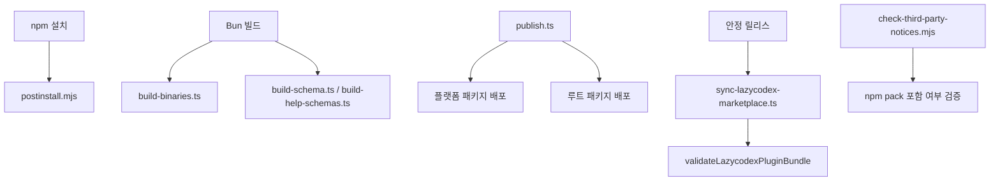

# repository scripts

## 저장소 스크립트 모듈

이 모듈은 루트 패키지의 설치, 빌드, 배포, Codex 마켓플레이스 동기화, 라이선스 고지 검증을 담당하는 저장소 운영 계층입니다. 런타임 플러그인 코드 자체가 아니라, 그 코드를 npm 패키지와 플랫폼별 실행 파일, LazyCodex 마켓플레이스 번들, JSON 스키마, 릴리스 산출물로 만드는 보조 스크립트들로 구성됩니다.

주요 파일은 두 디렉터리에 나뉩니다.

- `postinstall.mjs`: npm 설치 직후 플랫폼 바이너리와 OpenCode 호환성을 점검합니다.
- `script/*.ts`: Bun 기반 빌드, 스키마 생성, 릴리스, LazyCodex 동기화 스크립트입니다.
- `scripts/check-third-party-notices.mjs`: Node 기반 서드파티 고지 검증 스크립트입니다.

## 전체 흐름

저장소 스크립트는 대체로 “생성 → 검증 → 배포” 순서로 움직입니다. 예를 들어 `publish.ts`는 버전을 갱신하고, `bun run clean && bun run build`를 실행한 뒤, `build:binaries`로 플랫폼 실행기를 만들고, 플랫폼 패키지를 먼저 배포한 후 메인 패키지를 마지막에 배포합니다.

## 설치 후 검증: `postinstall.mjs`

`postinstall.mjs`는 패키지 설치 직후 실행되는 방어적 검증 스크립트입니다. 설치 실패를 강제로 만들기보다는, 문제가 있으면 경고를 출력하고 사용자가 CLI를 시도할 수 있게 둡니다.

핵심 상수는 다음과 같습니다.

- `MIN_OPENCODE_VERSION`: 지원하는 최소 OpenCode 버전입니다. 현재 값은 `"1.4.0"`입니다.
- `OPENCODE_PLUGIN_PACKAGES`: 캐시 무효화 대상 패키지 이름 목록입니다. `oh-my-opencode`, `oh-my-openagent`를 포함합니다.

주요 함수 흐름은 다음과 같습니다.

1. `invalidateOpenCodePluginCache()`가 `XDG_CACHE_HOME` 또는 `~/.cache/opencode` 아래의 OpenCode 플러그인 캐시를 best-effort로 삭제합니다.
2. `checkOpenCodeVersion()`이 `opencode --version`을 실행하고 `compareVersions()`로 최소 버전을 검사합니다.
3. `getLibcFamily()`가 Linux에서 `detect-libc`를 사용해 glibc/musl 계열을 감지합니다.
4. `getPlatformPackageCandidates()`와 `getBinaryPath()`를 통해 현재 플랫폼에 맞는 optional dependency 바이너리 패키지를 찾습니다.
5. `detectPlatformBinaryMismatch()`로 메인 패키지 버전과 플랫폼 패키지 버전 불일치를 경고합니다.

`compareVersions()`는 `parseVersion()`으로 `v1.2.3-beta.1` 같은 문자열을 숫자 배열로 바꾼 뒤, 각 자리수를 비교합니다. prerelease 접미사는 비교 전에 제거됩니다.

설치 후 검증은 실패해도 `process.exit(1)`을 호출하지 않습니다. 플랫폼 바이너리 누락, OpenCode 미설치, 캐시 삭제 실패는 모두 경고로 처리됩니다. 이 설계는 optional dependency 설치가 플랫폼이나 패키지 매니저에 따라 달라질 수 있다는 점을 반영합니다.

## 플랫폼 실행기 생성: `script/build-binaries.ts`

`build-binaries.ts`는 실제 네이티브 바이너리를 컴파일하는 대신, 각 플랫폼 패키지의 `bin/oh-my-opencode.js` 실행기 파일을 생성합니다. 플랫폼 목록은 `PLATFORMS` 배열에 정적으로 정의되어 있습니다.

`PLATFORMS`의 각 항목은 다음 구조를 갖습니다.

- `platform`: 논리 플랫폼 식별자입니다. 예: `darwin-arm64`, `linux-x64-musl`, `windows-x64-baseline`.
- `packageName`: npm 플랫폼 패키지 이름입니다.
- `packageDir`: `packages/` 아래 디렉터리 이름입니다.
- `target`: Bun 빌드 타깃 이름입니다.
- `binary`: 생성할 실행기 파일명입니다.
- `description`: 로그에 표시할 사람이 읽는 설명입니다.

실제 실행기 소스는 `createPlatformLauncherSource()`가 문자열로 생성합니다. 이 실행기는 `OMO_WRAPPER_PACKAGE_ROOT`를 기준으로 저장소 루트 안의 CLI 엔트리를 찾아 실행합니다.

실행기에는 세 가지 중요한 분기점이 있습니다.

- LazyCodex 설치 명령 감지: `OMO_INVOCATION_NAME`이 `lazycodex` 또는 `lazycodex-ai`이거나, `install/setup --platform codex` 형태면 `packages/omo-codex/scripts/install-local.mjs`를 실행합니다.
- 일반 CLI 실행: `dist/cli/index.js`를 Bun으로 실행합니다.
- Node 폴백: `OMO_RUNTIME=node`, Bun 실행 실패, 또는 `SIGILL` 발생 시 `dist/cli-node/index.js`를 `process.execPath`로 실행합니다.

`buildPlatform()`은 각 플랫폼 패키지의 `bin` 디렉터리를 만들고, 실행기 파일을 쓰고, `chmod 755`를 적용합니다. `main()`은 `PLATFORMS` 전체를 순회하며 성공/실패 요약을 출력하고, 하나라도 실패하면 종료 코드 1로 끝냅니다.

## Node CLI 번들: `script/build-cli-node.ts`

`build-cli-node.ts`는 Bun이 없는 환경이나 Bun이 CPU 명령어 세트 문제로 실행되지 않는 환경을 위한 Node 대상 CLI 번들을 생성합니다.

핵심 빌드 설정은 다음과 같습니다.

- 엔트리포인트: `packages/omo-opencode/src/cli/index.ts`
- 출력 디렉터리: `dist/cli-node`
- 타깃: `node`
- 포맷: `esm`

특이점은 `jsonc-parser` 처리입니다. `jsonc-parser`의 기본 엔트리는 UMD 형태이고 내부 상대 `require`가 번들 뒤에도 남아 Node 실행에서 깨질 수 있습니다. 그래서 `jsonc-parser-esm` 플러그인이 `jsonc-parser` import를 `node_modules/jsonc-parser/lib/esm/main.js`로 해석하도록 바꿉니다.

## Codex 설치기 번들: `script/build-codex-install.ts`

`build-codex-install.ts`는 `packages/omo-codex/src/install/install-local-cli.ts`를 단일 Node ESM 파일로 번들합니다. 결과물은 다음 경로에 생성됩니다.

`packages/omo-codex/scripts/install-dist/install-local.mjs`

빌드 후에는 두 가지 후처리를 수행합니다.

- shebang이 없으면 `#!/usr/bin/env node`를 추가합니다.
- `rewriteBareBuiltinSpecifiers()`가 `fs`, `path` 같은 bare builtin import를 `node:fs`, `node:path` 형태로 바꿉니다.

이 변환은 번들된 설치기가 다양한 Node 환경에서 builtin 모듈을 안정적으로 해석하도록 만들기 위한 것입니다.

## JSON 스키마 생성

설정 스키마와 도움말 출력 스키마는 별도 스크립트로 생성됩니다.

`script/build-schema-document.ts`는 `createOhMyOpenCodeJsonSchema()`를 export합니다. 이 함수는 `OhMyOpenCodeConfigSchema`를 `z.toJSONSchema()`로 draft-7 JSON Schema로 바꾸고, `$schema`, `$id`, `title`, `description` 메타데이터를 붙입니다.

`script/build-schema.ts`는 이 함수를 호출해 두 위치에 같은 스키마를 씁니다.

- `assets/oh-my-opencode.schema.json`
- `dist/oh-my-opencode.schema.json`

`script/build-help-schemas.ts`는 도움말 출력용 Zod 스키마를 JSON Schema로 변환합니다. 대상은 `DoctorResultSchema`, `StatusResultSchema`, `SandboxResultSchema`, `AcpResultSchema`이며 결과는 `assets/help/*.schema.json`에 기록됩니다.

## 모델 capability 스냅샷: `script/build-model-capabilities.ts`

`build-model-capabilities.ts`는 `fetchModelCapabilitiesSnapshot()`을 호출해 외부 모델 capability 데이터를 가져오고, 결과를 다음 파일에 씁니다.

`packages/omo-opencode/src/generated/model-capabilities.generated.json`

출력 경로는 `OUTPUT_PATH`로 계산되며, 로그에는 `MODELS_DEV_SOURCE_URL`과 생성된 모델 수가 표시됩니다. 이 스크립트는 런타임에서 매번 모델 정보를 조회하지 않고, 빌드 시점 스냅샷을 코드베이스에 고정하는 역할을 합니다.

## 릴리스 노트 생성: `script/generate-changelog.ts`

`generate-changelog.ts`는 GitHub CLI와 Git 로그를 사용해 릴리스 노트 초안을 생성합니다.

주요 함수는 다음과 같습니다.

- `getLatestReleasedTag()`: `gh release list`로 최신 정식 릴리스 태그를 찾습니다.
- `getChangedFiles(previousTag)`: 이전 태그 이후 변경 파일 목록을 가져옵니다.
- `generateChangelog(previousTag)`: `git log`에서 `ignore:`, `test:`, `chore:`, `ci:`, `release:` 커밋을 제외하고 요약을 만듭니다.
- `buildReleaseFraming(files)`: 변경 파일 경로를 보고 호환성/설치/태스크 시스템 관련 릴리스 프레이밍 문단을 추가합니다.
- `getContributors(previousTag)`: GitHub compare API로 외부 기여자를 정리합니다.

이 스크립트는 릴리스를 만들지는 않습니다. 출력용 릴리스 노트를 생성하는 보조 도구입니다.

## 배포 자동화: `script/publish.ts`

`publish.ts`는 루트 패키지와 12개 플랫폼 패키지를 함께 배포하는 릴리스 스크립트입니다.

입력은 주로 환경 변수로 제어됩니다.

- `BUMP`: `major`, `minor`, `patch` 중 하나입니다.
- `VERSION`: 자동 bump 대신 사용할 명시 버전입니다.
- `REPUBLISH=true`: 이미 존재하는 메인 버전에서 누락된 플랫폼 패키지를 다시 확인하고 배포합니다.
- `SKIP_PLATFORM_PACKAGES=true`: 플랫폼 패키지 빌드와 배포를 건너뜁니다.
- `CI`: provenance, git tag, GitHub release 생성 여부에 영향을 줍니다.

핵심 흐름은 `main()`에 모여 있습니다.

1. `fetchPreviousVersion()`으로 npm의 최신 `oh-my-opencode` 버전을 조회합니다.
2. `bumpVersion()` 또는 `VERSION`으로 새 버전을 결정합니다.
3. `--prepare-only` 모드면 `updateAllPackageVersions()`만 실행하고 종료합니다.
4. `checkVersionExists()`로 이미 배포된 버전인지 확인합니다.
5. `updateAllPackageVersions()`로 루트와 플랫폼 패키지의 버전을 맞춥니다.
6. `generateChangelog()`와 `getContributors()`로 릴리스 노트를 구성합니다.
7. `buildPackages()`가 `bun run clean && bun run build`를 실행하고, 필요하면 `bun run build:binaries`도 실행합니다.
8. `publishAllPackages()`가 플랫폼 패키지를 batch 단위로 먼저 배포하고 메인 패키지를 마지막에 배포합니다.
9. CI에서는 `gitTagAndRelease()`가 커밋, 태그, GitHub release를 처리합니다.

`publishPackage()`는 npm 배포 실패를 세밀하게 해석합니다. `EPUBLISHCONFLICT`, `E409`, `cannot publish over`는 이미 배포된 버전으로 처리합니다. `E403`은 권한 오류일 수도 있고 이미 존재하는 버전일 수도 있으므로 `checkPackageVersionExists()`로 npm registry를 다시 확인합니다. `404`는 이미 배포된 상태로 간주하지 않습니다.

플랫폼 패키지는 `BATCH_SIZE = 2`로 배포됩니다. 주석대로 npm OIDC 토큰 만료 가능성을 줄이기 위해 과도한 병렬 배포를 피합니다.

## LazyCodex 마켓플레이스 동기화

LazyCodex 동기화는 두 파일이 나눠 담당합니다.

- `script/sync-lazycodex-marketplace.ts`: 번들을 복사하고 경로를 재작성합니다.
- `script/lazycodex-marketplace-validation.ts`: 복사된 번들이 실제로 자기완결적인지 검증합니다.

### `syncLazycodexMarketplace()`

`syncLazycodexMarketplace(input)`는 공개 export 함수이며 테스트에서도 직접 호출됩니다. 입력은 `SyncLazycodexMarketplaceInput`입니다.

- `sourceRoot`: 현재 저장소 루트입니다.
- `lazycodexRoot`: 대상 LazyCodex 저장소 루트입니다.
- `releaseVersion`: 플러그인 manifest와 hook status message에 찍을 버전입니다.
- `allowMissingBundledDists`: 이전 payload 재구성 등에서 MCP dist 누락을 허용할지 여부입니다.

처리 순서는 다음과 같습니다.

1. `readMarketplaceManifest()`로 `packages/omo-codex/marketplace.json`의 name이 `sisyphuslabs`인지 확인합니다.
2. `readPluginManifest()`로 `.codex-plugin/plugin.json`의 name이 `omo`인지 확인합니다.
3. marketplace manifest를 `.agents/plugins/marketplace.json`로 복사합니다.
4. 기존 `plugins/omo`를 삭제하고 `packages/omo-codex/plugin`을 복사합니다.
5. `copyLazycodexRepositoryWorkflow()`가 PR source guidance workflow를 복사합니다.
6. `copyBundledMcpDists()`가 `git-bash-mcp`, `lsp-tools-mcp`, `lsp-daemon` dist를 플러그인 내부로 복사합니다.
7. `rewritePluginMcpManifest()`가 `.mcp.json`의 상대 경로를 플러그인 내부 `components/*/dist/cli.js` 경로로 바꿉니다.
8. `stampReleaseVersion()`이 plugin manifest, package.json, hook status message의 버전을 갱신합니다.
9. `validateLazycodexPluginBundle()`로 최종 번들을 검증합니다.

`shouldCopyPluginPath()`는 `.git`, `node_modules`, `.ulw`, `.claude`를 복사 대상에서 제외합니다. 이 denylist는 개발용 상태나 의존성 디렉터리가 marketplace payload에 섞이지 않도록 막습니다.

### `validateLazycodexPluginBundle()`

`validateLazycodexPluginBundle(pluginRoot)`는 Codex 플러그인 번들 안의 참조 경로가 실제 파일을 가리키는지 확인합니다.

검증은 두 갈래입니다.

- `validatePluginMcpManifests()`: 모든 `.mcp.json`을 찾아 `mcpServers.*.args` 안의 runtime path 인자를 검사합니다.
- `validatePluginHookCommands()`: 모든 `hooks/hooks.json`을 찾아 command hook의 `${PLUGIN_ROOT}/...` 참조가 실제 파일인지 검사합니다.

경로 검사는 `collectBundleFileIssue()`가 담당합니다. 이 함수는 세 가지 문제를 수집합니다.

- 참조 경로가 플러그인 루트 밖으로 탈출하는 경우
- 파일이 존재하지 않는 경우
- 파일 크기가 0바이트인 경우

중복 오류는 `pushIssue()`가 제거합니다. 문제가 하나라도 있으면 `validateLazycodexPluginBundle()`은 누락된 target 목록을 포함한 Error를 던집니다.

## Node require shim 패치: `script/patch-node-require-shim.ts`

`patch-node-require-shim.ts`는 `dist/index.js`에 Bun 전용 `import.meta.require`가 남아 있을 때, Node/Electron에서도 동작하도록 require helper를 바꿉니다.

기대하는 원본 라인은 다음입니다.

`var __require = import.meta.require;`

패치 후에는 `createRequire(import.meta.url)` 폴백을 포함한 라인으로 바뀝니다. 이미 패치된 경우에는 “already present” 로그를 출력하고 종료합니다. 기대한 Bun require helper가 없으면 에러를 던집니다. 이 스크립트는 dist 산출물의 특정 문자열에 의존하므로, 번들러 출력 형태가 바뀌면 함께 갱신해야 합니다.

## 서드파티 고지 검증: `scripts/check-third-party-notices.mjs`

이 스크립트는 라이선스/NOTICE 파일이 누락되지 않았는지 검증합니다. 다른 `script/*.ts` 파일과 달리 Node ESM으로 작성되어 있고, `spawnSync`를 사용해 `npm pack --dry-run`까지 검사합니다.

동작 모드는 세 가지입니다.

- 기본 모드: 루트 `THIRD-PARTY-NOTICES.md`를 검사합니다.
- `--codex`: `packages/omo-codex/THIRD-PARTY-NOTICES.md`와 Codex component별 `NOTICE`/`LICENSE`를 검사합니다.
- `--ship`: npm pack payload에 필수 고지 파일이 포함되는지 검사합니다.

주요 함수는 다음과 같습니다.

- `runScope(scopeName)`: root 또는 codex scope의 notice heading을 검사합니다.
- `checkCodexComponentNotices()`: Codex component별 `NOTICE`와 `LICENSE` 존재 여부, 필수 term 포함 여부를 확인합니다.
- `runShipCheck()`: root `package.json`의 `files[]`와 `npm pack --dry-run --json --ignore-scripts` 결과를 함께 검사합니다.
- `resolveSpawnSyncInvocation(command, args, platform)`: Windows에서 `npm`, `npx`를 `cmd.exe /d /s /c npm.cmd` 형태로 실행하도록 보정합니다.
- `parseNpmPackJson(output)`: npm 출력 중 JSON 배열이 시작되는 위치를 찾아 pack 파일 목록을 파싱합니다.

`resolveSpawnSyncInvocation()`은 테스트에서 직접 호출되는 export 함수입니다. Windows `.cmd` shim 처리를 이 함수에 모아두면 실제 pack 검증과 단위 테스트가 같은 경로 해석 규칙을 공유할 수 있습니다.

## 공개적으로 테스트되는 스크립트 API

이 모듈의 일부 함수는 단순 내부 구현이 아니라 테스트에서 직접 호출되는 안정적인 단위입니다.

- `createPlatformLauncherSource()`  
  플랫폼 패키지 실행기 소스를 생성합니다. `script/build-binaries-launcher.test.ts`가 실행기 fixture를 만들 때 사용합니다.

- `createOhMyOpenCodeJsonSchema()`  
  설정 JSON Schema 객체를 생성합니다. `script/build-schema.test.ts`가 schema 구조를 검증합니다.

- `validateLazycodexPluginBundle()`  
  LazyCodex 번들 검증 함수입니다. `script/lazycodex-marketplace-validation.pin.test.ts`가 경로 검증 동작을 고정합니다.

- `syncLazycodexMarketplace()`  
  LazyCodex marketplace 복사와 재작성의 메인 함수입니다. `script/sync-lazycodex-marketplace.test.ts`가 전체 동기화 동작을 검증합니다.

- `resolveSpawnSyncInvocation()`  
  Windows npm/npx 실행 보정 함수입니다. `scripts/check-third-party-notices.test.mjs`가 플랫폼별 인자 변환을 검증합니다.

이 함수들을 변경할 때는 CLI 출력뿐 아니라 테스트 fixture가 기대하는 구조도 함께 고려해야 합니다.

## 코드베이스와의 연결점

저장소 스크립트 모듈은 런타임 패키지의 여러 계층에 직접 연결됩니다.

- `packages/omo-opencode/src/cli/index.ts`: Bun CLI와 Node CLI 번들의 엔트리포인트입니다.
- `packages/omo-opencode/src/config/schema`: 루트 설정 JSON Schema 생성의 원천입니다.
- `packages/omo-opencode/src/help/schema/*`: doctor/status/sandbox/acp 도움말 JSON Schema 생성의 원천입니다.
- `packages/omo-opencode/src/shared/model-capabilities-cache`: 모델 capability 스냅샷 생성 로직을 제공합니다.
- `packages/omo-codex/src/install/install-local-cli.ts`: Codex 설치기 번들의 엔트리포인트입니다.
- `packages/omo-codex/plugin`: LazyCodex marketplace로 복사되는 실제 Codex 플러그인 payload입니다.
- `packages/git-bash-mcp/dist`, `packages/lsp-tools-mcp/dist`, `packages/lsp-daemon/dist`: LazyCodex 플러그인에 내장되는 MCP runtime 산출물입니다.
- `bin/platform.js`, `bin/version-mismatch.js`: postinstall 단계에서 플랫폼 패키지 후보와 버전 불일치를 판정합니다.

즉, 이 모듈은 “소스 코드가 올바른가”보다 “배포된 패키지가 올바른 모양으로 설치되고 실행되는가”를 다룹니다. 패키지 이름, manifest 경로, optional dependency 이름, Codex marketplace 경로, npm pack 포함 파일 목록이 바뀌면 이 스크립트들도 함께 갱신해야 합니다.

## 변경 시 주의할 점

플랫폼 패키지 목록을 바꿀 때는 `PLATFORMS`, `PLATFORM_PACKAGE_IDS`, 루트 `package.json`의 optional dependency, 실제 `packages/oh-my-opencode-*` 디렉터리가 일치해야 합니다.

LazyCodex 번들 경로를 바꿀 때는 `MCP_ARG_REWRITES`, `BUNDLED_MCP_DISTS`, `validatePluginMcpManifest()`, `validatePluginHookCommands()`를 함께 확인해야 합니다. 특히 root `.mcp.json`은 Codex가 실제로 읽는 manifest이므로, 플러그인 루트 밖으로 탈출하는 상대 경로를 허용하지 않습니다.

릴리스 자동화를 바꿀 때는 `publishPackage()`의 npm 오류 해석을 보수적으로 유지해야 합니다. `E403`처럼 의미가 모호한 오류는 registry 재조회로 확인하고, `404`는 이미 배포된 버전으로 처리하지 않는 현재 동작이 안전합니다.

서드파티 고지 파일을 추가하거나 제거할 때는 `CODEX_COMPONENT_NOTICE_REQUIREMENTS`, `ROOT_SHIP_REQUIRED_PATHS`, 각 component `package.json`의 `files[]`, 루트 `npm pack --dry-run` 결과가 모두 맞아야 합니다. 고지 검증은 문서 존재 여부뿐 아니라 실제 배포 payload 포함 여부까지 확인합니다.