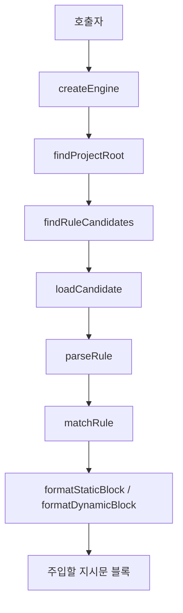

# rules engine

## 규칙 엔진

규칙 엔진은 프로젝트, 사용자 홈, 플러그인 번들에 있는 마크다운 규칙 파일을 찾아서 대상 파일에 적용할 지시문 블록으로 변환하는 모듈입니다. 핵심 역할은 다음 네 가지입니다.

- 규칙 후보 검색: `findRuleCandidates`, `findRuleFiles`, `findAgentsMdUp`
- 규칙 파싱과 매칭: `parseRule`, `parseRuleFrontmatter`, `matchRule`, `shouldApplyRule`
- 정렬, 중복 제거, 잘림 처리: `sortCandidates`, `formatStaticBlock`, `formatDynamicBlock`, `truncateRule`
- 세션 단위 주입 상태 관리: `createEngine`, `createSessionState`, `markStaticInjected`, `markDynamicInjected`

이 패키지는 두 API 층을 함께 제공합니다.

- `packages/rules-engine/src/index.ts`: 기존 rules-engine 공개 API입니다. `.sisyphus/rules` 호환, `AGENTS.md` 검색, 기존 `parseRuleFrontmatter`/`shouldApplyRule` 흐름을 제공합니다.
- `packages/rules-engine/src/engine/index.ts`: 새 엔진 API입니다. `createEngine` 중심으로 정적 규칙, 동적 규칙, 플러그인 번들 규칙, 포맷팅과 세션 중복 제거를 묶습니다.

## 전체 흐름



정적 주입은 세션 시작이나 프롬프트 시점에 “항상 적용되는 규칙”을 모읍니다. 동적 주입은 파일 작업 대상 경로를 기준으로 glob 조건에 맞는 규칙만 추가로 찾습니다.

## 규칙 파일 위치

새 엔진(`src/engine`)은 다음 소스를 검색합니다.

프로젝트 내부:

- `.omo/rules`
- `.claude/rules`
- `.cursor/rules`
- `.github/instructions`
- `.github/copilot-instructions.md`
- `CONTEXT.md`

사용자 홈:

- `~/.omo/rules`
- `~/.opencode/rules`
- `~/.claude/rules`

플러그인 번들:

- `bundled-rules`

기존 공개 API(`src/finder.ts`)는 호환성을 위해 `.sisyphus/rules`, `~/.sisyphus/rules`도 처리합니다. 이 경로는 `setSisyphusRuleDeprecationLogger`로 경고를 남길 수 있으며, 같은 디렉터리에 대해서는 중복 경고를 내지 않습니다.

## 프로젝트 루트 탐색

`findProjectRoot`는 시작 경로에서 위로 올라가며 프로젝트 마커를 찾습니다.

새 엔진의 마커는 `src/engine/constants.ts`의 `PROJECT_MARKERS`에 정의되어 있습니다.

- `.git`
- `pnpm-workspace.yaml`
- `package.json`
- `pyproject.toml`
- `Cargo.toml`
- `go.mod`
- `.venv`

기존 API의 `findProjectRoot`는 `projectRootCache`를 사용합니다. `clearProjectRootCache`는 테스트나 상태 초기화가 필요할 때 캐시를 비웁니다.

## 후보 검색

새 엔진의 후보 검색 진입점은 `findRuleCandidates`입니다.

`FinderOptions`는 다음 입력을 받습니다.

- `projectRoot`: `findProjectRoot`로 찾은 프로젝트 루트입니다. `null`이면 프로젝트 규칙 검색을 건너뜁니다.
- `targetFile`: 동적 모드에서 거리 계산과 상위 디렉터리 walk에 사용합니다. 정적 모드에서는 `null`입니다.
- `homeDir`: 테스트 주입용 사용자 홈입니다. 기본값은 `os.homedir()`입니다.
- `disabledSources`: 제외할 규칙 소스 집합입니다.
- `skipUserHome`: 사용자 홈 규칙을 건너뛸지 여부입니다.
- `pluginRoot`: 번들 규칙 루트 확인에 사용합니다.
- `cache`: `createRuleDiscoveryCache`로 만든 검색 캐시입니다.

`findProjectCandidates`는 대상 파일 디렉터리에서 프로젝트 루트까지 올라가며 각 디렉터리의 규칙 폴더를 스캔합니다. `getWalkDirectories`가 이 walk 목록과 `distance` 값을 만듭니다. 가까운 디렉터리의 규칙일수록 `distance`가 작습니다.

`findPluginBundledCandidates`는 `resolvePluginRulesRoot`로 규칙 컴포넌트 루트를 찾고 `bundled-rules`를 스캔합니다. `windows-git-bash.md`는 `platform === "win32"`일 때만 후보가 됩니다.

## 스캐너와 보안 경계

`scanRuleFiles`는 규칙 디렉터리를 재귀적으로 읽습니다. 기본 제약은 다음과 같습니다.

- 확장자: `.md`, `.mdc`
- 최대 깊이: 기본 `10`
- 최대 파일 수: 기본 `DEFAULT_MAX_SCAN_FILES`
- 제외 디렉터리: `node_modules`, `.git`, `dist`, `build`, `.turbo`, `.next`, `coverage`

심볼릭 링크는 `scanSymbolicLink`에서 처리합니다. 디렉터리 링크는 재귀 스캔 대상이 될 수 있지만, `visitedDirectories`가 실제 경로 기준으로 순환을 막습니다.

로드 단계에서는 `isCandidateWithinProjectCached`가 프로젝트 규칙 파일의 `realPath`가 프로젝트 루트 안에 있는지 다시 확인합니다. 프로젝트 밖으로 resolve되는 규칙은 `"Rule file resolves outside project root"` 진단을 남기고 제외합니다. 글로벌 규칙은 이 프로젝트 경계 검사를 통과합니다.

## 규칙 파싱

새 엔진의 `parseRule`은 마크다운 파일에서 지원하는 YAML frontmatter 부분만 추출합니다.

지원 필드:

- `description`
- `alwaysApply`
- `globs`
- `paths`
- `applyTo`

`paths`와 `applyTo`는 매칭 전에 glob 목록으로 합쳐집니다. `parseYamlFrontmatter`는 전체 YAML 파서가 아니라 제한된 frontmatter 파서입니다. 인라인 배열, 여러 줄 배열, 따옴표 문자열, 불리언 값을 직접 처리합니다.

frontmatter가 없으면 전체 파일이 `body`가 됩니다. 여는 `---`가 있지만 닫는 delimiter가 없으면 `diagnostic: "Missing closing frontmatter delimiter"`를 반환하고 본문은 원문 전체로 살립니다. malformed frontmatter도 실패로 던지지 않고 진단을 남긴 뒤 원문 본문을 유지합니다.

기존 API의 `parseRuleFrontmatter`는 `@oh-my-opencode/utils`의 `parseFrontmatter`를 호출합니다. 이 경로는 기존 rules-engine 소비자를 위한 호환 API입니다.

## 매칭 규칙

새 엔진의 `matchRule`은 다음 순서로 판단합니다.

1. `isSingleFile`이면 항상 매칭하고 reason은 `"single-file"`입니다.
2. `frontmatter.alwaysApply === true`이면 항상 매칭하고 reason은 `"alwaysApply"`입니다.
3. `globs`, `paths`, `applyTo`를 합쳐 glob 패턴 목록을 만듭니다.
4. 대상 경로의 `projectRelative`, `scopeRelative`, `basename`을 순서대로 검사합니다.
5. 양수 패턴이 매칭되어도 `!`로 시작하는 음수 패턴이 매칭되면 제외합니다.

`pathBasesForTarget`는 대상 파일을 세 기준으로 변환합니다.

- `projectRelative`: 프로젝트 루트 기준 상대 경로
- `scopeRelative`: 해당 규칙이 발견된 스코프 디렉터리 기준 상대 경로
- `basename`: 파일명만 사용한 경로

이 구조 때문에 하위 디렉터리에 있는 `.omo/rules` 규칙은 프로젝트 전체 기준뿐 아니라 해당 규칙 스코프 기준으로도 자연스럽게 매칭됩니다.

기존 API의 `shouldApplyRule`도 비슷하게 동작하지만 `projectRelative`와 `basename`만 검사합니다.

## 정적 규칙과 동적 규칙

`createEngine`은 `loadStaticRules`와 `loadDynamicRules`를 제공합니다.

`loadStaticRules(cwd)`는 다음 경우 빈 결과를 반환합니다.

- `config.disabled === true`
- `config.mode === "off"`
- `config.mode === "dynamic"`

그 외에는 `findProjectRoot(cwd)`로 프로젝트를 찾고, `targetFile: null`로 후보를 검색합니다. `loadStaticCandidates`는 후보를 정렬한 뒤 `staticMatchReason`이 있는 규칙만 통과시킵니다. 정적 규칙으로 인정되는 조건은 다음입니다.

- `frontmatter.alwaysApply === true`
- 단일 파일 규칙(`isSingleFile`)인 경우

`loadDynamicRules(cwd, targetPaths)`는 다음 경우 빈 결과를 반환합니다.

- `config.disabled === true`
- `config.mode === "off"`
- `config.mode === "static"`
- `targetPaths.length === 0`

동적 로더는 대상 파일별로 후보를 찾고 `matchRule`을 적용합니다. 같은 규칙 파일과 같은 내용 해시는 `ruleDedupKey`로 한 번만 결과에 들어갑니다.

## 캐시 전략

규칙 엔진은 여러 층에서 캐시를 사용합니다.

- `createRuleDiscoveryCache`: 디렉터리 스캔 결과와 단일 파일 stat 결과를 저장합니다.
- `findSortedCandidatesCached`: 대상 디렉터리와 disabled source 조합별 후보 목록을 저장합니다.
- `matchDynamicRuleCached`: 대상 파일, 후보, 내용 해시 조합별 동적 매칭 결과를 저장합니다.
- `compiledPatternSetFor`: glob 패턴 배열별 picomatch 컴파일 결과를 저장합니다.
- `createRuleScanCache`: 기존 API의 후보 목록과 디렉터리 스캔 결과를 저장합니다.
- `createAgentsMdCache`: `findAgentsMdUp` 결과를 저장합니다.

동적 매칭 캐시는 최대 `4096`개 항목을 유지합니다. 기존 matcher의 `matcherCache`는 최대 `256`개 glob matcher를 LRU 방식으로 유지합니다.

## 정렬과 우선순위

`sortCandidates`는 안정 정렬을 제공합니다. 비교 순서는 다음과 같습니다.

1. 프로젝트 규칙이 글로벌 규칙보다 먼저 옵니다.
2. `distance`가 작은 규칙이 먼저 옵니다.
3. `SOURCE_PRIORITY`가 낮은 소스가 먼저 옵니다.
4. `relativePath` 문자열 순서
5. `realPath` 문자열 순서

새 엔진의 대표 우선순위는 다음과 같습니다.

- `.omo/rules`: `0`
- `.claude/rules`: `1`
- `.cursor/rules`: `2`
- `.github/instructions`: `3`
- `.github/copilot-instructions.md`: `4`
- `CONTEXT.md`: `7`
- 사용자 홈 규칙: `100` 이상
- `plugin-bundled`: `200`

즉, 같은 거리에서는 프로젝트 로컬 `.omo/rules`가 가장 먼저 적용되고, 플러그인 번들 규칙은 가장 뒤로 밀립니다.

## 포맷팅과 잘림 처리

`formatStaticBlock`은 정적 규칙을 다음 형태의 블록으로 만듭니다.

```text
## Project Instructions

Instructions from: <규칙 경로>

<규칙 본문>
```

`formatDynamicBlock`은 대상 파일별 추가 규칙을 다음 형태로 만듭니다.

```text
Additional project instructions matched for <대상 경로>:

Instructions from: <규칙 경로>

<규칙 본문>
```

`truncateRules`는 두 단계로 크기를 제한합니다.

1. 규칙별 예산: `maxRuleChars`와 전체 결과를 규칙 수로 나눈 값을 함께 고려합니다.
2. 전체 예산: `truncateBudget`으로 `maxResultChars` 안에 들어오도록 다시 자릅니다.

잘린 본문에는 `TRUNCATION_NOTICE`가 붙습니다.

```text
[Truncated. Full: <relativePath>]
```

`isNeverTruncatedRule`은 파일명이 `hephaestus.md`인 규칙을 잘림 예외로 둡니다. `formatStaticBlock`도 `orderStaticRules`에서 `hephaestus.md`를 다른 규칙보다 앞에 둡니다.

`uniqueRulesByBody`는 본문이 같은 규칙을 중복 제거합니다. 또한 사용자가 같은 `description`을 가진 규칙을 제공한 경우, 같은 설명을 가진 `plugin-bundled` 규칙은 생략합니다. 이 동작은 번들 기본 규칙보다 사용자 규칙을 우선시키기 위한 것입니다.

## 세션 상태와 중복 주입

`createSessionState`는 한 세션에서 주입된 규칙을 추적합니다.

- `staticDedup`: `{cwd}::{rulePath}::{contentHash}` 형식의 정적 주입 키
- `dynamicDedup`: 세션 키 아래 `{rulePath}::{contentHash}` 형식의 동적 주입 키
- `loadedRules`: 마지막 로드 결과
- `diagnostics`: 마지막 로드 진단
- `dynamicTargetFingerprints`: 동적 대상 상태 저장용 맵

`markStaticInjected`와 `markDynamicInjected`는 새 규칙이면 `true`, 이미 주입된 규칙이면 `false`를 반환합니다. 호출자는 이 값을 사용해 같은 규칙 블록이 반복 주입되지 않도록 제어할 수 있습니다.

`resetSession`은 세션 상태와 동적 매칭 캐시를 함께 비웁니다. `cwd`를 인자로 넘기면 초기화 후 새 cwd를 설정합니다.

## 설정

`defaultConfig`는 `PiRulesConfig` 기본값을 만듭니다.

주요 필드:

- `disabled`: 전체 규칙 엔진 비활성화 여부
- `mode`: `"static"`, `"dynamic"`, `"both"`, `"off"`
- `maxRuleChars`, `maxResultChars`: 기본 정적 포맷 예산
- `postCompactMaxRuleChars`, `postCompactMaxResultChars`: compaction 이후 예산
- `dynamicMaxRuleChars`, `dynamicMaxResultChars`: 동적 주입용 예산
- `promptMaxRuleChars`, `promptMaxResultChars`: 프롬프트 시점 주입용 예산
- `enabledSources`: `"auto"` 또는 명시적 `RuleSource[]`

`disabledSourcesFromConfig`는 `enabledSources`를 제외 목록으로 변환합니다. `"auto"`일 때는 `DEFAULT_AUTO_DISABLED_SOURCES`를 사용합니다. 명시적 배열이 들어오면 `SOURCE_PRIORITY`에 등록된 소스 중 배열에 없는 모든 소스를 비활성화합니다.

## AGENTS.md 검색

기존 공개 API의 `findAgentsMdUp`은 대상 디렉터리에서 루트까지 올라가며 `AGENTS.md`를 찾습니다.

동작 특징:

- `startDir`와 `rootDir`는 `canonicalizePath`로 실제 경로화합니다.
- `startDir`가 `rootDir` 안에 없으면 빈 배열을 반환합니다.
- 기본값으로 `skipRoot: true`라서 루트의 `AGENTS.md`는 생략합니다.
- 발견 순서는 상위에서 하위로 정렬됩니다.
- `resolveAgentsFilePath`가 파일 존재, realpath, 프로젝트 경계, 파일 여부를 모두 확인합니다.

이 API는 규칙 파일과 별개로 계층형 `AGENTS.md` 지시문을 수집할 때 사용됩니다.

## 기존 API와 새 엔진 API의 차이

기존 API는 파일 검색, frontmatter 파싱, glob 매칭을 각각 독립 함수로 제공합니다.

- `findRuleFiles`
- `parseRuleFrontmatter`
- `shouldApplyRule`
- `calculateDistance`
- `findAgentsMdUp`
- `findProjectRoot`

새 엔진 API는 같은 책임을 `createEngine` 중심으로 묶고, 정적/동적 로딩과 포맷팅, 세션 중복 제거까지 포함합니다.

- `createEngine`
- `loadStaticRules`
- `loadDynamicRules`
- `formatStatic`
- `formatDynamic`
- `markStaticInjected`
- `markDynamicInjected`

새 호출자는 가능하면 `src/engine/index.ts`의 `createEngine`을 사용해야 합니다. 기존 호출자가 이미 `findRuleFiles`나 `shouldApplyRule` 조합에 의존하고 있다면, 호환 API를 유지하면서 점진적으로 옮기는 편이 안전합니다.

## 코드베이스 연결점

`createRulesEngine`은 `rules/src/rules-engine-factory.ts`에서 `createEngine`을 호출합니다. 이 경로가 rules 컴포넌트가 새 엔진을 사용하는 주요 통합 지점입니다.

테스트는 다음 동작을 검증합니다.

- `rules/test/engine.test.ts`: `createEngine`, `loadStaticRules`, `loadDynamicRules`
- `rules/test/bundled-rules-priority.test.ts`: 번들 규칙 우선순위와 `formatStatic`
- `rules/test/sources.test.ts`: `defaultConfig`와 source 설정
- `rules/test/dynamic-target-fingerprints.test.ts`: 동적 대상 관련 상태
- `packages/rules-engine/src/index.test.ts`: 기존 공개 API
- `packages/rules-engine/src/security-boundary.test.ts`: 경계 밖 규칙 차단
- `packages/rules-engine/src/distance.test.ts`: `calculateDistance`
- `packages/rules-engine/src/engine/project-root.test.ts`: 새 엔진의 `findProjectRoot`

## 기여 시 주의점

새 규칙 소스를 추가할 때는 한 파일만 바꾸면 안 됩니다. 최소한 다음 항목을 함께 확인해야 합니다.

- `RuleSource` 타입
- `SOURCE_PRIORITY`
- finder source 변환 함수: `toProjectRuleSource`, `toProjectSingleFileSource`, `toUserHomeRuleSource`
- 후보 검색 상수: `PROJECT_RULE_SUBDIRS`, `PROJECT_SINGLE_FILES`, `USER_HOME_RULE_SUBDIRS`
- source 설정 테스트

glob 매칭 동작을 바꿀 때는 `matchRule`과 기존 `shouldApplyRule`의 차이를 의식해야 합니다. 새 엔진은 `scopeRelative`까지 검사하지만 기존 API는 검사하지 않습니다.

스캐너나 realpath 처리를 수정할 때는 보안 경계 테스트를 먼저 확인해야 합니다. 규칙 파일은 모델 지시문으로 주입되므로, 프로젝트 밖 파일이 symlink나 상대 경로를 통해 섞이지 않는 것이 중요합니다.

포맷팅 예산을 바꿀 때는 `hephaestus.md` 예외와 `plugin-bundled` 중복 제거 정책을 함께 확인해야 합니다. 이 모듈은 단순히 파일을 읽는 코드가 아니라 최종 시스템 지시문에 가까운 문자열을 만드는 코드이므로, 정렬과 생략 정책이 실제 모델 동작에 영향을 줍니다.