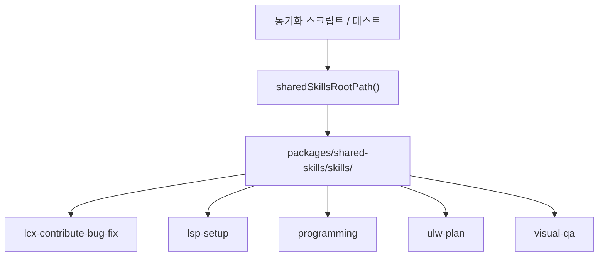
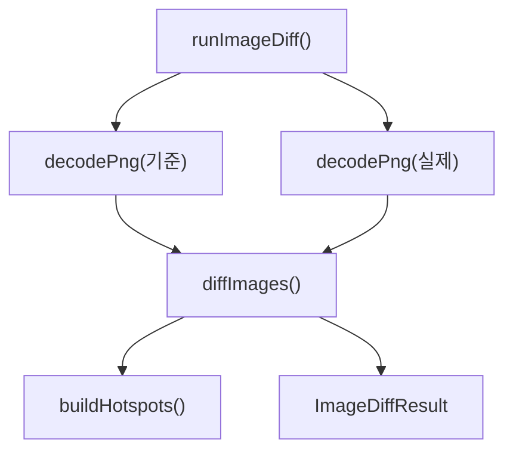

# shared skills source

ULTRAWORK MODE ENABLED!

## 공유 스킬 소스 모듈

`packages/shared-skills`는 여러 하네스가 함께 사용하는 `SKILL.md` 번들과 보조 스크립트를 제공하는 소스 패키지입니다. 런타임 로직의 중심은 `sharedSkillsRootPath()` 하나이며, 이 함수가 `packages/shared-skills/skills/`의 실제 파일 시스템 경로를 반환합니다.

```js
import { fileURLToPath } from "node:url";

export function sharedSkillsRootPath() {
	return fileURLToPath(new URL("./skills/", import.meta.url));
}
```

이 패키지는 스킬 실행 엔진이 아니라 “공유 스킬 디렉터리의 기준점”입니다. 실제 동작은 각 스킬 하위의 스크립트에 들어 있으며, `plugin/scripts/sync-skills.mjs`, `plugin/test/sync-skills.test.mjs`, `plugin/test/ultraresearch-skill-contract.test.mjs` 같은 소비자가 `sharedSkillsRootPath()`를 통해 이 트리를 읽습니다.



## 공개 진입점

### `sharedSkillsRootPath()`

`sharedSkillsRootPath()`는 ESM 기준의 `import.meta.url`에서 `./skills/` URL을 만들고, `fileURLToPath()`로 로컬 경로 문자열을 반환합니다.

이 방식은 호출자의 현재 작업 디렉터리에 의존하지 않습니다. 패키지가 어디에서 import되든 항상 패키지 내부의 `skills/` 디렉터리를 가리킵니다.

주요 소비 패턴은 다음과 같습니다.

```js
import { sharedSkillsRootPath } from "packages/shared-skills";

const skillsRoot = sharedSkillsRootPath();
// skillsRoot 아래의 SKILL.md, scripts/, references/ 등을 복사하거나 검증합니다.
```

## 스킬 트리 구성

`skills/` 하위에는 실제 워크플로 스킬과 그 스킬이 쓰는 독립 실행 스크립트가 들어 있습니다. 각 스크립트는 가능한 한 자기완결적으로 작성되어 있으며, 일부는 테스트에서 직접 import됩니다.

### `lcx-contribute-bug-fix`

`skills/lcx-contribute-bug-fix/scripts/create-pr-body.mjs`는 LazyCodex 버그 수정 PR 본문을 정해진 형식으로 생성합니다.

핵심 함수는 `createLazyCodexBugFixPrBody(value)`입니다. 내부 흐름은 다음과 같습니다.

1. `parseInput(value)`가 입력 객체를 검증합니다.
2. `requireRecord()`가 JSON 객체인지 확인합니다.
3. `requireStringField()`가 필수 문자열 필드를 검증하고 trim합니다.
4. `requireVerification()`이 `verification` 배열을 검증합니다.
5. `bulletList()`가 검증 항목을 Markdown 목록으로 렌더링합니다.
6. `createLazyCodexBugFixPrBody()`가 최종 PR 본문 문자열을 반환합니다.

필수 문자열 필드는 다음과 같습니다.

```js
[
	"title",
	"targetRepository",
	"problem",
	"reproductionLogs",
	"approach",
	"confidence",
	"risks",
	"userVisibleBehaviorChanges",
]
```

CLI로 실행할 때는 입력 JSON 파일과 출력 Markdown 파일을 받습니다.

```bash
node packages/shared-skills/skills/lcx-contribute-bug-fix/scripts/create-pr-body.mjs input.json output.md
```

`main()`은 `readFile()`로 JSON을 읽고, `createLazyCodexBugFixPrBody()` 결과를 `writeFile()`로 씁니다. 스크립트 직접 실행 여부는 `import.meta.url === pathToFileURL(process.argv[1]).href` 패턴으로 판별합니다.

### `lsp-setup`

`lsp-setup`은 프로젝트에 어떤 언어가 있는지 감지하고, 해당 언어의 기본 LSP 서버 설치 여부와 설정 파일 연결 상태를 확인합니다.

#### `detect-lsp.ts`

`detect-lsp.ts`는 디렉터리를 스캔해 확장자를 모으고, `LANGUAGES`에 정의된 기본 서버와 매칭합니다.

중요 함수는 다음과 같습니다.

- `collectExtensions(root)`: 디렉터리를 순회하며 파일 확장자 집합을 수집합니다.
- `resolveExecutable(command)`: `PATH`와 Windows `PATHEXT`를 기준으로 실행 파일을 찾습니다.
- `parseConfiguredServerIds(path)`: LSP 설정 JSON의 `lsp` 키 아래 서버 ID를 읽습니다.
- `readConfigState(root)`: `.codex/lsp-client.json`, `.opencode/lsp.json`, `.omo/lsp.json`, `.omo/lsp-client.json` 상태를 수집합니다.
- `detect(root, configState)`: 감지된 언어별 서버, 실행 파일 설치 여부, 설정 파일 참조 상태를 만듭니다.
- `renderReport(root, results, configState)`: 사람이 읽는 텍스트 리포트를 렌더링합니다.

`collectExtensions()`는 `node_modules`, `.git`, `dist`, `build`, `.next`, `target`, `.venv`, `coverage` 같은 큰 산출물 디렉터리를 건너뜁니다. 최대 파일 수는 `MAX_FILES = 50_000`으로 제한됩니다.

확장자가 없는 `Dockerfile`, `Containerfile`은 `BASENAME_EXTENSIONS`를 통해 `.dockerfile`로 처리합니다. 이 규칙은 `packages/lsp-tools-mcp/src/lsp/effective-extension.ts`의 동작을 맞추기 위한 것입니다.

```bash
bun packages/shared-skills/skills/lsp-setup/scripts/detect-lsp.ts .
bun packages/shared-skills/skills/lsp-setup/scripts/detect-lsp.ts . --json
```

#### `lsp-server-table.ts`

`lsp-server-table.ts`는 `detect-lsp.ts`가 독립 실행될 수 있도록 내장 LSP 서버 표를 담고 있습니다.

- `LanguageServer`: 언어 이름, 서버 ID, 실행 명령, 확장자, 설치 힌트를 표현합니다.
- `LANGUAGES`: TypeScript, Python, Go, Rust, C/C++, Java, Kotlin, C#, Razor, Swift, Ruby, PHP, Dart, Elixir, Zig, Lua, Bash, YAML, Terraform, Dockerfile, Haskell, Julia의 기본 서버 목록입니다.
- `PROJECT_CONFIG_FILES`: 검사할 프로젝트 LSP 설정 파일 목록입니다.

파일 상단 주석처럼 이 표는 `packages/lsp-tools-mcp/src/lsp/server-definitions.ts`의 스냅샷입니다. 기본 서버 정의가 바뀌면 이 파일도 함께 갱신해야 합니다.

#### `verify-lsp.ts`

`verify-lsp.ts`는 실제 `lsp-tools-mcp` 엔진을 찾아 파일 하나에 대해 진단 왕복을 수행합니다.

주요 흐름은 다음과 같습니다.

1. `findUp(relativeTarget)`이 현재 스크립트 위치와 `process.cwd()`에서 위로 올라가며 엔진 파일을 찾습니다.
2. `loadModule()`이 `tools.ts`, `request-context.ts`, `manager.ts`를 동적으로 import합니다.
3. `run(filePath, timeoutMs)`가 `runWithRequestContext()` 안에서 `executeLspDiagnostics()`를 호출합니다.
4. 결과의 `details.errorKind`를 보고 `missing_dependency`, `invalid_path`, `no_files`를 실패로 처리합니다.
5. 마지막에 `disposeDefaultLspManager()`를 호출해 LSP 매니저를 정리합니다.

이 스크립트는 `packages/lsp-tools-mcp/src`가 있는 omo 저장소 또는 워크트리 안에서 실행해야 합니다. 엔진을 찾지 못하면 `EngineNotFoundError`를 `SKIP`으로 보고하고 종료 코드 `3`을 반환합니다.

```bash
bun packages/shared-skills/skills/lsp-setup/scripts/verify-lsp.ts src/index.ts --timeout=60000
```

### `programming`

`programming` 스킬의 TypeScript 스크립트는 엄격한 코드 품질 기준과 새 프로젝트 스캐폴딩을 제공합니다.

#### `check-no-excuse-rules.ts`

`check-no-excuse-rules.ts`는 TypeScript AST를 사용해 금지 패턴을 검사합니다. 진입점 `main()`은 입력 파일 또는 디렉터리를 받아 `discoverFiles()`로 검사 대상 `.ts`, `.tsx`, `.mts`, `.cts` 파일을 찾고, 각 파일에 `analyzeFile()`을 적용합니다.

검사 규칙은 다음 `RuleId`로 표현됩니다.

- `no-any-assertion`: `as any`
- `no-unknown-assertion`: `as unknown`
- `no-ts-ignore`: `@ts-ignore`
- `no-ts-expect-error`: `@ts-expect-error`
- `no-enum`: `enum`
- `no-non-null-assertion`: `x!`
- `no-throw-literal`: 문자열, 숫자, 템플릿 리터럴 throw
- `no-mutable-export`: `export let`, `export var`
- `no-any-annotation`: `: any`
- `no-explicit-any-return`: `(): any`
- `empty-catch`: 빈 `catch`
- `catch-without-narrowing`: `instanceof` 좁히기나 rethrow 없는 `catch`

`analyzeFile()` 내부의 `visit()`가 TypeScript 노드를 순회합니다. `lineHasOptOut()`은 `// no-excuse-ok: any`를 확인하고, catch 관련 규칙은 `// no-excuse-ok: catch`로 예외 처리할 수 있습니다.

```bash
bun packages/shared-skills/skills/programming/scripts/typescript/check-no-excuse-rules.ts packages/shared-skills
```

출력은 위반 위치와 규칙 ID를 포함합니다.

```text
/path/file.ts:10:15: [no-any-annotation] `: any` annotation — use `unknown` and narrow
```

#### `new-project.ts`

`new-project.ts`는 Bun 기반 TypeScript 프로젝트를 생성합니다.

생성되는 파일은 다음과 같습니다.

- `package.json`
- `tsconfig.json`
- `biome.json`
- `src/index.ts`
- `.gitignore`

기본 앱은 Hono를 사용합니다.

```ts
import { Hono } from "hono";

const app = new Hono();

app.get("/", (c) => c.json({ status: "ok" }));

export default app;
```

사용법은 다음과 같습니다.

```bash
bun packages/shared-skills/skills/programming/scripts/typescript/new-project.ts my-api
bun packages/shared-skills/skills/programming/scripts/typescript/new-project.ts my-api --path ./projects
```

이미 대상 디렉터리가 있으면 덮어쓰지 않고 오류로 종료합니다.

### `ulw-plan`

`skills/ulw-plan/scripts/scaffold-plan.mjs`는 ultrawork 계획 초안과 실행 계획 골격을 결정적으로 생성합니다. 외부 의존성 없이 Node.js 내장 모듈만 사용하므로 `node`와 `bun` 양쪽에서 실행될 수 있습니다.

핵심 export는 다음과 같습니다.

- `PLAN_SECTION_HEADERS`: 계획 문서의 표준 섹션 헤더 목록입니다.
- `FINAL_VERIFICATION_ITEMS`: 최종 검증 항목 목록입니다.
- `parseArgs(argv)`: slug, intent, reset, force 옵션을 파싱합니다.
- `resolveSafeOmoPath(cwd, relPath)`: `.omo/` 아래의 `.md` 파일만 허용합니다.
- `isUlwArtifact(content)`: 기존 파일이 이 스크립트가 만든 계획/초안인지 판별합니다.
- `buildDraft(slug, intent)`: `.omo/drafts/<slug>.md` 내용을 만듭니다.
- `buildPlanSkeleton(slug, intent)`: `.omo/plans/<slug>.md` 내용을 만듭니다.
- `writeGuarded(cwd, relPath, content, options)`: 재실행 안전 쓰기를 수행합니다.
- `scaffold(cwd, options)`: 초안과 계획 파일을 함께 생성합니다.

이 스크립트의 중요한 성질은 “재실행 안전성”입니다. 이미 생성된 ulw-plan 산출물이 있으면 기본 실행은 no-op으로 성공하며, 기존 내용을 덮어쓰지 않습니다. 덮어쓰기는 `--reset` 뒤에 있으며, 손으로 수정된 파일을 버리려면 `--force`까지 필요합니다.

쓰기 경계도 명확합니다. `resolveSafeOmoPath()`와 `assertSafeWriteParent()`는 대상 경로가 워크스페이스 밖으로 나가거나 `.omo/` 밖에 쓰이는 것을 거부합니다. 경로 구성 요소가 symlink인 경우도 거부합니다.

```bash
node packages/shared-skills/skills/ulw-plan/scripts/scaffold-plan.mjs fix-login-timeout --clear
node packages/shared-skills/skills/ulw-plan/scripts/scaffold-plan.mjs fix-login-timeout --reset --force
```

### `visual-qa`

`visual-qa`는 이미지 비교와 TUI 캡처 검증을 위한 작은 TypeScript 유틸리티 묶음입니다. CLI 진입점은 `scripts/cli.ts`이며, 테스트에서는 하위 함수들을 직접 import합니다.

#### CLI 진입점

`cli.ts`의 `run(argv)`는 두 명령을 지원합니다.

```bash
bun packages/shared-skills/skills/visual-qa/scripts/cli.ts image-diff reference.png actual.png
bun packages/shared-skills/skills/visual-qa/scripts/cli.ts tui-check capture.txt --cols 80
```

- `runImageDiff(args)`: 두 PNG 파일을 `decodePng()`로 읽고 `diffImages()`를 호출합니다.
- `runTuiCheck(args)`: 텍스트 캡처를 읽고 `checkTui()`를 호출합니다.
- `CliError`: 사용법 오류나 잘못된 인자를 표현합니다.

결과는 JSON으로 출력됩니다.

#### 이미지 비교

이미지 비교 흐름은 다음과 같습니다.



`png-decode.ts`는 PNG 파일을 직접 디코드합니다.

- `decodePng(buffer)`: PNG 서명, `IHDR`, `IDAT`를 검사하고 RGBA 픽셀로 정규화합니다.
- `readChunks(buffer)`: PNG 청크를 읽습니다.
- `parseHeader(data)`: 폭, 높이, 비트 깊이, 색상 타입, 채널 수를 파싱합니다.
- `decodePixels(idat, width, height, bpp)`: zlib inflate 후 행 필터를 해제합니다.
- `unfilterRow(filterType, row, prev, bpp)`: PNG 필터 타입 0~4를 처리합니다.
- `normalizeToRgba(pixels, pixelCount, channels)`: grayscale, grayscale+alpha, RGB, RGBA를 RGBA 배열로 맞춥니다.
- `PngDecodeError`: 지원하지 않는 PNG 형식이나 손상된 입력을 표현합니다.

지원 범위는 8비트 PNG이며, 색상 타입은 0, 2, 4, 6입니다.

`image-diff.ts`의 `diffImages(reference, actual)`은 겹치는 영역을 픽셀 단위로 비교합니다. 결과에는 다음 정보가 들어갑니다.

- `dimensionsMatch`
- `reference`, `actual`
- `totalPixels`
- `diffPixels`
- `diffRatio`
- `similarityScore`
- `alphaChannelIntact`
- `hotspots`
- `summary`

핫스팟은 최대 8x8 그리드 기준으로 차이가 많은 영역을 요약합니다. `alphaChannelIntact`는 기준 이미지에 투명 픽셀이 있는데 실제 이미지에서 투명 픽셀이 사라진 경우를 감지합니다.

`png-synth.ts`는 테스트용 PNG 생성을 지원합니다.

- `encodeRgbaPng(width, height, rgba)`: RGBA 배열을 PNG 버퍼로 인코딩합니다.
- `solidRgba(width, height, color)`: 단색 RGBA 픽셀 배열을 만듭니다.
- 내부 `pngChunk()`는 `crc32()`로 PNG 청크 CRC를 계산합니다.

`png-crc.ts`는 PNG 서명 `PNG_SIGNATURE`와 `crc32(data)`를 제공합니다.

#### TUI 캡처 검증

`tui-grid.ts`의 `checkTui(text, expectedColumns)`는 터미널 캡처 텍스트를 분석합니다.

검사 항목은 다음과 같습니다.

- 각 줄의 표시 폭
- `expectedColumns` 초과 줄
- 박스 드로잉 문자를 포함한 프레임 줄의 폭 불일치
- ANSI escape 포함 여부
- 동아시아 wide 문자 시작 컬럼

폭 계산은 `east-asian-width.ts`가 담당합니다.

- `charWidth(codePoint)`: 코드포인트의 표시 폭을 `0 | 1 | 2`로 반환합니다.
- `stringWidth(text)`: 문자열의 터미널 표시 폭을 계산합니다.

`charWidth()`는 combining mark, zero-width 문자, C0/C1 제어 문자, 한글/CJK/emoji wide 영역을 직접 범위 테이블로 처리합니다.

ANSI 처리는 `ansi.ts`가 담당합니다.

- `stripAnsi(input)`: ANSI escape sequence를 제거합니다.
- `hasAnsi(input)`: ANSI sequence 포함 여부를 확인합니다.

`hasAnsi()`는 내부적으로 `stripAnsi()` 결과가 원본과 다른지 비교합니다.

## 오류 처리와 종료 코드

각 스크립트는 실행 표면에 맞는 오류 정책을 가집니다.

`create-pr-body.mjs`는 입력 구조가 잘못되면 `Error`를 던집니다. 직접 실행 시 top-level await에서 오류가 전파되어 Node가 실패 종료합니다.

`detect-lsp.ts`는 대상 디렉터리가 없으면 stderr에 메시지를 쓰고 종료 코드 `2`로 종료합니다. `--json`이 있으면 `{ root, configState, results }`를 JSON으로 출력합니다.

`verify-lsp.ts`는 다음 종료 코드를 사용합니다.

- `0`: LSP 진단 왕복 성공
- `1`: LSP 실행 실패, 잘못된 경로, 의존성 누락 등
- `2`: CLI 입력 오류
- `3`: `lsp-tools-mcp` 엔진을 찾지 못해 skip

`check-no-excuse-rules.ts`는 다음 종료 코드를 사용합니다.

- `0`: 위반 없음
- `1`: 위반 있음
- `2`: 입력 오류 또는 검사 대상 TypeScript 파일 없음

`visual-qa/scripts/cli.ts`는 `CliError`와 기타 오류를 `visual-qa error: ...` 형식으로 stderr에 출력하고 `process.exitCode = 1`을 설정합니다.

## 저장소 내 연결 지점

이 모듈은 직접 런타임에 서버를 띄우는 패키지가 아니라, 다른 패키지가 공유 스킬을 복사하거나 검증할 수 있게 하는 소스 패키지입니다.

주요 연결은 다음과 같습니다.

- `plugin/scripts/sync-skills.mjs`가 `sharedSkillsRootPath()`를 호출해 공유 스킬을 동기화합니다.
- `plugin/test/sync-skills.test.mjs`가 공유 스킬 루트와 동기화 결과를 검증합니다.
- `plugin/test/ultraresearch-skill-contract.test.mjs`가 공유 스킬 복사본을 읽어 계약을 확인합니다.
- `plugin/test/lcx-contribute-bug-fix-template.test.mjs`가 `createLazyCodexBugFixPrBody()`를 직접 호출합니다.
- `visual-qa/scripts/*.test.ts`가 `stripAnsi()`, `hasAnsi()`, `charWidth()`, `stringWidth()`, `decodePng()`, `encodeRgbaPng()`, `solidRgba()`, `diffImages()`, `runImageDiff()`, `runTuiCheck()`, `run()`을 직접 검증합니다.

## 변경 시 주의점

`sharedSkillsRootPath()`는 소비자들이 공유 스킬 트리를 찾는 기준입니다. `skills/` 위치나 패키지의 ESM 구조를 바꾸면 동기화 스크립트와 계약 테스트가 함께 영향을 받습니다.

`lsp-setup/scripts/lsp-server-table.ts`는 `packages/lsp-tools-mcp/src/lsp/server-definitions.ts`의 수동 스냅샷입니다. LSP 서버 ID, 명령, 확장자, 설치 힌트를 바꿀 때는 양쪽이 드리프트하지 않도록 확인해야 합니다.

`ulw-plan/scripts/scaffold-plan.mjs`는 `.omo/` 쓰기 경계를 자체적으로 강제합니다. 계획 파일 위치를 바꾸거나 새 출력 파일을 추가할 때는 `resolveSafeOmoPath()`, `assertSafeWriteParent()`, `writeGuarded()`의 보안 성질을 유지해야 합니다.

`visual-qa`는 외부 이미지 라이브러리 없이 PNG를 직접 처리합니다. 지원 범위는 제한적이지만 테스트와 QA 용도에는 예측 가능성이 높습니다. 새 PNG 기능을 추가할 때는 `decodePng()`의 지원 색상 타입, 필터 처리, `ImageDiffResult` 계약을 함께 검토해야 합니다.

`check-no-excuse-rules.ts`는 TypeScript AST 기반 검사와 일부 문자열 기반 주석 검사를 섞어 씁니다. 새 규칙을 추가할 때는 `RuleId`, `Violation`, `visit()` 순회, `formatViolation()` 출력 형식이 일관되게 유지되어야 합니다.