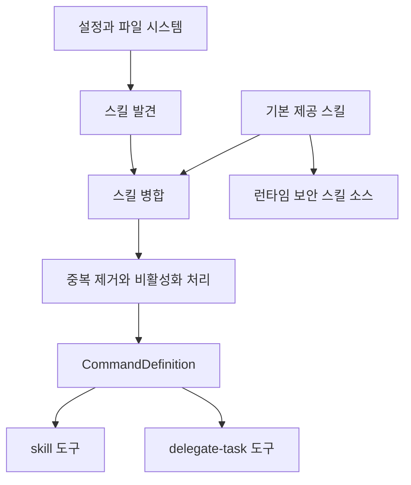
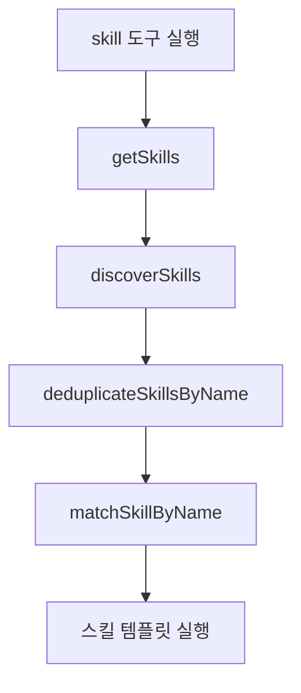

# skills loader core

## skills-loader-core 개요

`packages/skills-loader-core`는 OpenCode/Claude Code/Agents 형식의 `SKILL.md`를 발견하고, 설정과 기본 제공 스킬을 합쳐 실행 가능한 `CommandDefinition`으로 변환하는 모듈입니다. 이 모듈은 다음 경로의 스킬을 하나의 목록으로 정규화합니다.

- 기본 제공 스킬: `createBuiltinSkills()`
- 공유 스킬 번들: `discoverSharedSkills()`
- OpenCode 전역/프로젝트 스킬: `discoverOpencodeGlobalSkills()`, `discoverOpencodeProjectSkills()`
- Claude Code 전역/프로젝트 스킬: `discoverUserClaudeSkills()`, `discoverProjectClaudeSkills()`
- `.agents/skills` 전역/프로젝트 스킬: `discoverGlobalAgentsSkills()`, `discoverProjectAgentsSkills()`
- 설정 파일의 `skills.sources`: `discoverConfigSourceSkills()`

주요 소비자는 `tools/skill`, `tools/delegate-task`, `createSkillContext`, `applyCommandConfig`, `createConfigHandler`, `serverPlugin`입니다. 실행 흐름상 `tools/skill/tools.ts`와 `tools/delegate-task/tools.ts`는 스킬 목록을 가져온 뒤 `discoverSkills()`와 중복 제거 로직을 거쳐 최종 스킬을 해석합니다.



## 설정 스키마

`config/skills.ts`는 사용자가 지정할 수 있는 스킬 설정 구조를 Zod 스키마로 정의합니다.

`SkillSourceSchema`는 두 가지 형태를 허용합니다.

```ts
type SkillSource =
  | string
  | {
      path: string
      recursive?: boolean
      glob?: string
    }
```

`SkillDefinitionSchema`는 개별 스킬 오버라이드에 쓰입니다. 주요 필드는 다음과 같습니다.

- `description`: 명령 설명
- `template`: 인라인 스킬 본문
- `from`: 외부 마크다운 파일 경로
- `model`, `agent`, `subtask`: 실행 대상 모델/에이전트/서브태스크 설정
- `"argument-hint"`: 인수 힌트
- `"allowed-tools"`: 허용 도구 목록
- `disable`: 스킬 비활성화
- `metadata`, `license`, `compatibility`: 부가 메타데이터

`SkillsConfigSchema`는 간단한 배열 또는 객체형 설정을 모두 지원합니다.

```ts
skills: ["frontend", "debugging"]
```

또는:

```ts
skills: {
  sources: [{ path: "./skills", recursive: true, glob: "**/*.md" }],
  enable: ["frontend"],
  disable: ["security-review"],
  "custom-skill": {
    from: "./docs/custom-skill.md",
    description: "프로젝트 전용 스킬"
  }
}
```

## Git 환경 접두어 검증

`config/git-env-prefix.ts`는 `git-master` 스킬 템플릿에 주입할 Git 명령 접두어를 검증합니다.

핵심 API는 다음과 같습니다.

- `isValidGitEnvPrefix(value: string): boolean`
- `assertValidGitEnvPrefix(value: string): string`
- `GitEnvPrefixSchema`

허용되는 값은 빈 문자열이거나 셸 안전한 환경 변수 할당 목록입니다.

```ts
isValidGitEnvPrefix("") // true
isValidGitEnvPrefix("GIT_MASTER=1") // true
isValidGitEnvPrefix("GIT_MASTER=1 OMO_MODE=git-master") // true
```

값은 `KEY=value` 형식이어야 하며, 값에는 영문자, 숫자, `_`, `-`만 허용됩니다. 기본값은 `GIT_MASTER=1`입니다. 잘못된 값이면 `GIT_ENV_PREFIX_VALIDATION_MESSAGE`로 `Error`가 발생합니다.

## 기본 제공 스킬

기본 제공 스킬은 `features/builtin-skills` 아래에서 정의됩니다. 공통 타입은 `BuiltinSkill`입니다.

```ts
export interface BuiltinSkill {
  name: string
  description: string
  template: string
  license?: string
  compatibility?: string
  metadata?: Record<string, unknown>
  allowedTools?: string[]
  agent?: string
  model?: string
  subtask?: boolean
  argumentHint?: string
  mcpConfig?: SkillMcpConfig
}
```

`createBuiltinSkills(options)`는 설정에 따라 기본 스킬 목록을 만듭니다.

- `browserProvider: "playwright"`: `playwrightSkill`
- `browserProvider: "agent-browser"`: `agentBrowserSkill`
- `browserProvider: "dev-browser"`: `devBrowserSkill`
- `browserProvider: "playwright-cli"`: `playwrightCliSkill`
- `teamModeEnabled: true`: `teamModeSkill` 추가
- `disabledSkills`: 이름이 일치하는 기본 스킬 제외

항상 포함되는 주요 스킬은 `frontend`, `git-master`, `review-work`, `remove-ai-slops`, `init-deep`, `debugging`, `security-research`, `security-review`, `visual-qa`입니다.

`resolveActiveBuiltinSkills(options)`는 `createBuiltinSkills()` 결과에서 MCP 충돌을 제거합니다. 스킬에 `mcpConfig`가 있고 같은 MCP 이름이 `systemMcpNames`에 이미 있으면 해당 스킬은 제외됩니다. 예를 들어 시스템에 `playwright` MCP가 이미 등록되어 있으면 `playwrightSkill`의 MCP 설정이 중복 등록되지 않습니다.

## 공유 스킬 템플릿 로딩

`skill-file-loader.ts`는 `@oh-my-opencode/shared-skills`에서 공유 `SKILL.md` 본문을 읽습니다.

- `createSharedSkillTemplateLoader(readFile?, skillsRootPath?)`
- `loadSharedSkillTemplate(skillName)`

로더는 `parseFrontmatter()`로 frontmatter를 제거하고 본문만 반환합니다. 같은 `skillName`은 `Map`에 캐시됩니다. `debugging`, `frontend`, `remove-ai-slops`, `review-work`, `init-deep`, `visual-qa` 같은 기본 스킬은 이 로더로 공유 템플릿을 가져옵니다.

`agent-browser-template.ts`는 별도 번들된 `agent-browser/SKILL.md`를 읽고 `createAgentBrowserTemplate()`로 본문을 정리합니다. 이 함수는 frontmatter를 제거하고 em dash 주변 공백 표현을 `" - "`로 바꿉니다.

## 파일 시스템 스킬 발견

스킬 발견의 중심은 `features/opencode-skill-loader/loader.ts`입니다.

주요 진입점은 다음과 같습니다.

- `discoverSkills(options?)`
- `discoverAllSkills(directory?)`
- `getSkillByName(name, options?)`
- `loadUserSkills()`
- `loadProjectSkills(directory?)`
- `loadOpencodeGlobalSkills()`
- `loadOpencodeProjectSkills(directory?)`
- `loadProjectAgentsSkills(directory?)`
- `loadGlobalAgentsSkills(homeDirectory?)`

`discoverSkills()`는 기본적으로 OpenCode, 공유 스킬, Claude Code, `.agents` 경로를 모두 읽습니다. `includeClaudeCodePaths: false`를 넘기면 OpenCode 경로와 공유 스킬만 포함합니다.

공유 스킬은 두 번 들어갑니다.

1. `createSharedCanonicalAliases()`가 `shared/<name>` 별칭을 만듭니다.
2. 원래 이름의 공유 스킬도 뒤에 추가됩니다.

이 구조 덕분에 사용자는 `shared/debugging`처럼 명시적으로 공유 스킬을 고를 수 있고, 동시에 일반 이름 매칭도 사용할 수 있습니다.

## 디렉터리 스캔 방식

비동기 스캐너는 `async-loader.ts`에 있습니다.

- `discoverSkillsInDirAsync(skillsDir, scope, namePrefix, depth, maxDepth)`
- `loadSkillFromPathAsync(skillPath, resolvedPath, defaultName, scope, namePrefix?)`
- `loadMcpJsonFromDirAsync(skillDir)`
- `mapWithConcurrency(items, mapper, concurrency)`

스캔 규칙은 다음과 같습니다.

- 숨김 파일/디렉터리는 무시합니다.
- 디렉터리 안에 `SKILL.md`가 있으면 그 디렉터리를 하나의 스킬로 봅니다.
- `SKILL.md`가 없고 `{dirname}.md`가 있으면 그 파일을 스킬로 봅니다.
- 둘 다 없으면 `maxDepth`까지 재귀 탐색합니다.
- 일반 Markdown 파일은 파일명에서 `.md`를 제거해 기본 스킬 이름으로 씁니다.
- 심볼릭 링크는 `resolveSymlink()`로 실제 경로를 따라갑니다.

`loadSkillFromPathAsync()`는 마크다운을 `LoadedSkill`로 바꿉니다. 이때 frontmatter의 `name`, `description`, `model`, `agent`, `subtask`, `"argument-hint"`, `"allowed-tools"`, `license`, `compatibility`, `metadata`를 읽습니다.

본문은 `resolveSkillPathReferences()`를 거친 뒤 아래 래퍼에 들어갑니다.

```xml
<skill-instruction>
Base directory for this skill: /절대/경로/
File references (@path) in this skill are relative to this directory.

스킬 본문
</skill-instruction>

<user-request>
$ARGUMENTS
</user-request>
```

이 래퍼는 스킬 본문 안의 상대 파일 참조 기준을 명확히 하고, 실제 사용자 요청을 `$ARGUMENTS` 위치에 주입할 수 있게 합니다.

## 설정 기반 소스 발견

`config-source-discovery.ts`는 `skills.sources`를 처리합니다.

핵심 함수는 `discoverConfigSourceSkills({ config, configDir })`입니다. 내부적으로 `normalizeSkillsConfig()`로 설정을 정규화한 뒤 각 source를 `loadSourcePath()`로 읽습니다.

지원되는 경로 규칙은 다음과 같습니다.

- `~`와 `~/...`는 사용자 홈으로 확장됩니다.
- 상대 경로는 `configDir` 기준입니다.
- HTTP/HTTPS URL은 현재 로더에서 무시됩니다.
- 파일이면 `.md`만 로드합니다.
- 디렉터리면 `loadSkillsFromDir()`로 읽습니다.
- `recursive: true`이면 최대 깊이 `10`까지 탐색합니다.
- `glob`이 있으면 `picomatch`로 상대 경로를 필터링합니다.

`normalizePathForGlob()`는 Windows 경로 구분자 `\`를 `/`로 바꿔 glob 매칭을 안정화합니다.

## 스킬 로딩과 변환

동기/비동기 로더는 모두 최종적으로 `LoadedSkill`을 만듭니다.

`loaded-skill-from-path.ts`의 `loadSkillFromPath()`는 설정 소스나 디렉터리 스캔에서 발견한 Markdown 파일을 즉시 로드합니다. 반환값에는 `lazyContent`가 포함되지만, 현재 구현은 즉시 로드된 `eagerLoader`입니다.

`loaded-skill-template-extractor.ts`의 `extractSkillTemplate(skill)`은 상황에 따라 템플릿 원문을 추출합니다.

- `scope === "config"`이고 `definition.template`이 있으면 그 값을 반환합니다.
- `skill.path`가 있으면 파일을 다시 읽고 frontmatter를 제거한 본문을 반환합니다.
- 둘 다 없으면 `definition.template`을 반환합니다.

이 함수는 이미 래핑된 실행 템플릿이 아니라 원본 스킬 본문이 필요할 때 사용됩니다.

## MCP 설정 해석

스킬은 두 방식으로 MCP 설정을 가질 수 있습니다.

1. `SKILL.md` frontmatter의 `mcp`
2. 스킬 디렉터리의 `mcp.json`

`async-loader.ts`와 `loaded-skill-from-path.ts`는 모두 frontmatter MCP와 `mcp.json`을 읽고, `mcp.json`이 있으면 frontmatter보다 우선합니다.

`loadMcpJsonFromDirAsync()`는 두 형태를 지원합니다.

```json
{
  "mcpServers": {
    "example": {
      "command": "node",
      "args": ["server.js"]
    }
  }
}
```

또는 바로 서버 맵을 두는 형태입니다.

```json
{
  "example": {
    "command": "node",
    "args": ["server.js"]
  }
}
```

두 번째 형태는 값 중 하나에 `command` 필드가 있을 때 MCP 서버 맵으로 간주됩니다.

## 스킬 병합 규칙

`merger.ts`의 `mergeSkills()`는 기본 제공 스킬, 설정 항목, 설정 소스 스킬, 사용자/프로젝트 스킬을 하나의 `LoadedSkill[]`로 합칩니다.

입력 순서는 다음과 같습니다.

1. `builtinSkills`
2. 설정 객체의 직접 항목
3. `configSourceSkills`
4. `userClaudeSkills`
5. `userOpencodeSkills`
6. `projectClaudeSkills`
7. `projectOpencodeSkills`
8. 설정 항목의 후처리 오버라이드
9. disable/enable 필터

파일 시스템 스킬은 이름이 같을 때 `SCOPE_PRIORITY`가 높은 쪽이 이깁니다. 설정 항목은 `template`이나 `from`이 없으면 기존 스킬 위에 `mergeSkillDefinitions()`로 설명, 모델, 에이전트 같은 정의 필드만 덮어쓸 수 있습니다. 반대로 `template`이나 `from`이 있으면 새 스킬 정의로 대체됩니다.

비활성화는 여러 경로에서 적용됩니다.

- `skills.disable`
- 개별 항목 `false`
- 개별 항목 `{ disable: true }`
- `isDisabledSkillAlias()`가 인식하는 별칭

`skills.enable`이 비어 있지 않으면 enable 목록에 포함된 이름만 남깁니다.

## 설정 항목에서 스킬 만들기

`merger/config-skill-entry-loader.ts`의 `configEntryToLoadedSkill()`은 `skills` 설정 객체의 개별 항목을 `LoadedSkill`로 바꿉니다.

지원하는 템플릿 소스는 다음과 같습니다.

- `template`: 인라인 문자열
- `from`: 외부 파일 경로
- `{file:...}` 형태의 파일 참조

`resolveFilePath()`는 `~/`, 절대 경로, 상대 경로를 처리합니다. 파일을 읽을 때는 `parseFrontmatter()`로 metadata와 body를 분리합니다. 파일 경로가 프로젝트 내부인지 확인할 때 `isWithinProject()`를 사용하며, 로딩 실패는 `null`로 처리됩니다.

`allowed-tools`는 `parseAllowedTools()`로 정규화됩니다. 문자열이면 공백 기준으로 나누고, 배열이면 각 항목을 trim한 뒤 빈 항목을 제거합니다.

## Git Master 템플릿 주입

`git-master-template-injection.ts`는 `git-master` 기본 스킬에 런타임 설정을 반영합니다.

주요 함수는 다음과 같습니다.

- `parseBashEnvPrefix(prefix)`
- `buildShellAwareGitPrefix(bashPrefix, shellType?)`
- `injectGitMasterConfig(template, config?)`

`injectGitMasterConfig()`는 세 가지 일을 합니다.

1. `git_env_prefix`를 검증하고 Git 명령 접두어 섹션을 삽입합니다.
2. 셸 종류에 맞춰 접두어 문법을 변환합니다.
3. commit footer와 `Co-authored-by` 지침을 템플릿에 삽입합니다.

셸별 접두어는 `detectShellType()`과 `buildEnvPrefix()`를 사용합니다.

- Unix 셸: `GIT_MASTER=1 git status`
- PowerShell: `$env:GIT_MASTER='1'; git status`
- cmd: `set GIT_MASTER="1" && git status`
- csh/tcsh: `setenv GIT_MASTER 1; git status`

Unix 계열에서는 `prefixGitCommandsInBashCodeBlocks()`가 bash 코드 블록 안의 `git` 명령에도 접두어를 붙입니다. PowerShell, cmd, csh에서는 bash 코드 블록 자동 수정이 건너뛰어집니다.

## 런타임 보안 스킬 소스

`features/opencode-runtime-skills`는 OpenCode 런타임에 보안 관련 스킬을 URL 소스로 노출합니다. 이 경로는 기본 스킬 병합과 별도로 동작합니다.

`selectRuntimeSecuritySkills(pluginConfig)`는 `security-research`와 `security-review`를 선택합니다. `collectDisabledSkillAliases()` 결과에 해당 이름이 있으면 제외합니다. 선택된 스킬은 `createOpenCodeSkillMarkdown()`로 OpenCode가 읽을 수 있는 Markdown 문서가 됩니다.

생성되는 Markdown 구조는 다음과 같습니다.

```md
---
name: security-research
description: "..."
---

스킬 본문
```

`applyRuntimeSkillSourceConfig({ config, pluginConfig, sourceUrl })`는 선택된 런타임 보안 스킬이 있을 때만 `config.skills.urls`에 `sourceUrl`을 추가합니다. 이미 같은 URL이 있으면 중복 추가하지 않습니다.

## 런타임 소스 서버

`source-server.ts`의 `createRuntimeSkillSourceServer()`는 선택된 런타임 스킬을 로컬 HTTP 서버로 제공합니다.

반환 타입은 `RuntimeSkillSourceServer`입니다.

```ts
type RuntimeSkillSourceServer = {
  readonly url: string
  readonly fetch: (request: Request) => Response | Promise<Response>
  readonly stop: () => void
}
```

서버는 두 종류의 요청을 처리합니다.

- `/` 또는 `/index.json`: 스킬 인덱스 JSON 반환
- `/{skill.name}/SKILL.md`: 해당 스킬 Markdown 반환
- 그 외 경로: `404 not found`

Bun 런타임이 있으면 `Bun.serve()`를 사용합니다. 없으면 Node `createServer()`를 사용해 `127.0.0.1`의 임의 포트에 바인딩합니다. 두 경우 모두 응답에는 `cache-control: no-store`가 포함됩니다.

Node 경로에서는 내부 `Response` 객체를 `writeResponse()`로 `ServerResponse`에 복사합니다. 서버 바인딩에 실패하거나 포트를 얻지 못하면 `"Runtime skill source server failed to bind a loopback port"` 에러를 던집니다.

## 블로킹 스킬 발견

`blocking.ts`의 `discoverAllSkillsBlocking(dirs, scopes)`는 워커 스레드에서 스킬 발견을 수행하고 호출 스레드는 `Atomics.wait()`로 결과를 기다립니다.

동작 흐름은 다음과 같습니다.

1. `SharedArrayBuffer`로 완료 신호를 만든다.
2. `MessageChannel`을 만든다.
3. `discover-worker.ts`를 `Worker`로 실행한다.
4. 워커에 디렉터리 목록과 스코프 목록을 보낸다.
5. 최대 `30000ms` 동안 대기한다.
6. 워커 결과를 `receiveMessageOnPort()`로 읽는다.
7. 성공이면 `LoadedSkill[]`을 반환하고, 실패면 워커의 에러를 재구성해 던진다.

타임아웃이면 워커를 종료하고 `"Worker timeout after 30000ms"` 에러를 던집니다.

`discover-worker.ts`는 받은 디렉터리마다 `discoverSkillsInDirAsync()`를 실행한 뒤 결과를 합칩니다. 현재 워커 입력에는 `scopes`가 포함되어 있지만, 워커 내부 호출은 각 디렉터리에 기본 스코프를 사용합니다.

## 이름 매칭과 중복 제거

스킬 실행 경로에서는 `matchSkillByName()`과 `deduplicateSkillsByName()`이 중요합니다.

대표 실행 흐름은 다음과 같습니다.



`delegate-task`도 유사하게 `resolveSkillContent()`에서 전체 스킬 목록을 가져오고, 중복 제거와 비활성화 별칭 처리를 거쳐 필요한 스킬 내용을 찾습니다.

중복 제거는 단순한 파일 경로 기준이 아니라 스킬 이름과 스코프 우선순위를 고려합니다. 따라서 프로젝트 스킬이 전역 스킬을 덮어쓰고, 설정에서 특정 스킬을 비활성화하면 같은 스킬의 별칭까지 함께 제거될 수 있습니다.

## OpenCode 플러그인과의 연결

이 모듈은 OpenCode 플러그인의 여러 단계에 연결됩니다.

- `createSkillContext()`는 `resolveActiveBuiltinSkills()`와 `discoverConfigSourceSkills()`를 사용해 현재 세션에서 사용할 스킬 컨텍스트를 구성합니다.
- `applyCommandConfig()`는 활성 기본 스킬을 명령 설정에 반영합니다.
- `createConfigHandler()`는 `applyRuntimeSkillSourceConfig()`로 런타임 보안 스킬 URL을 OpenCode 설정에 추가합니다.
- `serverPlugin()`은 `selectRuntimeSecuritySkills()`를 호출해 런타임 스킬 서버를 만들 수 있는 입력을 준비합니다.
- `tools/skill`과 `tools/delegate-task`는 `discoverSkills()` 결과를 통해 실제 사용자 요청에서 스킬을 찾습니다.

즉, `skills-loader-core`는 단순한 파일 로더가 아니라 플러그인의 명령 표면, delegate-task 표면, 런타임 skill source 표면을 모두 연결하는 공통 계층입니다.

## 확장 지점

새 기본 스킬을 추가할 때는 다음 패턴을 따릅니다.

1. `features/builtin-skills/skills/<name>.ts`에 `BuiltinSkill` 객체를 만든다.
2. `features/builtin-skills/skills/index.ts`에서 export한다.
3. `features/builtin-skills/skills.ts`의 `createBuiltinSkills()` 목록에 추가한다.
4. MCP가 필요한 스킬이면 `mcpConfig`를 채운다.
5. 특정 시스템 MCP와 중복되면 `resolveActiveBuiltinSkills()`가 자동으로 제외할 수 있게 MCP 이름을 정확히 둔다.

파일 기반 스킬을 추가할 때는 디렉터리 안에 `SKILL.md`를 두는 방식이 가장 명확합니다. frontmatter에는 최소한 `name`과 `description`을 넣고, 필요하면 `allowed-tools`, `model`, `agent`, `subtask`, `mcp`를 추가합니다.

```md
---
name: example-skill
description: "예제 스킬"
allowed-tools:
  - Bash(example:*)
---

스킬 지침 본문입니다.
```

설정으로 외부 스킬을 연결할 때는 `skills.sources`를 사용합니다.

```jsonc
{
  "skills": {
    "sources": [
      { "path": "./.agents/skills", "recursive": true, "glob": "**/SKILL.md" }
    ]
  }
}
```

## 기여 시 주의사항

스킬 로딩 코드는 실패를 조용히 무시하는 경로가 많습니다. `loadSkillFromPath()`, `discoverSkillsInDirAsync()`, `discoverConfigSourceSkills()`는 파일이 없거나 파싱에 실패하면 빈 결과나 `null`을 반환하는 경우가 많습니다. 사용자가 보는 증상은 “스킬이 없다”일 수 있으므로, 변경할 때는 실패 모드와 진단 가능성을 함께 확인해야 합니다.

`git-master` 템플릿은 문자열 치환 기반입니다. `injectGitMasterConfig()`는 `"## MODE DETECTION (FIRST STEP)"`와 ````\n</execution>`` 같은 템플릿 마커에 의존합니다. `git-master` 본문을 바꿀 때는 이 마커가 깨지지 않는지 확인해야 합니다.

`resolveSkillPathReferences()`는 스킬 본문 안의 파일 참조 의미를 바꿉니다. 스킬 래퍼의 `Base directory for this skill` 문구와 함께 동작하므로, 로더에서 `resolvedPath`를 잘못 넘기면 `@path` 참조가 다른 파일을 가리킬 수 있습니다.

`discoverSkills()`는 여러 경로를 병렬로 읽고 마지막에 중복 제거합니다. 새 스코프를 추가할 때는 `SCOPE_PRIORITY`, `deduplicateSkillsByName()`, `matchSkillByName()`의 동작과 함께 검토해야 합니다.