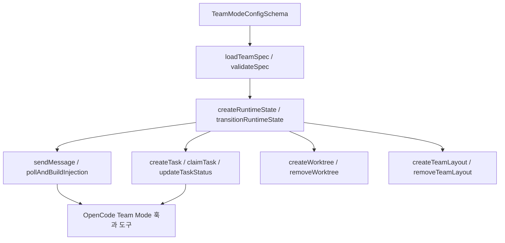

# team core

## 팀 코어 모듈

`packages/team-core`는 Team Mode의 순수 런타임 기반 기능을 담는 공용 패키지입니다. OpenCode 어댑터 쪽의 팀 생성, 메시징 도구, 훅, tmux 시각화, 상태 조회 기능은 이 모듈을 호출해 팀 스펙을 읽고, 런타임 상태를 저장하며, 멤버 간 메시지와 작업 큐를 파일 시스템 위에서 조정합니다.

이 모듈은 직접 에이전트를 실행하는 계층이 아니라, Team Mode가 안정적으로 동작하기 위한 저장소, 검증, 동기화, 정리 로직을 제공합니다.



## 공개 진입점

`src/index.ts`는 다음 하위 모듈을 다시 내보냅니다.

- `config`: `TeamModeConfigSchema`, `TeamModeConfig`
- `logger`: `setTeamCoreLogger`, `log`
- `member-parser`: `createParseMember`, `MemberValidationError`
- `session-client`: `TeamSessionClient`, `TeamSessionContext`
- `types`: 팀 스펙, 멤버, 메시지, 태스크, 런타임 상태 Zod 스키마와 타입
- `team-registry`: 팀 스펙 경로 탐색, 로딩, 정규화, 검증
- `team-mailbox`: 멤버 간 메시지 저장, 주입, ack, 예약 복구
- `team-tasklist`: 팀 작업 생성, 조회, claim, 상태 전이
- `team-state-store`: 런타임 상태 생성, 로딩, 전이, 재개
- `team-worktree`: 멤버별 Git worktree 생성과 정리
- `team-layout-tmux`: tmux 기반 팀 레이아웃 생성과 정리

## 설정 모델

`TeamModeConfigSchema`는 Team Mode의 런타임 한계를 정의합니다.

주요 필드는 다음과 같습니다.

- `enabled`: Team Mode 활성화 여부입니다. 기본값은 `false`입니다.
- `tmux_visualization`: tmux 레이아웃 시각화 사용 여부입니다.
- `max_parallel_members`: 동시에 실행할 수 있는 멤버 수입니다. `1..8` 범위입니다.
- `max_members`: 팀 전체 멤버 수 상한입니다. `1..8` 범위입니다.
- `max_messages_per_run`, `max_wall_clock_minutes`, `max_member_turns`: 팀 실행량 제한입니다.
- `base_dir`: 팀 런타임 데이터를 저장할 기준 디렉터리입니다. 없으면 `~/.omo`를 사용합니다.
- `message_payload_max_bytes`: 메시지 본문 크기 제한입니다. 기본값은 `32768`입니다.
- `recipient_unread_max_bytes`: 수신자 inbox의 미처리 메시지 총량 제한입니다.
- `mailbox_poll_interval_ms`: mailbox polling 간격입니다.

`resolveBaseDir(config)`는 모든 런타임 경로의 기준점을 계산합니다. `base_dir`가 있으면 그 값을 쓰고, 없으면 홈 디렉터리 아래 `.omo`를 사용합니다.

## 팀 스펙 로딩과 검증

팀 스펙은 `loadTeamSpec()`와 `loadAllTeamSpecs()`로 읽습니다. 스펙 탐색은 `discoverTeamSpecs()`가 담당하며, 두 위치를 함께 봅니다.

- 프로젝트 스코프: `<projectRoot>/.omo/teams/<teamName>/config.json`
- 사용자 스코프: `<baseDir>/teams/<teamName>/config.json`

프로젝트 스펙과 사용자 스펙의 이름이 충돌하면 프로젝트 스펙이 우선합니다. 충돌은 `team-spec collision` 로그로 남습니다.

`loadTeamSpec()`의 흐름은 다음과 같습니다.

1. `discoverTeamSpecs()`로 후보를 찾습니다.
2. `readFile()`과 `JSON.parse()`로 `config.json`을 읽습니다.
3. `normalizeTeamSpecInput()`으로 자연스러운 입력 형태를 정규화합니다.
4. `TeamSpecSchema.safeParse()`로 구조를 검증합니다.
5. `validateSpec()`로 Team Mode의 추가 규칙을 검증합니다.

`normalizeTeamSpecInput()`은 사용자 입력의 편의를 위해 몇 가지 변환을 수행합니다.

- 팀 이름과 멤버 이름을 소문자 kebab-case로 정규화합니다.
- `kind`가 빠졌지만 `category`나 `subagent_type`이 있으면 적절한 `kind`를 채웁니다.
- `lead`, `leadAgentId`, `isLead`를 해석해 리더를 결정합니다.
- 호출자가 팀 리더로 적격이면 `lead` 멤버를 자동 삽입할 수 있습니다.
- `role`, `description`, `capabilities`, `responsibilities` 같은 자연어 필드에서 category 멤버의 `prompt`를 만들 수 있습니다.
- 빈 문자열 필드는 제거합니다.

`validateSpec()`는 다음 규칙을 강제합니다.

- 멤버 수는 최대 8명입니다.
- `member.name`은 팀 안에서 유일해야 합니다.
- `leadAgentId`는 정확히 하나의 멤버 이름과 일치해야 합니다.
- `subagent_type` 멤버는 `AGENT_ELIGIBILITY_REGISTRY`에서 `hard-reject`가 아니어야 합니다.
- `category` 멤버의 `prompt`는 공백 제거 후 8자 이상이어야 합니다.
- `hyperplan` 팀은 `unspecified-low`, `unspecified-high`, `ultrabrain`, `artistry` category를 포함해야 합니다.

## 멤버 파싱과 리더 판별

`createParseMember(memberSchema, agentEligibilityRegistry)`는 Team Mode 설정의 개별 멤버를 파싱하는 팩토리입니다. `category`와 `subagent_type`을 동시에 지정하거나, 둘 다 지정하지 않거나, category 멤버에 `prompt`가 없으면 `MemberValidationError`를 던집니다.

`resolveCallerTeamLead(rawAgentName)`는 현재 호출 에이전트 표시 이름을 Team Mode의 내부 agent type으로 변환합니다. 예를 들어 `Sisyphus - Ultraworker`는 `sisyphus`로 해석됩니다. 이름 앞의 정렬용 zero-width prefix는 `stripAgentListSortPrefix()`가 제거합니다.

`shouldReuseCallerLeadSession(spec, callerAgentTypeId)`는 호출자 세션을 팀 리더 세션으로 재사용할 수 있는지 판단합니다. 현재 구현은 호출자 agent type이 있고 스펙에 `leadAgentId`가 있으면 `true`를 반환합니다.

## 안전한 파일 시스템 경로

`team-registry/paths.ts`는 Team Mode의 모든 저장 경로를 중앙에서 만듭니다.

핵심 함수는 다음과 같습니다.

- `getRuntimeStateDir(baseDir, teamRunId)`
- `getInboxDir(baseDir, teamRunId, memberName)`
- `getTasksDir(baseDir, teamRunId)`
- `getTaskFilePath(baseDir, teamRunId, taskId)`
- `getTaskClaimsDir(baseDir, teamRunId)`
- `getTaskClaimLockPath(baseDir, teamRunId, taskId)`
- `getWorktreeDir(baseDir, teamRunId, memberName)`

`resolveContainedPath()`는 `.` / `..` / 슬래시 / 역슬래시 / null byte를 포함한 path segment를 거부합니다. `teamRunId`, `memberName`, `taskId` 같은 값이 저장소 밖으로 빠져나가지 못하게 하기 위한 방어선입니다. 위반 시 `TeamPathTraversalError`가 발생합니다.

`ensureBaseDirs()`는 `baseDir`, `teams`, `runtime`, `worktrees` 디렉터리를 만들고 권한을 `0700`으로 맞춥니다. 일부 파일 시스템에서 `chmod`가 거부되면 로그를 남기고 기존 권한으로 계속합니다.

## 런타임 상태 저장소

`team-state-store/store.ts`는 팀 실행 상태의 단일 소스입니다. 상태 파일은 다음 위치에 저장됩니다.

```text
<baseDir>/runtime/<teamRunId>/state.json
```

`createRuntimeState(spec, leadSessionId, specSource, config)`는 새 `teamRunId`를 만들고 상태를 `creating`으로 시작합니다. 각 멤버는 `pending` 상태로 들어가며, `spec.leadAgentId`와 이름이 같은 멤버는 `agentType: "leader"`가 됩니다.

`transitionRuntimeState(teamRunId, transition, config)`는 `state.lock`을 잡고 다음 순서로 상태를 바꿉니다.

1. 현재 `state.json`을 `loadRuntimeState()`로 읽습니다.
2. 전달받은 `transition()` 함수를 적용합니다.
3. `RuntimeStateSchema`로 새 상태를 검증합니다.
4. 허용된 상태 전이인지 확인합니다.
5. `saveRuntimeState()`로 원자적 저장을 수행합니다.

허용되는 주요 전이는 다음과 같습니다.

- `creating -> active | failed`
- `active -> shutdown_requested | deleting`
- `shutdown_requested -> deleting`
- `deleting -> deleted`
- 모든 상태에서 `orphaned`로 이동 가능

잘못된 전이는 `InvalidTransitionError`를 던집니다. 상태 파일이 스키마에 맞지 않으면 `RuntimeStateError`가 발생합니다.

`listActiveTeams(config)`는 `<baseDir>/runtime` 아래의 상태를 훑어 현재 살아 있는 팀 목록을 반환합니다. `deleted`, `failed`, 오래된 `deleting` 상태는 best-effort로 런타임 디렉터리를 정리합니다.

## 재개와 정리

`resumeAllTeams(ctx, config)`는 프로세스 재시작 후 Team Mode 런타임을 정리하거나 이어 붙이는 함수입니다.

상태별 처리는 다음과 같습니다.

- `creating`: 30분 이상 stuck 상태이면 `markStuckCreatingTeamFailed()`로 `failed` 처리하고 worktree를 정리합니다.
- `active`: `resumeActiveTeam()`으로 리더 세션과 워커 세션 생존 여부를 확인합니다.
- `deleting`: `finishDeletingTeam()`으로 worktree를 정리하고 runtime 디렉터리를 제거합니다.
- `deleted`, `failed`: `cleanTerminalTeam()`으로 runtime 디렉터리를 제거합니다.
- `shutdown_requested`, `orphaned`: 자동 정리하지 않습니다.

`resumeActiveTeam()`은 `TeamSessionContext.client.session.get()`으로 리더 세션을 확인합니다. 리더가 없으면 팀을 `orphaned`로 표시합니다. 워커 세션은 `inspectWorkerMembers()`로 검사하고, 죽은 워커는 `markDeadWorkersErrored()`로 `errored` 처리합니다. 모든 워커가 죽었으면 팀도 `orphaned`가 됩니다.

## 파일 락과 원자적 쓰기

`team-state-store/locks.ts`는 팀 런타임의 동시성 제어를 담당합니다.

`withLock(lockPath, fn, opts)`는 `open(lockPath, "wx")` 방식으로 락 파일을 만들고, 작업이 끝나면 락을 제거합니다. 락 파일에는 owner tag, process id, 획득 시간이 기록됩니다.

`detectStaleLock(lockPath, staleAfterMs)`는 락 소유 프로세스가 살아 있는지 `process.kill(pid, 0)`으로 확인합니다. 프로세스가 죽었고 TTL이 지났으면 stale lock으로 판단합니다.

`atomicWrite(filePath, content)`는 임시 파일에 쓰고 `fsync` 후 `rename()`으로 교체합니다. `tolerantFsync()`는 `EPERM`, `EACCES`, `ENOTSUP`, `EINVAL` 같은 플랫폼별 fsync 제한을 허용합니다.

## Mailbox 메시징

`team-mailbox`는 멤버 간 메시지를 파일 기반 inbox로 전달합니다. 메시지는 `MessageSchema`를 따르며 `messageId`, `from`, `to`, `kind`, `body`, `timestamp` 등을 포함합니다.

`sendMessage(message, teamRunId, config, context)`는 메시지를 수신자의 inbox에 JSON 파일로 씁니다.

주요 보호 장치는 다음과 같습니다.

- `assertTeamAcceptsMessages()`는 팀 상태가 `deleting` 또는 `deleted`이면 `TeamDeletingError`를 던집니다.
- `message.body`가 `message_payload_max_bytes`를 넘으면 `PayloadTooLargeError`를 던집니다.
- `to: "*"` 브로드캐스트는 `context.isLead`가 아니면 `BroadcastNotPermittedError`를 던집니다.
- 수신자가 active member나 reserved recipient가 아니면 `InvalidRecipientError`를 던집니다.
- 수신자 inbox의 unread 총량이 `recipient_unread_max_bytes`를 넘으면 `RecipientBackpressureError`를 던집니다.
- 같은 `messageId`의 일반 파일이나 `.delivering-` 파일이 있으면 `DuplicateMessageIdError`를 던집니다.

메시지 파일은 일반적으로 `<messageId>.json`으로 저장됩니다. `reservedRecipients`에 포함된 수신자에게는 `.delivering-<messageId>.json` 형태로 미리 예약된 상태로 저장됩니다.

`listUnreadMessages(teamRunId, memberName, config)`는 inbox의 일반 JSON 파일을 읽어 `MessageSchema`로 검증하고 timestamp 순으로 반환합니다. 손상된 메시지는 로그를 남기고 건너뜁니다.

`pollAndBuildInjection(sessionID, memberName, teamRunId, config, turnMarker)`는 unread 메시지를 `<peer_message>` envelope로 바꾸어 모델 컨텍스트에 주입할 문자열을 만듭니다. 같은 turnMarker에서 중복 주입되지 않도록 `RuntimeStateMember.lastInjectedTurnMarker`와 `pendingInjectedMessageIds`를 함께 갱신합니다.

`buildEnvelope(message)`는 메시지 메타데이터를 XML 유사 envelope 속성으로 넣습니다. 속성값은 `escapeAttributeValue()`로 이스케이프되며, 본문은 태그 내부에 그대로 들어갑니다.

## 메시지 예약, ack, 복구

Mailbox는 “주입 요청은 있었지만 실제 세션 컨텍스트에 들어갔는지 알 수 없는” 상태를 피하기 위해 예약 파일을 사용합니다.

- `reserveMessageForDelivery()`는 `<id>.json`을 `.delivering-<id>.json`으로 바꾸거나, 이미 예약된 파일을 확인합니다.
- `commitDeliveryReservation()`은 `.delivering-<id>.json`을 `processed/<id>.json`으로 옮깁니다.
- `releaseDeliveryReservation()`은 `.delivering-<id>.json`을 다시 `<id>.json`으로 되돌립니다.
- `ackMessages()`는 일반 파일 또는 `.delivering-` 파일을 `processed/`로 이동합니다.
- `reclaimStaleReservations()`는 오래된 `.delivering-` 파일을 다시 unread 파일로 되돌립니다.

`findDeliveredMessageIds(client, sessionID, messageIds)`는 세션 메시지 히스토리를 읽어 `<peer_message messageId="...">`가 실제로 들어갔는지 검사합니다. 실패 시 빈 set을 반환하는데, 이는 메시지를 잃지 않기 위한 보수적 동작입니다.

`requeuePendingLiveDeliveries()`는 pending live delivery가 실제 컨텍스트에 들어가지 않았다고 판단될 때 예약을 해제해 다음 poll에서 다시 전달되도록 합니다.

`reconcileStaleReservationsForMember()`는 resume 과정에서 stale reservation을 되살리고, 이미 세션 히스토리에 들어간 메시지는 `ackMessages()`로 처리합니다.

## 작업 목록

`team-tasklist`는 팀 내부 작업 큐를 파일로 관리합니다. 태스크는 `TaskSchema`를 따르며 `pending`, `claimed`, `in_progress`, `completed`, `deleted` 상태를 가집니다.

`createTask(teamRunId, taskInput, config)`는 `<baseDir>/runtime/<teamRunId>/tasks` 아래에 새 JSON 파일을 만듭니다. `.highwatermark` 파일을 락으로 보호해 증가형 숫자 ID를 발급합니다.

`listTasks(teamRunId, config, filter)`는 태스크 파일을 읽고 `status` 또는 `owner` 필터를 적용합니다. 손상된 태스크 파일은 로그를 남기고 건너뜁니다.

`getTask(teamRunId, taskId, config)`는 단일 태스크 파일을 읽어 `TaskSchema`로 파싱합니다.

`claimTask(teamRunId, taskId, memberName, config)`는 pending 태스크를 특정 멤버가 claim합니다. claim 전에 `canClaim()`으로 `blockedBy` 태스크가 모두 완료됐는지 확인합니다. 이미 claim됐거나 진행 중이면 `AlreadyClaimedError`, 미완료 blocker가 있으면 `BlockedByError`가 발생합니다.

`updateTaskStatus(teamRunId, taskId, newStatus, memberName, config)`는 태스크 상태를 전이합니다. 허용 전이는 다음과 같습니다.

- `pending -> claimed | deleted`
- `claimed -> in_progress | deleted`
- `in_progress -> completed | deleted`
- `completed -> deleted`

`pending -> in_progress` 요청은 내부적으로 먼저 `claimTask()`를 호출한 뒤 다시 상태를 갱신합니다. 삭제가 아닌 상태 변경은 태스크 owner만 수행할 수 있으며, 위반 시 `CrossOwnerUpdateError`가 발생합니다.

## Worktree 관리

`team-worktree/manager.ts`는 멤버별 Git worktree를 생성합니다.

`validateWorktreeSpec(spec)`는 worktree path가 파일 시스템 경로인지 확인합니다. 허용되는 형태는 `./...`, `../...`, `/...`이며, `..` segment가 2개를 초과하면 거부합니다.

`createWorktree(repoRoot, teamRunId, memberName, worktreePath, config)`는 다음 순서로 동작합니다.

1. `validateWorktreeSpec()`로 경로를 검증합니다.
2. `isGitAvailable()`로 `git --version`을 확인합니다.
3. 상대 경로를 `repoRoot` 기준 절대 경로로 변환합니다.
4. `git -C <repoRoot> worktree add --detach <absolutePath>`를 실행합니다.

Git이 없으면 `GitUnavailableError`가 발생합니다.

`removeWorktree(worktreePath)`는 파일 시스템 디렉터리를 제거한 뒤 `git worktree remove --force`와 `git worktree prune`을 best-effort로 수행합니다. 이미 제거됐거나 worktree가 아닌 경우는 성공으로 간주합니다.

`findOrphanWorktrees(baseDir, config)`는 `<baseDir>/worktrees` 아래를 훑어 연결된 runtime 상태가 없거나 `active`, `shutdown_requested`가 아닌 worktree를 orphan으로 반환합니다.

## tmux 레이아웃

`team-layout-tmux`는 Team Mode를 tmux 창 안에서 시각화합니다. 이 기능은 `process.env.TMUX`가 있을 때만 활성화됩니다.

`canVisualize()`는 현재 프로세스가 tmux 안에서 실행 중인지 확인합니다.

`createTeamLayout(teamRunId, members, tmuxMgr, deps)`는 호출자 tmux window 안에 팀 멤버 pane을 생성하고, 각 pane에서 다음 명령을 실행합니다.

```sh
opencode attach '<serverUrl>' --session '<member.sessionId>' --dir '<worktree 또는 현재 디렉터리>'
```

생성 과정은 다음과 같습니다.

1. `tmuxMgr.getServerUrl()`로 attach 대상 서버 URL을 얻습니다.
2. `isServerRunning(serverUrl)`로 서버가 실제로 접근 가능한지 확인합니다.
3. `resolveCallerTmuxSession()`으로 현재 tmux pane, session, window target을 찾습니다.
4. `split-window`로 멤버 pane을 만듭니다.
5. pane title을 `omo-team-<member.name>`으로 설정합니다.
6. `@omo_attach_server_url`, `@omo_attach_session_id` pane option을 기록합니다.
7. `send-keys`로 `opencode attach`를 실행합니다.
8. window layout을 `main-vertical`로 맞추고 호출자 pane 폭을 조정합니다.

`removeTeamLayout(teamRunId, cleanupTarget, deps)`는 owned session이면 `kill-session`, pane 목록이 있으면 `kill-pane`, window id가 있으면 `kill-window`로 정리합니다.

`closeTeamMemberPane(member)`는 `tmuxPaneId`와 `tmuxGridPaneId`를 모두 닫으려고 시도하고, 하나라도 성공하면 `true`를 반환합니다.

`rebalanceTeamWindowWith(windowId, layout, deps)`는 `main-vertical` 또는 `tiled` 레이아웃을 적용합니다. `main-vertical`에서는 `main-pane-width`를 `60%`로 설정한 뒤 `select-layout`을 다시 호출합니다.

`sweepStaleTeamSessions(activeTeamRunIds)`는 `omo-team-<uuid>` 패턴의 tmux session 중 현재 active run id에 없는 session을 제거합니다.

## 외부 어댑터와의 연결

이 모듈은 OpenCode 어댑터의 Team Mode 구현에서 호출됩니다.

대표적인 연결 지점은 다음과 같습니다.

- `team-mode/team-runtime/create.ts`는 팀 실행 생성 중 `sweepStaleTeamSessions()`를 호출합니다.
- `team-mode/team-runtime/activate-team-layout.ts`는 `createTeamLayout()`으로 tmux pane을 붙입니다.
- `team-mode/team-runtime/cleanup-team-run-resources.ts`는 `removeTeamLayout()`으로 레이아웃을 정리합니다.
- `hooks/team-mailbox-injector/hook.ts`는 `pollAndBuildInjection()`을 호출해 unread 메시지를 모델 컨텍스트에 주입합니다.
- `hooks/team-session-events/team-idle-wake-hint.ts`는 `ackMessages()`, `findDeliveredMessageIds()`, `requeuePendingLiveDeliveries()`를 사용해 live delivery의 손실을 방지합니다.
- `team-mode/tools/messaging.ts`와 관련 테스트는 `sendMessage()`의 오류 타입을 사용자-facing 도구 결과로 변환합니다.
- `team-mode/team-runtime/status.ts`는 `listUnreadMessages()`로 팀 상태를 집계합니다.
- shutdown 관련 런타임은 `loadRuntimeState()`와 `transitionRuntimeState()`를 통해 상태 전이를 수행합니다.

## 기여 시 주의할 점

`team-core`는 여러 프로세스와 세션이 동시에 접근하는 파일 기반 런타임입니다. 상태 파일, mailbox, tasklist를 수정할 때는 `atomicWrite()`와 `withLock()` 사용 여부를 먼저 확인해야 합니다.

새로운 경로를 추가할 때는 `resolveContainedPath()` 패턴을 따라야 합니다. 외부 입력이 path segment에 들어가는 경우 `..`, 슬래시, 역슬래시, null byte를 반드시 차단해야 합니다.

런타임 상태를 바꾸는 기능은 `transitionRuntimeState()`를 통과해야 합니다. 직접 `saveRuntimeState()`를 호출하면 상태 전이 규칙과 락을 우회할 수 있습니다.

메시지 전달 로직을 바꿀 때는 unread 파일, `.delivering-` 예약 파일, `processed/` 파일의 의미를 유지해야 합니다. 특히 pending delivery는 “확실히 전달됨”이 증명되기 전까지 ack하면 안 됩니다.

태스크 상태를 추가하거나 바꾸려면 `TASK_STATUSES`, `TaskSchema`, `ALLOWED_TRANSITIONS`, `claimTask()`, `canClaim()`의 관계를 함께 봐야 합니다.

tmux 기능은 항상 best-effort입니다. `createTeamLayout()`과 `removeTeamLayout()`은 실패 시 팀 실행 자체를 중단하기보다 로그를 남기고 `null` 또는 조용한 정리를 반환하는 방향으로 설계되어 있습니다.