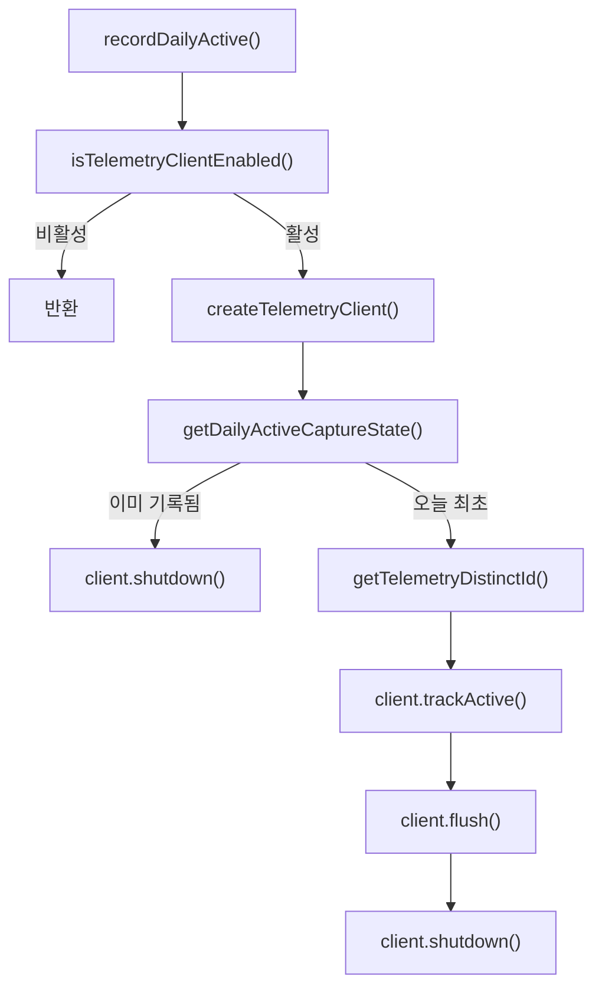

# telemetry core

## 개요

`packages/telemetry-core`는 OpenCode/Codex 어댑터가 공유하는 익명 사용 통계 기록 계층입니다. 핵심 책임은 하루 한 번만 활성 이벤트를 전송하고, 전송 가능 여부를 환경 변수로 제어하며, PostHog 전송 실패를 사용자 흐름에 영향을 주지 않는 진단 로그로 남기는 것입니다.

모듈의 공개 API는 `src/index.ts`에서 재-export됩니다.

```ts
export * from "./activity-state"
export * from "./constants"
export * from "./diagnostics"
export * from "./env"
export * from "./machine-id"
export * from "./posthog-client"
export * from "./record-daily-active"
export type * from "./types"
```

## 전체 흐름

일반적인 호출 진입점은 `recordDailyActive()`입니다. 이 함수는 텔레메트리가 꺼져 있거나 API 키가 없으면 즉시 반환하고, 활성화되어 있으면 PostHog 클라이언트를 만든 뒤 UTC 날짜 기준으로 하루 한 번만 이벤트를 보냅니다.



전송 상태는 네트워크 응답이 아니라 로컬 상태 파일 기준입니다. `getDailyActiveCaptureState()`가 오늘 날짜를 새로 기록하면 `recordDailyActive()`는 이벤트를 전송하고, 이미 같은 UTC 날짜가 기록되어 있으면 클라이언트를 종료하고 반환합니다.

## 제품 설정

`TelemetryProductConfig`는 이 코어 모듈을 사용하는 제품별 값을 주입하는 계약입니다.

```ts
export type TelemetryProductConfig = {
  readonly cacheDirName: string
  readonly defaultApiKey: string
  readonly defaultHost: string
  readonly eventName: string
  readonly machineIdPrefix: string
  readonly packageName: string
  readonly packageVersion: string
  readonly platform: string
  readonly productEnvPrefix: string
  readonly productName: string
  readonly additionalProperties?: TelemetryCaptureProperties
}
```

주요 필드는 다음처럼 쓰입니다.

- `cacheDirName`: XDG 데이터 디렉터리 아래 상태 파일 위치를 정할 때 사용합니다.
- `defaultApiKey`, `defaultHost`: `POSTHOG_API_KEY`, `POSTHOG_HOST`가 없을 때 기본값으로 사용합니다.
- `eventName`: `trackActive()`가 PostHog에 보내는 이벤트 이름입니다.
- `machineIdPrefix`: 호스트명 해시를 만들 때 접두어로 붙여 제품 간 식별자를 분리합니다.
- `productEnvPrefix`: 제품별 opt-out 환경 변수 prefix입니다.
- `additionalProperties`: 모든 capture 이벤트에 병합되는 제품별 속성입니다.

기본 PostHog 설정은 `constants.ts`에 있습니다.

```ts
export const DEFAULT_POSTHOG_HOST = "https://us.i.posthog.com"
export const DEFAULT_POSTHOG_API_KEY = "..."
```

## 환경 변수와 비활성화 규칙

`env.ts`는 텔레메트리 활성 여부와 PostHog 접속 정보를 결정합니다.

`shouldDisableTelemetry()`는 전역 prefix와 제품 prefix를 모두 검사합니다. 전역 prefix 기본값은 `OMO`이고, 제품 prefix는 `TelemetryProductConfig.productEnvPrefix`에서 전달됩니다.

검사되는 변수 패턴은 다음과 같습니다.

```text
{PREFIX}_DISABLE_POSTHOG
{PREFIX}_SEND_ANONYMOUS_TELEMETRY
```

`{PREFIX}_DISABLE_POSTHOG`는 `"1"`, `"true"`, `"yes"`일 때 비활성화됩니다.  
`{PREFIX}_SEND_ANONYMOUS_TELEMETRY`는 `"0"`, `"false"`, `"no"`, `"yes"`일 때 비활성화됩니다.

`SEND_ANONYMOUS_TELEMETRY`에서 `"yes"`도 opt-out으로 처리되는 점에 주의해야 합니다. 이 모듈의 현재 구현은 `SEND_OPT_OUT_VALUES`에 `"yes"`를 포함합니다.

`getTelemetryApiKey()`는 `POSTHOG_API_KEY`가 있으면 trim한 값을 사용하고, 없으면 제품의 기본 API 키를 사용합니다. `hasTelemetryApiKey()`는 최종 API 키 길이가 0보다 큰지만 확인합니다.

`getTelemetryHost()`는 `POSTHOG_HOST`가 비어 있지 않으면 해당 값을 쓰고, 없으면 기본 host를 사용합니다.

## 일일 활성 상태 파일

`activity-state.ts`는 하루 한 번 전송을 보장하기 위한 로컬 상태를 관리합니다.

상태 파일 이름은 고정입니다.

```ts
const POSTHOG_ACTIVITY_STATE_FILE = "posthog-activity.json"
```

파일 내용은 `PostHogActivityState` 형태입니다.

```ts
export type PostHogActivityState = {
  readonly lastActiveDayUTC?: string
}
```

`resolveTelemetryStateDir()`는 제품의 `cacheDirName`과 XDG 데이터 디렉터리를 조합해 상태 디렉터리를 구합니다. 내부적으로 `resolveXdgDataDir()`를 사용하며, `XDG_DATA_HOME`이 명시된 경우 중복 경로가 생기지 않도록 보정합니다.

`getTelemetryActivityStateFilePath(stateDir)`는 상태 디렉터리에 `posthog-activity.json`을 붙입니다.

`getDailyActiveCaptureState()`는 다음 순서로 동작합니다.

1. `readPostHogActivityState()`로 기존 상태를 읽습니다.
2. `getUtcDayString()`으로 현재 날짜를 `YYYY-MM-DD` UTC 문자열로 만듭니다.
3. `lastActiveDayUTC`가 오늘과 다르면 `captureDaily: true`로 판단합니다.
4. 오늘 최초 기록이면 `writePostHogActivityState()`로 상태 파일을 갱신합니다.
5. `{ dayUTC, captureDaily }`를 반환합니다.

상태 파일 읽기/쓰기 실패는 호출자에게 throw되지 않습니다. 대신 전달된 `diagnostics` 콜백이 있으면 각각 `telemetry_activity_state_read_failed`, `telemetry_activity_state_write_failed` 이벤트로 보고합니다.

쓰기에는 `writeFileAtomically()`가 사용됩니다. 디렉터리는 `mkdirSync(stateDir, { recursive: true })`로 생성합니다.

## 머신 식별자

`machine-id.ts`는 익명 distinct id를 생성합니다.

```ts
export function getTelemetryDistinctId(
  machineIdPrefix: string,
  osProvider: TelemetryOsProvider = getDefaultTelemetryOsProvider(),
): string {
  return createHash("sha256").update(`${machineIdPrefix}${osProvider.hostname()}`).digest("hex")
}
```

식별자는 원본 호스트명을 보내지 않고, `machineIdPrefix + hostname()` 값을 SHA-256으로 해시한 문자열입니다. 테스트나 어댑터에서는 `TelemetryOsProvider`를 주입해 hostname, OS 정보, CPU 정보 등을 제어할 수 있습니다.

## PostHog 클라이언트

`posthog-client.ts`는 실제 전송 클라이언트와 no-op 클라이언트를 같은 `TelemetryClient` 인터페이스로 제공합니다.

```ts
export type TelemetryClient = {
  readonly enabled: boolean
  readonly trackActive: (input: {
    readonly dayUTC: string
    readonly distinctId: string
    readonly reason: string
  }) => void
  readonly flush: () => Promise<void>
  readonly shutdown: () => Promise<void>
}
```

`isTelemetryClientEnabled()`는 두 조건을 모두 만족해야 `true`를 반환합니다.

- `shouldDisableTelemetry()`가 `false`
- `getTelemetryApiKey()` 결과가 빈 문자열이 아님

`createTelemetryClient()`는 비활성 상태면 `NO_OP_CLIENT`를 반환합니다. transport 생성에 실패해도 예외를 전파하지 않고 `telemetry_posthog_init_failed` 진단을 남긴 뒤 `NO_OP_CLIENT`를 반환합니다.

기본 transport는 `createDefaultPostHogTransport()`가 만들며, 내부 구현체는 `PostHogTelemetryTransport`입니다. 이 클래스는 `posthog-node`의 `PostHog` 인스턴스를 감싸고 `capture()`, `flush()`, `shutdown()`만 노출합니다.

PostHog 옵션은 원격 평가와 예외 자동 수집을 끄는 쪽으로 고정되어 있습니다.

```ts
{
  enableExceptionAutocapture: false,
  enableLocalEvaluation: false,
  strictLocalEvaluation: true,
  disableRemoteConfig: true,
  flushAt: 1,
  flushInterval: 0,
  host: getTelemetryHost(...),
  disableGeoip: false,
}
```

`trackActive()`가 보내는 이벤트 속성에는 제품 정보, 런타임 정보, OS 정보, CPU 정보, locale/timezone, shell, CI 여부, 터미널 프로그램, `day_utc`, `reason`이 포함됩니다. 또한 `$process_person_profile: false`를 명시해 PostHog person profile 처리를 피합니다.

CPU 정보 조회는 `getSafeCpuInfo()`로 감싸져 있습니다. `osProvider.cpus()`가 실패하면 `telemetry_cpu_info_unavailable` 진단을 남기고 `{ count: 0, model: undefined }`를 사용합니다.

## 진단 로그

`diagnostics.ts`는 텔레메트리 자체의 실패를 JSON Lines 파일로 기록합니다. 파일 이름은 `telemetry-diagnostics.jsonl`입니다.

`writeTelemetryDiagnostic()`는 먼저 `cleanupTelemetryDiagnostics()`를 호출한 뒤 한 줄짜리 JSON record를 append합니다. record는 `toDiagnosticRecord()`로 만들어집니다.

```json
{"timestamp":"2026-06-18T00:00:00.000Z","event":"telemetry_capture_failed","source":"shared","error_kind":"error","error_name":"Error","error_message":"..."}
```

에러 직렬화 규칙은 `serializeError()`에 있습니다.

- `Error` 인스턴스: `error_kind`, `error_name`, `error_message`
- `undefined`: 에러 필드를 추가하지 않음
- 그 외 값: `typeof error`와 `String(error)` 사용

보존 정책은 두 가지입니다.

- `DIAGNOSTICS_RETENTION_MS`: 7일보다 오래된 줄 제거
- `DIAGNOSTICS_MAX_BYTES`: 최신 줄부터 최대 256 KiB까지만 유지

`cleanupTelemetryDiagnostics()`는 파일을 읽고, `shouldRetainLine()`로 유효하고 최근인 줄만 남긴 뒤, `trimToMaxBytes()`로 크기를 제한합니다. 파싱 불가능한 JSON 줄이나 `timestamp`가 없는 줄은 버려집니다. `SyntaxError`가 아닌 JSON 파싱 오류는 다시 throw되어 cleanup 전체가 실패 처리됩니다.

진단 쓰기와 cleanup 실패는 모두 호출자에게 전파되지 않습니다. 이 모듈의 원칙은 텔레메트리 실패가 제품 실행을 방해하지 않는 것입니다.

## `recordDailyActive()` 사용 패턴

제품 어댑터는 보통 다음 값들을 조합해 `recordDailyActive()`를 호출합니다.

```ts
await recordDailyActive({
  product,
  source: "codex",
  reason: "session_start",
  stateDir,
  diagnostics,
  env: process.env,
})
```

`recordDailyActive()` 내부 순서는 중요합니다.

1. `isTelemetryClientEnabled()`로 빠르게 opt-out/API 키를 확인합니다.
2. `createTelemetryClient()`로 transport를 초기화합니다.
3. 클라이언트가 no-op이면 반환합니다.
4. `getDailyActiveCaptureState()`로 오늘 전송 여부를 결정합니다.
5. 이미 오늘 기록된 경우 `client.shutdown()`만 호출합니다.
6. 오늘 최초인 경우 `getTelemetryDistinctId()`로 distinct id를 만들고 `trackActive()`를 호출합니다.
7. `flush()` 후 `shutdown()`합니다.

이 설계 때문에 상태 파일 갱신은 capture보다 먼저 일어납니다. 따라서 capture나 flush가 실패해도 같은 UTC 날짜에 반복 전송하지 않습니다. 이 동작은 “최소 침습적인 익명 활성 신호”를 우선하는 선택입니다.

## 테스트와 주입 지점

이 모듈은 테스트 가능성을 위해 외부 의존성을 대부분 주입받습니다.

- `env`: 환경 변수 분기 테스트
- `now`: UTC 날짜와 진단 timestamp 테스트
- `osProvider`: hostname, CPU, OS 속성 테스트
- `transportFactory`: PostHog 네트워크 호출 없이 capture/flush/shutdown 테스트
- `diagnostics`: 실패 경로 관찰 테스트
- `stateDir`, `diagnosticsDir`: 임시 디렉터리 기반 파일 테스트

호출 그래프 기준으로 테스트 진입점은 주로 다음 함수들입니다.

- `shouldDisableTelemetry()` in `env.test.ts`
- `getDailyActiveCaptureState()` and `resolveTelemetryStateDir()` in `activity-state.test.ts`
- `createTelemetryClient()`, `recordDailyActive()`, `getTelemetryDistinctId()` in `posthog-client.test.ts`
- `writeTelemetryDiagnostic()` through diagnostics callbacks

## 기여 시 주의점

텔레메트리 코어는 제품 실행 경로에 붙지만, 실패해도 사용자 작업을 막으면 안 됩니다. 새 파일 I/O, PostHog 호출, OS 조회를 추가할 때는 기존 패턴처럼 try/catch로 감싸고 `TelemetryDiagnosticInput`을 통해 관찰 가능하게 만들어야 합니다.

환경 변수 규칙을 바꿀 때는 `shouldDisableTelemetry()`의 prefix 중복 제거 로직을 유지해야 합니다. 전역 prefix와 제품 prefix가 같을 수 있으므로 `Array.from(new Set(...))` 패턴이 사용됩니다.

이벤트 속성을 추가할 때는 `getSharedProperties()`에 넣는 값이 개인 식별 정보를 직접 포함하지 않는지 확인해야 합니다. 현재 distinct id도 hostname 원문이 아니라 prefix가 붙은 SHA-256 해시입니다.

상태 파일 포맷을 확장할 때는 `isPostHogActivityState()`가 현재 객체 여부만 검사한다는 점을 고려해야 합니다. 알 수 없는 필드는 `getDailyActiveCaptureState()`가 `...state`로 보존합니다.