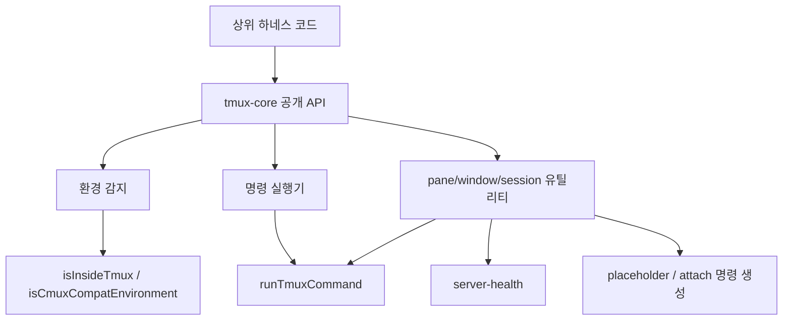

# tmux core

## tmux core

`packages/tmux-core`는 OMO 하네스에서 tmux 기반 보조 에이전트 패널, 별도 창, 별도 세션을 만들고 관리하는 공통 모듈입니다. 핵심 책임은 세 가지입니다.

1. tmux 명령 실행을 `runTmuxCommand()` 하나로 표준화합니다.
2. 현재 프로세스가 tmux 또는 cmux 호환 환경에서 실행 중인지 감지합니다.
3. 보조 에이전트용 pane/window/session 생성, 교체, 활성화, 종료, 정리를 제공합니다.

이 모듈은 실제 OpenCode attach 로직을 직접 구동하기보다, tmux 표면을 안정적으로 다루는 얇은 코어입니다. 상위 패키지는 `TmuxConfig`, `SpawnPaneResult`, `spawnTmuxPane()`, `spawnTmuxWindow()`, `spawnTmuxSession()`, `activateTmuxPane()` 같은 API를 가져와 사용자 세션과 연결합니다.

## 공개 진입점

`src/index.ts`는 다음 파일들을 다시 내보냅니다.

```ts
export * from "./types"
export * from "./constants"
export * from "./cmux-detect"
export * from "./runner"
export * from "./tmux-utils"
```

따라서 소비자는 보통 `@oh-my-opencode/tmux-core`에서 직접 타입과 유틸리티를 import합니다.

주요 타입은 `types.ts`에 있습니다.

```ts
export type TmuxLayout =
  | "main-horizontal"
  | "main-vertical"
  | "tiled"
  | "even-horizontal"
  | "even-vertical"

export type TmuxIsolation = "inline" | "window" | "session"

export type TmuxConfig = {
  readonly enabled: boolean
  readonly layout: TmuxLayout
  readonly main_pane_size: number
  readonly main_pane_min_width: number
  readonly agent_pane_min_width: number
  readonly isolation: TmuxIsolation
}

export interface SpawnPaneResult {
  readonly success: boolean
  readonly paneId?: string
}
```

`TmuxConfig.isolation`은 상위 계층이 어떤 생성 함수를 호출할지 결정하는 설정 값입니다. 이 모듈 내부에서 `inline`, `window`, `session`을 직접 dispatch하지는 않습니다.

## 전체 구조



`runner.ts`가 모든 tmux 명령 실행의 중심입니다. `pane-spawn.ts`, `window-spawn.ts`, `session-spawn.ts`, `pane-close.ts`, `pane-replace.ts`, `pane-activate.ts`, `layout.ts`, `stale-session-sweep.ts`는 모두 `runTmuxCommand()`를 통해 실제 tmux 명령을 호출합니다.

## tmux 명령 실행

`runTmuxCommand(tmuxPath, args, options)`는 tmux 호출 결과를 `TmuxCommandResult`로 통일합니다.

```ts
export type TmuxCommandResult = {
  success: boolean
  output: string
  stdout: string
  stderr: string
  exitCode: number
}
```

동작 흐름은 다음과 같습니다.

1. `resolveTmuxExecutable()`로 실제 실행할 명령을 결정합니다.
2. `runTmuxCommandOnce()`가 `spawn()`으로 프로세스를 실행합니다.
3. stdout과 stderr를 문자열로 수집하고 trim합니다.
4. timeout이 있으면 `AbortController`로 중단하고 `exitCode: -1`, `stderr: "timeout"`을 반환합니다.
5. `runTmuxCommand()`가 필요하면 재시도합니다.

재시도는 제한적으로 동작합니다. `options.retry`가 지정되면 실패 시 다시 실행하지만, stderr가 `can't find pane` 또는 `can't find session`에 매칭되면 복구 불가능한 터미널 오류로 보고 즉시 반환합니다. 이 판정은 `isTerminalTmuxError()`가 담당합니다.

```ts
const TERMINAL_TMUX_ERROR_PATTERN = /can't find (pane|session)/i
```

즉, 일시적인 tmux 실패는 재시도할 수 있지만, 대상 pane/session이 이미 사라진 경우에는 불필요한 재시도를 하지 않습니다.

## cmux 호환 실행

`cmux-detect.ts`는 `cmux omo` 환경을 감지합니다.

```ts
export function isCmuxCompatEnvironment(): boolean {
  const tmuxEnvironment = process.env.TMUX
  return tmuxEnvironment?.includes("cmuxterm") === true ||
    (Boolean(process.env.CMUX_SOCKET_PATH) && !tmuxEnvironment)
}
```

cmux 환경에서는 실제 tmux 서버가 없을 수 있습니다. 이때 `resolveTmuxExecutable()`은 tmux 명령을 그대로 실행하지 않고 `cmux __tmux-compat`로 우회합니다.

```ts
function resolveTmuxExecutable(tmuxPath: string): string[] {
  if (!isCmuxCompatEnvironment()) {
    return [tmuxPath]
  }

  const executableName = tmuxPath.split(/[\\/]/).pop()
  const cmuxExecutable =
    executableName && /^cmux(?:\.(?:bat|cmd|exe|ps1))?$/i.test(executableName)
      ? tmuxPath
      : "cmux"

  return [cmuxExecutable, "__tmux-compat"]
}
```

이 설계 덕분에 상위 코드는 tmux와 cmux를 구분하지 않고 `runTmuxCommand()`만 호출하면 됩니다.

## 환경 감지

`tmux-utils/environment.ts`는 tmux 실행 여부와 현재 pane ID를 확인합니다.

```ts
export function isInsideTmuxEnvironment(
  environment: Record<string, string | undefined>,
): boolean {
  return Boolean(environment.TMUX)
}

export function isInsideTmux(): boolean {
  return isInsideTmuxEnvironment(process.env)
}

export function getCurrentPaneId(): string | undefined {
  return process.env.TMUX_PANE
}
```

테스트나 상위 계층에서는 `isInsideTmuxEnvironment()`에 명시적인 환경 객체를 넣어 순수하게 검증할 수 있습니다. 런타임에서는 `isInsideTmux()`가 `process.env.TMUX`를 직접 확인합니다.

## 서버 상태 확인

tmux pane을 만들어도 attach할 OpenCode 서버가 없으면 사용자가 빈 패널을 보게 됩니다. 이를 막기 위해 `spawnTmuxPane()`, `spawnTmuxWindow()`, `spawnTmuxSession()`은 `isServerRunning(serverUrl)`을 먼저 호출합니다.

`isServerRunning()`은 다음 순서로 판단합니다.

1. `markServerRunningInProcess()`로 현재 프로세스 안에서 서버 실행이 표시되어 있으면 즉시 `true`.
2. 같은 `serverUrl`에 대해 이전 성공 결과가 캐시되어 있으면 즉시 `true`.
3. `${serverUrl}/global/health`를 최대 2번 fetch합니다.
4. 각 요청은 3초 timeout을 갖고, 실패 후 다음 시도 전 250ms 대기합니다.

테스트용 격리를 위해 상태 객체를 주입할 수 있습니다.

```ts
const state = createServerHealthState()

await isServerRunning("http://127.0.0.1:4096", {
  fetchImplementation: fetch,
  state,
})
```

전역 캐시는 `resetServerCheck()`로 초기화합니다.

## pane 명령 문자열

`pane-command.ts`는 tmux pane 안에서 실행될 shell command 문자열을 만듭니다.

`buildTmuxAttachCommand(serverUrl, sessionId, directory)`는 기존 pane을 OpenCode 세션에 attach하는 명령을 생성합니다.

```ts
/bin/sh -c "opencode attach <url> --session <session> --dir <directory>"
```

인자는 `shellEscapeForDoubleQuotedCommand()`로 escape됩니다. 이 함수는 `activateTmuxPane()`에서 사용됩니다.

`buildTmuxPlaceholderCommand(description)`은 새로 만든 보조 에이전트 pane에 임시 대기 화면을 띄웁니다.

```ts
/bin/sh -c "printf '%s\n%s\n' \"OMO subagent pane ready: ...\" \"Focus this pane to attach.\"; while :; do sleep 86400; done"
```

`spawnTmuxPane()`, `spawnTmuxWindow()`, `spawnTmuxSession()`, `replaceTmuxPane()`은 모두 처음에는 attach 명령이 아니라 placeholder 명령을 실행합니다. 실제 attach는 이후 `activateTmuxPane()`이 `respawn-pane`으로 수행합니다.

## pane 생성

`spawnTmuxPane()`은 현재 tmux window 안에 split pane을 생성합니다.

```ts
export async function spawnTmuxPane(
  sessionId: string,
  description: string,
  config: TmuxConfig,
  serverUrl: string,
  _directory: string,
  targetPaneId?: string,
  splitDirection: SplitDirection = "-h",
  depsInput?: Partial<SpawnTmuxPaneDeps>,
): Promise<SpawnPaneResult>
```

실행 조건은 모두 통과해야 합니다.

1. `config.enabled`가 `true`.
2. `isInsideTmux()`가 `true`.
3. `isServerRunning(serverUrl)`이 `true`.
4. `getTmuxPath()`가 tmux 실행 파일 경로를 반환.

성공하면 다음 tmux 명령을 실행합니다.

```text
split-window <방향> -d -P -F "#{pane_id}" [-t <targetPaneId>] <placeholderCmd>
```

반환된 stdout을 pane ID로 사용합니다. 이후 `select-pane -T`로 pane 제목을 `omo-subagent-${description.slice(0, 20)}` 형식으로 설정합니다. 제목 설정 실패는 경고 로그만 남기고 생성 자체를 실패로 보지는 않습니다.

## window 생성

`spawnTmuxWindow()`는 현재 tmux session 안에 새 window를 생성합니다.

```ts
export async function spawnTmuxWindow(
  sessionId: string,
  description: string,
  config: TmuxConfig,
  serverUrl: string,
  _directory: string,
  depsInput?: Partial<SpawnTmuxWindowDeps>,
): Promise<SpawnPaneResult>
```

검증 단계는 `spawnTmuxPane()`과 같습니다. 생성 명령은 다음 형태입니다.

```text
new-window -d -n omo-agents -P -F "#{pane_id}" <placeholderCmd>
```

window 이름은 상수 `ISOLATED_WINDOW_NAME = "omo-agents"`를 사용합니다. 성공 시 새 window의 첫 pane ID를 반환합니다.

## session 생성

`spawnTmuxSession()`은 보조 에이전트 전용 tmux session을 만듭니다.

```ts
export async function spawnTmuxSession(
  sessionId: string,
  description: string,
  config: TmuxConfig,
  serverUrl: string,
  _directory: string,
  sourcePaneId?: string,
  depsInput?: Partial<SpawnTmuxSessionDeps>,
  managerId?: string,
): Promise<SpawnPaneResult>
```

session 이름은 `getIsolatedSessionName()`이 만듭니다.

```ts
getIsolatedSessionName(process.pid)
// "omo-agents-<pid>"

getIsolatedSessionName(process.pid, managerId)
// "omo-agents-<pid>-<managerId>"
```

`sourcePaneId`가 있으면 `getWindowDimensions()`가 원본 pane의 `#{window_width},#{window_height}`를 읽고, 새 session 생성 시 `-x`, `-y` 크기 옵션으로 전달합니다.

이미 같은 isolated session이 있으면 새 session을 만들지 않고 해당 session 안에 `new-window`를 추가합니다.

```text
new-window -t <isolatedSessionName> -P -F "#{pane_id}" <placeholderCmd>
```

없으면 detached session을 새로 만듭니다.

```text
new-session -d -s <isolatedSessionName> [-x <width> -y <height>] -P -F "#{pane_id}" <placeholderCmd>
```

## pane 활성화와 교체

`activateTmuxPane()`은 placeholder pane을 실제 OpenCode attach pane으로 바꿉니다.

```ts
export async function activateTmuxPane(
  paneId: string,
  sessionId: string,
  serverUrl: string,
  directory: string,
  deps?: ActivateTmuxPaneDeps,
): Promise<boolean>
```

내부에서는 `buildTmuxAttachCommand(serverUrl, sessionId, directory)`로 attach 명령을 만들고 다음 명령을 실행합니다.

```text
respawn-pane -k -t <paneId> <opencode attach 명령>
```

`replaceTmuxPane()`은 기존 pane을 placeholder 상태로 다시 교체합니다.

```ts
export async function replaceTmuxPane(
  paneId: string,
  sessionId: string,
  description: string,
  config: TmuxConfig,
  _serverUrl: string,
  _directory: string,
  depsInput?: Partial<ReplaceTmuxPaneDeps>,
): Promise<SpawnPaneResult>
```

먼저 `send-keys -t <paneId> C-c`로 graceful shutdown을 시도한 뒤, `respawn-pane -k`로 placeholder command를 실행합니다. 현재 구현에서는 `_serverUrl`, `_directory` 인자를 받지만 사용하지 않습니다.

## pane 종료

`closeTmuxPane()`은 런타임 의존성을 동적으로 import한 뒤 `closeTmuxPaneWithDependencies()`에 위임합니다.

```ts
export async function closeTmuxPaneWithDependencies(
  paneId: string,
  dependencies: CloseTmuxPaneDependencies,
): Promise<boolean>
```

종료 흐름은 다음과 같습니다.

1. tmux 내부가 아니면 `false`.
2. tmux 경로가 없으면 `false`.
3. `send-keys -t <paneId> C-c`로 graceful shutdown 시도.
4. 250ms 대기.
5. `kill-pane -t <paneId>` 실행.
6. stderr가 `can't find pane`이면 Ctrl+C 중 이미 종료된 것으로 보고 `true`.

이 동작 때문에 pane이 이미 사라진 경우도 정상 종료로 취급할 수 있습니다.

## session 종료와 stale session 정리

`killTmuxSessionIfExists(sessionName)`은 session 존재 여부를 먼저 확인한 뒤 종료합니다.

```text
has-session -t <sessionName>
kill-session -t <sessionName>
```

존재하지 않는 session은 실패가 아니라 skip으로 처리하고 `false`를 반환합니다.

`stale-session-sweep.ts`는 오래 남은 isolated agent session을 정리합니다. 대상 session 이름은 다음 패턴에 매칭되어야 합니다.

```ts
const STALE_SESSION_PATTERN = /^omo-agents-(\d+)(?:-([A-Za-z0-9]+))?$/
```

`sweepStaleOmoAgentSessionsWith(deps)`는 session 이름에서 pid를 추출하고 다음 조건을 만족하는 session만 종료합니다.

1. 이름이 `omo-agents-<pid>` 또는 `omo-agents-<pid>-<managerId>` 형식.
2. pid가 현재 프로세스 pid가 아님.
3. `processAlive(pid)`가 `false`.

일반화된 정리 함수도 있습니다.

```ts
export async function sweepTmuxSessionsWith(
  deps: SweepTmuxSessionsDeps,
  options: SweepTmuxSessionsOptions,
): Promise<string[]>
```

`options.prefix`나 `options.predicate`를 사용해 삭제 대상을 제한할 수 있습니다. 실제 삭제는 주입된 `killSession(sessionName)`에 위임합니다.

## layout과 크기 조정

`applyLayout(tmux, layout, mainPaneSize, deps)`는 tmux window layout을 적용합니다.

```text
select-layout <layout>
```

layout이 `main-horizontal` 또는 `main-vertical`이면 추가로 main pane 크기를 설정합니다.

```text
set-window-option main-pane-height <mainPaneSize>%
set-window-option main-pane-width <mainPaneSize>%
```

`enforceMainPaneWidth()`는 window 폭과 설정값을 바탕으로 main pane의 실제 폭을 계산하고 `resize-pane -x`를 실행합니다.

```ts
export async function enforceMainPaneWidth(
  mainPaneId: string,
  windowWidth: number,
  mainPaneSizeOrOptions?: number | MainPaneWidthOptions,
  deps?: EnforceMainPaneWidthDeps,
): Promise<void>
```

폭 계산은 `calculateMainPaneWidth()`가 담당합니다.

- `mainPaneSize`는 기본 50이며 20~80 사이로 clamp됩니다.
- divider 폭은 1로 계산합니다.
- `mainPaneMinWidth`보다 작아지지 않게 합니다.
- `agentPaneMinWidth`를 남길 수 있도록 최대 폭을 제한합니다.

`getPaneDimensions(paneId)`는 tmux `display -p`로 pane 폭과 window 폭을 읽습니다.

```text
display -p -t <paneId> "#{pane_width},#{window_width}"
```

파싱 실패나 tmux 실패는 `null`로 반환합니다.

## 의존성 주입 패턴

대부분의 유틸리티는 테스트와 상위 런타임 통합을 위해 deps 객체를 받습니다.

```ts
await spawnTmuxPane(
  sessionId,
  description,
  config,
  serverUrl,
  directory,
  targetPaneId,
  "-h",
  {
    log,
    runTmuxCommand,
    isInsideTmux,
    isServerRunning,
    getTmuxPath,
  },
)
```

주의할 점은 기본 `getTmuxPath`가 대부분 `async () => null`이라는 것입니다. 즉, 상위 계층이 실제 tmux 경로 탐색 함수를 주입하지 않으면 생성/종료 함수는 tmux를 찾지 못하고 skip됩니다. 이 모듈은 tmux 경로 탐색 정책을 직접 소유하지 않고, 명령 실행과 tmux 조작만 소유합니다.

이 패턴은 테스트에서도 중요합니다. 테스트는 `runTmuxCommand`, `isInsideTmux`, `isServerRunning`, `delay`, `processAlive` 등을 주입해 실제 tmux 서버 없이 동작을 검증할 수 있습니다.

## timeout과 안정성 상수

`constants.ts`는 tmux 세션 관리에 쓰이는 시간 상수를 제공합니다.

```ts
export const POLL_INTERVAL_BACKGROUND_MS = 2000
export const SESSION_TIMEOUT_MS = 60 * 60 * 1000
export const SESSION_MISSING_GRACE_MS = 30 * 1000
export const SESSION_READY_POLL_INTERVAL_MS = 500
export const SESSION_READY_TIMEOUT_MS = 10_000
```

`SESSION_TIMEOUT_MS`는 장시간 실행되는 subagent 작업을 고려해 60분으로 잡혀 있습니다. `SESSION_MISSING_GRACE_MS`는 부하 상황에서 tmux status 조회가 일시적으로 live session을 놓칠 수 있다는 점을 반영해 30초로 설정되어 있습니다.

## 기여 시 주의할 점

tmux 명령을 새로 추가할 때는 직접 `spawn()`을 호출하기보다 `runTmuxCommand()`를 사용해야 합니다. 그래야 cmux 호환, timeout, stdout/stderr 정규화, 재시도 정책이 일관되게 적용됩니다.

새로운 생성 함수는 기존 `spawnTmuxPane()`, `spawnTmuxWindow()`, `spawnTmuxSession()`과 같은 guard 순서를 따르는 것이 좋습니다.

1. 설정 활성화 확인
2. tmux 환경 확인
3. 서버 health 확인
4. tmux 경로 확인
5. tmux 명령 실행
6. pane title 설정은 best-effort로 처리

사용자에게 보이는 pane을 만들 때는 바로 attach 명령을 실행하지 않고 `buildTmuxPlaceholderCommand()`로 준비 상태를 만든 뒤, 별도 활성화 단계에서 `activateTmuxPane()`을 호출하는 현재 패턴을 유지해야 합니다. 이 분리는 pane 생성 실패, 서버 준비 상태, attach 타이밍을 각각 독립적으로 다룰 수 있게 합니다.