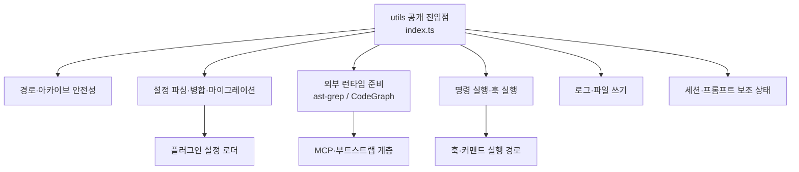

# utils

# utils 모듈

`packages/utils`는 OpenCode 어댑터, Codex Light, Core 패키지, MCP 패키지가 함께 쓰는 공용 TypeScript 유틸리티 계층입니다. 파일 시스템 안전성, 설정 병합과 마이그레이션, 외부 바이너리 준비, 훅 명령 실행, JSONC/YAML 파싱, 로그, 작업 트리 요약 같은 반복 기반 기능을 한곳에 모읍니다.

이 모듈의 진입점은 `packages/utils/src/index.ts`입니다. 대부분의 하위 기능은 이 파일에서 재수출되며, 일부 도메인은 `ast-grep`, `codegraph`, `command-executor`, `git-worktree`, `logging`, `migration`처럼 하위 배럴 파일을 통해 묶입니다.



## 설계 역할

`utils`는 제품 기능을 직접 구현하기보다, 여러 패키지가 같은 규칙으로 동작하도록 만드는 기반 모듈입니다.

주요 책임은 다음과 같습니다.

- 위험한 파일 경로, 아카이브 엔트리, 심볼릭 링크, 하드 링크를 검증합니다.
- 사용자 설정을 안전하게 읽고, 병합하고, 레거시 형식에서 현재 형식으로 이전합니다.
- `ast-grep`와 `CodeGraph` 같은 외부 실행 파일을 찾거나 내려받아 사용할 수 있게 준비합니다.
- 훅 명령과 텍스트 내 임베디드 명령을 실행하고 결과를 문자열로 되돌립니다.
- JSONC, frontmatter, rule metadata처럼 사용자 작성 파일 포맷을 파싱합니다.
- 로그 파일 회전, 원자적 파일 쓰기, 작업 트리 변경 요약처럼 여러 패키지에서 반복되는 I/O 패턴을 제공합니다.
- 내부 에이전트 프롬프트와 실제 사용자 메시지를 구분하는 마커 처리 함수를 제공합니다.

## 공개 API 구성

`packages/utils/src/index.ts`는 다음 계열의 API를 내보냅니다.

- 설정: `deepMerge`, `mergeUniqueStrings`, `parseConfigSections`, `expandEnvReferences`, `parseJsonc`, `detectPluginConfigFile`
- 파일과 경로: `writeFileAtomically`, `containsPath`, `isWithinProject`, `fileExists`, `resolveSymlink`, `validateArchiveEntries`
- 외부 도구: `ast-grep`, `codegraph`, `runtime`
- 명령 실행: `executeCommand`, `executeHookCommand`, `resolveCommandsInText`
- 문서 파싱: `parseFrontmatter`
- 마이그레이션: `migrateConfigFile`, `migrateAgentNames`, `migrateHookNames`, `migrateModelVersions`
- 로그: `createLogger`, `configureSharedSubunitLogger`, `log`
- 세션과 내부 메시지: `internal-initiator-marker`, `prompt-async-gate`, `session-idle-settle`
- Git 작업 트리: `collectGitDiffStats`, `parseGitStatusPorcelain`, `parseGitDiffNumstat`, `formatFileChanges`

## 경로와 아카이브 안전성

### `validateArchiveEntries`

`archive-entry-validator.ts`의 `validateArchiveEntries(entries, destDir)`는 압축 해제 전에 아카이브 엔트리가 목적 디렉터리 밖으로 빠져나가지 못하도록 검사합니다.

검증 대상은 `ArchiveEntry`입니다.

```ts
export type ArchiveEntry = {
  path: string
  type: "file" | "directory" | "symlink" | "hardlink"
  linkPath?: string
}
```

검사는 세 단계로 이루어집니다.

1. `normalizeArchivePath()`가 Windows 백슬래시를 `/`로 정규화합니다.
2. `isArchiveAbsolutePath()`와 `containsTraversalSegment()`가 절대 경로, 드라이브 경로, `//` 경로, `..` 세그먼트를 차단합니다.
3. `resolveContainedPath()`와 `escapesDirectory()`가 실제 해석된 경로가 `destDir` 밖으로 나가는지 다시 확인합니다.

심볼릭 링크와 하드 링크는 `entry.path`뿐 아니라 `entry.linkPath`도 같은 기준으로 검사합니다. 링크 대상은 링크가 생성될 디렉터리인 `dirname(resolvedEntryPath)` 기준으로 해석한 뒤, 최종 위치가 추출 루트 안에 있는지 확인합니다.

이 함수는 ZIP/TAR 추출 경로에서 중요한 보안 경계입니다. 호출 그래프상 `extractZip`, `extractTarGz`, PowerShell ZIP 엔트리 검증, 공유 아카이브 테스트가 이 함수를 기준으로 아카이브 slip 취약점을 막습니다.

```ts
validateArchiveEntries(
  [
    { path: "bin/tool", type: "file" },
    { path: "bin/current", type: "symlink", linkPath: "tool" },
  ],
  "/tmp/extract-root",
)
```

### `containsPath`와 `isWithinProject`

`contains-path.ts`의 `containsPath(rootPath, candidatePath)`는 후보 경로가 루트 경로 안에 있는지 확인합니다. 단순 문자열 비교가 아니라 `resolve()`, `realpathSync.native()`, 가장 가까운 기존 상위 디렉터리 탐색을 사용해 심볼릭 링크와 아직 존재하지 않는 경로를 최대한 실제 경로 기준으로 정규화합니다.

`isWithinProject(candidatePath, projectRoot)`는 같은 검사를 프로젝트 루트 의미로 감싼 별칭입니다.

이 함수는 "사용자가 지정한 파일이 프로젝트 내부인가" 같은 권한 경계 판단에 적합합니다.

## 설정 파싱, 병합, 마이그레이션

### `deepMerge`

`deep-merge.ts`의 `deepMerge(base, override)`는 설정 객체 병합의 기본 규칙을 제공합니다.

- plain object끼리는 재귀 병합합니다.
- 배열은 이어 붙이지 않고 override 값으로 교체합니다.
- override의 `undefined`는 base 값을 덮어쓰지 않습니다.
- `__proto__`, `constructor`, `prototype`은 `isUnsafeObjectKey()`로 무시합니다.
- 깊이는 `MAX_DEPTH = 50`까지 제한합니다.

```ts
const merged = deepMerge(
  { agents: { sisyphus: { disabled: false } } },
  { agents: { sisyphus: { category: "unspecified-high" } } },
)
```

### `mergeUniqueStrings`와 `mergeUniqueStringsCaseInsensitive`

`config-merge.ts`는 문자열 배열 병합 전용 헬퍼를 제공합니다.

- `mergeUniqueStrings(base, override)`는 대소문자를 구분해 중복을 제거합니다.
- `mergeUniqueStringsCaseInsensitive(base, override)`는 비교만 소문자로 수행하고, 결과에는 처음 등장한 원래 값을 유지합니다.

`disabled_hooks`, `disabled_agents`, allowlist류 설정처럼 "부모 설정 + 가까운 설정"을 합쳐야 하는 곳에서 쓰기 좋은 형태입니다.

### `parseConfigSections`

`config-section-parser.ts`의 `parseConfigSections(schema, rawConfig, options)`는 전체 설정 파싱이 실패해도 유효한 섹션만 살려내는 복구형 파서입니다.

동작 순서는 다음과 같습니다.

1. 전체 `rawConfig`를 `schema.safeParse()`로 먼저 검사합니다.
2. 실패하면 최상위 키별로 `{ [key]: rawConfig[key] }` 형태를 다시 파싱합니다.
3. 안전하지 않은 객체 키는 건너뜁니다.
4. 섹션 오류는 `onInvalidSections` 콜백으로 전달합니다.
5. 성공한 섹션만 `Partial<TConfig>`로 반환합니다.

이 방식은 사용자 설정 일부가 깨져 있어도 나머지 기능을 가능한 한 살리는 데 사용됩니다.

### JSONC와 설정 파일 감지

`jsonc-parser.ts`는 사용자 설정 파일을 위한 JSONC 유틸리티입니다.

- `parseJsonc(content)`는 주석과 trailing comma를 허용하되, 오류가 있으면 `SyntaxError`를 던집니다.
- `parseJsoncSafe(content)`는 `{ data, errors }` 구조로 실패 정보를 반환합니다.
- `readJsoncFile(filePath)`는 파일 읽기와 파싱 실패를 `null`로 흡수합니다.
- `detectConfigFile(basePath)`는 `.jsonc`를 `.json`보다 우선합니다.
- `detectPluginConfigFile(dir, options)`는 canonical basename과 legacy basename을 함께 감지하고, 결과를 메모리 캐시에 저장합니다.
- `clearPluginConfigFileDetectionCache()`는 테스트나 재탐색에서 캐시를 비웁니다.

### 환경 변수 확장

`env-expansion.ts`는 `${NAME}`과 `${NAME:-default}` 형식의 문자열 치환을 처리합니다.

`expandEnvReferences(value, options)`는 단일 문자열을 처리하고, `expandEnvReferencesInObject(value, options)`는 배열과 객체를 재귀적으로 처리합니다. `trusted`가 `false`인 경우 `isAllowed(name)`이 허용하지 않는 변수는 `onBlocked(name, "not_allowed")`로 보고하고 기본값 또는 빈 문자열로 대체합니다.

객체 순회 중 `isUnsafeObjectKey()`를 사용하므로 환경 변수 확장 과정에서도 prototype pollution 위험 키가 복사되지 않습니다.

### 설정 마이그레이션

`migration/config-migration.ts`의 `migrateConfigFile(configPath, rawConfig)`는 레거시 설정을 현재 스키마로 이동합니다. 내부적으로 다음 마이그레이션 헬퍼를 사용합니다.

- `migrateAgentNames()`와 `AGENT_NAME_MAP`
- `migrateHookNames()`
- `migrateModelVersions()`
- `migrateAgentConfigToCategory()`
- `readAppliedMigrations()` / `writeAppliedMigrations()`

주요 마이그레이션 동작은 다음과 같습니다.

- 예전 에이전트 이름을 현재 canonical 이름으로 바꿉니다.
- 레거시 모델 문자열을 새 버전 또는 category 기반 설정으로 이전합니다.
- 과거 `_migrations` / `appliedMigrations` 상태를 sidecar 파일로 옮깁니다.
- `omo_agent`를 `sisyphus_agent`로 이동합니다.
- 폐기된 `lsp` 설정 키를 제거하고 로그로 안내합니다.
- `experimental.hashline_edit`를 최상위 `hashline_edit`로 승격합니다.
- 변경 전 설정 파일 백업을 만든 뒤 `writeFileAtomically()`로 씁니다.

이 함수는 사용자 설정 파일을 직접 수정하므로, 호출자는 마이그레이션이 실제 파일 쓰기와 백업 생성을 포함한다는 점을 고려해야 합니다.

## ast-grep 런타임

`ast-grep` 하위 모듈은 구조적 검색 도구 `sg`를 찾고, 필요하면 고정 버전 바이너리를 준비하는 역할을 합니다.

### 매니페스트와 런타임 식별

`sg-manifest.ts`는 ast-grep 고정 버전과 플랫폼별 배포 자산을 정의합니다.

- `SG_PINNED_VERSION = "0.43.0"`
- `SG_RELEASE_ASSETS`
- `normalizeRuntimePlatform(platform)`
- `normalizeRuntimeArch(arch)`
- `runtimeSlug(platform, arch)`
- `sgBinaryName(platform)`

`runtimeSlug()`는 `darwin-arm64`, `linux-x64`, `win32-arm64` 같은 slug를 만들고, `sgBinaryName()`은 Windows에서 `sg.exe`, 그 외 플랫폼에서 `sg`를 반환합니다.

### 설치 스크립트 실행

`install-script.ts`의 `runAstGrepSkillInstall(options)`는 skill 디렉터리 안의 설치 스크립트를 실행합니다.

- Unix 계열은 `install.sh`를 `bash`로 실행합니다.
- Windows는 `install.ps1`을 `pwsh`로 먼저 시도하고, 실행 파일이 없으면 `powershell.exe`로 재시도합니다.
- `OMO_AST_GREP_BIN_DIR` 환경 변수에 대상 디렉터리를 주입합니다.
- 기본 제한 시간은 `AST_GREP_INSTALL_TIMEOUT_MS = 30_000`입니다.
- 결과는 `AstGrepSkillInstallResult`의 `succeeded`, `skipped`, `failed`, `timed-out` 중 하나입니다.

`astGrepRuntimeDir(baseDir, platform, arch)`는 `<baseDir>/runtime/ast-grep/<runtimeSlug>` 경로를 구성합니다.

### 바이너리 프로비저닝

`sg-provisioner.ts`의 `provisionSgBinary(options)`는 릴리스 ZIP을 내려받고, 체크섬을 검증한 뒤, standalone `ast-grep` 또는 `sg` 바이너리만 추출해 대상 디렉터리에 설치합니다.

핵심 방어 장치는 다음과 같습니다.

- `sha256()`으로 다운로드 바이트가 매니페스트 체크섬과 일치하는지 검사합니다.
- ZIP central directory를 직접 읽어 `ast-grep` 또는 `sg` 엔트리만 선택합니다.
- ZIP64와 지원하지 않는 압축 방식을 거부합니다.
- 임시 파일 `.sg-*.partial`에 쓴 뒤 `chmod(0o755)` 후 `rename()`으로 교체합니다.
- `assertInsideTarget()`으로 대상 파일과 임시 파일이 `targetDir` 밖으로 나가지 못하게 합니다.
- 실패 시 임시 파일을 제거하고 `SgProvisionError`로 오류 코드를 보존합니다.

`SgProvisionError.code`는 `"bad_checksum"`, `"download_failed"`, `"extract_failed"`, `"unsupported_platform"`, `"write_failed"` 중 하나입니다.

### 바이너리 탐색

`sg-resolver.ts`의 `findSgBinarySync(options)`는 사용할 `sg` 바이너리를 동기적으로 찾습니다.

탐색 순서는 다음과 같습니다.

1. `OMO_AST_GREP_SG_PATH` 환경 변수
2. `options.runtimeDir` 아래의 `sg` 또는 `sg.exe`
3. PATH의 명령 후보

Linux에서는 `ast-grep`를 `sg`보다 먼저 검사하고, 다른 플랫폼에서는 `sg`를 먼저 검사합니다. 단, `sg`라는 이름은 다른 프로그램일 수 있으므로 `--version` 출력에 `ast-grep`가 포함되는지 확인합니다.

## CodeGraph 런타임

`codegraph` 하위 모듈은 CodeGraph MCP 실행에 필요한 환경, Node 런타임, 바이너리 위치, 작업공간 저장소를 관리합니다.

### 환경 변수 구성

`codegraph/env.ts`의 `buildCodegraphEnv(options)`는 CodeGraph 실행 환경을 구성합니다.

반환되는 값은 다음 키를 포함합니다.

- `CODEGRAPH_INSTALL_DIR`: 기본값은 `<home>/.omo/codegraph`
- `CODEGRAPH_NO_DOWNLOAD`: `"1"`
- `CODEGRAPH_TELEMETRY`: `"0"`
- `DO_NOT_TRACK`: `"1"`

이 기본값은 자동 다운로드와 원격 텔레메트리를 막고, OMO가 관리하는 설치 디렉터리를 명시합니다.

### Node 버전 지원 판단

`codegraph/node-support.ts`는 CodeGraph를 실행할 Node 버전 범위를 판단합니다.

- 최소 지원 major: `CODEGRAPH_MIN_NODE_MAJOR = 20`
- 차단 major: `CODEGRAPH_BLOCKED_NODE_MAJOR = 25`
- 우회 환경 변수: `CODEGRAPH_ALLOW_UNSAFE_NODE`

`evaluateCodegraphNodeSupport(options)`는 `{ major, override, reason, supported }`를 반환합니다. Node 25 이상은 `"too-new"`, Node 20 미만은 `"too-old"`로 표시되며, `CODEGRAPH_ALLOW_UNSAFE_NODE`가 설정되어 있으면 `supported`가 true가 될 수 있습니다.

`buildCodegraphNodeSkipHint(support)`는 MCP를 건너뛰는 이유와 권장 Node 범위를 설명하는 사용자 메시지를 만듭니다.

### 명령 해석

`codegraph/resolve.ts`의 `resolveCodegraphCommand(options)`는 CodeGraph 실행 명령을 다음 우선순위로 해석합니다.

1. `OMO_CODEGRAPH_BIN` 또는 레거시 `CODEGRAPH_BIN`
2. 설치된 npm 패키지 `@colbymchenry/codegraph`의 bundled shim과 지원 가능한 Node 런타임
3. `~/.omo/codegraph/bin/codegraph` 같은 provisioned 바이너리
4. PATH의 `codegraph`

반환 타입 `CodegraphCommandResolution`은 `command`, `argsPrefix`, `exists`, `source`를 포함합니다. bundled shim을 사용할 때는 `command`가 Node 실행 파일이고, `argsPrefix`에 shim 경로가 들어갑니다.

`resolveCodegraphNodeRuntime()`은 `CODEGRAPH_NODE_BIN` 설정값, 현재 `process.execPath`, `node24`, `node22`, `node20`, `node` 순서의 후보를 검사해 지원 가능한 Node를 찾습니다.

### 바이너리 프로비저닝

`codegraph/provision.ts`의 `ensureCodegraphProvisioned(options)`는 CodeGraph 바이너리 번들을 내려받아 설치합니다.

주요 흐름은 다음과 같습니다.

1. `.provisioned/codegraph-<version>.json` marker를 읽어 기존 설치를 재사용합니다.
2. `<lockDir>/codegraph-<hostname>.lock` 디렉터리 락을 획득합니다.
3. 매니페스트 버전과 플랫폼 키를 확인합니다.
4. 자산을 다운로드하고 SHA-256 체크섬을 검증합니다.
5. `.tar.gz` 또는 `.tgz`만 압축 해제합니다.
6. 압축 결과가 단일 루트 디렉터리인지 확인합니다.
7. bundle 내용을 `installDir`로 이동하고 `bin/<executableName>`에 실행 권한을 부여합니다.
8. marker 파일을 기록합니다.
9. staging 디렉터리를 정리합니다.

결과는 `{ provisioned: true, binPath }` 또는 `{ provisioned: false, error }` 형태입니다. 예외를 외부로 던지기보다 결과 객체에 오류 메시지를 담는 API입니다.

### 작업공간 저장소

`codegraph/workspace.ts`는 프로젝트별 `.codegraph` 저장 위치를 관리합니다.

`prepareCodegraphWorkspace(workspace, options)`는 기본적으로 전역 OMO 저장소 아래에 프로젝트별 디렉터리를 만들고, 프로젝트 루트의 `.codegraph`를 그 디렉터리로 symlink합니다.

저장소 이름은 `workspaceStorageName()`이 만듭니다. 실제 workspace 경로를 SHA-256으로 해시한 16자리 suffix를 붙이므로, 같은 basename을 가진 서로 다른 프로젝트가 충돌하지 않습니다.

반환되는 `CodegraphWorkspacePreparation.mode`는 다음 중 하나입니다.

- `"global-linked"`: 전역 저장소로 연결 성공
- `"in-place-fallback"`: symlink가 불가능해 프로젝트 내부 `.codegraph` 사용
- `"in-project"`: 이미 일반 디렉터리 `.codegraph`가 있어 그대로 사용

`pruneCodegraphStore(options)`는 오래된 프로젝트 저장소를 나이와 총 용량 기준으로 제거합니다. `ensureCodegraphGitignored(workspace)`는 `.git/info/exclude`에 `.codegraph`를 추가해 실수로 커밋되지 않게 합니다.

## 명령 실행

### 일반 명령: `executeCommand`

`command-executor/execute-command.ts`의 `executeCommand(command)`는 `node:child_process.exec`를 Promise로 실행하고, stdout/stderr를 문자열로 정리합니다.

- 정상 종료하면서 stderr가 있으면 `[stderr: ...]` 형태로 stdout 뒤에 붙입니다.
- 실패해도 예외를 던지지 않고 stdout과 오류 메시지를 조합한 문자열을 반환합니다.

이 함수는 명령 결과를 사용자 텍스트에 삽입하는 용도에 맞춰 설계되어 있습니다.

### 임베디드 명령: `resolveCommandsInText`

`embedded-commands.ts`의 `findEmbeddedCommands(text)`는 `!` 뒤의 backtick 명령, 즉 ``!`command` `` 패턴을 찾습니다.

`resolve-commands-in-text.ts`의 `resolveCommandsInText(text, depth = 0, maxDepth = 3)`는 발견한 명령을 병렬로 실행하고, 원래 텍스트의 패턴을 실행 결과로 치환합니다. 치환 결과에 다시 임베디드 명령이 있으면 최대 3단계까지 재귀 처리합니다.

```ts
const resolved = await resolveCommandsInText(
  "현재 브랜치: !`git branch --show-current`",
)
```

### 훅 명령: `executeHookCommand`

`command-executor/execute-hook-command.ts`의 `executeHookCommand(command, stdin, cwd, options)`는 플러그인 훅 실행을 위한 더 엄격한 명령 실행기입니다.

지원하는 주요 기능은 다음과 같습니다.

- `~`, `$CLAUDE_PROJECT_DIR`, `${CLAUDE_PROJECT_DIR}` 치환
- `pluginRoot`가 있을 때 `$CLAUDE_PLUGIN_ROOT`, `${CLAUDE_PLUGIN_ROOT}` 치환
- `forceZsh`가 true이면 `findZshPath()`를 우선 사용하고, 없으면 `findBashPath()`로 fallback
- `allowedEnvVars`가 있으면 환경 변수를 allowlist 기반으로 제한
- `HOME`, `CLAUDE_PROJECT_DIR`, `CLAUDE_PLUGIN_ROOT` 같은 보호 키는 ambient env가 덮어쓰지 못하게 차단
- 기본 timeout 30초, grace kill 5초
- Unix 계열에서는 detached process group을 만들고 timeout 시 그룹 전체에 `SIGTERM`, 이후 `SIGKILL`
- Windows에서는 `taskkill /T /F`로 프로세스 트리 종료
- timeout 시 exitCode `124`와 `"Hook command timed out after ..."` 메시지 반환

`CommandResult`는 `{ exitCode, stdout?, stderr? }`입니다.

## 파일 쓰기와 파일 시스템 보조 함수

### `writeFileAtomically`

`atomic-write.ts`의 `writeFileAtomically(filePath, content, options)`는 `<filePath>.tmp`에 먼저 쓰고 fsync한 뒤 rename하는 원자적 쓰기 함수입니다.

흐름은 다음과 같습니다.

1. 임시 파일에 UTF-8 문자열을 씁니다.
2. `openSync(tempPath, "r+")`로 열고 `fsyncSync()`를 호출합니다.
3. `EPERM`, `EACCES`, `ENOTSUP`, `EINVAL`은 `tolerantFsyncSync()`가 허용 가능한 fsync 실패로 간주합니다.
4. 임시 파일을 대상 파일로 rename합니다.
5. Windows에서 rename이 권한 오류로 실패하면 기존 파일을 지우고 다시 rename합니다.

텔레메트리 상태 파일이나 설정 마이그레이션처럼 "중간에 깨진 파일을 남기면 안 되는" 쓰기 경로에서 사용됩니다.

### 파일 존재와 symlink

`file-utils.ts`는 다음 함수를 제공합니다.

- `isMarkdownFile(entry)`: 숨김 파일이 아니고 `.md`로 끝나는 일반 파일인지 확인합니다.
- `fileExists(filePath)`: `access()` 기반 존재 확인, 실패는 false
- `fileExistsStrict(filePath)`: `lstat()` 기반 존재 확인, `ENOENT`만 false이고 다른 오류는 다시 던짐
- `isSymbolicLink(filePath)`: `lstatSync(..., { throwIfNoEntry: false })` 기반 symlink 여부
- `resolveSymlink(filePath)`: `realpathSync.native()` 결과를 반환하되 실패하면 원래 경로 반환
- `resolveSymlinkAsync(filePath)`: 비동기 realpath 버전

macOS에서 `/private/var/...`로 시작하는 realpath는 `normalizeDarwinRealpath()`로 `/var/...` 형태에 맞춥니다.

### 경로 환경 분류

`classify-path-environment.ts`의 `classifyPathEnvironment(absolutePath)`는 경로가 iCloud, OneDrive, Desktop/Documents 동기화, 네트워크 드라이브, unknown 중 어디에 속하는지 판단합니다.

`describePathClassification(pathClassification)`는 사람이 읽기 쉬운 설명을 반환합니다. 이 분류는 fsync가 신뢰하기 어려운 파일 시스템을 사용자에게 설명하거나 fallback 메시지를 만들 때 사용됩니다.

## frontmatter와 규칙 메타데이터

`frontmatter.ts`의 `parseFrontmatter(content, options)`는 두 가지 모드를 지원합니다.

기본 모드에서는 일반 YAML frontmatter를 `js-yaml`의 `JSON_SCHEMA`로 파싱합니다. 이 스키마는 임의 YAML 태그 실행을 막기 위한 보안 선택입니다.

반환 타입은 다음 구조입니다.

```ts
export interface FrontmatterResult<T = Record<string, unknown>> {
  data: T
  body: string
  hadFrontmatter: boolean
  parseError: boolean
}
```

`mode: "rule"`일 때는 `parseRuleFrontmatter()` 경로를 사용합니다. 이 경로는 full YAML 파서 대신 제한된 hand-written parser로 다음 키만 추출합니다.

- `description`
- `alwaysApply`
- `globs`
- `paths`
- `applyTo`

rule 모드는 BOM 제거, `---` delimiter 탐색, inline array, multiline array, comma-separated value, 주석 제거를 직접 처리합니다. 사용자가 작성한 rule 파일에서 필요한 메타데이터만 보수적으로 읽기 위한 경량 파서입니다.

## 로그

### 공유 subunit 로그

`logger.ts`는 매우 작은 전역 로거를 제공합니다.

- `configureSharedSubunitLogger(logger)`
- `log(message, data?)`

초기 기본값은 no-op입니다. 호출자는 상위 런타임에서 실제 로거를 주입할 수 있습니다.

### 파일 로거

`logging/logger.ts`의 `createLogger(options)`는 버퍼링과 파일 회전을 지원하는 bound logger를 만듭니다.

기본값은 다음과 같습니다.

- 최대 로그 파일 크기: `DEFAULT_MAX_LOG_FILE_SIZE_BYTES = 50 * 1024 * 1024`
- 백업 개수: `DEFAULT_MAX_LOG_FILE_BACKUPS = 2`
- flush 간격: `DEFAULT_LOG_FLUSH_INTERVAL_MS = 500`
- 버퍼 개수 제한: `DEFAULT_LOG_BUFFER_SIZE_LIMIT = 50`

`BoundLogger`는 다음 메서드를 제공합니다.

- `log(message, data?)`
- `getLogFilePath()`
- `_setLoggerForTesting(overrides)`
- `_resetLoggerForTesting()`
- `_flushForTesting()`

로그 파일이 최대 크기를 넘으면 `.1`, `.2` 순서로 회전합니다. 파일 쓰기나 회전 실패는 로깅 경로 자체가 제품 실행을 방해하지 않도록 흡수합니다.

### 제품 식별자

`logging/product-identity.ts`의 `createProductIdentity(input)`은 plugin name, legacy name, published package name, config basename, log filename, cache directory name을 하나의 `ProductIdentity`로 묶습니다. `acceptedPackageNames`가 없으면 `[publishedPackageName, pluginName]`을 기본값으로 사용합니다.

## Git 작업 트리 요약

`git-worktree` 하위 모듈은 변경 파일 요약을 만들기 위한 작은 parser 집합입니다.

### 상태와 numstat 파싱

- `parseGitStatusPorcelainLine(line)`은 `git status --porcelain` 한 줄을 `{ filePath, status }`로 바꿉니다.
- `parseGitStatusPorcelain(output)`은 파일 경로별 `GitFileStatus` 맵을 만듭니다.
- `parseGitDiffNumstat(output, statusMap)`은 `git diff --numstat` 출력을 `GitFileStat[]`로 변환합니다.

`GitFileStatus`는 `"modified"`, `"added"`, `"deleted"` 중 하나입니다.

### 변경 수집

`collectGitDiffStats(directory)`는 다음 명령을 실행합니다.

- `git diff --numstat HEAD`
- `git status --porcelain`
- `git ls-files --others --exclude-standard`

추적 중인 변경과 untracked 파일을 합쳐 `GitFileStat[]`로 반환합니다. untracked 텍스트 파일은 직접 읽어 줄 수를 added count로 계산합니다. 오류가 발생하면 빈 배열을 반환합니다.

### 표시 문자열

`formatFileChanges(stats, notepadPath?)`는 변경 통계를 사람이 읽는 요약으로 포맷합니다.

출력은 `[FILE CHANGES SUMMARY]`로 시작하며, modified, added, deleted 파일을 그룹화합니다. `notepadPath`가 stats에 포함되어 있으면 `[NOTEPAD UPDATED]` 섹션을 추가합니다.

## 내부 에이전트 메시지 마커

`internal-initiator-marker.ts`는 시스템 내부에서 생성한 사용자 역할 메시지와 실제 사용자의 메시지를 구분하기 위한 마커 유틸리티입니다.

상수는 다음과 같습니다.

- `OMO_INTERNAL_INITIATOR_MARKER = "<!-- OMO_INTERNAL_INITIATOR -->"`
- `OMO_INTERNAL_NOREPLY_MARKER = "<!-- OMO_INTERNAL_NOREPLY -->"`

주요 함수는 다음과 같습니다.

- `hasInternalInitiatorMarker(text)`
- `hasInternalNoReplyMarker(text)`
- `isTextPartLike(part)`
- `isSyntheticOrInternalTextPart(part)`
- `isRealUserTextPart(part)`
- `isSyntheticOrInternalOnlyTextParts(parts)`
- `isSyntheticOrInternalUserMessage(message)`
- `isTerminalNoReplyUserMessage(message)`
- `isRealUserMessage(message)`
- `stripInternalInitiatorMarkers(text)`
- `createInternalAgentTextPart(text)`
- `createInternalAgentContinuationTextPart(text)`
- `withInternalNoReplyMarker(part)`

이 API는 background agent wake prompt, prompt dedupe, compaction continuation 같은 흐름에서 중요합니다. 실행 흐름상 `sendParentWakePrompt`는 `dispatchInternalPrompt()`로 이어지고, semantic dedupe 경로에서 `hasInternalInitiatorMarker()`를 사용해 내부 continuation 프롬프트를 식별합니다.

## 기타 경량 유틸리티

### `extractSemverFromOutput`

`extract-semver.ts`의 `extractSemverFromOutput(output)`은 명령 출력에서 `1.2.3`, `v1.2.3`, prerelease/build suffix를 포함한 semver를 추출합니다. 정규식의 negative lookbehind는 Electron 기반 OpenCode 바이너리가 stdout에 흘리는 `00:24:25.202` 같은 timestamp의 millisecond 구간을 버전으로 오인하지 않도록 설계되어 있습니다.

### `formatDurationHuman`

`format-duration.ts`의 `formatDurationHuman(milliseconds)`는 밀리초를 `1h 2m 3s`, `2m 3s`, `3s` 형식으로 바꿉니다. 음수는 0초로 처리합니다.

### `buildCodegraphEnv`, `createProductIdentity`, `sanitizeBase`

이 모듈에는 단일 목적의 작은 함수도 많습니다. 이들은 대부분 상위 계층에서 정책을 직접 반복하지 않도록 하기 위한 것입니다.

예를 들어 `sanitizeBase(value)`는 CodeGraph workspace 저장소 이름에 사용할 basename을 안전한 문자 집합으로 정리하고, 비어 있으면 `"workspace"`를 반환합니다.

## 코드베이스와의 연결

`utils`는 여러 실행 경로에 넓게 연결되어 있습니다.

- 아카이브 추출 경로는 `validateArchiveEntries()`를 호출해 absolute path, traversal, 링크 escape를 막습니다.
- ast-grep 부트스트랩은 `runtimeSlug()`, `sgBinaryName()`, `findSgBinarySync()`, `provisionSgBinary()`를 사용해 구조 검색 런타임을 준비합니다.
- CodeGraph MCP 경로는 `buildCodegraphEnv()`, `resolveCodegraphCommand()`, `resolveCodegraphNodeRuntime()`, `ensureCodegraphProvisioned()`, `prepareCodegraphWorkspace()`를 통해 실행 환경과 저장소를 구성합니다.
- 훅 실행 경로는 `executeHookCommand()`를 통해 shell, timeout, 환경 변수 allowlist, plugin root 치환을 통일합니다.
- 설정 로더와 마이그레이션 경로는 `parseJsonc()`, `detectPluginConfigFile()`, `deepMerge()`, `parseConfigSections()`, `migrateConfigFile()`을 사용합니다.
- 텔레메트리 상태 쓰기와 설정 쓰기는 `writeFileAtomically()`를 통해 부분 쓰기 위험을 낮춥니다.
- background agent와 continuation 경로는 `createInternalAgentTextPart()`, `isSyntheticOrInternalUserMessage()`, `stripInternalInitiatorMarkers()`를 사용해 내부 메시지가 실제 사용자 입력처럼 처리되지 않도록 합니다.
- 변경 요약과 notepad 업데이트 표시는 `collectGitDiffStats()`와 `formatFileChanges()`를 통해 Git 출력 파싱 로직을 공유합니다.

## 기여할 때 주의할 점

`utils`는 하위 패키지 다수가 의존하는 공용 계층이므로, 작은 변경도 넓게 전파될 수 있습니다.

기여 시 특히 주의할 부분은 다음과 같습니다.

- 경로 검증 함수는 문자열 정규화만으로 판단하지 말고, 가능하면 `resolve()`, `relative()`, `realpath` 계열과 함께 검증해야 합니다.
- 사용자 설정 파서는 실패를 어떻게 복구할지 명확해야 합니다. 전체 실패와 섹션별 실패를 구분하는 기존 패턴을 따르는 것이 좋습니다.
- 마이그레이션은 반복 실행되어도 같은 결과가 나와야 합니다. `migrateConfigFile()`처럼 sidecar나 applied migration set을 고려해야 무한 마이그레이션 루프를 피할 수 있습니다.
- 외부 바이너리 다운로드 경로는 버전 고정, 체크섬 검증, 임시 파일 쓰기, 대상 디렉터리 경계 검사를 유지해야 합니다.
- 명령 실행 함수는 실패를 던지는 API인지, 결과 문자열이나 결과 객체로 흡수하는 API인지 호출자 기대가 다릅니다. 기존 반환 계약을 바꾸면 훅과 텍스트 치환 경로가 함께 영향을 받습니다.
- 로그와 진단 함수는 제품 실행을 방해하지 않도록 오류를 흡수하는 경우가 많습니다. 반대로 보안 검증 함수는 오류를 명시적으로 던져야 합니다.