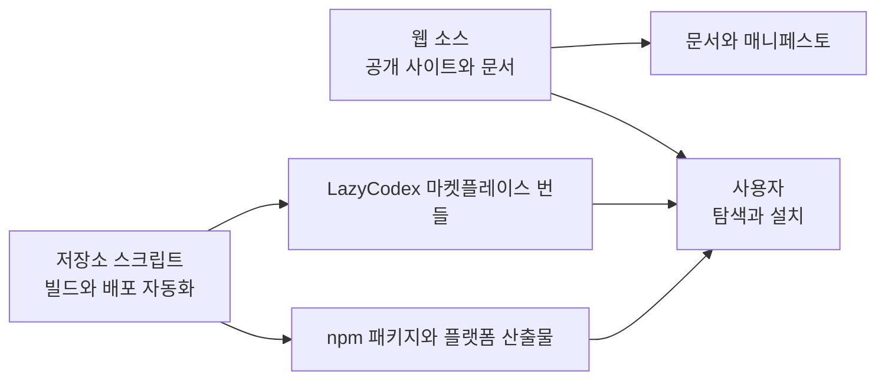

# Web And Automation Source

## 개요

Web And Automation Source는 제품을 외부에 보여 주는 웹 계층과, 그 제품을 배포 가능한 산출물로 만드는 저장소 자동화 계층을 함께 묶는 영역입니다. [web source](web-source.md)는 Next.js 기반 공개 사이트, 문서, 매니페스토, 통계 API, 로케일 라우팅을 담당하고, [repository scripts](repository-scripts.md)는 설치 후 검증, 빌드 산출물 생성, npm 배포, LazyCodex 마켓플레이스 동기화, 서드파티 고지 검증을 담당합니다.

두 하위 모듈은 런타임 플러그인 기능을 직접 구현하기보다는, 사용자가 제품을 발견하고 설치하며 배포판이 일관되게 만들어지는 흐름을 지탱합니다. 웹 모듈은 `RootLayout`, `LocaleLayout`, `LocalizedPageShell`을 통해 페이지 셸을 구성하고, 저장소 스크립트는 `postinstall.mjs`, `publish.ts`, `sync-lazycodex-marketplace.ts`, `lazycodex-marketplace-validation.ts` 같은 운영 스크립트로 패키지와 마켓플레이스 번들을 검증합니다.

## 함께 동작하는 방식

웹 계층은 제품의 설명과 설치 경로를 노출합니다. 예를 들어 홈 페이지 흐름은 `HomePage`에서 `LandingPage`로 이어지고, `HeroSection`은 `InstallCommand`를 사용해 설치 명령을 보여 줍니다. 같은 화면에서 `getStats`, `fetchGitHubStars`, `formatStats`, `formatCount`가 GitHub stars와 npm downloads를 가져와 표시합니다. 공통 UI는 `NavHeader`, `Badge`, `Button`, `CardHeader`, `CardContent`, `Input`, `Section`, `cn` 같은 컴포넌트와 유틸리티로 조립됩니다.

문서와 메시지 계층은 다국어 사이트 구조 위에서 동작합니다. `LocaleLayout`은 `LocalizedPageShell`을 감싸고, 이 셸 안에서 랜딩 페이지, `DocsPage`, `ManifestoPage`가 같은 내비게이션과 레이아웃 규칙을 공유합니다. 문서 페이지는 `loadDocSource`로 Markdown 기반 내용을 HTML로 변환하고, 매니페스토 페이지는 `HeroSection`, `PainPointsSection`, `CoreLoopSection` 같은 섹션으로 제품 철학을 구성합니다.

자동화 계층은 이 공개 표면이 가리키는 실제 배포 산출물을 만듭니다. `build-binaries.ts`, `build-schema.ts`, `build-help-schemas.ts`는 실행 파일과 스키마를 만들고, `publish.ts`는 `checkVersionExists`를 통해 이미 배포된 버전을 확인한 뒤 플랫폼 패키지와 루트 패키지 배포를 조율합니다. 설치 직후에는 `postinstall.mjs`가 `checkOpenCodeVersion`, `compareVersions`, `getMainPackageVersion`, `readMainPackageJson`을 통해 실행 환경과 패키지 상태를 점검합니다.

LazyCodex 배포 흐름은 별도 검증 단계를 갖습니다. `syncLazycodexMarketplace`는 `copyBundledMcpDists`, `stampReleaseVersion`, `stampHookStatusMessages`를 통해 Codex용 번들을 구성하고, `validateLazycodexPluginBundle`과 `validatePluginHookCommands`가 훅 명령과 번들 구조를 확인합니다. 릴리스 고지 측면에서는 `check-third-party-notices.mjs`의 `runShipCheck`가 중복 항목을 `unique`로 정리하며 고지 파일의 완결성을 확인합니다.

## 핵심 흐름

- 공개 사이트 렌더링: `HomePage` → `LandingPage` → `HeroSection` → `InstallCommand`
- 통계 표시: `HomePage` → `LandingPage` → `HeroSection` → `getStats` → `fetchGitHubStars`
- 로케일 셸 구성: `LocaleLayout` → `LocalizedPageShell` → `NavHeader` → `Badge` → `cn`
- 문서 제공: `DocsPage` → `loadDocSource`
- 매니페스토 구성: `ManifestoPage` → `HeroSection` / `PainPointsSection` / `CoreLoopSection`
- 배포 준비: `build-binaries.ts` / `build-schema.ts` / `build-help-schemas.ts`
- 패키지 배포: `publish.ts` → `checkVersionExists`
- Codex 번들 동기화: `syncLazycodexMarketplace` → `copyBundledMcpDists` → `stampReleaseVersion` → `validateLazycodexPluginBundle`
- 설치 후 검증: `postinstall.mjs` → `checkOpenCodeVersion` → `compareVersions`

이 모듈 그룹을 볼 때는 웹 페이지의 세부 UI보다 “사용자가 보는 설치·문서 표면”과 “그 표면이 안내하는 실제 배포 산출물을 만드는 자동화”의 연결을 중심으로 이해하는 것이 좋습니다. 세부 렌더링 구조는 [web source](web-source.md), 릴리스와 검증 스크립트의 상세 역할은 [repository scripts](repository-scripts.md)를 참조하면 됩니다.