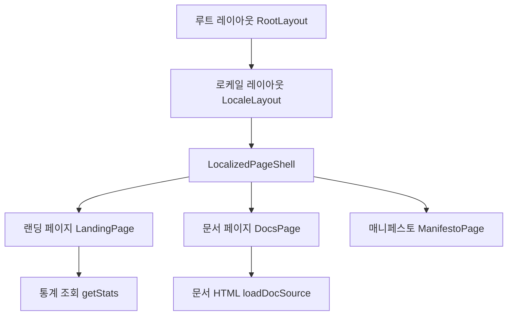
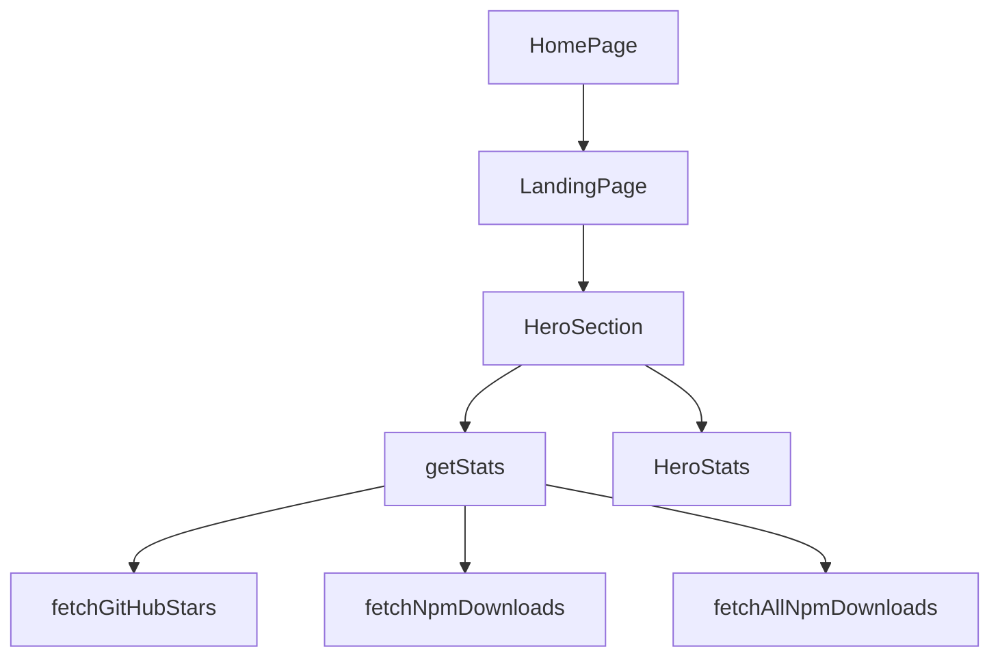

# web source

# 웹 소스 모듈

`packages/web`는 Oh My OpenAgent의 공개 웹사이트, 문서 페이지, 매니페스토 페이지, 통계 API, 다국어 라우팅을 담당하는 Next.js 애플리케이션입니다. App Router 기반으로 구성되어 있으며, `next-intl`을 통해 `en`, `ko`, `ja`, `zh` 로케일을 지원합니다.

이 모듈의 핵심 역할은 다음과 같습니다.

- 랜딩 페이지와 매니페스토 페이지를 서버 컴포넌트 중심으로 렌더링합니다.
- Markdown 문서를 빌드 시점에 HTML로 변환해 문서 페이지에 삽입합니다.
- GitHub stars와 npm downloads를 조회해 랜딩 페이지와 Shields.io 배지 API에 제공합니다.
- 로케일 경로, 이전 설치 문서 경로, 이전 호스트를 정규화하는 미들웨어를 제공합니다.
- 공통 UI 컴포넌트와 사이트 셸을 통해 페이지 구조를 일관되게 유지합니다.

## 전체 구조

웹 소스는 크게 다섯 영역으로 나뉩니다.



`RootLayout`은 HTML 문서의 최상위 설정을 담당하고, `[locale]/layout.tsx`의 `LocaleLayout`은 요청된 로케일을 검증한 뒤 `LocalizedPageShell`로 넘깁니다. 실제 화면은 랜딩, 문서, 매니페스토 페이지가 각각 독립된 섹션 컴포넌트 조합으로 구성합니다.

## 라우팅과 레이아웃

### `RootLayout`

`app/layout.tsx`의 `RootLayout`은 사이트 전체에 적용되는 최상위 레이아웃입니다.

주요 책임은 다음과 같습니다.

- `metadata`로 기본 title, description, Open Graph, Twitter, robots, canonical, alternate locale URL을 설정합니다.
- `GeistSans`, `GeistMono` 폰트 변수를 `<html>` 클래스에 주입합니다.
- Google Analytics 스크립트를 `next/script`의 `lazyOnload` 전략으로 로드합니다.
- `jsonLd`를 `application/ld+json` 스크립트로 삽입합니다.
- 모든 페이지를 어두운 배경의 `<body>` 안에 렌더링합니다.

Google Analytics는 `window.location.hostname === "omo.dev"` 조건을 만족할 때만 동적으로 로드됩니다. 로컬 개발이나 다른 호스트에서는 추적 스크립트가 삽입되지 않습니다.

### `LocaleLayout`

`app/[locale]/layout.tsx`의 `LocaleLayout`은 로케일 세그먼트가 있는 모든 페이지의 공통 진입점입니다.

```tsx
export default async function LocaleLayout({
  children,
  params,
}: {
  children: ReactNode
  params: Promise<{ locale: string }>
}): Promise<JSX.Element>
```

동작 순서는 다음과 같습니다.

1. `params`에서 `locale`을 가져옵니다.
2. `hasLocale(routing.locales, locale)`로 지원 로케일인지 확인합니다.
3. 유효하지 않으면 `notFound()`를 호출합니다.
4. `setRequestLocale(locale)`로 현재 요청의 로케일을 고정합니다.
5. `LocalizedPageShell`에 `locale`과 `children`을 전달합니다.

`generateStaticParams()`는 `routing.locales`를 기반으로 정적 로케일 경로를 생성합니다.

### `LocalizedPageShell`

`app/_components/localized-page-shell.tsx`의 `LocalizedPageShell`은 다국어 메시지와 사이트 공통 UI를 묶는 서버 컴포넌트입니다.

```tsx
export async function LocalizedPageShell({
  children,
  locale,
}: LocalizedPageShellProps): Promise<JSX.Element>
```

이 함수는 `../../messages/${locale}.json`을 동적으로 import하고, `NextIntlClientProvider`에 메시지를 제공합니다. 내부 구조는 다음과 같습니다.

- `<NavHeader />`
- `<main>{children}</main>`
- `<Footer locale={locale} />`

`getLanguageTag()`는 `"zh"`를 `"zh-CN"`으로 변환하고, 나머지 로케일은 그대로 사용합니다. 이 값은 최상위 `<div>`의 `lang` 속성에 들어갑니다.

## 랜딩 페이지

랜딩 페이지는 `app/page.tsx`, `app/[locale]/page.tsx`, `app/_components/landing-page.tsx`가 함께 구성합니다.

### 기본 경로

`app/page.tsx`의 `HomePage()`는 기본 로케일인 `defaultLocale`을 사용합니다.

```tsx
export default function HomePage(): JSX.Element {
  setRequestLocale(defaultLocale)

  return (
    <LocalizedPageShell locale={defaultLocale}>
      <LandingPage />
    </LocalizedPageShell>
  )
}
```

로케일 경로의 랜딩 페이지는 `app/[locale]/page.tsx`의 `LocaleLandingPage()`가 담당합니다. 이 컴포넌트는 이미 상위 `LocaleLayout` 안에서 렌더링되므로 `LandingPage`만 반환합니다.

### `LandingPage`

`LandingPage()`는 실제 랜딩 페이지 섹션을 순서대로 조립합니다.

```tsx
export async function LandingPage(): Promise<JSX.Element>
```

렌더링 순서는 다음과 같습니다.

1. `HeroSection`
2. `UltraworkSection`
3. `SisyphusSection`
4. `PrometheusAtlasSection`
5. `HephaestusSection`
6. `TeamModeSection`
7. `SubAgentsSection`
8. `ArchitectureSection`
9. `ReviewsSection`
10. `CtaSection`

`<link rel="preload" as="image" href="/images/hero.webp" fetchPriority="low" />`를 포함해 히어로 배경 이미지를 미리 로드합니다.

### `HeroSection`과 실시간 통계

`components/landing/sections/hero.tsx`의 `HeroSection()`은 랜딩 페이지에서 가장 중요한 데이터 흐름을 가집니다. 서버에서 `getStats()`를 호출하고, 실패하면 `FALLBACK_STATS`를 사용합니다.



`HeroStats`는 클라이언트 컴포넌트이며 `useLiveStats()`를 통해 `/api/stats`를 다시 호출합니다. 이 구조 덕분에 정적 또는 서버 렌더링된 초기 값이 먼저 표시되고, 브라우저에서 최신 통계로 갱신됩니다.

## 문서 페이지

문서 페이지는 Markdown 원본을 런타임에 직접 파싱하지 않습니다. 대신 `scripts/generate-docs-content.mjs`가 빌드 준비 단계에서 Markdown을 HTML 문자열로 변환하고, `lib/docs-content.generated.ts`를 생성합니다.

### 문서 섹션 정의

`lib/docs-sections-data.mjs`는 문서 페이지에 표시할 섹션 목록의 단일 소스입니다.

```js
export const DOC_SECTIONS_DATA = [
  { id: "overview", file: "guide/overview.md", title: "Overview" },
  { id: "installation", file: "guide/installation.md", title: "Installation" },
  // ...
]
```

`lib/docs-sections.ts`는 이 데이터를 TypeScript 쪽에서 재사용합니다.

- `DOC_SECTIONS`
- `DOC_SECTION_IDS`
- `DocSectionId`
- `DocSection`

`DocSectionId`는 `DocsShell`의 active section 상태와 hash navigation 검증에 사용됩니다.

### `loadDocSource`

`lib/docs-source.ts`의 `loadDocSource(file)`는 생성된 HTML 맵에서 문서 HTML을 가져옵니다.

```tsx
export function loadDocSource(file: string): string {
  const source = DOC_SOURCES[file]
  if (source === undefined) {
    throw new Error(`Unknown doc file: ${file}`)
  }
  return source
}
```

알 수 없는 파일명을 받으면 즉시 예외를 던집니다. 따라서 새 문서 섹션을 추가할 때는 `DOC_SECTIONS_DATA`와 생성된 `DOC_SOURCES`가 일치해야 합니다.

### `DocsPage`

`app/[locale]/docs/page.tsx`의 `DocsPage()`는 다음 흐름으로 문서 화면을 구성합니다.

1. `getTranslations("docs")`로 모바일 헤더와 검색 placeholder 번역을 가져옵니다.
2. `DOC_SECTIONS.map()`으로 각 섹션의 HTML을 `loadDocSource(section.file)`에서 읽습니다.
3. `DocsShell`에 사이드바 섹션 목록을 전달합니다.
4. 각 문서 섹션을 `<section id={section.id}>`와 `<article className="docs-content">`로 렌더링합니다.
5. HTML은 `dangerouslySetInnerHTML`로 삽입합니다.

문서 HTML은 빌드 스크립트가 생성한 신뢰된 내부 산출물이라는 전제에서 사용됩니다. 외부 사용자 입력을 직접 넣는 경로가 아닙니다.

### `DocsShell`

`components/docs/docs-shell.tsx`의 `DocsShell`은 문서 페이지의 클라이언트 상호작용을 담당합니다.

주요 상태는 다음과 같습니다.

- `searchQuery`: 사이드바 섹션 필터
- `activeSection`: 현재 활성 섹션
- `isMobileMenuOpen`: 모바일 사이드바 열림 상태
- `activeSectionRef`: 스크롤 핸들러 안에서 최신 active section을 참조하기 위한 ref

핵심 함수는 다음과 같습니다.

- `findHashSectionId(hash)`: URL hash가 `DOC_SECTION_IDS`에 포함된 섹션인지 검증합니다.
- `scrollToSection(id, updateHash)`: 해당 섹션으로 스크롤하고 필요하면 hash를 갱신합니다.
- `handleDocsClick(event)`: 문서 본문 안의 같은 페이지 anchor 클릭을 가로채 `scrollToSection()`으로 처리합니다.

스크롤 활성 섹션 감지는 `requestAnimationFrame`으로 throttle 처리합니다. `window.scrollY + 100`을 기준으로 현재 뷰포트에 가까운 섹션을 찾아 `activeSection`을 갱신합니다.

## 매니페스토 페이지

`app/[locale]/manifesto/page.tsx`의 `ManifestoPage()`는 매니페스토용 섹션 컴포넌트를 순서대로 렌더링합니다.

```tsx
export default async function ManifestoPage(): Promise<JSX.Element>
```

구성 섹션은 다음과 같습니다.

- `HeroSection`
- `PainPointsSection`
- `IndistinguishableSection`
- `TokenCostSection`
- `CognitiveLoadSection`
- `PrinciplesSection`
- `CoreLoopSection`
- `FutureSection`
- `FinalCtaSection`

`Separator`는 주요 흐름 사이를 시각적으로 분리하는 데 사용됩니다.

매니페스토 섹션 대부분은 서버 컴포넌트이며 `getTranslations("manifesto")`를 호출해 텍스트를 가져옵니다. 반복 목록은 `as const` 배열로 키를 고정한 뒤 `t("...")` 경로를 구성하는 패턴을 사용합니다.

예를 들어 `CoreLoopSection()`은 `coreLoopKeys`를 순회해 카드 목록을 렌더링하고, `CognitiveLoadSection()`은 `ultraworkStepKeys`를 순회해 단계형 타임라인을 만듭니다.

## 통계 API와 데이터 조회

통계 관련 로직은 `lib/stats.ts`, `app/api/stats/route.ts`, `app/api/npm-downloads/route.ts`에 분산되어 있습니다.

### `getStats`

`lib/stats.ts`의 `getStats()`는 GitHub stars, 월간 npm downloads, 주간 npm downloads, 누적 npm downloads를 병렬로 가져옵니다.

```tsx
export async function getStats(): Promise<StatsData>
```

내부 호출은 다음과 같습니다.

- `fetchGitHubStars()`
- `fetchNpmDownloads("last-month")`
- `fetchNpmDownloads("last-week")`
- `fetchAllNpmDownloads()`

`cache`는 모듈 스코프 변수이며 `CACHE_TTL_MS` 동안 같은 값을 재사용합니다. 서버 런타임 인스턴스 안에서 중복 외부 호출을 줄이는 단순 메모리 캐시입니다.

### GitHub stars 조회

`fetchGitHubStars()`는 GitHub REST API를 호출합니다.

- 대상 저장소: `code-yeongyu/oh-my-openagent`
- 기본 헤더: `Accept`, `User-Agent`
- 선택 헤더: `GITHUB_TOKEN`이 있으면 `Authorization: Bearer ...`

응답이 실패하면 `GitHub API error: ${res.status}` 예외를 던집니다. 이 예외는 상위 API route나 `HeroSection`에서 fallback 처리를 유도합니다.

### npm downloads 조회

`NPM_PACKAGES`는 `["oh-my-opencode", "oh-my-openagent"]`입니다. 다운로드 수는 두 패키지를 합산합니다.

- `fetchNpmDownloadsForPackage(period, pkg)`는 npm point API를 호출합니다.
- `fetchNpmDownloads(period)`는 패키지별 호출을 `Promise.all()`로 병렬 실행한 뒤 합산합니다.
- `fetchAllNpmDownloadsForPackage(pkg)`는 `NPM_FIRST_PUBLISH_YEAR`부터 현재 연도까지 연 단위로 누적 downloads를 계산합니다.
- `fetchAllNpmDownloads()`는 두 패키지의 누적값을 합산합니다.

npm API 오류는 대부분 `0`으로 흡수합니다. GitHub stars와 달리 npm downloads는 일부 패키지 또는 일부 기간 조회가 실패해도 전체 통계 응답을 가능한 한 유지하는 방향입니다.

### `formatStats`와 `formatCount`

`formatStats(stats)`는 숫자형 `StatsData`를 UI 표시용 문자열로 바꿉니다.

```tsx
export function formatStats(stats: StatsData): FormattedStatsData
```

내부의 `formatCount(num)`은 다음 규칙을 사용합니다.

- `1_000_000` 이상: `1.2M+`
- `1_000` 이상: `37.3k`
- 그 미만: 원래 숫자 문자열

`app/api/npm-downloads/route.ts`의 `formatDownloads(num)`도 유사하지만 Shields.io badge 메시지용이므로 `M`, `k` 뒤에 `+`를 붙이지 않습니다.

### `/api/stats`

`app/api/stats/route.ts`의 `GET()`은 웹 UI가 사용하는 JSON API입니다.

성공 시 다음 형태를 반환합니다.

```json
{
  "stars": "37.3k",
  "totalDownloads": "1M+",
  "monthlyDownloads": "580k+",
  "weeklyDownloads": "90k+",
  "raw": {
    "stars": 37300,
    "totalDownloads": 1000000,
    "monthlyDownloads": 580000,
    "weeklyDownloads": 90000
  }
}
```

실패 시 `FALLBACK` 값을 반환합니다. 성공 응답은 `s-maxage=3600`, 실패 응답은 `s-maxage=300`으로 CDN 캐시 시간이 다릅니다.

### `/api/npm-downloads`

`app/api/npm-downloads/route.ts`의 `GET(request)`는 Shields.io endpoint badge용 API입니다.

지원하는 query parameter는 `period`입니다.

- `period=monthly`: `stats.monthlyDownloads`
- `period=weekly`: `stats.weeklyDownloads`
- 기본값 또는 `period=total`: `stats.totalDownloads`

응답은 Shields.io endpoint badge schema에 맞춰 `{ schemaVersion, label, message, color, labelColor, style }` 형태로 반환됩니다. 실패 시에도 badge가 깨지지 않도록 `"1M+"` fallback badge를 반환합니다.

## 미들웨어

`middleware.ts`는 요청이 페이지 라우트로 들어오기 전에 호스트와 경로를 정규화합니다.

핵심 함수는 다음과 같습니다.

- `getLocaleSegment(segment)`: 첫 번째 path segment가 지원 로케일이면 `Locale`, 아니면 `null`을 반환합니다.
- `getInstallationDocsPath(pathname)`: 예전 설치 문서 경로를 현재 `/docs#installation` 경로로 매핑합니다.
- `middleware(request)`: 호스트 리다이렉트, 설치 문서 리다이렉트, i18n middleware 실행을 조합합니다.

`oldHosts`에는 `"www.omo.dev"`가 들어 있으며, 이 호스트로 들어온 요청은 `https://omo.dev`로 308 리다이렉트됩니다.

설치 문서 호환 경로는 다음과 같습니다.

- `/installation`
- `/installation.md`
- `/docs/installation`
- `/docs/installation.md`
- 로케일 접두사가 붙은 동일 경로

예를 들어 `/ko/docs/installation.md`는 `/ko/docs#installation`로 리다이렉트됩니다.

`config.matcher`는 API route, Next.js 내부 경로, metadata route, 파일 확장자가 있는 asset 경로를 제외합니다. 다만 설치 문서 호환 경로는 명시적으로 matcher에 포함합니다.

## i18n 구성

`i18n/config.ts`는 지원 로케일과 기본 로케일을 정의합니다.

```tsx
export const locales = ["en", "ko", "ja", "zh"] as const
export type Locale = (typeof locales)[number]
export const defaultLocale: Locale = "en"
```

`i18n/routing.ts`는 `next-intl` 라우팅을 정의합니다.

```tsx
export const routing = defineRouting({
  locales,
  defaultLocale,
  localePrefix: "as-needed",
  localeDetection: true,
})
```

`createNavigation(routing)`에서 생성한 `Link`, `redirect`, `usePathname`, `useRouter`, `getPathname`을 애플리케이션 전역에서 사용합니다. 특히 `NavHeader`, `Footer`, 랜딩 CTA 버튼은 이 `Link`를 사용해 로케일 인식 링크를 만듭니다.

`i18n/request.ts`는 요청별 메시지 로딩을 담당합니다. 요청 로케일이 지원 목록에 있으면 그대로 사용하고, 아니면 `routing.defaultLocale`로 fallback합니다.

## 공통 UI 컴포넌트

`components/ui`는 shadcn 스타일의 작은 UI 프리미티브를 제공합니다.

- `Button`: `buttonVariants`와 Radix `Slot`을 사용해 `asChild` 패턴을 지원합니다.
- `Badge`: `badgeVariants`로 `default`, `secondary`, `destructive`, `outline` 변형을 제공합니다.
- `Card`, `CardHeader`, `CardTitle`, `CardDescription`, `CardContent`, `CardFooter`: 카드 레이아웃 조합을 제공합니다.
- `Input`: 문서 검색 입력처럼 기본 input 스타일이 필요한 곳에서 사용합니다.
- `Separator`: Radix Separator 기반의 구분선 컴포넌트입니다.
- `Section`: 매니페스토 섹션에서 반복되는 `px-6 py-24 md:py-32` 레이아웃을 캡슐화합니다.

모든 className 병합은 `lib/utils.ts`의 `cn(...inputs)`를 통과합니다. `cn`은 `clsx`와 `tailwind-merge`를 결합해 조건부 클래스와 Tailwind 충돌 정리를 함께 처리합니다.

## 내비게이션과 푸터

### `NavHeader`

`components/nav-header.tsx`의 `NavHeader()`는 클라이언트 컴포넌트입니다. `useTranslations("nav")`와 `useState`를 사용합니다.

주요 기능은 다음과 같습니다.

- 데스크톱 내비게이션 링크 표시
- GitHub badge 표시
- 모바일 메뉴 열기와 닫기
- 모바일 링크 클릭 시 `setIsOpen(false)`로 메뉴 닫기
- `aria-expanded`, `aria-controls`, `aria-hidden`으로 모바일 메뉴 접근성 상태 표시

내부의 `GitHubMark`는 이 파일 안에서만 쓰이는 SVG 컴포넌트입니다.

### `Footer`

`components/footer.tsx`의 `Footer({ locale })`는 서버 컴포넌트입니다.

`locale`이 전달되면 `getTranslations({ locale, namespace: "footer" })`를 사용하고, 없으면 현재 요청 컨텍스트의 `getTranslations("footer")`를 사용합니다. 현재 연도는 `new Date().getUTCFullYear()`로 계산합니다.

외부 링크는 GitHub와 Discord이며, 내부 링크는 `/docs`, `/manifesto`입니다.

## 문서 HTML 생성 스크립트

`scripts/generate-docs-content.mjs`는 Markdown 문서를 HTML로 컴파일해 `lib/docs-content.generated.ts`를 생성합니다.

주요 상수는 다음과 같습니다.

- `SECTIONS`: `DOC_SECTIONS_DATA`
- `DOCS_ROOT`: 저장소 루트의 `docs` 디렉터리
- `OUTPUT`: `packages/web/lib/docs-content.generated.ts`
- `sectionIdByFile`: 문서 파일명을 섹션 ID로 매핑하는 `Map`

### 링크 재작성

`rewriteDocsLink(sourceFile, href)`는 문서 간 상대 링크를 문서 페이지 내부 hash 링크로 바꿉니다.

처리 규칙은 다음과 같습니다.

- 빈 href, hash 링크, protocol-relative 링크는 그대로 둡니다.
- `https:`, `mailto:` 같은 명시적 protocol 링크는 그대로 둡니다.
- 상대 경로는 현재 문서 디렉터리를 기준으로 정규화합니다.
- 대상 파일이 `DOC_SECTIONS_DATA`에 있으면 `#sectionId`로 바꿉니다.
- 매핑되지 않으면 원래 href를 유지합니다.

`createMarked(sourceFile)`은 `Marked` 인스턴스를 만들고, `walkTokens`에서 link token만 골라 `rewriteDocsLink()`를 적용합니다.

### 생성 과정

스크립트는 각 문서 파일을 읽고 HTML로 변환한 뒤 `DOC_SOURCES` 객체를 TypeScript 파일로 출력합니다. `outputIsCurrent(content)`가 기존 출력과 새 출력이 같은지 비교하므로, 변경이 없을 때는 파일을 다시 쓰지 않습니다.

`prepare-build.mjs`는 빌드 전에 이 스크립트를 실행합니다. `OMO_WEB_CLEAR_FETCH_CACHE=1`이 설정되면 `.next/cache/fetch-cache`도 삭제합니다.

## 정적 메타데이터와 플랫폼 파일

웹 앱은 Next.js file-based metadata convention을 사용합니다.

- `app/manifest.ts`: PWA manifest를 반환합니다.
- `app/robots.ts`: 모든 user agent에 `/` 접근을 허용하고 sitemap URL을 지정합니다.
- `app/sitemap.ts`: `["", "/docs", "/manifesto"]`와 `["en", "ko", "ja", "zh"]` 조합으로 sitemap 항목을 생성합니다.
- `app/[locale]/docs/layout.tsx`: 문서 페이지 metadata를 설정합니다.
- `app/[locale]/manifesto/layout.tsx`: 매니페스토 페이지 metadata를 설정합니다.

`sitemap()`은 `lastModified: new Date()`를 사용하므로 호출 시점 기준으로 갱신됩니다.

## 기여할 때 주의할 점

새 페이지를 추가할 때는 다음 흐름을 맞춰야 합니다.

1. App Router 경로 아래에 페이지 파일을 추가합니다.
2. 로케일 경로가 필요한 페이지라면 `[locale]` 아래에 배치하고 `LocaleLayout`을 통과하게 합니다.
3. 내비게이션에 노출해야 하면 `NavHeader`와 `Footer`의 번역 키를 함께 갱신합니다.
4. sitemap 대상이면 `app/sitemap.ts`의 `routes` 배열에 추가합니다.
5. 페이지별 metadata가 필요하면 해당 segment의 `layout.tsx`에 `metadata`를 둡니다.

새 문서 섹션을 추가할 때는 다음 세 곳을 함께 확인해야 합니다.

1. 실제 Markdown 파일을 `docs` 아래에 추가합니다.
2. `lib/docs-sections-data.mjs`에 `{ id, file, title }`을 추가합니다.
3. `node ./scripts/generate-docs-content.mjs`를 실행해 `lib/docs-content.generated.ts`를 갱신합니다.

랜딩 또는 매니페스토 섹션을 추가할 때는 기존 패턴처럼 서버 컴포넌트에서 `getTranslations()`를 호출하고, 반복 렌더링에는 `as const` 키 배열을 사용하는 것이 좋습니다. 이렇게 하면 번역 키의 구조가 컴포넌트 구조와 가까워지고, 섹션 순서를 페이지 조립부에서 쉽게 파악할 수 있습니다.

통계 로직을 수정할 때는 `getStats()`가 랜딩 히어로, `/api/stats`, `/api/npm-downloads`에서 모두 사용된다는 점을 고려해야 합니다. GitHub API 실패와 npm API 실패는 현재 서로 다르게 처리됩니다. GitHub 실패는 전체 `getStats()` 실패로 이어질 수 있고, npm 패키지별 실패는 `0`으로 흡수됩니다. 이 차이는 UI fallback과 badge fallback 동작에 직접 영향을 줍니다.