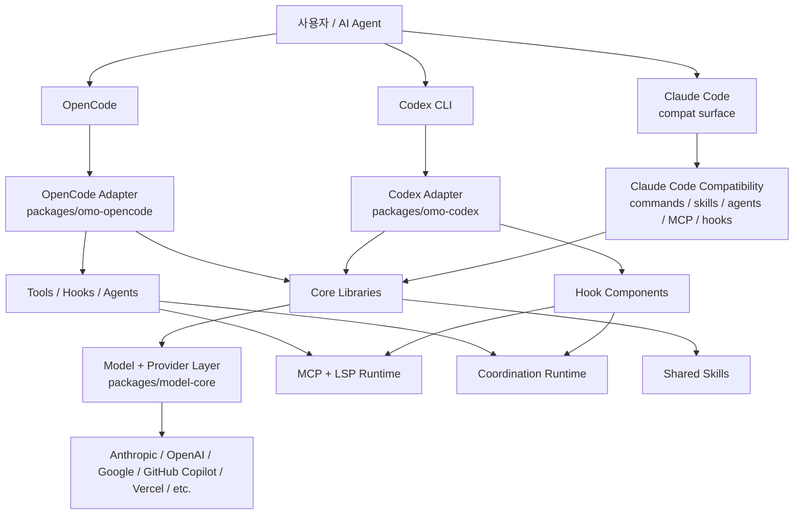
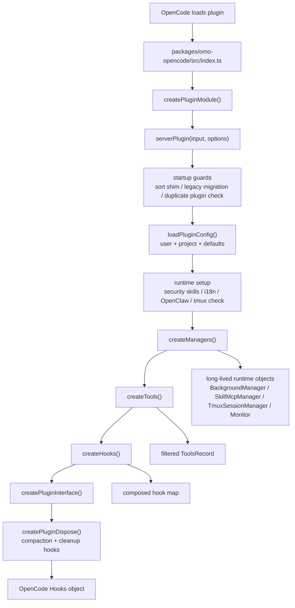
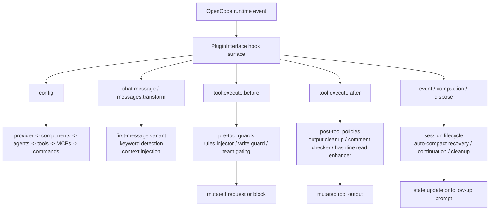
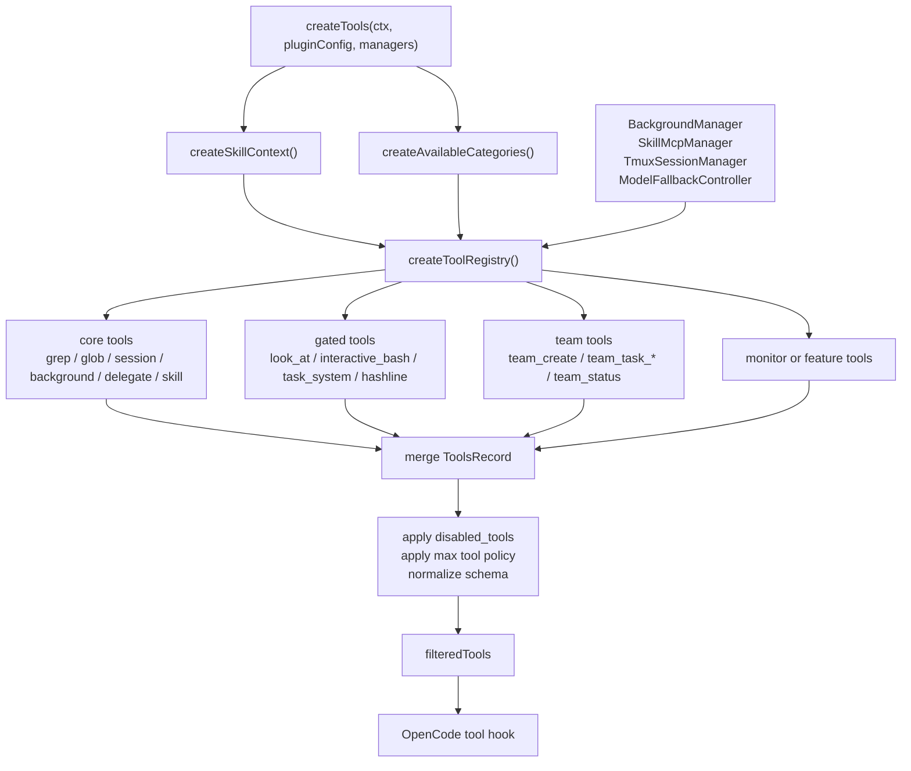
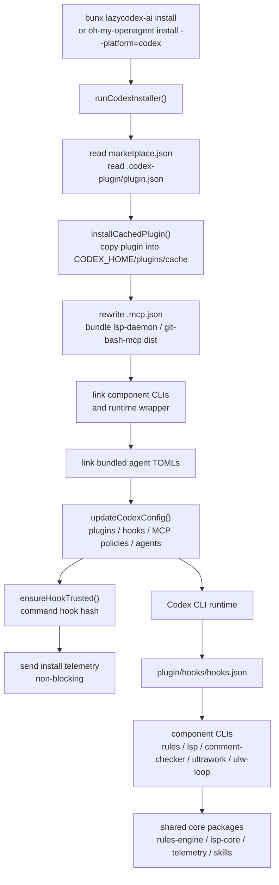
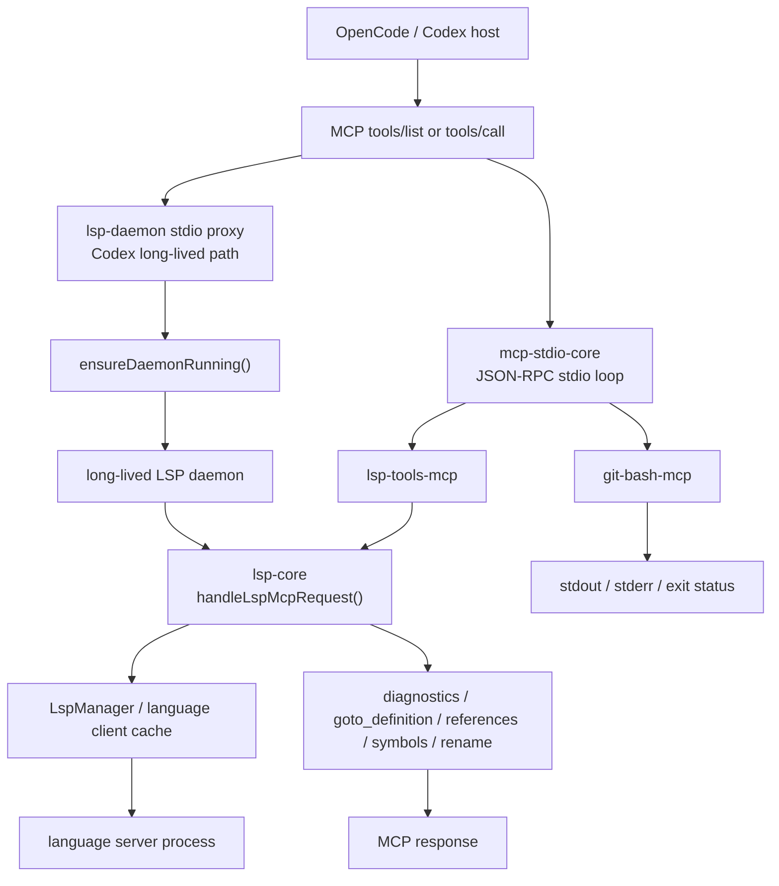
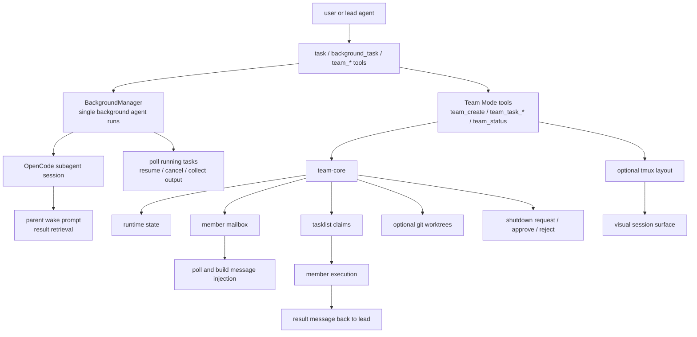

# Architecture: oh-my-openagent에서 가져갈 수 있는 아이디어

이 문서는 `oh-my-openagent`를 처음 보는 사람이 “이 프로젝트에서 어떤 설계 아이디어를 얻을 수 있는가”를 빠르게 파악하기 위한 진입점입니다. 모든 파일을 설명하려는 문서가 아닙니다. 대신 이 저장소가 품고 있는 반복 가능한 패턴, 경계, 실행 흐름, 읽는 순서를 정리합니다.

더 깊은 자동 분석 자료는 GitNexus 산출물을 먼저 보세요.

- `.gitnexus/wiki/index.html`: source-only GitNexus wiki viewer
- `.gitnexus/wiki/overview.md`: 전체 구조 요약
- `.omo/reports/20260618-gitnexus-oh-my-openagent/execution-flows-ko.md`: 핵심 실행 흐름 6개 해설
- `.omo/reports/20260618-gitnexus-oh-my-openagent/source-map-ko.md`: 패키지/파일별 소스맵

## 한 문장으로 보기

`oh-my-openagent`는 OpenCode와 Codex라는 서로 다른 AI coding harness 위에, 같은 제품 철학을 공유하는 agent/tool/hook/runtime 계층을 올리는 다중 하네스 에이전트 시스템입니다.

OpenCode edition은 runtime adapter에 가깝고, Codex Light edition은 설치 가능한 plugin bundle과 hook component runtime에 가깝습니다. 두 edition은 core package, skill bundle, MCP/LSP runtime, coordination runtime을 공유합니다.

## 이 프로젝트를 설명하는 법

처음 소개할 때는 “프롬프트 모음”이나 “특정 모델 wrapper”라고 설명하지 않는 편이 좋습니다. 이 프로젝트의 중심은 모델 호출 자체가 아니라, AI coding agent를 제품처럼 운영하기 위한 runtime 구조입니다.

짧게는 이렇게 말할 수 있습니다.

> `oh-my-openagent`는 OpenCode와 Codex 같은 서로 다른 AI coding harness 위에 agent, tool, hook, skill, MCP/LSP, multi-agent coordination을 얹어 하나의 agent runtime layer처럼 쓰게 만드는 다중 하네스 AI 에이전트 시스템입니다.

조금 더 길게 설명한다면 아래 문장이 가장 안전합니다.

> 단순히 에이전트에게 좋은 프롬프트를 주는 프로젝트가 아닙니다. 외부 harness는 adapter로 얇게 받고, 재사용 가능한 정책은 core package로 빼며, hook을 governance layer로 쓰고, tool registry와 installer, MCP/LSP, Team Mode 같은 runtime primitive를 조합해 장기 작업을 운영 가능한 시스템으로 만드는 프로젝트입니다.

대상에 따라 강조점은 달라집니다.

| 대상 | 설명 포인트 |
|---|---|
| 소프트웨어 엔지니어 | adapter/core 분리, hook 기반 정책 집행, tool registry, 설치/동기화 파이프라인 |
| AI 시스템 설계자 | chat prompt가 아니라 state, tools, policy, QA, coordination을 갖춘 agent runtime |
| multi-agent에 관심 있는 사람 | mailbox, tasklist, concurrency, background execution, Team Mode 같은 control plane |
| 아이디어를 얻으려는 사람 | 이름과 persona보다 boundary, runtime contract, verification culture를 가져갈 것 |

오해를 줄이려면 세 가지 축을 분리해서 설명하세요.

- **Harness / surface**: OpenCode, Codex CLI, Claude Code compatibility처럼 agent가 실행되고 hook/tool/config가 붙는 표면입니다.
- **Model provider**: Anthropic, OpenAI, Google, GitHub Copilot, Vercel, OpenRouter류 gateway처럼 실제 model id, fallback, capability, API behavior가 달라지는 계층입니다.
- **Agent role**: Sisyphus, Hephaestus, Prometheus, Atlas, Explore 같은 역할 단위입니다. role은 harness 위에서 실행되고 provider/model 선택을 가집니다.

따라서 “Claude Code/Codex를 감싼 model provider wrapper”라고 부르면 핵심을 놓칩니다. 더 정확한 표현은 “여러 AI coding harness에 같은 agent 운영 철학을 이식하는 multi-harness runtime layer”입니다.

## AI Agent Harness 관점으로 설명하기

이 프로젝트를 AI Agent Harness 관점에서 설명하려면 먼저 harness를 “LLM을 실제 개발 작업자로 만들기 위해 필요한 실행 껍질”로 정의하면 좋습니다. 모델은 텍스트를 생성하지만, harness는 그 모델이 어떤 파일을 읽고, 어떤 도구를 호출하고, 어떤 권한과 규칙을 따르며, 어떤 상태를 이어받고, 언제 다른 agent에게 일을 넘길지 결정하는 runtime입니다.

그 관점에서 `oh-my-openagent`는 새 foundation model을 만드는 프로젝트가 아닙니다. OpenCode와 Codex 같은 agent harness 위에 다음 계층을 보강하는 프로젝트입니다.

| Harness 구성 요소 | 이 프로젝트에서의 대응 |
|---|---|
| Model binding | provider/model id, fallback, reasoning profile, agent/category별 model 선택 |
| Prompt and role surface | Sisyphus, Hephaestus, Prometheus, Atlas, Explore 같은 agent role과 shared skill |
| Tool surface | file/search/session/background/LSP/MCP/team 도구를 registry로 구성 |
| Lifecycle hooks | UserPrompt, PreToolUse, PostToolUse, SessionStart, Stop, compaction 같은 개입 지점 |
| Policy and guardrails | rules injection, write guard, comment checker, context recovery, hook trust |
| State and memory | session state, task state, team runtime state, mailbox, evidence artifact |
| External runtime | MCP stdio, LSP daemon, Git Bash MCP, tmux, OpenClaw 외부 채널 |
| Distribution and install | OpenCode adapter, Codex Light plugin cache, marketplace snapshot, agent TOML, config migration |
| Verification | isolated harness QA, hook firing proof, evidence-bound change discipline |

그래서 이 프로젝트의 핵심 질문은 “어떤 모델이 더 똑똑한가?”가 아닙니다. 더 정확한 질문은 “LLM이 장기 개발 작업을 안전하게 수행하려면 harness가 어떤 실행 표면과 통제 장치를 제공해야 하는가?”입니다.

이 관점에서 발표하거나 설명할 때는 다음 흐름이 자연스럽습니다.

1. **모델은 엔진이고 harness는 작업 환경입니다.** 모델만으로는 파일 시스템, 도구 권한, 세션 상태, 외부 프로세스, 동시 실행, 검증 루프가 생기지 않습니다.
2. **OpenCode와 Codex는 서로 다른 harness입니다.** 둘은 hook, tool, install, config, multi-agent 지원 방식이 다르므로 하나의 API로 억지로 합치지 않습니다.
3. **`oh-my-openagent`는 harness 위의 운영 계층입니다.** adapter는 각 harness에 맞추고, 공통 정책은 core package로 올리며, MCP/LSP/team/runtime 기능을 공유 가능한 형태로 분리합니다.
4. **좋은 agent system은 prompt보다 runtime contract가 중요합니다.** 어떤 hook에서 개입하는지, 어떤 tool을 허용하는지, 어떤 state를 보존하는지, 실패를 어떻게 복구하는지가 제품 품질을 결정합니다.
5. **Multi-agent도 harness 문제입니다.** 여러 agent를 부르는 문구가 아니라 task ownership, mailbox, concurrency, cancellation, result retrieval, worktree, tmux visibility 같은 control plane이 필요합니다.

한 문장으로 줄이면 이렇게 말할 수 있습니다.

> `oh-my-openagent`는 AI coding agent가 실제 개발 작업을 수행할 수 있도록 model, role, tool, hook, state, policy, multi-agent coordination을 묶어 주는 multi-harness agent runtime입니다.

이 설명은 `Claude Code`, `Codex`, `OpenCode`를 model provider가 아니라 harness 또는 compatibility surface로 분리해 설명할 수 있다는 장점이 있습니다. model provider는 그 아래에서 OpenAI, Anthropic, Google, GitHub Copilot, Vercel 같은 실제 모델 공급 계층으로 다루면 됩니다.

위 다이어그램도 같은 구분을 따릅니다. OpenCode, Codex CLI, Claude Code compatibility는 실행 표면이고, model/provider layer는 그 아래에서 model id와 fallback, capability 정책을 담당합니다.

## GitNexus 소스 그래프를 Mermaid로 보기

아래 다이어그램은 GitNexus source-only wiki와 query 결과에서 반복적으로 드러나는 주요 실행 그래프를 사람이 읽기 쉽게 다시 그린 것입니다. 세부 파일은 refactor 중이므로, 경로 이름보다 “어떤 경계가 어떤 산출물을 다음 단계에 넘기는가”에 집중해서 읽는 편이 좋습니다.

### 1. OpenCode 플러그인 부트스트랩

OpenCode edition의 중심 그래프는 `createPluginModule()`입니다. 이 함수는 구현 로직을 직접 많이 담기보다, 설정과 런타임 자원을 만든 뒤 managers, tools, hooks, interface를 순서대로 조립하는 composition root입니다.

대표 소스:

- `packages/omo-opencode/src/index.ts`
- `packages/omo-opencode/src/testing/create-plugin-module.ts`
- `packages/omo-opencode/src/create-managers.ts`
- `packages/omo-opencode/src/create-tools.ts`
- `packages/omo-opencode/src/create-hooks.ts`
- `packages/omo-opencode/src/plugin-interface.ts`

### 2. OpenCode 훅 거버넌스 그래프

OpenCode runtime에서 발생하는 event, message transform, tool execution은 하나의 거대한 handler로 들어가지 않습니다. `createHooks()`가 목적별 hook factory를 합성하고, `createPluginInterface()`가 OpenCode의 공개 hook 이름을 내부 handler와 연결합니다.

대표 소스:

- `packages/omo-opencode/src/plugin-interface.ts`
- `packages/omo-opencode/src/plugin/hooks/`
- `packages/omo-opencode/src/hooks/`
- `packages/omo-opencode/src/hooks/rules-injector/`
- `packages/omo-opencode/src/hooks/comment-checker/`
- `packages/omo-opencode/src/hooks/anthropic-context-window-limit-recovery/`

### 3. Tool Registry 합성 그래프

도구 표면은 `createTools()`와 `createToolRegistry()`에서 만들어집니다. 핵심은 “항상 켜지는 도구”, “설정으로 켜지는 도구”, “Team Mode 전용 도구”, “task/hashline/monitor 도구”를 한 registry에서 합성한 뒤 disabled policy와 cap을 마지막에 적용하는 구조입니다.

대표 소스:

- `packages/omo-opencode/src/create-tools.ts`
- `packages/omo-opencode/src/plugin/tool-registry.ts`
- `packages/omo-opencode/src/plugin/tool-registry-core-tools.ts`
- `packages/omo-opencode/src/plugin/tool-registry-gated-tools.ts`
- `packages/omo-opencode/src/plugin/tool-registry-team-tools.ts`

### 4. Codex Light 설치와 훅 실행 그래프

Codex Light edition은 runtime 조립보다 설치 결과의 재현성이 중요합니다. installer가 Codex home 아래에 plugin cache, marketplace snapshot, agent TOML, component CLI, MCP manifest, `config.toml`, hook trust state를 만들어 두고, Codex runtime은 그 산출물을 기준으로 hook component를 실행합니다.

대표 소스:

- `packages/omo-codex/src/install/install-codex.ts`
- `packages/omo-codex/src/install/codex-config-toml.ts`
- `packages/omo-codex/src/install/codex-hook-trust.ts`
- `packages/omo-codex/src/install/link-cached-plugin-agents.ts`
- `packages/omo-codex/plugin/hooks/hooks.json`
- `packages/omo-codex/plugin/components/*/src/`

### 5. MCP/LSP 실행 그래프

MCP/LSP 계층은 agent adapter에서 직접 언어 서버를 다루지 않도록 분리합니다. OpenCode와 Codex는 MCP tool call을 보내고, stdio server나 daemon proxy가 `lsp-core`의 실제 LSP 작업으로 라우팅합니다.

대표 소스:

- `packages/mcp-stdio-core/src/`
- `packages/lsp-tools-mcp/src/cli.ts`
- `packages/lsp-core/src/mcp.ts`
- `packages/lsp-core/src/lsp/manager.ts`
- `packages/lsp-daemon/src/`
- `packages/git-bash-mcp/src/`

### 6. Multi-agent coordination 그래프

Multi Agent System은 prompt pattern이 아니라 control plane입니다. OpenCode 쪽에서는 background agent와 Team Mode가 실행, mailbox, tasklist, worktree, tmux 시각화, shutdown 요청을 분리해서 다룹니다. Codex Light는 같은 수준의 Team Mode runtime을 제공하지 않고, Codex `multi_agent_v2` 설정도 기능 강제가 아니라 thread limit 보장에 머뭅니다.

대표 소스:

- `packages/omo-opencode/src/features/background-agent/`
- `packages/omo-opencode/src/features/team-mode/`
- `packages/omo-opencode/src/plugin/tool-registry-team-tools.ts`
- `packages/team-core/src/`
- `packages/tmux-core/src/`
- `docs/architecture/multi-agent-system.md`

## 이 프로젝트에서 배울 수 있는 핵심 아이디어

### 1. Adapter는 얇게, 정책은 core로

OpenCode와 Codex는 hook 모델, 설치 방식, 런타임 제약이 다릅니다. 이 프로젝트는 두 runtime을 하나의 추상화로 억지로 합치지 않습니다. 대신 adapter는 각 harness의 표면에만 집중하고, 재사용 가능한 정책은 core package로 밀어냅니다.

읽을 곳:

- `packages/omo-opencode/src/testing/create-plugin-module.ts`
- `packages/omo-opencode/src/plugin-interface.ts`
- `packages/omo-codex/src/install/install-codex.ts`
- `packages/model-core/src/`
- `packages/rules-engine/src/`
- `packages/skills-loader-core/src/`

가져갈 아이디어:

- 외부 runtime과 맞닿는 코드는 “translation layer”로 제한합니다.
- 모델 선택, rule discovery, skill loading, 상태 저장 같은 정책은 harness-neutral package로 분리합니다.
- 두 runtime이 완전히 같은 API를 갖는 척하지 말고, 각 runtime의 차이를 adapter 경계에서 명시합니다.

### 2. Hook surface를 제품 운영 체제로 사용하기

이 프로젝트의 핵심은 hook입니다. 사용자의 메시지, tool 실행 전후, session event, compaction, stop event를 독립적인 정책 삽입 지점으로 봅니다. 그래서 기능 하나가 꼭 UI 버튼이나 CLI 명령일 필요가 없습니다. “언제 개입할 것인가”가 기능 설계의 중심입니다.

OpenCode 쪽은 `createPluginInterface()`가 hook 이름을 내부 handler로 연결합니다. Codex 쪽은 `plugin/hooks/hooks.json`이 lifecycle event를 component CLI로 연결합니다.

읽을 곳:

- `packages/omo-opencode/src/plugin-interface.ts`
- `packages/omo-opencode/src/create-hooks.ts`
- `packages/omo-opencode/src/plugin/hooks/`
- `packages/omo-codex/plugin/hooks/hooks.json`
- `packages/omo-codex/plugin/components/rules/src/codex-hook.ts`
- `packages/omo-codex/plugin/components/ulw-loop/src/codex-hook.ts`

가져갈 아이디어:

- hook을 단순 callback이 아니라 “agent runtime governance layer”로 설계합니다.
- pre-tool hook은 실행 전 제약과 안내에 적합합니다.
- post-tool hook은 검증, diagnostics, context refresh에 적합합니다.
- session/compaction/stop hook은 장기 작업의 연속성과 상태 회복에 적합합니다.

### 3. 도구 표면은 registry로 합성하기

OpenCode edition의 tool surface는 한 파일에 무작정 나열되지 않습니다. `createTools()`가 skill context와 category를 계산하고, `createToolRegistry()`가 core/gated/team/monitor/task/hashline 도구를 합성합니다.

읽을 곳:

- `packages/omo-opencode/src/create-tools.ts`
- `packages/omo-opencode/src/plugin/tool-registry.ts`
- `packages/omo-opencode/src/plugin/tool-registry-core-tools.ts`
- `packages/omo-opencode/src/plugin/tool-registry-gated-tools.ts`
- `packages/omo-opencode/src/plugin/tool-registry-team-tools.ts`

가져갈 아이디어:

- 도구를 추가할 때 “항상 켜지는가, 설정으로 켜지는가, 특정 mode 전용인가”를 먼저 정합니다.
- registry 마지막 단계에서 disabled policy와 max tool cap을 적용합니다.
- tool schema normalize를 중앙화하면 개별 tool 구현의 실수를 줄일 수 있습니다.

### 4. 설치도 runtime의 일부로 보기

Codex Light edition은 설치 과정 자체가 중요한 runtime 계약입니다. `runCodexInstaller()`는 plugin cache, bin link, agent TOML, hook trust, marketplace snapshot, `config.toml`, cleanup, telemetry를 한 흐름으로 다룹니다.

읽을 곳:

- `packages/omo-codex/src/install/install-codex.ts`
- `packages/omo-codex/src/install/codex-config-toml.ts`
- `packages/omo-codex/src/install/codex-hook-trust.ts`
- `packages/omo-codex/src/install/link-cached-plugin-agents.ts`
- `packages/omo-codex/plugin/.codex-plugin/plugin.json`

가져갈 아이디어:

- plugin runtime이 제대로 동작하려면 설치 결과를 재현 가능하게 만들어야 합니다.
- installer는 단순 file copy가 아니라 runtime graph를 구성하는 단계입니다.
- 실제 사용자 홈을 건드리는 installer는 isolated home에서 검증할 수 있어야 합니다.

### 5. LSP와 외부 실행은 MCP runtime으로 분리하기

LSP 기능은 OpenCode adapter 내부에 직접 박혀 있지 않습니다. `lsp-core`, `lsp-tools-mcp`, `lsp-daemon`, `mcp-stdio-core`로 나누어 stdio MCP와 장기 실행 daemon을 통해 노출합니다.

읽을 곳:

- `packages/lsp-core/src/mcp.ts`
- `packages/lsp-core/src/lsp/manager.ts`
- `packages/lsp-tools-mcp/src/cli.ts`
- `packages/lsp-daemon/src/ensure-daemon.ts`
- `packages/mcp-stdio-core/src/`

가져갈 아이디어:

- editor-like 기능은 agent adapter에 직접 섞지 말고 독립 protocol boundary로 둡니다.
- `initialize`, `tools/list`, `tools/call` 같은 MCP protocol shape를 안정적인 계약으로 봅니다.
- daemon은 socket probe, lock, stale socket cleanup, detached spawn을 별도 계층으로 나눠야 race를 줄일 수 있습니다.

### 6. 장기 작업은 coordination runtime이 필요하다

이 저장소는 단일 응답형 assistant보다 긴 작업을 염두에 둡니다. Team Mode, OpenClaw, background agent, tmux, mailbox, tasklist, state store 같은 기능은 “agent가 여러 단계와 여러 실행 주체를 가진다”는 전제에서 나옵니다.

읽을 곳:

- `packages/team-core/src/`
- `packages/openclaw-core/src/`
- `packages/omo-opencode/src/features/team-mode/`
- `packages/omo-opencode/src/features/background-agent/`
- `packages/tmux-core/src/`

가져갈 아이디어:

- multi-agent 기능은 prompt만으로 해결하지 말고 mailbox/tasklist/state store를 둡니다.
- tmux 같은 외부 session surface는 core primitive로 분리합니다.
- 외부 채널 연동은 runtime dispatch, reply listener, session registry로 쪼개야 안전합니다.

### 7. Multi Agent System은 control plane으로 다루기

이 프로젝트에서 Multi Agent System은 “여러 agent 이름을 prompt에 적는 기능”이 아닙니다. agent role, category, task spawning, background execution, concurrency, mailbox, tasklist, optional worktree, tmux/cmux pane, Codex multi-agent feature limit이 함께 맞물리는 control plane입니다.

OpenCode 쪽은 background agent와 Team Mode가 중심입니다. background agent는 작업을 띄우고 나중에 결과를 회수하는 모델이고, Team Mode는 lead/member, deferred-ack mailbox, file-locked task claims, optional worktree, tmux layout까지 포함하는 협업 runtime입니다.

Codex 쪽은 `multi_agent_v2`를 무조건 켜지 않습니다. `ensureCodexMultiAgentV2Config()`는 `enabled = true`를 강제하지 않고, server-side model catalog가 해당 기능을 활성화할 때 사용할 thread limit만 설정합니다. 현재 Codex plugin runtime에는 SessionStart 시 `multi_agent_v2`를 다시 비활성화하는 guard도 있습니다. 이유는 provider/API 조합에 따라 encrypted tool parameter 지원 여부가 다르고, 특정 Codex `multi_agent_v2` 경로가 모든 turn을 실패시킬 수 있기 때문입니다.

읽을 곳:

- `docs/reference/features.md`
- `docs/guide/team-mode.md`
- `packages/omo-opencode/src/features/background-agent/`
- `packages/omo-opencode/src/features/team-mode/`
- `packages/team-core/src/`
- `packages/openclaw-core/src/`
- `packages/tmux-core/src/`
- `packages/omo-codex/src/install/codex-multi-agent-v2-config.ts`
- `packages/omo-codex/plugin/scripts/migrate-codex-config/multi-agent-v2-guard.mjs`

가져갈 아이디어:

- Multi agent는 prompt pattern이 아니라 scheduling, state, mailbox, ownership, cancellation 문제입니다.
- agent가 늘어나면 “누가 어떤 파일을 잡았는가”, “어떤 결과를 언제 회수할 것인가”, “동시 실행 한도는 어디서 걸 것인가”가 제품 기능이 됩니다.
- provider나 model이 multi-agent feature를 지원하지 않을 수 있으므로 feature flag를 강제로 켜지 말고 runtime capability와 분리합니다.
- visual coordination은 tmux/cmux 같은 외부 pane surface로 빼면 runtime 관찰성이 좋아집니다.

### 8. Model Provider는 harness와 분리해서 보기

이 저장소는 Claude 계열, GPT 계열, Gemini 계열, Copilot/Vercel gateway 계열을 한 이름 체계로 단순화하려고 하지 않습니다. 대신 provider별 model id 변환, fallback chain, capability metadata, category/agent model selection을 별도 계층으로 둡니다.

OpenCode edition은 `oh-my-openagent.json[c]` 또는 legacy `oh-my-opencode.json[c]`에서 agent/category별 model, fallback, reasoning/thinking 설정을 받습니다. Claude Code compatibility layer는 `.claude` 계열 commands, skills, agents, MCP, hooks를 OpenCode runtime 안으로 가져옵니다.

Codex Light edition은 Codex의 모델 프로필과 reasoning profile을 installer가 다룹니다. `codex-model-catalog.ts`는 현재 Codex profile과 managed profile fallback을 읽고, installer는 Codex home/plugin cache/config에 맞춰 Light edition을 배치합니다.

읽을 곳:

- `packages/model-core/src/provider-model-id-transform.ts`
- `packages/model-core/src/model-string-parser.ts`
- `packages/omo-codex/src/install/codex-model-catalog.ts`
- `packages/omo-codex/src/install/link-cached-plugin-agents.ts`
- `packages/omo-opencode/src/shared/connected-providers-cache.ts`
- `docs/reference/configuration.md`
- `docs/reference/features.md`

가져갈 아이디어:

- “Claude Code/Codex/OpenCode” 같은 harness surface와 “Anthropic/OpenAI/Google/GitHub Copilot/Vercel” 같은 model provider를 같은 축에 놓지 않습니다.
- model id는 provider별로 표기법이 다릅니다. 변환 규칙은 중앙화해야 합니다.
- fallback은 단순 backup model 이름 목록이 아니라 provider/API 오류, capability, reasoning 설정까지 포함하는 runtime recovery 전략입니다.
- agent role은 provider에 묶이지 않아야 합니다. 같은 role이 상황에 따라 Claude, GPT, Gemini, Copilot gateway 모델을 선택할 수 있어야 합니다.

## 처음 읽는 순서

아이디어를 얻는 목적이라면 아래 순서가 가장 효율적입니다.

1. `.gitnexus/wiki/overview.md`
2. 이 문서 `ARCHITECTURE.md`
3. `.omo/reports/20260618-gitnexus-oh-my-openagent/execution-flows-ko.md`
4. `docs/architecture/multi-agent-system.md`
5. `docs/reference/features.md`
6. `packages/omo-opencode/src/testing/create-plugin-module.ts`
7. `packages/omo-opencode/src/plugin-interface.ts`
8. `packages/omo-opencode/src/plugin/tool-registry.ts`
9. `packages/omo-codex/src/install/install-codex.ts`
10. `packages/omo-codex/plugin/hooks/hooks.json`
11. `packages/lsp-core/src/mcp.ts`
12. `packages/team-core/src/` 또는 `packages/openclaw-core/src/`
13. `packages/model-core/src/provider-model-id-transform.ts`

## 수정할 위치를 고르는 법

| 하고 싶은 일 | 먼저 볼 곳 | 이유 |
|---|---|---|
| OpenCode 시작 순서 바꾸기 | `create-plugin-module.ts` | managers/tools/hooks/interface 조립 순서가 여기에 있음 |
| OpenCode hook 정책 바꾸기 | `plugin-interface.ts` → `plugin/*` → `hooks/*` | 외부 hook 이름과 내부 handler 경계를 분리해야 함 |
| 새 tool 추가 | `create-tools.ts`, `tool-registry*.ts` | core/gated/team/tool cap 정책을 따라야 함 |
| Codex 설치 문제 수정 | `install-codex.ts`, `codex-config-toml.ts` | install output이 Codex runtime 계약임 |
| Codex hook 동작 수정 | `plugin/hooks/hooks.json`, `plugin/components/*/src` | event-to-command routing이 manifest에 있음 |
| LSP tool 수정 | `lsp-core/src/mcp.ts`, `lsp-core/src/tools/` | MCP request와 LSP execution을 분리해야 함 |
| multi-agent coordination 수정 | `team-core`, `openclaw-core`, `tmux-core` | 상태, mailbox, session, tmux primitive가 흩어져 있음 |
| background agent 동시성 수정 | `features/background-agent/concurrency.ts` | model/provider 단위 실행 한도를 여기서 다룸 |
| Codex multi-agent 설정 수정 | `codex-multi-agent-v2-config.ts` | feature enable과 thread limit을 분리해야 함 |
| model/provider 표기 수정 | `model-core/src/provider-model-id-transform.ts` | provider별 model id 변환을 중앙화해야 함 |
| agent/category model 정책 수정 | `docs/reference/configuration.md`, `packages/omo-opencode/src/config/` | role, category, fallback, reasoning 설정이 연결됨 |

## 따라 하기 좋은 패턴

### Boundary-first package layout

`packages/` 아래를 adapter, core, MCP runtime, coordination runtime, shared skills, distribution package로 나눕니다. 이 구조는 기능 이름보다 책임 경계를 먼저 드러냅니다.

### Source-generated artifact 분리

generated, dist, platform binary package는 손으로 고치는 영역이 아닙니다. 소스와 산출물을 명확히 분리해야 AI agent도 안전하게 작업할 수 있습니다.

### Evidence-bound QA

OpenCode나 Codex에 연결되는 변경은 단순 typecheck로 끝내지 않습니다. 실제 harness를 격리 환경에서 구동하고 evidence를 디스크에 남기는 규칙을 둡니다. 이 프로젝트의 QA 문화는 기능 자체만큼 중요한 설계 요소입니다.

### Harness/provider/role 분리

agent system을 설계할 때 harness, model provider, agent role을 한 덩어리로 묶지 않습니다. 이 셋을 분리해야 Claude Code compatibility, Codex Light, OpenCode adapter, Copilot/Vercel gateway, GPT/Claude/Gemini fallback을 같은 시스템 안에서 다룰 수 있습니다.

### Multi-agent control plane

agent를 여러 개 띄우는 기능은 쉽게 만들 수 있지만, 오래 운영되는 multi-agent system에는 mailbox, task ownership, concurrency limit, cancellation, result retrieval, visual session surface가 필요합니다. 이 프로젝트는 그 문제를 runtime concern으로 끌어올린 사례입니다.

### Agent-facing documentation

`AGENTS.md`, `CLAUDE.md`, GitNexus wiki, `.omo/reports`는 사람이 읽는 문서이면서 AI agent가 작업 전 참고하는 operational context입니다. 복잡한 agent system에서는 문서도 runtime safety surface입니다.

## 그대로 베끼면 안 되는 것

- 모든 hook을 한 번에 많이 추가하는 방식
- project-specific mythology나 agent persona 이름
- Claude Code, Codex, OpenCode, Anthropic, OpenAI를 같은 provider 축으로 섞는 방식
- 현재 refactor 중인 directory structure를 안정된 표준처럼 받아들이는 것
- 실제 사용자 홈을 건드리는 installer를 isolated QA 없이 실행하는 것
- generated/dist/platform package를 소스처럼 수정하는 것

가져갈 것은 이름이 아니라 경계입니다. adapter를 얇게 유지하는 방식, hook을 governance layer로 쓰는 방식, tool registry를 config gate 뒤에 두는 방식, installer를 runtime contract로 보는 방식이 이 프로젝트의 재사용 가능한 부분입니다.

## GitNexus-first 작업 규칙

이 저장소는 GitNexus index와 source-only wiki를 갖고 있습니다. AI 시스템이 이 프로젝트를 분석하거나 수정한다면 아래 순서를 따르세요.

1. broad 질문은 `.gitnexus/wiki/overview.md`와 이 문서에서 시작합니다.
2. 특정 기능 질문은 `node .gitnexus/run.cjs query "<concept>" --repo oh-my-openagent-part7`로 관련 흐름을 찾습니다.
3. 특정 symbol을 수정하기 전에는 GitNexus impact analysis를 먼저 확인합니다.
4. 완료 전에는 `node .gitnexus/run.cjs detect-changes --scope all --repo oh-my-openagent-part7`로 변경 범위를 확인합니다.

## 다음 문서로 이어가기

- 사용자 관점: `README.md`, `README.ko.md`
- 현재 재구성 방향: `ROADMAP.md`
- Multi Agent System 구현 해부: `docs/architecture/multi-agent-system.md`
- OpenCode adapter 상세: `packages/omo-opencode/src/AGENTS.md`
- Codex Light adapter 상세: `packages/omo-codex/AGENTS.md`
- GitNexus wiki: `.gitnexus/wiki/index.html`
- 핵심 실행 흐름: `.omo/reports/20260618-gitnexus-oh-my-openagent/execution-flows-ko.md`
