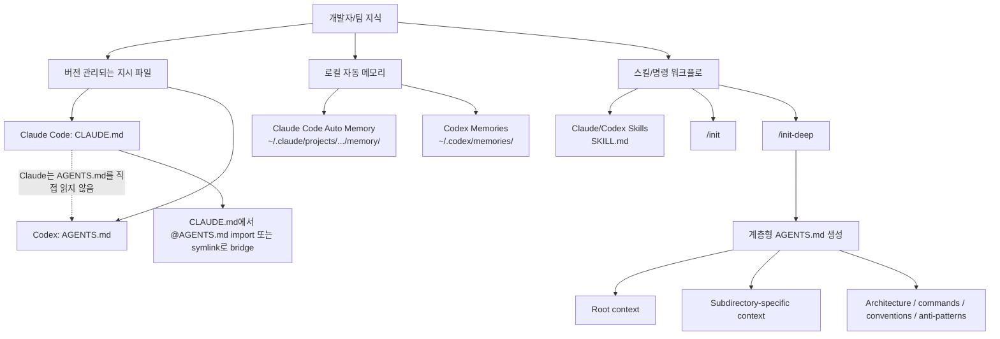
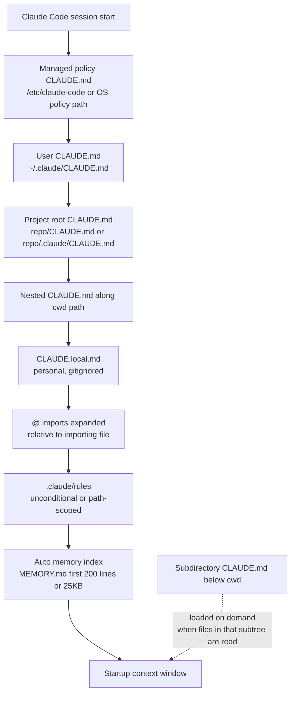
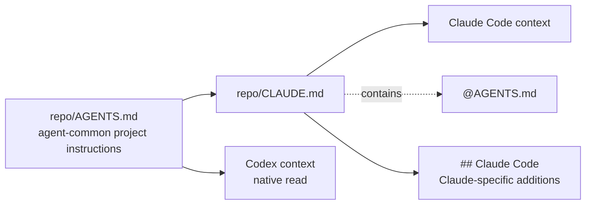
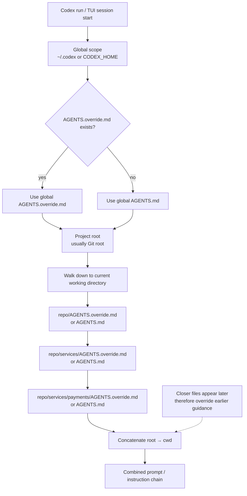
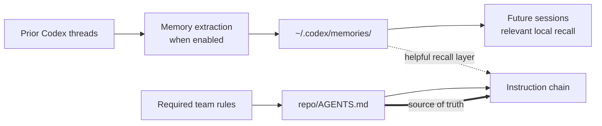
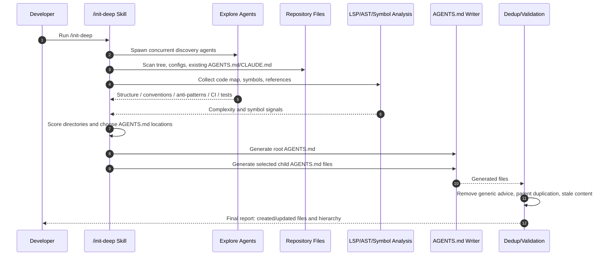
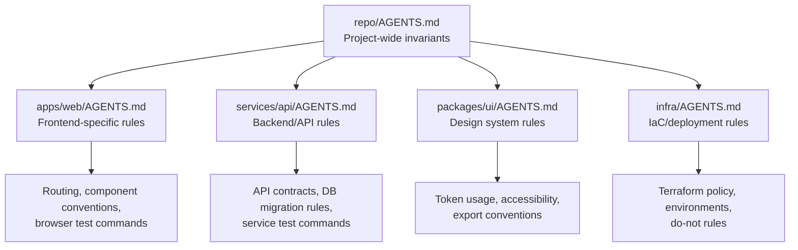
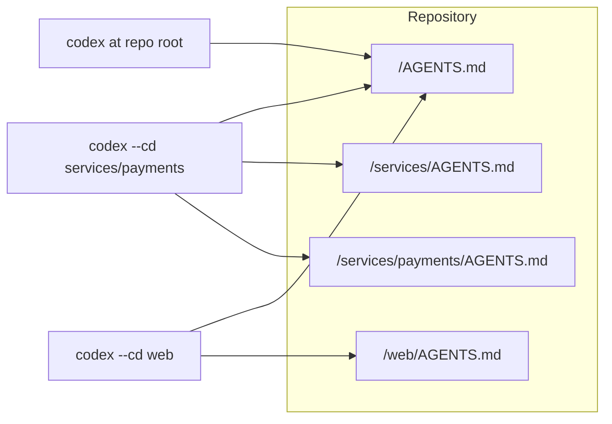
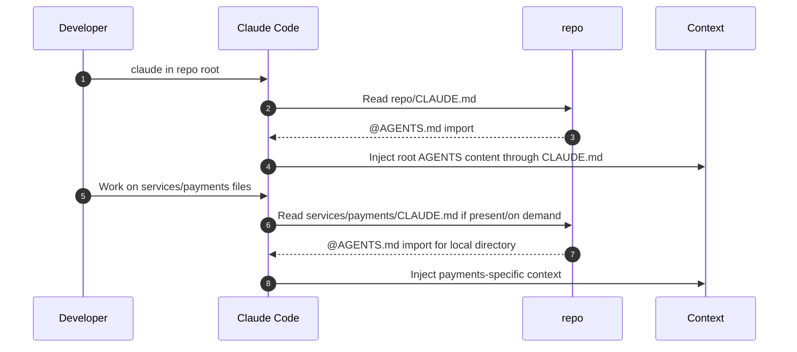

# `/init-deep`과 계층형 `AGENTS.md` 구성을 통한 컨텍스트 자동 주입 이해

## 1. 핵심 결론

`/init-deep`을 강의할 때 가장 먼저 분리해야 할 개념은 **“메모리”**와 **“컨텍스트 주입 파일”**입니다. Claude Code와 Codex 모두 과거 세션의 정보를 다시 활용하는 기능을 갖고 있지만, 팀이 의도적으로 관리해야 하는 핵심 지식은 보통 자동 메모리보다 **프로젝트 안에 버전 관리되는 지시 파일**에 두는 것이 더 안전합니다.

Claude Code의 네이티브 지속 지시 파일은 **`CLAUDE.md`**입니다. Claude Code 공식 문서는 세션이 매번 새 context window로 시작하며, 세션 간 지식을 이어 주는 메커니즘으로 사용자가 작성하는 `CLAUDE.md`와 Claude가 자동으로 작성하는 auto memory를 구분합니다. 또한 `CLAUDE.md`는 행동을 유도하는 컨텍스트이지 강제 설정이 아니며, 강제가 필요하면 hook 같은 별도 장치를 써야 한다고 설명합니다. ([Claude Platform Docs][1])

Codex의 네이티브 프로젝트 지시 파일은 **`AGENTS.md`**입니다. OpenAI Codex 문서는 Codex가 작업 전에 `AGENTS.md`를 읽고, 전역 지침과 프로젝트별 override를 계층적으로 결합해 instruction chain을 만든다고 설명합니다. 이때 더 현재 작업 디렉터리에 가까운 파일이 combined prompt의 뒤쪽에 배치되어 앞선 지침보다 우선한다고 설명합니다. ([OpenAI Developers][2])

`/init`은 공식 도구에서 제공하는 “초기 스캐폴딩”입니다. Claude Code의 `/init`은 코드베이스를 분석해 시작용 `CLAUDE.md`를 생성하거나 기존 파일 개선을 제안하고, Codex의 `/init`은 현재 디렉터리에 `AGENTS.md` scaffold를 생성합니다. ([Claude Platform Docs][1])

반면 `/init-deep`은 공식 Anthropic/OpenAI 기본 명령이라기보다, 커뮤니티/스킬 생태계에서 관찰되는 **계층형 `AGENTS.md` 자동 생성 워크플로**로 보는 것이 정확합니다. 공개된 `init-deep` 스킬 문서는 root와 complexity-scored subdirectory에 `AGENTS.md`를 생성하고, discovery → scoring → generation → review 단계를 수행한다고 설명합니다. ([Unpkg][3])

---

## 2. 핵심 개념 지도



이 그림에서 중요한 메시지는 세 가지입니다. 첫째, `AGENTS.md`와 `CLAUDE.md`는 “모델이 매번 기억해야 하는 프로젝트 규칙”을 담는 **명시적 컨텍스트 파일**입니다. 둘째, auto memory나 Codex Memories는 사용자의 과거 작업에서 파생된 **로컬 recall layer**이지, 팀 규칙의 유일한 근거로 두면 안 됩니다. Codex 문서도 팀에 필수적인 지침은 `AGENTS.md`나 checked-in documentation에 두고, memories는 보조적인 로컬 recall layer로 취급하라고 설명합니다. ([OpenAI Developers][4]) 셋째, `init-deep`의 목적은 “파일을 많이 만드는 것”이 아니라 **작업 위치에 맞는 지침이 자동으로 context에 들어오도록 지식의 위치와 범위를 설계하는 것**입니다.

---

## 3. Claude Code의 Memory 구조

### 3.1 `CLAUDE.md`와 Auto Memory의 역할 구분

Claude Code에는 크게 두 종류의 메모리 계층이 있습니다.

| 구분          |  작성 주체 | 대표 위치                                                         | 성격                 | 강의 포인트                      |
| ----------- | -----: | ------------------------------------------------------------- | ------------------ | --------------------------- |
| `CLAUDE.md` |  사용자/팀 | `./CLAUDE.md`, `./.claude/CLAUDE.md`, `~/.claude/CLAUDE.md` 등 | 명시적 지속 지시          | 프로젝트 규칙, 빌드/테스트 명령, 아키텍처 지식 |
| Auto memory | Claude | `~/.claude/projects/<project>/memory/`                        | Claude가 축적하는 로컬 노트 | 반복된 수정, 디버깅 패턴, 선호사항        |

Claude Code 공식 문서는 `CLAUDE.md`를 “프로젝트, 개인 워크플로, 조직 전체에 대한 persistent instructions”로 설명하며, Claude가 세션 시작 시 이를 읽는다고 설명합니다. 반면 auto memory는 Claude가 수정 사항과 선호에서 스스로 작성하는 notes입니다. ([Claude Platform Docs][1])

### 3.2 `CLAUDE.md`의 scope와 로딩 순서

Claude Code는 `CLAUDE.md`를 여러 scope에서 읽습니다. 공식 문서의 load order는 broadest scope에서 more specific scope로 진행되며, 예를 들어 managed policy, user instructions, project instructions, local instructions가 있습니다. 프로젝트 지시는 `./CLAUDE.md` 또는 `./.claude/CLAUDE.md`에 둘 수 있고, 개인별 프로젝트 설정은 `CLAUDE.local.md`로 둘 수 있습니다. ([Claude Platform Docs][1])

Claude Code는 현재 작업 디렉터리에서 위로 올라가며 각 디렉터리의 `CLAUDE.md`와 `CLAUDE.local.md`를 찾고, 발견한 파일들을 override가 아니라 **concatenate**합니다. 파일 시스템 root에서 현재 작업 디렉터리 방향으로 순서가 정해지므로, 현재 작업 위치에 가까운 지침이 나중에 context에 들어갑니다. 같은 디렉터리에서는 `CLAUDE.local.md`가 `CLAUDE.md` 뒤에 붙습니다. ([Claude Platform Docs][1])



이 구조에서 중요한 점은 Claude Code가 하위 디렉터리의 `CLAUDE.md`를 모두 세션 시작 시 무조건 읽는 것이 아니라, 현재 작업 디렉터리 아래의 subdirectory memory는 해당 디렉터리의 파일을 읽을 때 on demand로 포함한다는 점입니다. ([Claude Platform Docs][1])

### 3.3 `@path` import와 `AGENTS.md` 호환

Claude Code는 `CLAUDE.md` 내부에서 `@path/to/import` 문법으로 다른 파일을 import할 수 있습니다. import된 파일은 `CLAUDE.md`와 함께 세션 시작 시 context에 확장되어 들어가며, 상대 경로는 현재 working directory가 아니라 import를 포함한 파일 기준으로 해석됩니다. 재귀 import는 최대 네 hop까지 가능하다고 문서는 설명합니다. ([Claude Platform Docs][1])

여기서 `AGENTS.md`와의 호환성이 등장합니다. Claude Code 공식 문서는 **Claude Code가 `AGENTS.md`가 아니라 `CLAUDE.md`를 읽는다**고 명시합니다. 이미 `AGENTS.md`를 쓰는 저장소라면 `CLAUDE.md`에서 `@AGENTS.md`로 import하거나 symlink를 만들라고 안내합니다. 또한 저장소에 이미 `AGENTS.md`가 있을 때 Claude Code `/init`은 이를 읽고 생성되는 `CLAUDE.md`에 관련 부분을 반영한다고 설명합니다. ([Claude Platform Docs][1])



따라서 강의에서는 “`AGENTS.md`를 만들면 Claude Code도 자동으로 읽는다”라고 설명하면 부정확합니다. 정확한 설명은 **Codex는 `AGENTS.md`를 네이티브로 읽고, Claude Code는 `CLAUDE.md`를 통해 import하거나 symlink해야 한다**입니다.

### 3.4 `.claude/rules/`와 path-specific context

Claude Code는 큰 프로젝트에서 `.claude/rules/`로 instruction을 모듈화할 수 있습니다. Markdown 파일을 `.claude/rules/` 아래에 두면 재귀적으로 발견되며, `paths` frontmatter가 없는 rule은 시작 시 로드되고, `paths`가 있는 rule은 해당 패턴의 파일을 Claude가 읽을 때 적용됩니다. ([Claude Platform Docs][1])

이는 `init-deep` 강의에서 중요한 비교점입니다. Claude Code 세계에서는 “계층형 디렉터리 지시”를 꼭 `AGENTS.md`만으로 풀 필요가 없습니다. Claude 네이티브 방식으로는 `CLAUDE.md` + `.claude/rules/` + skill을 조합하는 것이 더 자연스럽습니다. 반면, 여러 에이전트 도구가 공유하는 표준화된 문서 계층을 만들고 싶다면 `AGENTS.md`를 중심으로 두고 Claude용 bridge를 붙이는 방식이 좋습니다.

### 3.5 Auto Memory의 저장 구조와 한계

Claude Code auto memory는 프로젝트별로 `~/.claude/projects/<project>/memory/`에 저장되며, 대표적으로 `MEMORY.md`와 topic file들이 있습니다. 공식 문서는 세션 시작 시 `MEMORY.md`의 첫 200줄 또는 25KB 중 먼저 도달하는 범위가 로드되고, topic file은 시작 시 로드되지 않고 필요 시 파일 도구로 읽는다고 설명합니다. 또한 `CLAUDE.md`는 길이와 관계없이 full load되지만, 짧을수록 더 잘 따르는 경향이 있다고 설명합니다. ([Claude Platform Docs][1])

즉, `CLAUDE.md`와 auto memory는 모두 context를 소비합니다. 특히 `CLAUDE.md`는 full load이므로, 장황한 규칙 파일은 토큰을 낭비하고 adherence를 낮출 수 있습니다. Claude 문서는 `CLAUDE.md`를 200줄 이하로 목표 삼고, 긴 지시는 path-scoped rules나 skills로 분리하라고 권장합니다. ([Claude Platform Docs][1])

---

## 4. Codex의 Memory / Guidance 구조

### 4.1 `AGENTS.md` instruction chain

Codex는 `AGENTS.md`를 작업 시작 전에 읽습니다. 공식 문서는 Codex가 run 시작 시 instruction chain을 만들며, TUI에서는 일반적으로 launched session마다 한 번 구성한다고 설명합니다. 전역 scope에서는 기본적으로 `~/.codex`를 Codex home으로 보고, `CODEX_HOME`이 설정되면 해당 경로를 사용합니다. 이 위치에서 `AGENTS.override.md`가 있으면 우선 읽고, 없으면 `AGENTS.md`를 읽습니다. ([OpenAI Developers][2])

프로젝트 scope에서는 보통 Git root를 project root로 보고, project root에서 현재 working directory까지 내려가며 각 디렉터리에서 `AGENTS.override.md`, `AGENTS.md`, fallback filename 순으로 확인합니다. 각 디렉터리에서는 최대 하나의 instruction file만 포함합니다. ([OpenAI Developers][2])



여기서 강의 핵심은 **Codex가 모든 하위 디렉터리의 `AGENTS.md`를 무조건 읽는 것이 아니라, project root에서 현재 working directory까지의 경로에 있는 파일을 읽는다**는 점입니다. 따라서 `services/payments/AGENTS.md`를 적용하려면 Codex를 해당 디렉터리에서 시작하거나 `--cd services/payments`처럼 작업 디렉터리를 그 위치로 잡아야 합니다. OpenAI 문서도 nested override를 확인하려면 `codex --cd subdir ...` 형태로 실행해 active instruction files를 확인하라고 안내합니다. ([OpenAI Developers][2])

### 4.2 `AGENTS.override.md`, fallback filenames, size cap

Codex는 같은 디렉터리에서 `AGENTS.override.md`가 있으면 `AGENTS.md` 대신 override 파일을 사용합니다. 또한 `project_doc_fallback_filenames`를 설정하면 `AGENTS.md`가 없을 때 `TEAM_GUIDE.md`, `.agents.md` 같은 다른 파일명을 instruction file로 취급하게 할 수 있습니다. 기본 combined size limit은 `project_doc_max_bytes`로 제어되며, 문서는 32 KiB 기본값을 언급합니다. ([OpenAI Developers][2])

이 설정은 `~/.codex/config.toml`에서 조정할 수 있습니다. OpenAI advanced config 문서는 `project_doc_max_bytes`와 `project_doc_fallback_filenames`가 프로젝트 instruction discovery를 제어한다고 설명합니다. ([OpenAI Developers][5])

### 4.3 Codex Memories

Codex에도 Memories 기능이 있습니다. 공식 문서는 Memories가 기본적으로 꺼져 있으며, 활성화하면 이전 thread에서 유용한 context를 로컬 memory file로 전환할 수 있다고 설명합니다. 이 memory는 안정적인 선호, 반복 workflow, tech stack, project convention, known pitfall 등을 기억하는 데 쓰일 수 있습니다. 하지만 필수 팀 지침은 `AGENTS.md`나 checked-in documentation에 두고, memories는 보조 레이어로 취급하라고 명시합니다. ([OpenAI Developers][4])

Codex memory는 Codex home 아래에 저장되며, 기본적으로 `~/.codex/memories/`에 summaries, durable entries, recent inputs, supporting evidence 등이 들어갑니다. 문서는 이 파일들을 generated state로 취급하고, 수동 편집을 primary control surface로 의존하지 말라고 설명합니다. ([OpenAI Developers][4])



---

## 5. `/init`과 `/init-deep`의 차이

### 5.1 공식 `/init`

Claude Code의 `/init`은 코드베이스를 분석해 시작용 `CLAUDE.md`를 생성합니다. 공식 문서는 `/init`이 build commands, test instructions, project conventions를 발견해 파일을 만들고, 이미 `CLAUDE.md`가 있으면 overwrite 대신 개선을 제안한다고 설명합니다. 또한 새로운 interactive multi-phase flow에서는 `CLAUDE.md`, skills, hooks 중 어떤 artifact를 설정할지 묻고, subagent로 코드베이스를 탐색한 뒤 proposal을 보여 준다고 설명합니다. ([Claude Platform Docs][1])

Codex CLI의 `/init`은 현재 디렉터리에 `AGENTS.md` scaffold를 생성합니다. 공식 slash command 문서는 `/init`을 “Generate an `AGENTS.md` scaffold in the current directory”라고 설명하고, persistent instructions를 잡기 위한 명령으로 소개합니다. ([OpenAI Developers][6]) Codex app에서도 `/init`은 현재 프로젝트용 `AGENTS.md` scaffold를 생성하는 명령으로 제공됩니다. ([OpenAI Developers][7])

### 5.2 `/init-deep`

`/init-deep`은 root에 하나의 파일만 만드는 `/init`과 달리, 코드베이스 전체를 탐색해 **root `AGENTS.md`와 중요 하위 디렉터리 `AGENTS.md`를 함께 생성**하는 접근입니다. 공개된 `init-deep` 스킬 구현은 workflow를 discovery + analysis, scoring & location decision, generate, review & deduplicate로 나누고, root는 항상 생성하되 child는 file count, subdirectory count, code ratio, module boundary, symbol density, reference centrality 같은 기준으로 선별한다고 설명합니다. ([Unpkg][3])



MCP Market의 `Init Deep Documentation` 설명도 이 스킬을 “large codebases의 context gap을 해결하기 위해 multi-layered `AGENTS.md` files를 생성하는 documentation skill”로 설명하며, concurrent discovery와 scoring matrix를 통해 문서화가 필요한 디렉터리를 판단한다고 소개합니다. ([MCP Market][8])

강의에서는 `/init-deep`을 다음처럼 정의하면 좋습니다.

> `/init-deep`은 저장소의 구조, 빌드·테스트 방식, 아키텍처 경계, 하위 도메인별 convention과 anti-pattern을 분석해, 에이전트가 작업 위치에 맞는 프로젝트 지식을 자동으로 context에 주입받도록 `AGENTS.md` 계층을 생성하는 context engineering workflow다.

---

## 6. 계층형 `AGENTS.md`의 설계 원리

### 6.1 root와 child의 책임 분리

`AGENTS.md`는 “agent를 위한 README”로 생각하면 됩니다. OpenAI Codex best practices도 `AGENTS.md`를 repository 안에서 Codex가 자동으로 context에 로드하는 open-format README로 설명하고, repo layout, 실행 방법, build/test/lint commands, engineering conventions, PR expectations, constraints, done criteria를 담으라고 권장합니다. ([OpenAI Developers][9])

계층형 구성에서는 root와 child의 책임을 분명히 나눠야 합니다.



root `AGENTS.md`에는 프로젝트 전체에 항상 적용되는 불변 지식을 둡니다. 예를 들면 제품/서비스 개요, 주요 디렉터리 맵, 표준 명령어, 공통 coding style, security baseline, PR 완료 기준 등이 여기에 속합니다.

child `AGENTS.md`에는 해당 하위 트리에서만 의미 있는 지식을 둡니다. 예를 들어 `services/payments/AGENTS.md`에는 결제 도메인의 API key rotation 금지 규칙, 테스트 fixture, idempotency key 처리, ledger consistency 검증 방법이 들어갈 수 있습니다. 이 내용은 root에 두면 context bloat가 되고, 다른 디렉터리 작업에 불필요한 노이즈가 됩니다.

### 6.2 “상속”은 파일 시스템 경로와 실행 위치에 의해 결정된다

Codex에서는 root에서 current working directory까지 내려오며 instruction files를 결합합니다. 따라서 계층형 `AGENTS.md`의 효과는 **어디서 Codex를 시작했는가**에 직접 좌우됩니다. OpenAI 문서는 Codex가 project root에서 current working directory까지 탐색하고, closer file이 combined prompt의 뒤쪽에 들어가 앞선 지침보다 우선한다고 설명합니다. ([OpenAI Developers][2])



Claude Code에서는 상황이 다릅니다. Claude Code는 `CLAUDE.md`를 네이티브로 읽고, subdirectory의 `CLAUDE.md`는 해당 파일을 읽을 때 on demand로 포함합니다. 하지만 `AGENTS.md` 자체는 네이티브로 읽지 않으므로, 계층형 `AGENTS.md`를 Claude Code에서도 활용하려면 각 relevant directory에 `CLAUDE.md` bridge를 두는 방식이 필요합니다. Claude Code 문서는 `AGENTS.md`를 직접 읽지 않으며, `CLAUDE.md`에서 `@AGENTS.md` import 또는 symlink를 사용하라고 설명합니다. ([Claude Platform Docs][1])

### 6.3 권장 저장소 구조

```text
repo/
├── AGENTS.md                       # Codex/공통 agent root context
├── CLAUDE.md                       # Claude bridge: @AGENTS.md + Claude-specific notes
├── .codex/
│   └── config.toml                 # Codex project config, trusted project에서만 적용
├── .claude/
│   ├── CLAUDE.md                   # 선택: Claude project context
│   └── rules/
│       ├── testing.md
│       ├── security.md
│       └── frontend.md
├── services/
│   ├── AGENTS.md                   # services 공통 context
│   └── payments/
│       ├── AGENTS.md               # payments-specific context
│       └── CLAUDE.md               # 선택: @AGENTS.md bridge
├── apps/
│   └── web/
│       ├── AGENTS.md
│       └── CLAUDE.md               # 선택: @AGENTS.md bridge
└── docs/
    ├── architecture.md
    ├── testing.md
    └── release.md
```

Claude와 Codex를 동시에 강의한다면 이 구조가 가장 설명하기 쉽습니다. Codex는 `AGENTS.md` 계층을 자연스럽게 사용하고, Claude Code는 `CLAUDE.md` bridge를 통해 같은 지식을 import합니다. 단, Claude의 `@` import는 import된 파일까지 startup context에 들어가므로, 너무 많은 내용을 import하면 token bloat가 생깁니다. Claude 문서도 import는 세션 시작 시 context에 확장된다고 설명합니다. ([Claude Platform Docs][1])

---

## 7. `AGENTS.md` 작성 템플릿

### 7.1 Root `AGENTS.md`

````markdown
# AGENTS.md

## Project overview
- One-sentence purpose.
- Core stack: language, framework, runtime, package manager.

## Repository map
| Path | Purpose | Notes |
|---|---|---|
| apps/web | Frontend application | Next.js app |
| services/api | Backend API | Owns public API |
| packages/ui | Shared UI library | Design-system source |

## Commands
```bash
pnpm install
pnpm lint
pnpm test
pnpm build
````

## Engineering conventions

* Use TypeScript strict mode.
* Prefer existing domain services over adding new global utilities.
* Public behavior changes require tests and docs.

## Verification

* Before finishing: run the smallest relevant test first.
* For cross-package changes: run full lint and typecheck.

## Do not

* Do not add production dependencies without explicit approval.
* Do not edit generated files directly.
* Do not change public API contracts without migration notes.

## Where to look

| Task          | Start here             |
| ------------- | ---------------------- |
| API behavior  | services/api/AGENTS.md |
| UI components | packages/ui/AGENTS.md  |
| Deployment    | infra/AGENTS.md        |

````

### 7.2 Child `AGENTS.md`

```markdown
# services/payments/AGENTS.md

## Scope
Applies to payment orchestration, ledger writes, refunds, and reconciliation.

## Local structure
| Path | Purpose |
|---|---|
| src/ledger | Immutable ledger events |
| src/refunds | Refund workflows |
| tests/fixtures | Payment provider fixtures |

## Local conventions
- All write operations must be idempotent.
- Use existing ledger event types before adding new ones.
- External provider failures must map to domain-specific errors.

## Local commands
```bash
pnpm --filter payments test
pnpm --filter payments test:integration
````

## Anti-patterns

* Do not update ledger rows in place.
* Do not log raw provider payloads containing payment metadata.
* Do not rotate payment provider keys from code changes.

````

이 템플릿에서 핵심은 **“부모와 자식의 중복 제거”**입니다. child 파일이 root의 공통 규칙을 반복하면 context가 낭비되고, 서로 어긋나는 문장이 생길 위험이 커집니다. Claude 문서도 instruction이 서로 충돌하면 Claude가 임의로 하나를 선택할 수 있으므로 nested `CLAUDE.md`와 rules를 주기적으로 검토하라고 권장합니다. :contentReference[oaicite:30]{index=30} Codex도 closer file이 나중에 결합되어 우선하지만, 동일한 의미의 규칙을 여러 파일에 반복하면 유지보수 비용이 높아집니다.

---

## 8. `/init-deep` 구현 관점의 알고리즘

강의에서 `/init-deep`을 기술적으로 설명하려면 다음 알고리즘으로 풀 수 있습니다.

```mermaid
flowchart TD
    A["Start /init-deep"] --> B["Read existing context files<br/>AGENTS.md, CLAUDE.md, rules, README, configs"]
    B --> C["Repository inventory<br/>files, directories, languages, package/workspace markers"]
    C --> D["Discovery agents<br/>structure, entrypoints, tests, CI, conventions, anti-patterns"]
    C --> E["Static analysis<br/>symbols, exports, references, module boundaries"]
    D --> F["Directory scoring"]
    E --> F
    F --> G{"Create child AGENTS.md?"}
    G -- "root" --> H["Always create/update root"]
    G -- "high score or distinct domain" --> I["Create/update child"]
    G -- "low score" --> J["Skip; parent covers"]
    H --> K["Generate content"]
    I --> K
    K --> L["Deduplicate against parent"]
    L --> M["Trim generic advice"]
    M --> N["Validate commands and paths"]
    N --> O["Final report"]
````

공개된 `init-deep` 스킬 문서의 scoring matrix는 file count, subdir count, code ratio, module boundary, symbol density, export count, reference centrality 같은 신호를 사용해 디렉터리별 `AGENTS.md` 생성 여부를 판단합니다. 또한 child `AGENTS.md`는 parent content를 반복하지 않고, generic advice를 제거하라고 지시합니다. ([Unpkg][3])

실무적으로는 다음 기준이 타당합니다.

| 판단 기준                    | child `AGENTS.md` 생성 권장                           | 생성 비권장            |
| ------------------------ | ------------------------------------------------- | ----------------- |
| 하위 디렉터리의 domain boundary | 결제, 인증, 검색, 배포처럼 별도 책임이 명확함                       | 단순 util 모음        |
| local command            | 해당 디렉터리 전용 test/build 명령 존재                       | root 명령만 사용       |
| local convention         | root와 다른 code style, API pattern, test fixture 존재 | root 규칙과 동일       |
| risk profile             | 보안, 결제, 데이터 마이그레이션, infra처럼 실수 비용 큼               | 단순 정적 asset       |
| 파일 밀도/복잡도                | 파일 수, symbol 수, 참조 중심성이 높음                        | 작은 leaf directory |
| 변경 빈도                    | 자주 수정되고 반복 실수가 발생함                                | 거의 변경되지 않음        |

---

## 9. Claude Code와 Codex를 함께 쓰는 강의용 비교표

| 항목                | Claude Code                                                         | Codex                                                              |
| ----------------- | ------------------------------------------------------------------- | ------------------------------------------------------------------ |
| 네이티브 프로젝트 지시 파일   | `CLAUDE.md`                                                         | `AGENTS.md`                                                        |
| `AGENTS.md` 직접 로딩 | 직접 읽지 않음. `CLAUDE.md`에서 `@AGENTS.md` import 또는 symlink 필요           | 직접 읽음                                                              |
| 계층 로딩             | cwd에서 상위로 `CLAUDE.md`/`CLAUDE.local.md` 탐색, 하위는 파일 read 시 on demand | project root에서 current working directory까지 `AGENTS.md`/override 탐색 |
| override 방식       | concatenate. 더 가까운 파일이 뒤쪽에 들어가지만 충돌 시 임의 선택 가능                      | root → cwd 순으로 concatenate. 가까운 파일이 뒤쪽에 들어가 우선                     |
| 자동 메모리            | `~/.claude/projects/<project>/memory/`; `MEMORY.md` 일부 startup load | `~/.codex/memories/`; Memories 활성화 시 generated local state         |
| `/init`           | 시작용 `CLAUDE.md` 생성/개선                                               | 현재 디렉터리에 `AGENTS.md` scaffold 생성                                   |
| skill의 역할         | 반복 workflow를 `SKILL.md`로 분리. `CLAUDE.md`와 달리 body는 사용 시 로드          | skill metadata만 초기 노출, 선택 시 full `SKILL.md` 로드                     |
| 강제 정책             | 지시 파일은 context. 강제는 hook/settings 필요                                | 지시 파일은 guidance. 강제는 config, hooks, CI, permissions 등과 결합 필요       |

Claude Code skills는 `SKILL.md`로 기능을 확장하며, `CLAUDE.md`와 달리 skill body는 사용될 때만 로드되므로 긴 절차 지식을 항상 context에 넣지 않아도 됩니다. ([Claude Platform Docs][10]) Codex skills도 progressive disclosure를 사용해 초기에는 skill name, description, path만 context에 넣고, 해당 skill을 선택하면 full `SKILL.md`를 읽는다고 설명합니다. ([OpenAI Developers][11])

---

## 10. 컨텍스트 자동 주입의 실제 동작 시나리오

### 10.1 Codex에서 `services/payments` 작업

```mermaid
sequenceDiagram
    autonumber
    participant Dev as Developer
    participant Codex as Codex
    participant Home as ~/.codex
    participant Repo as repo
    participant Ctx as Context

    Dev->>Codex: codex --cd services/payments
    Codex->>Home: Read AGENTS.override.md or AGENTS.md
    Codex->>Repo: Read repo/AGENTS.md
    Codex->>Repo: Read repo/services/AGENTS.md if exists
    Codex->>Repo: Read repo/services/payments/AGENTS.md if exists
    Codex->>Ctx: Concatenate global → root → cwd
    Dev->>Codex: "Implement refund retry logic"
    Codex->>Ctx: Use payments-specific guidance
```

이 시나리오의 핵심은 `--cd services/payments`입니다. Codex의 계층형 `AGENTS.md`는 current working directory를 기준으로 작동하므로, root에서 실행하면 root `AGENTS.md`만 들어가고 payments-specific 파일은 instruction chain에 포함되지 않을 수 있습니다. OpenAI 문서는 Codex가 current working directory까지의 경로를 따라 discovery한다고 설명합니다. ([OpenAI Developers][2])

### 10.2 Claude Code에서 같은 지식 사용



Claude Code에서 계층형 `AGENTS.md`를 재사용하려면 각 중요한 디렉터리에 `CLAUDE.md` bridge를 둘 수 있습니다.

```markdown
# services/payments/CLAUDE.md

@AGENTS.md

## Claude Code notes
- Use plan mode before changing ledger semantics.
```

이렇게 하면 Codex는 `AGENTS.md`를 직접 읽고, Claude Code는 `CLAUDE.md`를 통해 같은 내용을 가져옵니다. Claude Code 공식 문서는 `AGENTS.md`가 있는 저장소에서 `CLAUDE.md`가 `@AGENTS.md`를 import하도록 구성할 수 있다고 설명합니다. ([Claude Platform Docs][1])

---

## 11. 강조해야 할 위험과 방지책

### 11.1 Context bloat

`AGENTS.md`나 `CLAUDE.md`가 길어질수록 모델이 실제 task context에 쓸 수 있는 공간이 줄어듭니다. Claude 문서는 `CLAUDE.md`가 startup context에 들어가 token을 소비하며, 짧고 구체적이고 잘 구조화된 지시가 가장 잘 작동한다고 설명합니다. ([Claude Platform Docs][1]) Codex도 `project_doc_max_bytes`로 프로젝트 문서 read limit을 제어하므로, 중요한 지식이 뒤쪽에서 잘리거나 누락되지 않게 관리해야 합니다. ([OpenAI Developers][2])

방지책은 root 파일을 짧게 유지하고, child 파일은 해당 디렉터리에서만 필요한 내용으로 제한하는 것입니다. 또한 command, convention, anti-pattern처럼 행동에 직접 영향을 주는 정보 위주로 작성해야 합니다.

### 11.2 Generic advice

“Clean code를 작성하라”, “테스트를 잘 작성하라” 같은 문장은 거의 쓸모가 없습니다. `AGENTS.md`에는 검증 가능한 지시가 들어가야 합니다. 예를 들어 “API handler는 `src/api/handlers/`에 둔다”, “payment ledger row는 update하지 말고 append-only event를 추가한다”, “변경 후 `pnpm --filter payments test`를 실행한다”처럼 구체적이어야 합니다.

### 11.3 지시 충돌

Claude Code는 여러 `CLAUDE.md` 파일을 concatenate하며, 충돌하는 규칙이 있으면 Claude가 임의로 선택할 수 있다고 문서가 경고합니다. ([Claude Platform Docs][1]) Codex는 가까운 파일이 나중에 들어가 우선하지만, 그래도 동일 주제를 여러 파일에 반복하면 유지보수 중 drift가 생깁니다. 따라서 `/init-deep`의 review 단계에는 반드시 parent-child deduplication과 contradiction check가 포함되어야 합니다.

### 11.4 보안과 secret

메모리와 context 파일에는 secret을 넣으면 안 됩니다. Codex Memories 문서는 secret redaction이 있더라도 Codex home directory나 generated memory artifacts를 공유하기 전에 memory files를 검토하라고 권장합니다. ([OpenAI Developers][4]) `AGENTS.md`에도 API key, token, private endpoint credential 같은 민감정보를 넣지 말고, “secret은 어디에서 읽어야 하는가” 정도의 절차만 남겨야 합니다.

### 11.5 “지시 파일 = 강제 정책”이라는 오해

Claude Code 공식 문서는 `CLAUDE.md`와 auto memory가 context이지 enforced configuration이 아니라고 말합니다. 특정 action을 막으려면 PreToolUse hook 같은 enforcement layer를 써야 합니다. ([Claude Platform Docs][1]) Codex에서도 `AGENTS.md`는 guidance 파일이므로, 보안 정책·lint·typecheck·test·CI·hook과 함께 사용해야 합니다.

---

## 12. `/init-deep` 운영 체크리스트

### 생성 전

1. root `README.md`, package manager config, build config, CI workflow, test config를 먼저 분석한다.
2. 기존 `AGENTS.md`, `CLAUDE.md`, `.claude/rules/`, `.codex/config.toml`을 읽고 덮어쓰기 위험을 확인한다.
3. 프로젝트 root 기준을 확인한다. Codex는 기본적으로 `.git`이 있는 디렉터리를 project root로 취급하지만, `project_root_markers`로 조정할 수 있습니다. ([OpenAI Developers][5])
4. monorepo라면 package/workspace boundary를 우선 탐지한다.

### 생성 중

1. root `AGENTS.md`는 항상 생성하되 50~150줄 정도의 고밀도 지식으로 유지한다.
2. child `AGENTS.md`는 high-complexity 또는 distinct-domain 디렉터리에만 생성한다.
3. child는 parent를 반복하지 않는다.
4. build/test/lint command는 실제 config에서 확인한 것만 쓴다.
5. anti-pattern은 “이 프로젝트에서 실제로 금지해야 하는 것”만 쓴다.
6. Claude Code 병행 사용을 고려한다면 `CLAUDE.md` bridge를 생성한다.

### 생성 후 검증

```bash
# Codex: root instruction 확인
codex --ask-for-approval never "Summarize the current instructions."

# Codex: 특정 child instruction chain 확인
codex --cd services/payments --ask-for-approval never "List the instruction sources you loaded."

# Claude Code: /memory에서 현재 세션에 로드된 CLAUDE.md, CLAUDE.local.md, rules 확인
# Claude Code 내부에서:
/memory
```

Codex 공식 문서는 active instruction files를 확인하려면 root에서 instruction 요약을 요청하거나, `--cd subdir`로 nested override가 적용되는지 확인하라고 안내합니다. 또한 Codex는 run마다 instruction chain을 다시 만들기 때문에 stale해 보이면 target directory에서 다시 시작하라고 설명합니다. ([OpenAI Developers][2]) Claude Code의 `/memory` 명령은 현재 세션에 로드된 `CLAUDE.md`, `CLAUDE.local.md`, rules 파일을 보여 주고 auto memory folder를 열 수 있게 합니다. ([Claude Platform Docs][1])

---

## 13. 강의용 최종 메시지

`/init-deep`의 본질은 “AI에게 프로젝트를 한 번에 다 읽히는 것”이 아닙니다. 본질은 **프로젝트 지식을 파일 시스템의 구조와 같은 형태로 분해하고, 작업 위치에 맞는 최소한의 지식만 context에 자동 주입되도록 설계하는 것**입니다.

Claude Code 관점에서는 `CLAUDE.md`와 auto memory를 구분해야 합니다. `CLAUDE.md`는 사용자가 의도한 지속 지시이고, auto memory는 Claude가 축적한 로컬 노트입니다. `AGENTS.md`를 쓰려면 `CLAUDE.md`에서 import하거나 symlink해야 합니다.

Codex 관점에서는 `AGENTS.md`가 네이티브 프로젝트 instruction chain입니다. global → repo root → current working directory로 이어지는 계층이 있고, 현재 작업 디렉터리에 가까운 지침이 더 강하게 작동합니다. 따라서 계층형 `AGENTS.md`를 설계할 때는 “어느 디렉터리에서 agent를 시작할 것인가”가 매우 중요합니다.

`/init-deep`은 `/init`보다 깊은 context engineering입니다. 단일 root 문서가 아니라, root 지식과 subdomain 지식을 분리하고, 복잡도와 도메인 경계를 기준으로 `AGENTS.md`를 배치합니다. 잘 설계된 계층형 `AGENTS.md`는 에이전트에게 프로젝트 구조, 명령어, convention, anti-pattern, 완료 기준을 안정적으로 제공하며, 반복 프롬프트를 줄이고, 대형 코드베이스에서 탐색 비용을 낮춥니다. 반대로 과도한 파일 생성, 중복 규칙, 일반론, secret 포함, 실행 위치 오해는 `init-deep`의 효과를 크게 떨어뜨립니다.

[1]: https://docs.anthropic.com/en/docs/claude-code/memory "How Claude remembers your project - Claude Code Docs"
[2]: https://developers.openai.com/codex/guides/agents-md "Custom instructions with AGENTS.md – Codex | OpenAI Developers"
[3]: https://app.unpkg.com/oh-my-opencode%404.10.0/files/packages/shared-skills/skills/init-deep/SKILL.md "UNPKG"
[4]: https://developers.openai.com/codex/memories "Memories – Codex | OpenAI Developers"
[5]: https://developers.openai.com/codex/config-advanced "Advanced Configuration – Codex | OpenAI Developers"
[6]: https://developers.openai.com/codex/cli/slash-commands "Slash commands in Codex CLI | OpenAI Developers"
[7]: https://developers.openai.com/codex/app/commands "Commands – Codex app | OpenAI Developers"
[8]: https://mcpmarket.com/tools/skills/init-deep-documentation "Init Deep: Hierarchical Context for Claude Code Skill"
[9]: https://developers.openai.com/codex/learn/best-practices "Best practices – Codex | OpenAI Developers"
[10]: https://docs.anthropic.com/en/docs/claude-code/skills "Extend Claude with skills - Claude Code Docs"
[11]: https://developers.openai.com/codex/skills "Agent Skills – Codex | OpenAI Developers"
