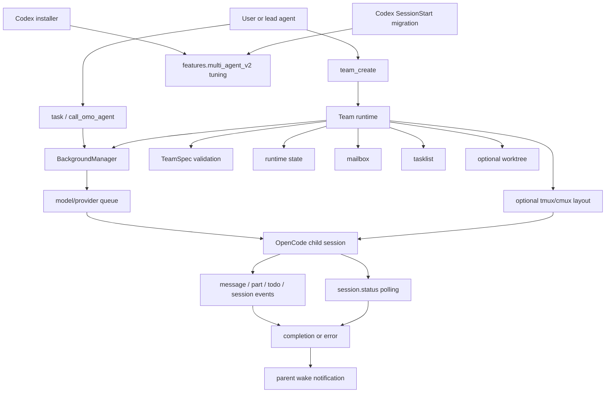

# Multi Agent System: oh-my-openagent 구현 해부

이 문서는 `oh-my-openagent`의 Multi Agent System을 구현 관점에서 읽기 위한 문서입니다. `docs/guide/team-mode.md`가 사용법에 가깝다면, 이 문서는 “어떤 runtime primitive들이 합쳐져 multi-agent처럼 보이는가”를 설명합니다.

핵심 결론은 단순합니다.

- OpenCode 쪽 multi-agent의 하부 엔진은 `BackgroundManager`입니다.
- Team Mode는 그 하부 엔진 위에 mailbox, tasklist, runtime state, optional worktree, optional tmux layout을 얹은 control plane입니다.
- `team-core`는 이 control plane의 harness-neutral primitive를 담고, `packages/omo-opencode/src/features/team-mode/`는 OpenCode adapter입니다.
- Codex Light 쪽은 같은 Team Mode runtime을 제공하지 않습니다. 현재는 installer와 session-start migration이 `multi_agent_v2` 설정을 보수적으로 관리합니다.
- tmux/cmux는 관찰성과 조작성을 위한 visual surface일 뿐, coordination의 source of truth가 아닙니다.

## 한 장으로 보기



## 개념 구분

| 개념 | 의미 | 대표 파일 |
|---|---|---|
| Background task | 한 parent session에서 별도 child session으로 실행되는 비동기 작업 | `packages/omo-opencode/src/features/background-agent/manager.ts` |
| Team run | 하나의 TeamSpec에서 생성된 실행 인스턴스 | `packages/team-core/src/team-state-store/store.ts` |
| Team member | team run 안에서 역할을 맡은 agent/category worker | `packages/team-core/src/types.ts` |
| Mailbox | member 간 비동기 메시지 전달 파일 큐 | `packages/team-core/src/team-mailbox/` |
| Tasklist | member가 claim/update하는 공유 작업 목록 | `packages/team-core/src/team-tasklist/` |
| Worktree | member별 선택적 작업 디렉터리 | `packages/team-core/src/team-worktree/` |
| Tmux layout | team/member session을 사람이 볼 수 있게 배치하는 optional visual surface | `packages/team-core/src/team-layout-tmux/`, `packages/tmux-core/src/` |
| Codex `multi_agent_v2` | Codex CLI의 자체 multi-agent feature gate | `packages/omo-codex/src/install/codex-multi-agent-v2-config.ts` |

## Background Agent Lifecycle

Background agent는 `task(...)`나 Team Mode member spawning의 실제 실행 엔진입니다. 상태 흐름은 아래처럼 읽으면 됩니다.

```text
LaunchInput
  -> pending task record
  -> per model/provider queue
  -> ConcurrencyManager.acquire()
  -> OpenCode session.create()
  -> promptAsync fire-and-forget
  -> event tracking + session.status polling
  -> completed / error / cancelled / interrupt
  -> parent wake notification
  -> cleanup + concurrency release
```

주요 구현:

- `BackgroundManager.launch()`는 agent 이름을 정리하고, spawn depth를 검사한 뒤 `pending` task를 만들고 queue에 넣습니다.
- `processKey()`는 concurrency key별 queue를 처리하고 `ConcurrencyManager.acquire()`를 통과한 작업만 시작합니다.
- `startTask()`는 parent session의 directory를 따라 child session을 만들고, prompt body와 tool restriction을 적용한 뒤 `promptAsync`를 호출합니다.
- `handleEvent()`는 `message.updated`, `message.part.updated`, `todo.updated`, `session.idle`, `session.error`를 받아 progress, fallback retry, circuit breaker, idle completion을 갱신합니다.
- `pollRunningTasks()`는 event만 믿지 않고 `session.status()`를 함께 확인해 idle, terminal, disappeared session을 처리합니다.
- `tryCompleteTask()`는 terminal 상태 전환, attempt finalize, task history, toast cleanup, concurrency release, child session abort, parent wake enqueue를 한 번에 수행합니다.

중요한 설계 포인트:

- completion은 단순 idle event 하나로 결정하지 않습니다. output 존재, todo 완료 여부, terminal status, session disappearance threshold를 함께 봅니다.
- parent wake는 child task가 끝난 결과를 parent session에 다시 주입하는 경로입니다. child가 끝났는데 parent가 결과를 못 받는 race를 막기 위해 notification preparation reservation을 둡니다.
- concurrency key는 model config가 있으면 `providerID/modelID`이고, 없으면 agent 이름입니다. config는 model 단위, provider 단위, default 단위 limit을 지원합니다.
- fallback retry는 provider/model 오류를 새 attempt로 승격합니다. Team Mode task는 fallback session도 team membership을 보존해야 하므로 `onSessionCreated` callback이 없으면 fallback을 거부합니다.

## Team Mode Lifecycle

Team Mode는 background task 여러 개를 그냥 띄우는 기능이 아닙니다. team run을 만들고, 그 run 안에서 member identity, mailbox, task ownership, runtime bounds, optional worktree, optional tmux layout을 관리합니다.

```text
team_create
  -> named or inline TeamSpec load
  -> member eligibility validation
  -> runtime/{teamRunId}/state.json created as creating
  -> member inbox dirs created
  -> members spawned through BackgroundManager.launch()
  -> sessionID registered into team-session-registry
  -> optional tmux layout activated
  -> runtime state becomes active
  -> lead/member communicate through mailbox and tasklist
  -> shutdown request / approve / reject
  -> team_delete cleanup
```

주요 구현:

- `createTeamCreateTool()`는 named team spec 또는 inline spec을 받아 `createTeamRun()`으로 넘깁니다.
- `TeamSpecSchema`는 `category` member와 `subagent_type` member를 분리하고, member 수를 1-8로 제한합니다.
- `AGENT_ELIGIBILITY_REGISTRY`는 `sisyphus`, `atlas`, `sisyphus-junior`를 eligible로 두고, read-only/planner 계열 agent를 hard-reject합니다.
- `createTeamRun()`은 `runtime state`를 만든 뒤 `max_parallel_members`만큼 member spawn을 병렬 진행합니다.
- 각 member spawn은 `BackgroundManager.launch()`를 사용합니다. `onSessionCreated`에서 `teamRunId`, member name, role을 `team-session-registry`에 즉시 등록합니다.
- `activateTeamLayout()`은 `tmux_visualization`이 켜진 경우에만 layout을 만들고, 실패하더라도 team 생성의 source of truth를 깨지 않습니다.

Team Mode가 일반 background task와 다른 점:

- 단일 parent-child 관계가 아니라 `teamRunId` 중심의 durable state가 있습니다.
- 결과 전달은 parent wake 하나가 아니라 mailbox와 tasklist를 함께 사용합니다.
- team member는 shared state를 써야 하므로 read-only agent가 member가 될 수 없습니다.
- nested team은 금지됩니다. member가 다시 `team_create`를 호출하면 coordination graph가 통제 불가능해지기 때문입니다.

## Core Primitives

### Runtime State

`team-core`의 runtime state는 `~/.omo/runtime/{teamRunId}/state.json`에 저장됩니다. 상태는 `creating`, `active`, `shutdown_requested`, `deleting`, `deleted`, `failed`, `orphaned`로 제한됩니다.

`transitionRuntimeState()`는 `state.lock`을 잡고, 현재 state를 읽고, 허용된 전이인지 확인한 뒤 atomic write를 수행합니다. `deleted`와 `failed` run은 active list를 조회할 때 정리되고, 오래된 `deleting` run도 stale cleanup 대상입니다.

### Mailbox

Mailbox는 recipient별 inbox directory에 JSON message를 기록합니다. 중요한 규칙은 다음과 같습니다.

- broadcast는 lead만 할 수 있습니다.
- message body는 `message_payload_max_bytes`로 제한됩니다.
- recipient unread total은 `recipient_unread_max_bytes`로 제한됩니다.
- live delivery 중인 message는 `.delivering-{uuid}.json`으로 예약됩니다.
- delivery 성공 시 `processed/`로 commit되고, 실패 시 원래 unread file로 release됩니다.
- stale reservation은 reclaim되어 message loss보다 duplicate-safe retry를 선택합니다.

이 설계는 “메시지를 보냈다”와 “recipient context에 실제로 주입되었다”를 분리합니다.

### Tasklist

Task status는 `pending`, `claimed`, `in_progress`, `completed`, `deleted`입니다. Claim은 task별 lock을 사용하며, dependency가 완료되지 않은 task는 claim할 수 없습니다.

허용 전이는 forward-only입니다.

```text
pending -> claimed -> in_progress -> completed -> deleted
pending -> deleted
claimed -> deleted
in_progress -> deleted
```

Owner가 아닌 member의 cross-owner update는 거부됩니다. 이 때문에 tasklist는 단순 todo file이 아니라 ownership protocol입니다.

### Worktree

member는 선택적으로 `worktreePath`를 가질 수 있습니다. Team Mode는 member별 작업 디렉터리를 만들고 runtime state에 보존합니다. 이는 여러 agent가 같은 checkout에서 충돌하는 문제를 줄이기 위한 선택지입니다.

### Tmux / Cmux

tmux는 execution authority가 아닙니다. 실행 권한과 상태는 background manager와 team runtime에 있고, tmux/cmux는 사람이 session을 볼 수 있게 해주는 surface입니다.

`tmux-core`는 다음 조건을 모두 만족할 때만 pane을 만듭니다.

- config가 enabled
- 현재 프로세스가 tmux 안에 있음
- OpenCode server가 살아 있음
- tmux binary 또는 cmux compat path를 찾음

cmux 환경은 `CMUX_SOCKET_PATH` 또는 `TMUX` 값에서 감지하고, tmux 명령을 `cmux __tmux-compat` 계열로 우회합니다.

## Codex Light와 Multi Agent

Codex Light edition은 OpenCode Team Mode와 같은 multi-agent control plane을 싣고 있지 않습니다. 대신 Codex CLI의 자체 `multi_agent_v2` 설정을 조심스럽게 다룹니다.

두 경로를 구분해야 합니다.

1. `ensureCodexMultiAgentV2Config()`는 installer 단계에서 `[features.multi_agent_v2]`의 `max_concurrent_threads_per_session = 10000`만 설정합니다. `enabled = true`를 강제하지 않습니다.
2. `multi-agent-v2-guard.mjs`는 Codex SessionStart config migration에서 `[features.multi_agent_v2] enabled = false`를 강제합니다. 현재 Codex `multi_agent_v2`가 특정 model/provider 조합에서 encrypted tool parameter 오류를 내기 때문입니다.

따라서 현재 이 프로젝트에서 “multi-agent system”을 이해할 때는 OpenCode Team Mode와 Codex `multi_agent_v2`를 같은 기능으로 보지 않는 것이 중요합니다.

- OpenCode Team Mode: 이 repo가 구현한 mailbox/task/state 기반 coordination runtime입니다.
- Codex `multi_agent_v2`: Codex runtime 자체 기능이며, 이 repo는 현재 안정성을 위해 비활성화 guard를 둡니다.
- Codex Light: hooks, rules, LSP, ultrawork, telemetry 같은 component runtime을 제공하지만 OpenCode Team Mode를 그대로 제공하지 않습니다.

## 수정 위치 가이드

| 바꾸려는 것 | 먼저 볼 곳 | 주의점 |
|---|---|---|
| background task launch/queue | `packages/omo-opencode/src/features/background-agent/manager.ts` | spawn depth, parent wake, concurrency release를 함께 봐야 함 |
| child session prompt construction | `packages/omo-opencode/src/features/background-agent/spawner.ts` | team task인지 여부에 따라 team tool denylist가 달라짐 |
| concurrency policy | `packages/omo-opencode/src/features/background-agent/concurrency.ts` | model/provider/default limit 우선순위를 보존해야 함 |
| completion detection | `manager.ts`, `task-poller.ts`, `session-idle-event-handler.ts` | idle event 하나만 믿으면 premature completion 위험 |
| fallback retry | `fallback-retry-handler.ts`, `attempt-lifecycle.ts` | teamRunId가 있으면 session registry 보존이 필수 |
| TeamSpec validation | `packages/team-core/src/types.ts`, `team-registry/validator.ts` | hard-reject agent는 parse 단계에서 막아야 함 |
| team creation | `packages/omo-opencode/src/features/team-mode/team-runtime/create.ts` | sessionID 등록 race를 피해야 함 |
| mailbox protocol | `packages/team-core/src/team-mailbox/` | reservation, ack, backpressure를 함께 봐야 함 |
| task ownership | `packages/team-core/src/team-tasklist/` | claim lock과 forward-only transition을 유지해야 함 |
| runtime state | `packages/team-core/src/team-state-store/` | atomic write와 allowed transition을 우회하면 안 됨 |
| tmux layout | `packages/team-core/src/team-layout-tmux/`, `packages/tmux-core/src/` | tmux 실패가 team 생성 실패가 되면 안 됨 |
| Codex multi-agent config | `packages/omo-codex/src/install/codex-multi-agent-v2-config.ts`, `packages/omo-codex/plugin/scripts/migrate-codex-config/multi-agent-v2-guard.mjs` | tuning과 enable/disable guard를 분리해서 봐야 함 |

## 실패 모드와 방어선

| 실패 모드 | 방어선 |
|---|---|
| child session은 생겼지만 team member lookup이 안 됨 | `team-session-registry`에 sessionID를 즉시 등록 |
| child task가 끝났는데 parent가 결과를 못 받음 | parent wake reservation과 pending wake tracking |
| idle event가 너무 빨리 와서 작업이 끝난 것으로 오판 | output validation, todo check, polling fallback |
| provider/model 오류로 child session이 실패 | fallback retry와 attempt lifecycle |
| member가 같은 task를 동시에 claim | task별 file lock과 stale lock reaping |
| message가 delivery 중 crash로 사라짐 | `.delivering-*` reservation release/reclaim |
| team state가 깨지거나 역전이됨 | Zod schema parse와 allowed transition check |
| tmux/cmux visual surface 실패 | non-blocking optional layout 처리 |
| Codex `multi_agent_v2`가 provider와 맞지 않음 | installer는 enable하지 않고, SessionStart guard는 disable |

## 이 프로젝트에서 가져갈 수 있는 패턴

### Prompt orchestration만으로 multi-agent를 만들지 않기

여러 agent에게 일을 나눠주는 prompt는 시작점일 뿐입니다. 오래 실행되는 multi-agent system에는 queue, state, ownership, mailbox, cancellation, retry, cleanup이 필요합니다.

### Execution engine과 coordination layer 분리

Background agent는 “작업을 실행한다”에 집중하고, Team Mode는 “작업자들이 함께 일한다”에 집중합니다. 이 분리는 다른 harness로 옮길 때도 유효합니다.

### Durable file state를 protocol처럼 다루기

Mailbox와 tasklist는 파일이지만, 단순 저장소가 아닙니다. message reservation, task claim, allowed transition, lock owner 같은 protocol rule이 붙어 있습니다.

### Visual surface를 source of truth로 만들지 않기

tmux/cmux는 관찰성에 매우 유용하지만 coordination state의 원천이 아닙니다. 이 원칙 덕분에 tmux가 없어도 Team Mode 자체는 실행될 수 있습니다.

### Runtime capability를 config flag와 분리하기

Codex `multi_agent_v2` 사례처럼 feature flag를 켠다고 provider/model/runtime이 준비되는 것은 아닙니다. installer, model catalog, runtime guard를 분리해야 장애 범위가 작아집니다.

## 읽는 순서

처음 읽는다면 아래 순서가 가장 효율적입니다.

1. `docs/guide/orchestration.md`
2. `docs/guide/team-mode.md`
3. `packages/omo-opencode/src/features/background-agent/AGENTS.md`
4. `packages/omo-opencode/src/features/team-mode/AGENTS.md`
5. `packages/team-core/AGENTS.md`
6. `packages/omo-opencode/src/features/background-agent/manager.ts`
7. `packages/omo-opencode/src/features/team-mode/team-runtime/create.ts`
8. `packages/team-core/src/types.ts`
9. `packages/team-core/src/team-mailbox/`
10. `packages/team-core/src/team-tasklist/`
11. `packages/team-core/src/team-state-store/`
12. `packages/omo-codex/plugin/scripts/migrate-codex-config/multi-agent-v2-guard.mjs`
