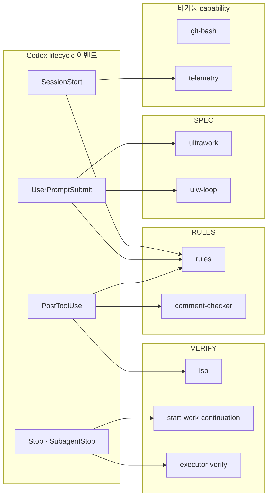

# 나만의 하네스로 축소 이식하기 — Spec·Rules·Verify만 남기기

oh-my-openagent를 통째로 베끼지 않고, 중요한 것만 뽑아서 내 하네스로 옮기는 법

## 3. LazyCodex — 저자가 실제로 한 축소 이식 (Ultimate → Light)

명제를 말로 주장할 필요가 없다. 이 프로젝트는 같은 저장소 안에서 **강제 축소를 실제로 수행**했다. Ultimate Edition(OpenCode용)을 Codex CLI용 **Light Edition**(`packages/omo-codex/`, 배포명 `lazycodex`)으로 옮길 때, Codex의 플러그인 표면은 lifecycle hook + skill + plugin-scoped MCP뿐이라 OpenCode의 메인 루프 주입 평면(`session.prompt`/`promptAsync`)에 의존하던 기능은 구조적으로 이식 불가였다. `ROADMAP.md`는 그 주입 평면을 "the disease"라 부른다.

그래서 축소는 취향이 아니라 **제약 주도**였다. 무엇이 살아남았는지가 곧 "무엇이 본질인가"에 대한 저자의 답이다.

### 경량화 판단 기준 — 표현 계층(hierarchy of expression)

무엇을 남길지는 취향이 아니라 **판단 함수**로 결정됐다. 그 함수가 `ROADMAP.md`의 표현 계층이다.

```text
// part7_opensource/oh-my-openagent/ROADMAP.md:57-64
The hierarchy of expression is:
1. Skill (static knowledge, zero runtime cost)
2. MCP   (external tool with process boundary)
3. Tool  (first-party runtime capability)
4. Hook  (injection into the agent loop itself)
This order is not dogma. ... Agent performance is the only metric.
```

이 사다리를 위에서 아래로 읽으면 곧 **이식성 순서**다. 1·2단(Skill·MCP)은 명시적으로 호스트 비의존(Skill=마크다운 zero-runtime, MCP=stdio 프로세스 경계, `ROADMAP.md:32-33`), 3단(Tool)은 first-party, 4단의 괄호 "injection into the agent loop itself"가 바로 **이식되지 않는 능력**이다. 판단 함수를 한 줄로: *"이 기능을 새 호스트에서 Skill, MCP, 혹은 호스트 자체 lifecycle hook 중 하나로 다시 표현할 수 있는가?"* — 가능하면 남기고, 호스트 메인 루프에 내부 프롬프트를 주입해야만 살 수 있으면 버린다.

버리는 경계에는 이름이 붙어 있다 — **the disease**.

```text
// part7_opensource/oh-my-openagent/ROADMAP.md:82-88
session.prompt / session.promptAsync ... returns before the prompt is durably accepted.
... Multiple hooks ... inject the same internal message into a live parent session.
Duplicate work. Infinite loops. State corruption.
... Any plugin system that exposes the main loop to arbitrary injection has the same disease.
```

OpenCode는 플러그인이 `session.prompt`/`promptAsync`로 메인 세션에 내부 메시지를 주입할 수 있고, 이 주입 평면이 Team Mode·background agent·recovery continuation을 떠받친다. Codex 플러그인 표면에는 그 평면이 없다. 그래서 **그 평면에 의존하던 기능은 구조적으로 이식 불가** → 드롭되거나 Spec·Rules·Verify 패턴으로만 축소 생존한다.

이 축소가 가능한 구조적 전제는 **레이어 DAG**다(`ROADMAP.md:29-38, 49`). Core(순수 TS, 호스트 무의존) → MCP(stdio) → Skills(마크다운) → **Adapters(OpenCode 플러그인 / Codex Light)**, 의존은 아래로만 흐르고 "Adapters에는 아무도 의존하지 않는다". LazyCodex는 Adapter 한 장이라 **이미 Core/MCP/Skills에 들어 있는 호스트-중립 로직만 다시 export**할 수 있다. OpenCode 어댑터의 루프-주입 배선 안에만 사는 코드는 얇은 어댑터가 감쌀 수조차 없어 자동으로 탈락한다.

### 살아남은 컴포넌트 → 기둥 매핑

| 컴포넌트 | 무엇을 하나 | 기둥 |
|----------|-------------|------|
| `ultrawork` | `ultrawork`/`ulw` 키워드 감지 후 작업 계약 directive 주입(Goal + 3+ QA 시나리오) | **Spec** |
| `ulw-loop` | 목표·성공기준·증거를 repo 파일로 영속, 게이트 통과 전 완료 거부 | **Spec + Verify** |
| `rules` | `.omo/rules` 등 규칙 파일을 컨텍스트로 주입 | **Rules** |
| `comment-checker` | 편집 시점에 AI-slop 주석 차단(코드 스타일 규칙 강제) | **Rules / Verify** |
| `start-work-continuation` | 계획 체크박스가 남으면 Stop을 차단해 조기 종료 방지 | **Verify** |
| `lsp` | 편집 후 진단을 실제 언어 서버로 재확인 | **Verify** |
| `git-bash` | 셸 경로를 git_bash MCP로 유도(특히 Windows) | 비(非)기둥 · 환경 |
| `telemetry` | 일 1회 익명 활성 설치 집계, 대화엔 아무것도 주입 안 함 | 비기둥 · 관측 |

> 정직함이 설득력을 만든다: 8개 중 6개는 세 기둥으로 깔끔히 매핑되고, `git-bash`·`telemetry` 2개는 "싸고 이식이 쉬워서" 남은 잡일(capability)이다. 모든 항목을 억지로 기둥에 끼워 맞추지 않는 게 핵심 교훈이다.

### 버린 것 — 그리고 그 이유 (출처 포함)

| 버린 것 | 이유 | 출처 |
|---------|------|------|
| Agent orchestration / 11 persona | Codex CLI가 자체 에이전트 모델을 가짐 | `README.md:117` |
| Team Mode / `team_*` 도구 | OpenCode 호스트 런타임 의존, Ultimate에서도 기본 off | `README.md:117`, `ANALYSIS.md:168` |
| LSP 외 built-in MCP | OAuth/PKCE·per-session 격리는 Codex 매니페스트 밖 | 루트 `AGENTS.md` |
| Hashline 편집 도구 | OpenCode Read/Edit 도구쌍에 결합, 교체 불가 | 루트 `AGENTS.md` |
| Background Agent / 주입 평면 | `session.promptAsync` = "the disease" | `ROADMAP.md` |
| IntentGate 4 modes | 이식된 런타임이 있는 `ultrawork`만 인식 | `README.md:218` |

### 와이어링 — lifecycle 이벤트에 묶인 프로그램

핵심은 단순하다. "hook"이란 lifecycle 이벤트에 묶인 **한 줄짜리 명령 실행**이다. 프레임워크가 없다.

```jsonc
// part7_opensource/oh-my-openagent/packages/omo-codex/plugin/hooks/hooks.json (발췌)
"UserPromptSubmit": [
  { "hooks": [{ "type": "command",
      "command": "node \"${PLUGIN_ROOT}/components/rules/dist/cli.js\" hook user-prompt-submit" }] },     // RULES
  { "hooks": [{ "type": "command",
      "command": "node \"${PLUGIN_ROOT}/components/ultrawork/dist/cli.js\" hook user-prompt-submit" }] }, // SPEC
],
"PostToolUse": [
  { "matcher": "^(apply_patch|write|edit|multiedit|...)$", "hooks": [
      { "command": "...comment-checker/dist/cli.js hook post-tool-use", "timeout": 30 },   // VERIFY
      { "command": "...lsp/dist/cli.js hook post-tool-use",            "timeout": 60 } ] }, // VERIFY
],
"Stop":         [ { "hooks": [{ "command": "...start-work-continuation/dist/cli.js hook stop" }] } ],          // VERIFY
"SubagentStop": [ { "hooks": [{ "command": "...lazycodex-executor-verify/dist/cli.js hook subagent-stop" }] } ] // VERIFY
```

이 한 파일에서 두 가지가 드러난다. 첫째, 세 기둥이 각각 어느 lifecycle 시점에 붙는지가 데이터로 선언돼 있다. 둘째, **Verify는 한 군데가 아니라 lifecycle 곳곳**에 있다 — 편집 직후(`PostToolUse`: comment-checker·lsp), 멈추려 할 때(`Stop`), 서브에이전트 종료 시(`SubagentStop`: executor-verify). 검증은 단일 게이트가 아니라 여러 지점의 그물이다.

### LazyCodex 한눈에 — 이벤트 → 컴포넌트 → 기둥



### 컴포넌트별 축소 스토리 — 무거운 Ultimate에서 얇은 Codex로

같은 일을 더 가벼운 형태로 다시 표현한 4가지 대표 사례다.

| 컴포넌트 | Ultimate (무거움) | Light (가벼움) | 축소 레시피 |
|---|---|---|---|
| `ultrawork` | IntentGate 분류기(ultrawork·search·analyze·team) + prompts-core 로더 | 정규식 `/(?:ultrawork\|ulw)/i` 한 번 + 정적 `directive.md` 주입 | 로직을 코드에서 파일로 이동 |
| `rules` | rules-injector tool-guard hook 안에서 엔진 구동 | **동일 엔진**(`@oh-my-opencode/rules-engine`)에 Codex I/O만 주입 | 엔진 재구현 0줄, 어댑터만 |
| `comment-checker` | `tool.execute.after` 네이티브 페이로드 | Codex `PostToolUse` + `apply_patch` 정규화 | 같은 core, 이벤트명 + 정규화 shim |
| `lsp` | 3-tier · 5 built-in MCP 시스템 | MCP 1개(tool 7종) + 편집후 hook 1개, vendored daemon에 위임 | 다중 MCP를 단일 stdio 경계로 |

`ultrawork`가 극단적 예다 — OpenCode의 분류기 전체가 정규식 한 줄 + 364줄/약 1.9만 자짜리 `directive.md`(additionalContext로 주입)로 줄었다. "런타임 코드"가 "정적 파일"이 된 것이다.

### 컴포넌트 해부 — 얇은 어댑터 + 호스트-중립 core

11개 컴포넌트(공개 8 + 내부 `bootstrap`·`codegraph`·`lazycodex-executor-verify`)는 전부 같은 골격이다: **워크스페이스로 격리된 npm 패키지이고, `dist/cli.js`가 stdin으로 Codex 이벤트 JSON을 받아 argv로 디스패치한 뒤 stdout으로 Codex hook-JSON을 쓰며, 잘못된 입력에는 exit 0으로 턴을 절대 막지 않는다.**

```ts
// .../packages/omo-codex/plugin/components/ultrawork/src/cli.ts:16-24 — 모든 Light 컴포넌트의 공통 본체
async function runHookCli(): Promise<void> {
	const raw = await readStdin();
	if (raw.trim().length === 0) return;            // 빈/깨진 입력 → 그대로 exit 0
	const parsed = parseHookInput(raw);
	const output = runUserPromptSubmitHook(parsed); // 순수 함수 1개
	if (output.length > 0) processStdout.write(output);
}
```

무거운 로직은 컴포넌트가 아니라 공유 `packages/*-core`(rules-engine·comment-checker-core·telemetry-core·boulder-state·utils)나 vendored MCP(lsp-daemon)에 있고, **그 core를 두 에디션이 함께 쓴다**. 컴포넌트는 Codex 페이로드 검증·정규화 수백 줄짜리 글루일 뿐이다.

```jsonc
// .../components/ultrawork/package.json — 의존성 위생
"dependencies": {}   // 런타임 prod 의존성 0 (rules=picomatch 1개, lsp=vendored lsp-daemon 1개,
                     // comment-checker=optional 바이너리; core는 전부 file: devDependency로 빌드타임 번들)
```

축소 레시피는 항상 같은 3단계다. ① 호스트-중립 core 엔진은 그대로 둔다. ② OpenCode의 풍부한 plugin 객체(IntentGate / tool.execute.after / 다중 MCP)는 버린다. ③ **Codex 이벤트 1개 + (오케스트레이션이면) 정적 `directive.md` 1개**에 다시 묶는다. `rules`가 가장 깨끗한 예다 — `rules-engine-factory.ts`가 OpenCode와 **같은** `createEngine`을 import하고 Codex용 `readFile`·`pluginRoot`만 주입한다. Codex를 위해 엔진 로직을 재구현한 줄은 0이다.

### 설치 풋프린트 — 설치가 곧 런타임 계약

Light는 호스트 프로세스 안에서 조립되지 않고 디스크에 떨어진다. `npx lazycodex-ai install`이 만드는 것:

- `~/.codex/plugins/cache/sisyphuslabs/omo/<version>/` — 플러그인 캐시(컴포넌트 dist)
- `~/.codex/.tmp/marketplaces/sisyphuslabs/plugins/omo/` — 로컬 마켓플레이스 스냅샷
- `~/.codex/agents/` — 번들 agent TOML 10개 복사
- `~/.codex/config.toml` — `omo@sisyphuslabs` 활성화 블록
- `~/.local/bin` — 컴포넌트 CLI 링크
- Windows: Git Bash preflight(`winget install --id Git.Git`)

런타임은 **Node**다(Bun 아님). 모든 hook이 `node "${PLUGIN_ROOT}/.../cli.js"`로 실행되고, 플러그인 번들은 `npm@11.12.1` + `node --test`를 쓴다. 그래서 Bun 없이 `npx`만으로 설치된다. 설치 산출물의 재현성이 곧 런타임 계약이므로, installer는 단순 파일 복사가 아니라 runtime graph를 구성하는 단계다.

### 무게 비교 — Ultimate vs Light (출처·불일치 명시)

| 차원 | Ultimate (OpenCode) | Light (Codex / lazycodex) | 출처 |
|---|---|---|---|
| 에이전트 | 11개 | 0 오케스트레이션 (단 ultrawork가 agent TOML 10개 번들) | `AGENTS.md:59` / omo-codex `AGENTS.md:43-45` |
| Lifecycle | 53–60 in-process hook(5-tier) | 7 Codex 이벤트 · `hooks.json`에 명령 19개 | `AGENTS.md:59` / `hooks.json` |
| 도구 | 20–39 config-gated(기본 18) | 자체 tool registry 없음, team_* 0, hashline 0 | `AGENTS.md` TOOL CATALOG / `README.md:117` |
| Built-in MCP | 5개(HTTP 3 + lsp·codegraph) | 문서상 "LSP-only", 실제 plugin `.mcp.json`은 5개 | `AGENTS.md:80` / plugin `.mcp.json` |
| 편집 도구 | Hashline LINE#ID | 없음(네이티브 apply_patch + 편집후 comment-checker) | `README.md:116-117` |
| 멀티에이전트 | Team Mode +12 team_*(기본 off) | 없음 | `AGENTS.md` / `README.md:117` |
| 런타임 | Bun 전용(1.3.12) | Node(`npm@11.12.1`) | `AGENTS.md` CONVENTIONS / `hooks.json` |
| 설치 | `bunx oh-my-openagent install` | `npx lazycodex-ai install` | `README.md:125-129` |

> 정직한 doc-vs-disk 주석(발표 시 함께 말할 것): 문서는 "8 컴포넌트"지만 디스크엔 11개 워크스페이스(+bootstrap·codegraph·lazycodex-executor-verify); 문서는 "LSP-only built-in MCP"지만 published plugin `.mcp.json`은 5개(`codegraph`는 `required:false`, `git_bash`는 Windows 기본); 문서는 "0 agents"지만 ultrawork가 agent TOML 10개를 `~/.codex/agents/`로 깐다. Light를 "의존성 0"이라 말하면 안 된다(picomatch·lsp-daemon 2개 + Node 필요).

---

## 4. 기둥 ① Spec — 디스크 위의 명세

흔한 오해는 "스펙은 프롬프트에 적는 것"이다. omo의 진짜 스펙은 프롬프트가 아니라 **`.omo/ulw-loop/` 안의 세 파일**이다. 그래서 compaction·재시작·새 세션을 견딘다.

```ts
// part7_opensource/oh-my-openagent/packages/omo-codex/plugin/components/ulw-loop/src/constants.ts:1-13
export const ULW_LOOP_DIR = ".omo/ulw-loop";
export const ULW_LOOP_BRIEF = "brief.md";    // 원문 의도
export const ULW_LOOP_GOALS = "goals.json";  // 구조화된 스펙
export const ULW_LOOP_LEDGER = "ledger.jsonl"; // append-only 증거 감사 로그

export type UlwLoopStatus =
	| "pending" | "in_progress" | "complete"
	| "failed" | "blocked" | "review_blocked" | "needs_user_decision";
```

스펙의 최소 단위는 `goal`이고, 그 안의 `successCriteria`가 TODO 리스트와 스펙을 가르는 분기점이다.

```ts
// part7_opensource/oh-my-openagent/packages/omo-codex/plugin/components/ulw-loop/src/domain-types.ts:12-22
export interface UlwLoopSuccessCriterion {
	readonly id: string;
	readonly scenario: string;
	readonly userModel: UlwLoopSuccessCriterionUserModel; // happy | edge | regression | adversarial
	readonly expectedEvidence: string;   // 무슨 증거를 찾아야 하나
	readonly essential?: boolean;
	capturedEvidence: string | null;     // 실제로 기록된 증거
	status: UlwLoopCriterionStatus;       // pending | pass | fail | blocked
	capturedAt?: string;
}
```

`expectedEvidence`(찾을 증거)와 `capturedEvidence`(기록된 증거)의 쌍이 핵심이다. `capturedEvidence`가 채워지기 전엔 `status`가 `pass`가 될 수 없다. 그리고 "완료"는 분위기가 아니라 **예외를 던지는 게이트**다.

```ts
// part7_opensource/oh-my-openagent/packages/omo-codex/plugin/components/ulw-loop/src/evidence.ts:189-197
export function requireAllCriteriaPass(goal: UlwLoopItem): void {
	if (hasAllCriteriaPass(goal)) return;
	throw new UlwLoopError(`Goal ${goal.id} has unresolved success criteria.`,
		"ulw_loop_criteria_not_all_pass", {
		details: { goalId: goal.id,
			unresolved: unresolvedCriteriaOf(goal).map((c) => ({ id: c.id, status: c.status })) },
	});
}
```

**최소 핵심.** 디렉터리 하나 + 3파일 + 4연산이면 된다. (1) `create(brief)`: 자유 텍스트를 bullet로 쪼개 목표로 만들고 happy/edge/regression 3종 기준을 자동 시드. (2) `startNext()`: 다음 pending 목표를 in_progress로. (3) `recordEvidence()`: 빈 증거면 거부, 채워지면 `status=pass`. (4) `requireAllPass()`: 모든 기준이 pass일 때만 완료 허용. 영속 장치는 atomic temp-write+rename과 append-only JSONL이면 충분하다. **버릴 것:** `aggregate`/`per_story` 모드, steering 서브시스템, heavyweight `UlwLoopQualityGate`, session-id 스코핑, multi-agent 위임.

---

## 5. 기둥 ② Rules — 잘 알려진 위치의 마크다운

거버넌스 표면 전체가 **선언적 테이블 하나**다. DB도, 매직도 없다. "규칙은 어디서 오는가"는 프로젝트 루트로 올라간 뒤 정해진 디렉터리를 읽는 것뿐이다.

```ts
// part7_opensource/oh-my-openagent/packages/rules-engine/src/engine/constants.ts:21-31, 56-67
export const PROJECT_RULE_SUBDIRS: ReadonlyArray<readonly [string, string]> = [
	[".omo", "rules"], [".claude", "rules"], [".cursor", "rules"], [".github", "instructions"],
];
export const PROJECT_SINGLE_FILES: readonly string[] = [".github/copilot-instructions.md", "CONTEXT.md"];
export const RULE_FILE_EXTENSIONS: readonly string[] = [".md", ".mdc"];

// 우선순위도 코드가 아니라 데이터: 프로젝트 > 개인(~/) > 번들 기본값
export const SOURCE_PRIORITY: ReadonlyMap<RuleSource, number> = new Map([
	[".omo/rules", 0], [".claude/rules", 1], [".cursor/rules", 2], [".github/instructions", 3],
	["~/.omo/rules", 100], ["~/.claude/rules", 102], ["plugin-bundled", 200],
]);
```

규칙 적용 시점(언제 주입할지)은 단 한 함수로 결정된다. `alwaysApply`면 매 세션 정적 주입, `globs`면 해당 파일을 건드릴 때만 동적 주입이다. 후자가 컨텍스트 예산을 아끼는 just-in-time 주입의 핵심이다.

```ts
// part7_opensource/oh-my-openagent/packages/rules-engine/src/engine/matcher.ts:29-61
export function matchRule(input: MatcherInput): MatchResult {
	if (input.isSingleFile) return { matched: true, reason: "single-file" };
	if (input.frontmatter.alwaysApply === true) return { matched: true, reason: "alwaysApply" };

	const patterns = normalizeGlobs(input.frontmatter);
	if (patterns.length === 0) return noMatch();

	const pathBases = normalizedPathBases(input.pathBases);
	const { positivePatterns, negativeMatchers } = compiledPatternSetFor(patterns);
	for (const { pattern, isMatch } of positivePatterns) {
		for (const pathBase of pathBases) {
			if (!isMatch(pathBase)) continue;
			if (isExcluded(pathBase, negativeMatchers)) return noMatch(); // ! 부정 패턴 존중
			return { matched: true, reason: { kind: "glob", pattern } };
		}
	}
	return noMatch();
}
```

같은 엔진(`packages/rules-engine`)이 OpenCode hook과 Codex CLI hook 양쪽을 구동한다. 엔진은 `readFile`·`findProjectRoot`를 주입받는 순수 함수라 OpenCode/Codex import이 전혀 없다. 어댑터(hook)만 호스트별로 얇게 다르다 — **harness-neutral core + thin adapter**가 이식성의 정석이다.

**최소 핵심.** `[.omo/rules, .claude/rules]` 같은 allowlist 디렉터리를 스캔 → `---` frontmatter에서 `alwaysApply`·`globs`만 읽기 → picomatch 매칭 → `## Project Instructions` 마크다운으로 합쳐 주입. 세션 시작 시 정적 주입, tool이 파일을 건드릴 때 동적 주입, 세션당 주입된 경로를 `Set`으로 추적해 한 번만 주입. **버릴 것:** post-compact 복구, 다층 캐시(parsed/match/scan/finder), 4종 char-budget 프로파일, locking·fingerprinting, plugin-bundled 티어와 source allowlist switch.

---

## 6. 기둥 ③ Verify — 관측된 상태에서 진실을 재도출

Verify의 한 원칙: **에이전트의 말을 믿지 않고, 독립적 검사가 실제 상태에서 다시 계산한다.** 신선한 해시, 프로세스 종료 코드, LSP 진단, "hook이 실제로 발화했다"는 알림 — 전부 모델이 아니라 관측에서 나온다.

### 패턴 A — exit-code 게이트 (fail-OPEN)

판정을 종료 코드라는 위조 불가·언어 무관 계약으로 환원한다. 핵심은 인프라 오류(타임아웃·바이너리 없음)엔 **열어 두고**(fail-open), 진짜 부정 판정엔 닫는다는 점이다. 게이트가 에이전트를 벽돌로 만들면 안 되기 때문이다.

```ts
// part7_opensource/oh-my-openagent/packages/comment-checker-core/src/runner.ts:95-109
const race = await Promise.race([completed, timeoutPromise] as const)
if (race === "timeout") {
  return EMPTY_RESULT          // 타임아웃 = 통과 (fail-OPEN)
}
const [_stdout, stderr, exitCode] = race
if (exitCode === 0) {
  return EMPTY_RESULT          // 0 = 통과
}
if (exitCode === 2) {
  return { hasComments: true, message: normalizeMessage(stderr) } // 2 = 차단, 이유는 stderr
}
return EMPTY_RESULT            // 그 외 = 통과 (fail-OPEN)
```

### 패턴 B — 검증 가능한 편집 (fail-CLOSED)

읽은 각 줄에 내용 해시를 태깅해 두고, 쓰기 직전에 현재 파일에서 그 해시를 재계산한다. 다르면 "읽은 뒤 파일이 바뀌었다"는 뜻이므로 편집을 **거절**한다. read-then-stale-write 경쟁이 구조적으로 불가능해진다.

```ts
// part7_opensource/oh-my-openagent/packages/hashline-core/src/validation.ts:76-79
const content = lines[line - 1]
if (!isCompatibleLineHash(line, content, hash)) {
  throw new HashlineMismatchError([{ line, expected: hash }], lines)
}
```

좋은 게이트의 거절은 **건설적**이다. 그냥 "안 돼"가 아니라, 갓 계산한 올바른 해시를 `>>>` 표시와 함께 돌려줘 에이전트가 즉시 재시도하게 한다(거절 + 수리 지침을 한 메시지에).

```text
// HashlineMismatchError.formatMessage 출력 형태 (validation.ts:112-129)
1 line has changed since last read. Use updated {line_number}#{hash_id} references below (>>> marks changed lines).

>>> 22#XJ|   return "world";
```

두 패턴의 대조가 Verify 설계의 핵심 교훈이다 — **언제 열고(인프라 오류) 언제 닫나(진짜 위반).** 여기에 `comment-checker`는 "새로 생긴 주석에만, 세션당 30초에 한 번" 같은 anti-deadloop 가드를 둬 에이전트가 무한 핑퐁에 빠지지 않게 한다.

### 패턴 C — 사람용 증거 규율

자동 게이트와 같은 자세를 사람(에이전트)에게도 적용한다. `CLAUDE.md`의 "QA IS MANDATORY"는 타입체크·녹색 유닛테스트를 **명시적으로 검증이 아니라고** 못 박는다. 실제 하네스를 격리 환경에서 구동하고, hook이 실제로 발화했음을 증명하고, 캡처한 산출물을 `.omo/evidence/<날짜>-<슬러그>/`에 남긴다 — "증거 파일이 없으면 QA는 일어나지 않은 것."

**최소 핵심.** `PostToolUse` hook 하나(도구 실패 시 skip) + 라인 해시 검증기(불일치 시 교정 해시와 함께 throw) + 종료 코드가 게이트인 서브프로세스. 인프라 오류엔 fail-OPEN, 진짜 위반엔 fail-CLOSED. 완료 선언 전 실제로 돌려 보고 산출물을 증거 폴더에 저장. **버릴 것:** OpenCode 어댑터 + Codex 컴포넌트의 이중 패키징, 바이너리 lazy 다운로더, before/after를 잇는 pending-call 머신, legacy-hash 호환 경로.

---

## 8. 자주 빠지는 오해

1. **규칙·스펙은 프롬프트에 산다** → 아니다. 디스크에 살고 compaction을 견딘다. `ulw-loop`의 SKILL.md는 컨텍스트 손실 후 "기억으로 재계획하지 말고 brief+goals+ledger를 다시 읽으라"고 강제한다.
2. **프레임워크/DB/LLM 호출이 필요하다** → 아니다. `readdir` + `string.split` + 종료 코드면 된다. 의도→스펙 변환조차 LLM이 아니라 텍스트 분할이다.
3. **Verify = 테스트/타입체크** → `CLAUDE.md`가 명시적으로 부정한다. 검증은 실제 표면에서 관측 상태로 재도출하는 것이다.
4. **차단 게이트가 에이전트를 망가뜨린다** → fail-OPEN(인프라 오류)과 fail-CLOSED(진짜 위반)를 구분하고 anti-deadloop 가드를 둔다.
5. **Light가 게을러서 기능을 버렸다** → 호스트 확장 표면 때문이다. 이유는 `ROADMAP.md`·`ANALYSIS.md`에 기록돼 있다.
