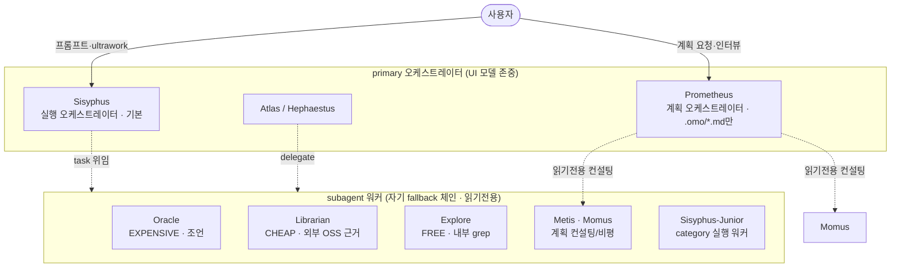
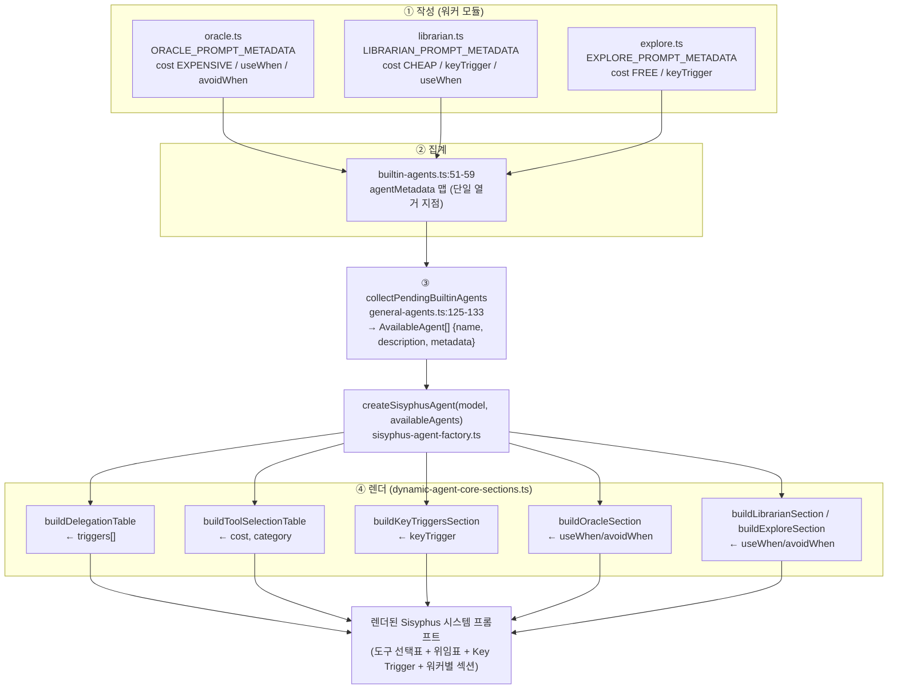
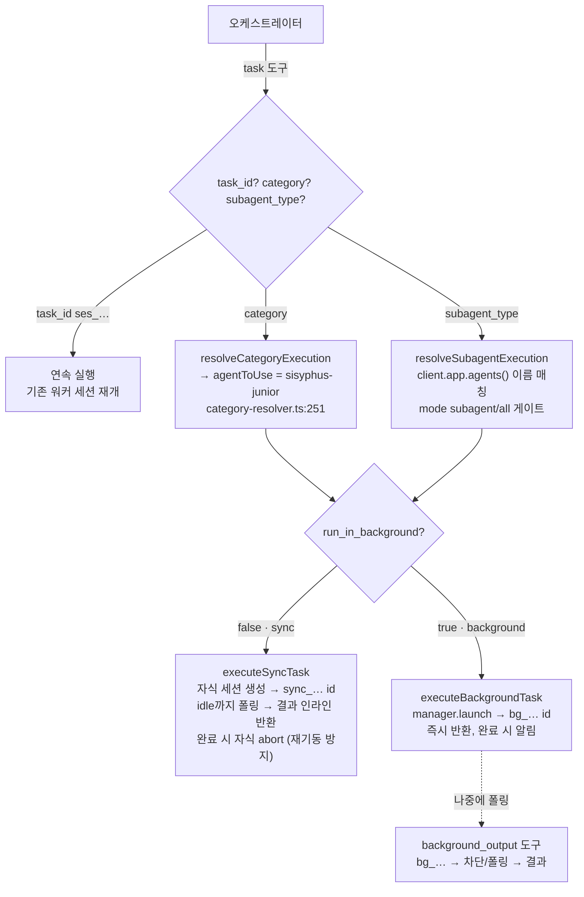
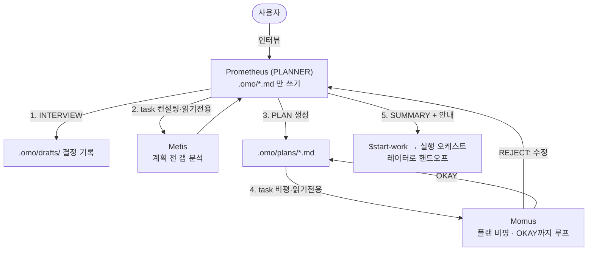
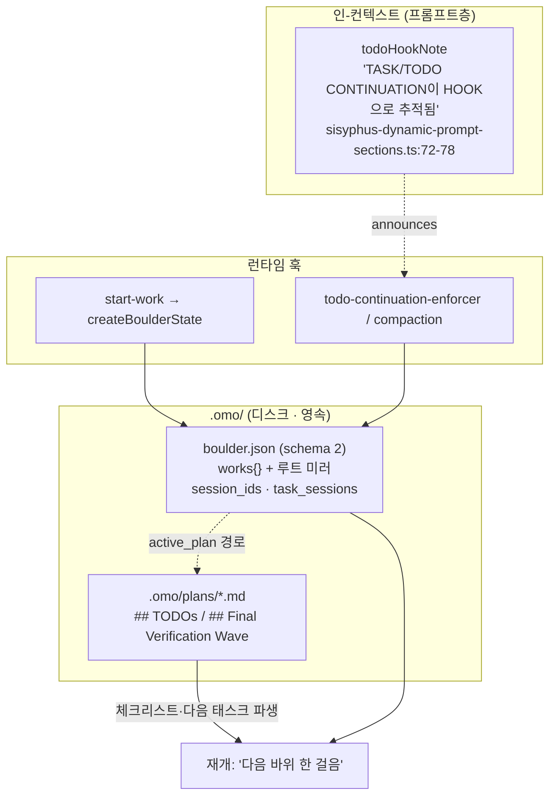

# 역할 기반 오케스트레이터와 워커 활용 

Sisyphus / Prometheus / Oracle / Librarian

## 1. 멀티에이전트 오케스트레이션 하네스

oh-my-openagent는 "단일 AI 에이전트를 하나의 협업 개발팀으로 바꾼다"는 명제를 코드로 구현한 멀티에이전트 오케스트레이션 하네스다. 11개 에이전트가 그리스 신화 이름을 달고 있고, 그중 **Sisyphus와 Prometheus는 사용자가 직접 모는 오케스트레이터**, **Oracle과 Librarian은 그 오케스트레이터가 불러 쓰는 워커**다.

이 문서는 두 개의 동사로 질문을 쪼갠다.

1. **읽는다(read)** — 오케스트레이터는 어떤 워커가 있고 각자 무엇을 잘하는지를 어떻게 "아는"가? 손으로 프롬프트에 적어 넣는가, 아니면 워커가 자기를 설명하면 자동으로 알게 되는가? (§3)
2. **활용한다(utilize)** — 오케스트레이터는 워커를 실제로 어떻게 불러 일을 시키는가? 동기/비동기, 모델 선택, 읽기전용 강제는 어디서 이뤄지는가? (§4)

답을 미리 한 문장으로: **워커는 `AgentPromptMetadata`라는 자기 설명서를 export하고, 빌드 타임에 그 메타데이터가 오케스트레이터의 시스템 프롬프트로 자동 렌더링된다(읽는다). 런타임에는 `task` 위임 도구가 권한 맵으로 워커를 읽기전용으로 묶은 채 자식 세션으로 띄운다(활용한다).**

---

## 2. 한눈에 보기

11개 에이전트는 직교하는 두 축으로 나뉜다. 

| 에이전트 | 축1: mode | 축2: layer | 한 줄 역할 | 본 문서 |
|----------|-----------|------------|-----------|---------|
| **Sisyphus** | primary | 실행 | 기본 오케스트레이터. 계획·위임·검증·실행 | §5 |
| **Prometheus** | primary | 계획 | 인터뷰형 전략 기획자. `.omo/*.md` 플랜만 작성 | §6 |
| **Oracle** | subagent | 워커 | 읽기전용 고난도 추론 컨설턴트 | §7 |
| **Librarian** | subagent | 워커 | 외부 OSS·문서를 GitHub permalink 근거로 검색 | §8 |
| Atlas | primary | 실행 | 투두리스트 오케스트레이터(지휘자) | 참고 |
| Hephaestus | primary | 실행 | 자율 심층 워커(GPT 계열) | 참고 |
| Explore | subagent | 워커 | 내부 코드베이스 contextual grep | §7·§9 |
| Metis | subagent | 워커 | 계획 전 갭 분석 컨설턴트 | §6 |
| Momus | subagent | 워커 | 플랜 비평가(리뷰 게이트) | §6 |
| Multimodal-Looker | subagent | 워커 | PDF/이미지 분석 | 참고 |
| Sisyphus-Junior | subagent | 워커 | category로 소환되는 실행 워커 | §4 |

**mode** 의 의미는 모델 선택 동작이다. `primary`는 사용자가 UI에서 고른 모델을 존중하고, `subagent`는 UI 선택을 무시하고 자기 fallback 체인을 쓴다(`packages/omo-opencode/src/agents/types.ts:48-62`). 즉 mode는 "도구 권한"이 아니라 "어떤 모델로 도느냐"를 결정한다.

```ts
// packages/omo-opencode/src/agents/types.ts:48-54
// - "primary": Respects user's UI-selected model (sisyphus, atlas)
// - "subagent": Uses own fallback chain, ignores UI selection (oracle, explore, etc.)
// - "all": Available in both contexts (OpenCode compatibility)
export type AgentMode = "primary" | "subagent" | "all";
```

**layer** 는 공식 문서가 그리는 3개의 계층 구조이다 — 계획층(Prometheus + Metis + Momus), 실행층(Atlas/Sisyphus), 워커층(Sisyphus-Junior + 전문가들). 문서가 명제를 직접 못박는다: *"오케스트레이션 시스템은 **계획과 실행의 분리**를 통해 단순 AI 에이전트를 협업 개발팀으로 바꾼다"*(`docs/guide/orchestration.md:1-3`).



---

## 3. 메커니즘 ① — 오케스트레이터가 워커를 "읽는" 법

이 절이 보고서의 핵심이다. "오케스트레이터가 워커를 읽는다"는 비유가 아니라 **빌드 타임 데이터 변환**이다: 워커가 export한 메타데이터 객체가, 오케스트레이터 시스템 프롬프트의 표·섹션으로 순수 함수에 의해 렌더링된다.

### 3.1 워커의 자기 설명서 — `AgentPromptMetadata`

모든 워커 모듈은 팩토리와 나란히 `*_PROMPT_METADATA` 상수 하나를 export한다. 그 타입이 양측이 합의한 단일 계약이다.

```ts
// packages/omo-opencode/src/agents/types.ts:88-116
/**
 * Metadata for generating Sisyphus prompt sections dynamically
 * This allows adding/removing agents without manually updating the Sisyphus prompt
 */
export interface AgentPromptMetadata {
  category: AgentCategory;        // exploration | specialist | advisor | utility
  cost: AgentCost;                // FREE | CHEAP | EXPENSIVE
  triggers: DelegationTrigger[];  // { domain, trigger }
  useWhen?: string[];             // 이 워커를 쓸 상황
  avoidWhen?: string[];           // 쓰지 말 상황
  dedicatedSection?: string;
  promptAlias?: string;           // 프롬프트에서 쓸 별명 (예: "Oracle")
  keyTrigger?: string;            // Phase 0에서 즉시 발화할 트리거
}
```

도큐먼트 주석이 설계 의도를 직접 명시한다 — *"이 메타데이터는 에이전트를 추가/제거해도 Sisyphus 프롬프트를 손으로 고치지 않게 하기 위함"*. 즉 **디커플링**이 목적이다. 세 워커의 실제 값:

| 워커 | cost | category | keyTrigger | useWhen / avoidWhen |
|------|------|----------|-----------|---------------------|
| **Oracle** (`oracle.ts:8-38`) | `EXPENSIVE` | advisor | (없음) | useWhen: 복잡한 아키텍처·중대 작업 후·2회+ 실패한 수정·낯선 패턴 / avoidWhen: 단순 파일작업·첫 시도·코드로 답 가능 |
| **Librarian** (`librarian.ts:7-22`) | `CHEAP` | exploration | `External library/source mentioned → fire librarian background` | useWhen: "How do I use [lib]?" 등 (avoidWhen 없음) |
| **Explore** (`explore.ts:7-25`) | `FREE` | exploration | `2+ modules involved → fire explore background` | useWhen: 다각도 검색·낯선 모듈 / avoidWhen: 정확한 검색어를 안다·파일 위치를 안다 |

비용 등급이 곧 발화 정책을 만든다. Oracle이 `EXPENSIVE`라서 `avoidWhen`에 "먼저 직접 해봐라"가 들어가고, Explore가 `FREE`라서 "맘껏 병렬로 쏴라"가 된다.

### 3.2 집계 → 런타임 목록 → 렌더 함수

데이터는 4단계로 흐른다.

**1단계 · 집계.** 모든 워커 메타데이터가 단 한 곳의 맵으로 모인다. 이 맵이 "오케스트레이터가 설명할 에이전트"의 유일한 열거 지점이다.

```ts
// packages/omo-opencode/src/agents/builtin-agents.ts:51-59
const agentMetadata: Partial<Record<BuiltinAgentName, AgentPromptMetadata>> = {
  oracle: ORACLE_PROMPT_METADATA,
  librarian: LIBRARIAN_PROMPT_METADATA,
  explore: EXPLORE_PROMPT_METADATA,
  "multimodal-looker": MULTIMODAL_LOOKER_PROMPT_METADATA,
  metis: metisPromptMetadata,
  momus: momusPromptMetadata,
  atlas: atlasPromptMetadata,
}
```

> `sisyphus`·`hephaestus`·`sisyphus-junior`는 이 맵에 **의도적으로 없다**. 이들은 위임의 *대상*이 아니라 위임의 *주체*(또는 category 전용)이기 때문이다.

**2단계 · 실체화.** `collectPendingBuiltinAgents`가 비활성/모델 가용성 게이트를 통과한 에이전트마다, 살아있는 `config.description`과 메타데이터를 묶어 `AvailableAgent[]`로 만든다(`general-agents.ts:125-133`). `AvailableAgent`는 렌더 함수가 읽는 메모리 형태다 — `{ name, description, metadata }`(`dynamic-agent-prompt-types.ts:3-7`).

**3단계 · 핸드오프.** 이 목록이 `maybeCreateSisyphusConfig` → `createSisyphusAgent(model, availableAgents, …)`로 전달된다(`builtin-agents/sisyphus-agent.ts:82-89`).

**4단계 · 렌더.** 렌더 함수들이 메타데이터 필드를 markdown으로 변환한다. 어느 함수가 어떤 필드를 읽는지가 메커니즘의 전부다(전부 `dynamic-agent-core-sections.ts`).

| 렌더 함수 | 읽는 필드 | 만드는 것 | 라인 |
|-----------|----------|-----------|------|
| `buildToolSelectionTable` | `cost`, `category` | 비용 정렬된 도구·에이전트 선택표 (`utility` 제외, FREE→CHEAP→EXPENSIVE 정렬) | `:44-75` |
| `buildDelegationTable` | `triggers[]` | "도메인 → \`에이전트\`" 위임 규칙표(트리거 1개당 1행) | `:118-128` |
| `buildKeyTriggersSection` | `keyTrigger` | Phase 0 즉시 발화 트리거 블록 | `:26-42` |
| `buildExploreSection` | `useWhen`/`avoidWhen` | "Explore 직접도구 vs 에이전트" 섹션 | `:77-97` |
| `buildLibrarianSection` | `useWhen` | "Librarian 트리거 문구" 섹션 | `:99-116` |
| `buildOracleSection` | `useWhen`/`avoidWhen` | `<Oracle_Usage>` 컨설팅 규약 블록 | `:130-171` |

가장 데이터 주도적인 `buildDelegationTable`의 실체:

```ts
// packages/omo-opencode/src/agents/dynamic-agent-core-sections.ts:118-128
export function buildDelegationTable(agents: AvailableAgent[]): string {
  const rows: string[] = ["### Delegation Table:", ""]
  for (const agent of agents) {
    for (const trigger of agent.metadata.triggers) {
      rows.push(`- **${trigger.domain}** → \`${agent.name}\` - ${trigger.trigger}`)
    }
  }
  return rows.join("\n")
}
```

워커가 `triggers`에 한 줄을 추가하면 위임표에 한 행이 자동으로 생긴다. 프롬프트를 손댈 필요가 없다. 모든 렌더 함수의 호출을 한 곳에 모으는 허브가 `buildSisyphusDynamicPromptSections`이고(`sisyphus-dynamic-prompt-sections.ts:40-70`), 그 결과 구조체를 4개 렌더러(역할+의도 / 탐색 / 실행 / 톤+제약)가 이어붙여 최종 프롬프트를 만든다(`sisyphus-dynamic-prompt-builder.ts:13-37`).



### 3.3 이 설계가 중요한 이유

이 패턴은 멀티에이전트 하네스 설계의 중요한 사례입니다.

- **단일 진실 원천(SSOT).** 워커의 성격(비용·트리거·사용 조건)은 그 워커 파일 한 곳에만 산다. 오케스트레이터 프롬프트는 그것을 **파생**할 뿐 중복하지 않는다.
- **확장이 O(1).** 새 워커 추가 = 메타데이터 상수 export + `agentMetadata`에 한 줄. 위임표·도구표·Key Trigger가 자동 갱신된다.
- **존재 게이팅.** 워커가 비활성화되거나 모델이 없으면 `availableAgents`에서 빠지고, 해당 섹션은 빈 문자열을 반환해 사라진다(예: `buildExploreSection`은 explore가 없으면 `""` 반환, `:77-81`). 프롬프트가 "없는 워커"를 광고하지 않는다.

> 검증 노트: 인터페이스에 선언된 `dedicatedSection`·`promptAlias`는 현재 핵심 렌더 함수가 소비하지 않는다. Oracle/Explore/Librarian 섹션은 메타데이터가 아니라 **에이전트 이름**으로 분기한다(`find(a => a.name === "oracle")`). 즉 두 필드는 현 코드 경로에서 사실상 미사용에 가깝다(§11 미해결 항목).

---

## 4. 메커니즘 ② — 오케스트레이터가 워커를 "활용하는" 법

읽기가 끝나면 부르기다. 오케스트레이터가 워커를 실제로 소환하는 도구는 `task`(내부명 delegate-task)다. OpenCode에 `tools.task`로 등록된다(`tool-registry-core-tools.ts:36,120`).

### 4.1 `task` 도구의 계약

```ts
// packages/omo-opencode/src/tools/delegate-task/tools.ts:61-79 (요지)
{
  prompt:            string,    // 필수
  description?:      string,
  load_skills?:      string[],  // 워커에 장착할 스킬
  run_in_background?: boolean,  // true=async(bg_… 반환) / false=sync(대기). 기본 false
  category?:         string,    // subagent_type 미지정 시 필수
  subagent_type?:    string,    // category 미지정 시 필수
  task_id?:          string,    // ses_… 연속(continuation) id
}
```

규칙은 **`category` XOR `subagent_type`** 다 — 둘 다 없으면 거부, 둘 다 주면 category가 이긴다. 두 경로의 의미가 다르다.

- **`subagent_type` = 특정 워커 직접 지목.** `oracle`/`librarian`/`explore`/`metis`/`momus` 등. 살아있는 OpenCode 에이전트 레지스트리(`client.app.agents()`)와 이름 매칭으로 해석하고, mode가 `subagent` 또는 `all`인 에이전트만 호출 가능하다(`subagent-agent-match.ts:49-122`, `subagent-discovery.ts:67-69`). primary(오케스트레이터)는 워커로 재소환할 수 없다.
- **`category` = sisyphus-junior로 라우팅.** category가 있으면 `subagent_type`이 강제로 `sisyphus-junior`로 덮어쓰인다. 즉 category는 "에이전트 정체성"이 아니라 "모델 + 프롬프트 덧붙임"만 고른다.

```ts
// packages/omo-opencode/src/tools/delegate-task/tool-argument-preparation.ts:11-20
if (category && subagentType && subagentType !== SISYPHUS_JUNIOR_AGENT) {
  log("[task] category provided - overriding subagent_type to sisyphus-junior", ...)
}
if (category) {
  subagentType = SISYPHUS_JUNIOR_AGENT
}
```

### 4.2 모델 선택은 에이전트마다 다르다

워커가 정해지면 모델은 `AGENT_MODEL_REQUIREMENTS[agent].fallbackChain`에서 온다(`packages/model-core/src/agent-model-requirements.ts`). 전역 우선순위는 없다.

- `oracle` → gpt-5.5(high) → gemini-3.1-pro(high) → claude-opus-4-7(max) … (무거운 추론 모델)
- `explore`·`librarian` → gpt-5.4-mini-fast → … (싸고 빠른 모델)

해석 알고리즘 자체는 하네스 중립 패키지 `delegate-core`로 분리돼 있고(`resolveModelForDelegateTask`, `delegate-core/src/model-selection.ts:75-259`), category 경로와 subagent 경로가 같은 함수를 공유한다. 우선순위는 user-model > category-default > user fallback_models > fallbackChain > systemDefault.

### 4.3 동기 vs 비동기 생명주기



- **동기(sync).** 자식 OpenCode 세션을 만들어 프롬프트를 보내고 idle까지 폴링한 뒤 결과를 그 자리에서 반환하고, 끝난 자식 세션을 강제 abort해 "끝난 워커가 되살아나는" 경쟁을 막는다(`sync-task.ts:36-174`).
- **비동기(background).** `manager.launch()`가 즉시 `bg_…` id를 반환하고, 결과는 완료 알림 후 별도 도구 `background_output`으로 수거한다(`background-task.ts:119-225`, `background-task/create-background-output.ts:93-200`). id 네임스페이스가 엄격히 분리된다 — `bg_…`는 `background_output`용, `ses_…`는 `task_id` 연속/`session_read`용.

> 비안정 모델(gemini·minimax 기반 category)을 sync로 요청하면 자동으로 background로 승격된다(`tools.ts:171-196`). 사용자가 모르는 사이 sync가 babysit 대상 background로 바뀌는 비자명한 분기다.

### 4.4 좁은 형제 `call_omo_agent`

`task`보다 의도적으로 좁은 도구가 `call_omo_agent`다. `explore`/`librarian` **두 워커만** 허용하고(`call-omo-agent/tools.ts:113-177`, `ALLOWED_AGENTS=['explore','librarian']`), category·스킬 로딩이 없으며 `run_in_background`가 필수다. "내가 일하는 동안 빠른 contextual 조회만 곁가지로 띄운다"는 용도다.

> 흥미로운 권한 비대칭: Sisyphus 자신의 config는 `call_omo_agent`를 **deny**한다(`sisyphus-agent-config.ts:6-53`). 즉 Sisyphus는 곁가지 호출 대신 정식 `task` 위임만 쓰도록 설계됐다.

### 4.5 워커는 읽기전용 — 권한 맵으로 강제된다

워커가 파일을 못 고치고 더 위임도 못 하는 것은 "삭제된 도구" 때문이 아니라 **권한 맵**이다. `createAgentToolRestrictions`는 deny 도구를 `"deny"`로, 선택적 allow 도구를 `"allow"`로 매핑한 `{ permission }` 객체를 만든다.

```ts
// packages/omo-opencode/src/shared/permission-compat.ts:15-25
return {
  permission: Object.fromEntries([
    ...denyTools.map((tool) => [tool, "deny" as const]),
    ...allowTools.map((tool) => [tool, "allow" as const]),
  ]),
}
```

| 워커 | deny 목록 | 추가 allow | 의미 |
|------|-----------|-----------|------|
| Oracle (`oracle.ts:411-417`) | write, edit, apply_patch, task | — | 파일 변경·재위임 불가. (단 `call_omo_agent`는 deny 안 함) |
| Librarian (`librarian.ts:25-31`) | write, edit, apply_patch, task, **call_omo_agent** | — | 완전 읽기전용, 어떤 에이전트도 못 부름 |
| Explore (`explore.ts:27-31`) | write, edit, apply_patch, task, **call_omo_agent** | lsp_symbols, goto_definition, find_references, diagnostics | 읽기전용 + LSP 시맨틱 검색 재허용 |

이 권한 맵이 워커 config에 `...restrictions`로 스프레드되고, OpenCode 권한 시스템이 실행 시점에 `deny` 도구를 차단한다. "읽기전용"이 프롬프트 훈계가 아니라 **구조적 강제**라는 점이 핵심이다.

---

## 5. Sisyphus — 실행 오케스트레이터

### 5.1 정체성: 바위를 굴리는 시니어 엔지니어

Sisyphus는 `mode: "primary"` 오케스트레이터다(`sisyphus-agent-factory.ts:32`). 프롬프트가 이름의 이유를 직접 밝힌다.

```text
// packages/omo-opencode/src/agents/sisyphus-dynamic-prompt-role.ts:6-21
You are "Sisyphus" - Powerful AI Agent with orchestration capabilities ...
**Why Sisyphus?**: Humans roll their boulder every day. So do you. ...
**Identity**: SF Bay Area engineer. Work, delegate, verify, ship. No AI slop.
**Operating Mode**: You NEVER work alone when specialists are available.
  Frontend work → delegate. Deep research → parallel background agents.
  Complex architecture → consult Oracle.
```

config 층의 정체성도 일관된다: 설명에 "explore는 내부 코드, librarian은 외부 문서로 쓴다", maxTokens 64000, 청록색(#00CED1), 그리고 `call_omo_agent: "deny"`(`sisyphus-agent-config.ts:6-53`).

### 5.2 프롬프트는 모델마다 다르게 조립된다

`createSisyphusAgent`는 모델 패밀리를 감지해 전용 빌더로 분기한다 — Kimi K2.6/K2.7, GPT-5.5, GPT-native 5.4+, Claude Fable 5/Opus 4.8/4.7, 그 외엔 fallback 동적 빌더(`sisyphus-agent-factory.ts:34-117`). 어느 분기든 §3의 `availableAgents`를 그대로 넘겨 워커 섹션을 렌더한다. mode는 모든 분기에서 `primary`로 고정된다.

### 5.3 행동 골격: Intent Gate → 위임 → 검증

Sisyphus 프롬프트는 위상(Phase)으로 행동을 못박는다.

- **Phase 0 · Intent Gate (매 메시지).** 의도를 말로 표명하고(research/implementation/investigation/…), 요청 유형을 분류한다(`role.ts:25, 60-81`). 동적 변형은 두 게이트를 더 건다 — **Step 1.5 턴-로컬 의도 리셋**("이전 턴의 implementation 모드를 자동 계승하지 마라")과 **Step 2.5 컨텍스트 완결 게이트**("명시적 구현 동사 + 구체적 범위 + 대기 중 Oracle 의존성 없음, 셋 다일 때만 구현 시작").
- **위임 우선 편향.** Step 3 위임 체크 + 대문자 한 줄로 못박는다: *"Default Bias: DELEGATE. WORK YOURSELF ONLY WHEN IT IS SUPER SIMPLE."*(`role.ts:89-95`). 비-Claude 모델에는 "너는 구현자가 아니다(YOU ARE NOT AN IMPLEMENTER)" 섹션이 추가 주입된다(`dynamic-agent-core-sections.ts:206-245`).
- **병렬·백그라운드 탐색.** explore/librarian은 "백그라운드 grep"이며 **항상 `run_in_background=true`, 항상 병렬(2–5개)**. 동기 호출은 명시적으로 WRONG으로 표시된다(`sisyphus-dynamic-prompt-exploration.ts:13-46`).
- **6섹션 위임 계약.** 모든 위임 프롬프트는 TASK / EXPECTED OUTCOME / REQUIRED TOOLS / MUST DO / MUST NOT DO / CONTEXT 6섹션을 채워야 하며, 모호한 프롬프트는 거부된다. 위임 후엔 항상 결과를 검증한다(`sisyphus-dynamic-prompt-execution.ts:20-39`).
- **증거 기반 완료.** 편집은 lsp_diagnostics 클린, 빌드는 exit 0 등 "증거 없으면 미완료". 3회 연속 실패 시 STOP→REVERT→Oracle 상담(`execution.ts:86-113`).

---

## 6. Prometheus — 계획 오케스트레이터

### 6.1 정체성: 끈적이는(sticky) 계획 모드

Prometheus도 `mode: "primary"`다(`prometheus-agent-config-builder.ts:98-104`). 그러나 역할은 정반대다 — 코드를 절대 쓰지 않고 `.omo/`의 마크다운 플랜만 만든다.

```text
// packages/prompts-core/prompts/prometheus/default.md:1-5
You are a PLANNER. You read, search, and write only plan artifacts under `.omo/`;
you never edit product code and never implement. Plan mode is sticky:
"do X" / "fix X" / "just do it" all mean "plan X" - execution belongs to the
worker and begins only when the user explicitly starts it (e.g. `$start-work`).
```

프롬프트는 의도적으로 얇다. 첫 행동이 `skill(name="shared/ulw-plan")` 로드이고, 모든 계획 기법(탐색·승인 게이트·플랜 템플릿·이중 Momus 리뷰)은 그 스킬에 위임한다. OpenCode 어댑터는 모델·disabledTools를 무시하고 단일 `default.md` 본문만 반환한다(`agents/prometheus/system-prompt.ts:10-24`).

### 6.2 `.md`-only 강제는 "금지 목록"이 아니라 "허용 목록"이다

> **검증으로 정정된 핵심 포인트(§11 verify-3).** Prometheus의 쓰기 제약은 `prometheus-md-only` 훅이 `tool.execute.before`에서 강제한다(`hooks/prometheus-md-only/hook.ts:40-61`, 파이프라인 등록 `plugin/tool-execute-before.ts:91`). 자주 인용되는 "`packages/*/src/`, `package.json`, config 파일 금지"는 **코드에 명시된 금지 규칙이 아니다** — 그 문구는 CLAUDE.md/AGENTS.md 산문에만 있다. 코드의 실제 정책은 **허용 목록**이다.

```ts
// packages/omo-opencode/src/hooks/prometheus-md-only/path-policy.ts:14-39 (요지)
const resolved = resolve(workspaceRoot, filePath)
const rel = relative(workspaceRoot, resolved)
if (rel.startsWith("..") || isAbsolute(rel)) return false        // 워크스페이스 밖 금지
if (!/(^|[/\\])\.omo([/\\]|$)/i.test(rel)) return false          // .omo 세그먼트 필수
const hasAllowedExtension = ALLOWED_EXTENSIONS.some(             // .md 확장자 필수
  ext => resolved.toLowerCase().endsWith(ext.toLowerCase()))
```

즉 `Write`/`Edit`(BLOCKED_TOOLS, `constants.ts:12`)는 **`.omo/**/*.md`만 통과**하고, 그 외는 전부 "허용 목록 불일치"로 거부된다. `src/`나 `package.json`이 막히는 건 명시적 금지가 아니라 *허용에 들지 못해서*다.

### 6.3 워커를 읽고 쓰는 법: 계획 파이프라인

Prometheus가 `task`/`call_omo_agent`로 워커를 부를 때, 훅이 그 프롬프트에 읽기전용 컨설팅 경고(`<planning-context source="prometheus-read-only">`)를 주입한다 — 불려간 워커도 파일을 고치지 말고 분석만 반환하라는 뜻(`hook.ts:10-38`, `constants.ts:23-44`). `.omo/plans/`에 쓸 때는 5단계 워크플로 리마인더가 덧붙는다(`constants.ts:46-89`).



여기서 Sisyphus와 Prometheus의 가장 날카로운 대비가 드러난다. Prometheus는 team mode에서 `hard-reject`다 — 팀원은 메일박스 파일을 써야 하는데 Prometheus는 `.omo/*.md`만 쓸 수 있어서다(`team-core/src/types.ts:230-234`). 반면 Sisyphus는 `eligible`. **Sisyphus는 팀에서 실행·조율하고, Prometheus는 계획만 하며 메일박스 쓰기에서 배제된다.**

---

## 7. Oracle — 읽기전용 조언 워커

### 7.1 워커 계약

Oracle은 `mode: "subagent"`, temperature 0.1, cost `EXPENSIVE`인 "전략 기술 자문"이다(`oracle.ts:6,8-38`). 계약이 프롬프트에 명문화돼 있다.

```text
// packages/omo-opencode/src/agents/oracle.ts:251
You are read-only. You advise; others execute. You cannot write, edit, patch,
or delegate further. Your output is the entire contribution you make to this task ...
```

각 컨설팅은 독립적이며(같은 세션 내 후속 질문은 지원), 응답은 중간 처리 없이 부르는 에이전트에게 직접 간다. 근거 규율은 **내부 컨텍스트 앵커링** — 제공된 코드에 claim을 묶고, 줄번호·경로·외부 참조를 지어내지 말 것(`oracle.ts:99-108`). 모델별로 추론 설정이 갈린다: Claude는 thinking 예산, GPT-5.5/GPT는 reasoningEffort `medium` + textVerbosity `high`(`oracle.ts:419-451`).

### 7.2 발화 규칙: blocking-but-backgrounded

> **검증으로 정정된 핵심 포인트(§11 verify-4).** "Oracle은 `run_in_background=false`로 차단 호출한다"는 것은 **기본·Claude 프롬프트에서 사실이 아니다.** 렌더된 Oracle 섹션의 제목 자체가 "Oracle **Background** Task Policy"다.

```text
// packages/omo-opencode/src/agents/dynamic-agent-core-sections.ts:157-169 (요지)
**Oracle-dependent implementation is BLOCKED until Oracle finishes.**
- Oracle takes minutes. When done with your own work: **end your response** -
  wait for the `<system-reminder>`.
- Do NOT poll `background_output` on a running Oracle.
- Never cancel Oracle.
```

즉 Oracle은 **백그라운드로 띄우되**(run_in_background=true), 부모가 "자기 일을 끝내고 응답을 종료한 뒤 system-reminder를 기다리는" 방식으로 차단한다. 폴링도 취소도 금지. 차단의 본질은 "동기 대기"가 아니라 "**Oracle 의존 구현을 결과 도착 전까지 금지**"하는 정책이다(§5.3 Step 2.5와 연결). 또한 Oracle은 Sisyphus가 행동 전에 미리 알리는 **유일한** 경우다("Consulting Oracle for [reason]", `:152-155`). gpt-5-5 변형만 sync/background 둘 다를 옵션으로 제시한다.

---

## 8. Librarian — 외부 지식 워커

### 8.1 워커 계약: permalink 없으면 주장도 없다

Librarian은 `mode: "subagent"`, temperature 0.1, cost `CHEAP`인 "오픈소스 코드베이스 이해" 워커다(`librarian.ts:5,7-22`). Oracle이 *내부 컨텍스트로 조언*한다면, Librarian은 *외부 OSS를 GitHub permalink 근거로 검색*한다. 모든 주장에 SHA 고정 permalink가 강제된다.

```text
// packages/omo-opencode/src/agents/librarian.ts:206-231 (요지)
Every claim MUST include a permalink:
**Claim** / **Evidence**([permalink]) / **Explanation**
https://github.com/<owner>/<repo>/blob/<commit-sha>/<filepath>#L<start>-L<end>
```

요청을 4유형(TYPE A 개념 / B 구현 / C 맥락 / D 종합)으로 먼저 분류하고(`librarian.ts:56-63`), 유형별로 도구 시퀀스와 병렬 호출 최소치를 달리한다 — context7·web search(문서), gh clone·blame(구현), gh issues/PRs(이력). "올해 연도를 쓰라"는 날짜 인식 규율도 있다.

### 8.2 Librarian이 더 강하게 묶이는 이유

읽기전용 deny 목록에서 Librarian과 Explore는 Oracle보다 한 가지를 더 막는다 — `call_omo_agent`(§4.5 표). Librarian은 외부 도구(gh CLI·웹·clone)를 자유롭게 쓰되 **다른 에이전트는 일절 못 부른다**. "근거 수집기"가 다시 위임 트리를 펼치지 못하게 하는 격리다.

> Oracle·Explore와 함께 본 워커 3종은 오케스트레이터 프롬프트의 비용표에서 정확히 비용 순으로 정렬돼 노출된다 — Explore(FREE) → Librarian(CHEAP) → Oracle(EXPENSIVE)(`buildToolSelectionTable`, `:57-69`). 메타데이터(§3)와 활용(§4)이 한 화면에서 만나는 지점이다.

---

## 9. 워커 firing 규칙 종합 비교

4 주역의 워커 2종(Oracle·Librarian)에 Explore를 더해, 오케스트레이터가 "읽은" 메타데이터가 "활용" 규칙으로 어떻게 이어지는지를 한 표로 정리한다.

| 항목 | Explore | Librarian | Oracle |
|------|---------|-----------|--------|
| mode | subagent | subagent | subagent |
| cost (메타데이터) | `FREE` | `CHEAP` | `EXPENSIVE` |
| 검색 대상 | 내부 코드베이스 | 외부 OSS·문서 | (제공 컨텍스트 추론) |
| keyTrigger | 2+ 모듈 → 즉시 발화 | 외부 라이브러리 언급 → 즉시 발화 | (없음, useWhen으로 판단) |
| 발화 방식 | background·병렬 2–5 | background·병렬 | **blocking-but-backgrounded** |
| deny 도구 | write,edit,apply_patch,task,call_omo_agent | 동left + call_omo_agent | write,edit,apply_patch,task |
| 추가 allow | LSP 4종 | — | — |
| 근거 규율 | 절대경로 `<results>` 블록 | GitHub SHA permalink | 내부 코드 앵커링·날조 금지 |
| 호출 도구 | task / call_omo_agent | task / call_omo_agent | task |

오케스트레이터의 기본 흐름은 비용 순서를 그대로 따른다: *"explore/librarian(백그라운드) + 직접도구 → 필요 시 oracle"*(`buildToolSelectionTable:72`).

---

## 10. boulder-state — "바위"(작업 상태)의 영속화

Sisyphus가 굴리는 바위는 비유로 끝나지 않는다. `boulder-state` 패키지가 그 바위를 디스크에 영속화한다.

- **위치·형태.** `<dir>/.omo/boulder.json`, schema v2(`constants.ts:1-8`, `storage/path.ts:7-9`). `works` 맵(다중 작업 레지스트리) + 루트에 활성 작업의 평탄화 "미러"(`types.ts:1-37`). 미러는 읽기 시 투영, 쓰기 시 역동기화로 절대 어긋나지 않는다(`read-state.ts:23-27`, `write-state.ts:20-45`).
- **무엇을 기억하나.** 활성 플랜 경로, 세션 계보(플랫폼 접두사 `opencode:`/`codex:`로 두 에디션이 한 파일 공유), 위임된 작업별 `task_sessions`(어느 subagent 세션이 어느 플랜 태스크를 맡았는지)(`task.ts:43-106`).
- **체크리스트는 저장하지 않는다.** 남은 일은 `.omo/plans/*.md`에서 **실시간으로 파생**한다 — `## TODOs`/`## Final Verification Wave` 아래 체크박스를 세고(`plan-checklist.ts:25-59`), 다음 최상위 태스크를 읽는다(`top-level-task.ts:31-69`). 마크다운이 단일 편집 원천, JSON은 포인터.
- **컨텍스트 손실을 견딘다.** 바위가 LLM 컨텍스트 윈도와 무관한 평탄 JSON이라, compaction 후에도 다시 읽어 정확히 재개한다. `.omo/`는 첫 쓰기 때 자기 무시 `.gitignore`와 함께 자동 생성된다(`write-state.ts:13-18`).



> 주의: 프롬프트의 `todoHookNote`(인-세션 투두 추적)와 `boulder.json`(오케스트레이션 영속)은 **다른 층**이다. 전자는 todo-continuation 훅이, 후자는 start-work/atlas 훅이 다룬다. 둘이 협력해 "바위를 절대 놓치지 않는다"를 보장한다.

---

## 11. 검증 노트 — 투명성

본 보고서의 핵심 주장 6건은 도시에를 작성한 에이전트와 **별개의** 에이전트가 코드를 다시 읽어 적대적으로 검증했다. 4건 confirmed, 2건 partial(정정 반영 완료).

| # | 주장 | 판정 | 비고 |
|---|------|------|------|
| 1 | 워커가 `AgentPromptMetadata`를 export하고, 그 메타데이터가 오케스트레이터 프롬프트 섹션으로 동적 렌더링된다 | ✅ confirmed | §3 그대로 |
| 2 | Oracle/Librarian/Explore는 권한 deny로 읽기전용(Librarian·Explore는 call_omo_agent도 deny) | ✅ confirmed | §4.5 표 |
| 3 | Prometheus는 `.md`만 쓸 수 있고, 훅이 `src/`·`package.json` 등을 금지한다 | ⚠️ partial | **정정:** 금지 목록이 아니라 `.omo/*.md` **허용 목록**. 금지 경로 예시는 산문에만 존재(§6.2) |
| 4 | explore/librarian은 background, **oracle은 run_in_background=false로 차단** | ⚠️ partial | **정정:** Oracle은 background로 띄우고 "응답 종료 후 대기"로 차단 — blocking-but-backgrounded(§7.2) |
| 5 | canonical 순서 Sisyphus→Hephaestus→Prometheus→Atlas, `installAgentSortShim`이 강제 | ✅ confirmed | OpenCode 1.4.x가 이름 알파벳 정렬을 하므로 `Array.prototype.sort/toSorted`를 좁게 패치(`agent-sort-shim.ts:96-137`) |
| 6 | boulder-state는 디스크 영속 작업 상태머신, mode primary는 UI 모델·subagent는 fallback 체인 | ✅ confirmed | §10 + §2 |

**미해결/주의 사항.** (a) `AgentPromptMetadata.dedicatedSection`·`promptAlias`는 선언돼 있으나 핵심 렌더 함수가 소비하지 않는다(이름 기반 분기). (b) `BuiltinAgentName` 타입(`types.ts:134-144`)에는 `prometheus`가 없다 — Prometheus는 별도 빌더(`prometheus-agent-config-builder.ts`)로 등록되는 다른 경로다. (c) 문서별 모델 이름 표기가 일부 불일치(예: Junior 체인의 kimi-k2.5 vs k2.6) — 소스 검증 테이블(`agents/AGENTS.md`)을 정본으로 삼는다.

---

## 12. 정리 — 강의용 시사점

이 코드베이스가 가르치는 "역할 기반 오케스트레이션"의 핵심 4가지.

1. **워커는 자기를 데이터로 설명하고, 오케스트레이터는 그 데이터를 프롬프트로 컴파일한다.** 프롬프트를 손으로 동기화하지 않는 것이 멀티에이전트 유지보수성의 열쇠다(§3). 직접 프롬프트에 워커 목록을 적는 흔한 안티패턴과의 대비가 강의 포인트.
2. **"활용"은 권한·생명주기·모델선택의 합이다.** `task` 한 도구가 category XOR subagent_type, sync XOR background, ses_ XOR bg_라는 직교 축들로 위임을 표현한다(§4). 읽기전용은 권한 맵으로 *구조적으로* 강제된다.
3. **역할 분리가 비용·신뢰의 분리로 이어진다.** 비싼 추론(Oracle)은 차단 게이트로, 싼 검색(Explore/Librarian)은 병렬 백그라운드로. 계획(Prometheus)은 `.md`만 쓰는 격리로, 실행(Sisyphus)은 팀 적격으로(§6·§9).
4. **상태는 컨텍스트 밖 디스크에 산다.** "바위"(boulder.json)가 LLM 컨텍스트와 분리돼 있어 compaction·세션 교체를 견딘다(§10). 이것이 "Sisyphus"라는 이름의 기술적 근거다(`docs/guide/orchestration.md:294`).

---

## 부록 A — 1차 인용 인덱스

| 주제 | 파일 | 라인 |
|------|------|------|
| AgentMode 정의 | `packages/omo-opencode/src/agents/types.ts` | 48-62 |
| AgentPromptMetadata 계약 | `packages/omo-opencode/src/agents/types.ts` | 88-116 |
| 워커 메타데이터 (Oracle/Librarian/Explore) | `agents/oracle.ts` · `librarian.ts` · `explore.ts` | 8-38 · 7-22 · 7-25 |
| 메타데이터 집계 맵 | `agents/builtin-agents.ts` | 51-59 |
| AvailableAgent 실체화 | `agents/builtin-agents/general-agents.ts` | 77-85, 125-133 |
| 렌더 함수 (위임표/도구표/워커섹션) | `agents/dynamic-agent-core-sections.ts` | 26-171, 206-245 |
| 프롬프트 섹션 허브·조립 | `agents/sisyphus-dynamic-prompt-sections.ts` · `-builder.ts` | 40-70 · 13-37 |
| Sisyphus 팩토리·config·역할 | `agents/sisyphus-agent-factory.ts` · `sisyphus-agent-config.ts` · `sisyphus-dynamic-prompt-role.ts` | 32,34-117 · 6-53 · 6-21,60-95 |
| Sisyphus 탐색·실행 위상 | `agents/sisyphus-dynamic-prompt-exploration.ts` · `-execution.ts` | 13-46 · 20-39,86-113 |
| Prometheus config·프롬프트 | `plugin-handlers/prometheus-agent-config-builder.ts` · `prompts-core/prompts/prometheus/default.md` | 98-104 · 1-5 |
| Prometheus md-only 훅 | `hooks/prometheus-md-only/{hook,path-policy,constants}.ts` | 40-61 · 14-39 · 8-89 |
| 권한 제한 헬퍼 | `shared/permission-compat.ts` | 15-25 |
| task 도구 스키마·라우팅 | `tools/delegate-task/tools.ts` · `tool-argument-preparation.ts` | 61-79,124-196 · 11-20 |
| subagent/category 해석 | `tools/delegate-task/subagent-agent-match.ts` · `category-resolver.ts` | 49-122 · 251 |
| sync/background 생명주기 | `tools/delegate-task/sync-task.ts` · `background-task.ts` | 36-174 · 119-225 |
| call_omo_agent | `tools/call-omo-agent/tools.ts` | 113-177 |
| 모델 요구사항 | `packages/model-core/src/agent-model-requirements.ts` · `packages/delegate-core/src/model-selection.ts` | (per-agent chains) · 75-259 |
| boulder-state | `packages/boulder-state/src/{constants,types,storage/*,plan-checklist,top-level-task}.ts` | §10 참조 |
| 순서·모드·적격성 | `shared/agent-ordering.ts` · `agent-sort-shim.ts` · `team-core/src/types.ts` | 3-8 · 96-137 · 189-263 |
| 공식 내러티브 | `docs/guide/orchestration.md` · `agents/AGENTS.md` | 1-3,82-94,294 · 20-32,104-110 |

> 모든 경로는 `part7_opensource/oh-my-openagent/` 루트 기준. 생성 시점 브랜치 `dev`, 릴리스 v4.10.0 계열 소스 기준이며, 활발한 멀티-하네스 리팩터 진행 중이므로 라인 번호는 후속 커밋에서 이동할 수 있다.
