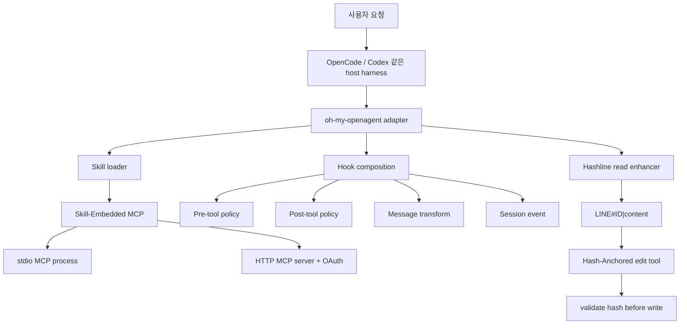
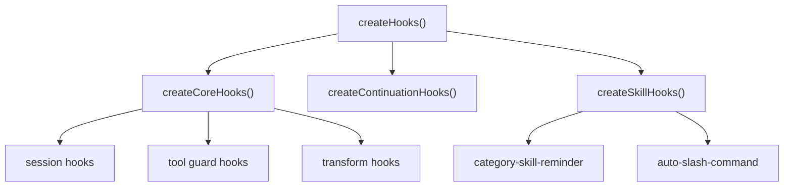

# Skill-Embedded MCP · Hooks · Hash-Anchored Edit

oh-my-openagent의 차별 기능을 소스 코드 기준으로 읽기

## 1. 명제

oh-my-openagent의 특징은 "도구가 많다"가 아니다. 이 하네스의 차별점은 **기능을 아무 때나 전역으로 열어 두지 않고, 필요한 시점과 범위에서만 활성화하는 런타임 구조**에 있다.

세 기능은 서로 다른 문제를 푼다.

| 기능 | 표면 | 실제로 푸는 문제 |
|------|------|------------------|
| **Skill-Embedded MCP** | `skill` + `skill_mcp` | 모든 MCP를 전역 컨텍스트에 올리지 않고, 스킬이 필요한 MCP를 작업 단위로 들고 오게 한다. |
| **Hooks** | `chat.message`, `tool.execute.before/after`, transform, event | 모델 출력 전후의 위험한 순간을 하네스가 잡아 정책, 주입, 복구, 검증을 적용한다. |
| **Hash-Anchored Edit** | `Read` 출력의 `LINE#ID` + `edit` 도구 | 줄 번호만 믿고 편집하다 엉뚱한 줄을 고치는 문제를 줄 내용 해시로 막는다. |

이 셋을 합치면 하네스의 성격이 선명해진다. 모델에게 "잘해줘"라고 부탁하는 대신, 하네스가 **capability activation**, **policy intervention**, **edit verification**을 런타임 계약으로 만든다.

> 이 문서는 현재 checkout의 `part7_opensource/oh-my-openagent/` 소스 기준이다. 이 repo는 활발한 package-layering refactor 중이므로 라인 번호는 이후 커밋에서 이동할 수 있다.

---

## 2. 한눈에 보기



셋은 독립 기능처럼 보이지만 실제 구현에서는 같은 조립점으로 들어온다.

- `createManagers()`가 `SkillMcpManager` 같은 장기 런타임 객체를 만든다(`packages/omo-opencode/src/create-managers.ts:49-57`, `205-221`).
- `createToolRegistry()`가 `skill`, `skill_mcp`, `edit` 같은 도구 표면을 합성한다(`packages/omo-opencode/src/plugin/tool-registry.ts:29-68`).
- `createHooks()`가 core, continuation, skill hook을 합친다(`packages/omo-opencode/src/create-hooks.ts:36-100`).
- `createPluginInterface()`가 OpenCode의 공개 hook 이름을 내부 handler에 연결한다(`packages/omo-opencode/src/plugin-interface.ts:36-104`).

즉 기능의 중심은 개별 프롬프트가 아니라 **composition root**다. 어떤 manager가 오래 살아야 하는지, 어떤 도구가 언제 registry에 올라오는지, 어떤 hook이 어떤 시점에 개입하는지가 하네스 품질을 결정한다.

---

## 3. Skill-Embedded MCP

### 3.1 문제: MCP는 유용하지만 전역으로 열면 비싸다

MCP 서버는 외부 도구, 리소스, 프롬프트를 하네스에 붙이는 강력한 방법이다. 하지만 모든 MCP를 항상 전역 도구처럼 노출하면 다음 문제가 생긴다.

1. 모델 컨텍스트에 불필요한 도구 설명이 늘어난다.
2. 작업과 무관한 외부 프로세스가 켜질 수 있다.
3. 같은 MCP라도 세션, 스킬, 작업 디렉터리별 격리가 흐려진다.

oh-my-openagent는 MCP를 세 층으로 나눈다.

| 층 | 성격 | 대표 구현 |
|----|------|-----------|
| built-in MCP | 하네스가 기본 제공하는 MCP | `packages/omo-opencode/src/mcp/`, `applyMcpConfig()` |
| `.mcp.json` / plugin MCP | 사용자·프로젝트·Claude Code plugin에서 들어오는 MCP | `packages/omo-opencode/src/plugin-handlers/mcp-config-handler.ts:28-69` |
| **skill-embedded MCP** | 특정 `SKILL.md` 또는 `mcp.json`에 붙어 있는 MCP | `packages/skills-loader-core/src/features/opencode-skill-loader/skill-mcp-config.ts:6-51` |

이 문서의 핵심은 세 번째다.

### 3.2 스킬은 프롬프트 조각이 아니라 capability bundle이다

스킬 로더는 `SKILL.md` frontmatter에서 `mcp:` 블록을 읽을 수 있다.

```yaml
---
name: mcp-skill
description: Skill with MCP
mcp:
  sqlite:
    command: uvx
    args: [mcp-server-sqlite]
---
```

이 동작은 테스트에도 명시돼 있다. frontmatter의 `mcp:`가 `skill.mcpConfig.sqlite.command === "uvx"`로 적재된다(`packages/skills-loader-core/src/features/opencode-skill-loader/async-loader-discovery-mcp.test.ts:39-62`).

스킬 디렉터리에 별도 `mcp.json`이 있으면 그것도 읽는다. `mcpServers` wrapper가 있는 형식과 직접 서버 맵 형식을 둘 다 지원한다(`packages/skills-loader-core/src/features/opencode-skill-loader/skill-mcp-config.ts:24-51`). 테스트는 `mcp.json`이 frontmatter보다 우선한다고 고정한다(`packages/skills-loader-core/src/features/opencode-skill-loader/async-loader-discovery-mcp.test.ts:92-119`).

이 설계의 의미는 크다. 스킬은 더 이상 "모델에게 읽혀지는 지시문"만이 아니다. 필요하면 다음을 함께 가진다.

- `SKILL.md` 본문
- 관련 script / asset
- 스킬 전용 MCP server config
- 이 capability를 호출하는 `skill_mcp` 표면

즉 스킬은 작은 plugin처럼 동작한다.

### 3.3 스킬 컨텍스트는 여러 source를 병합하되, 충돌과 비활성화를 처리한다

`createSkillContext()`는 config source, host config, user Claude skills, project Claude skills, OpenCode global/project skills, `.agents` skills, shared skills를 병렬로 발견한다(`packages/omo-opencode/src/plugin/skill-context.ts:87-133`).

그 다음 세 가지 필터를 통과한다.

1. **browser provider gate**: `agent-browser`, `dev-browser`, `playwright`처럼 provider별로 하나만 살아야 하는 스킬을 골라낸다(`plugin/skill-context.ts:38-57`).
2. **disabled skill filter**: config에서 꺼진 skill alias를 제거한다(`plugin/skill-context.ts:59-66`, `164-179`).
3. **shared alias protection**: shared skill의 canonical alias가 config/user skill에 의해 덮이는 것을 막는다(`plugin/skill-context.ts:180-216`).

마지막에 `mergeSkills()` 결과를 `mergedSkills`와 `availableSkills`로 내보낸다(`plugin/skill-context.ts:218-229`). 이 목록이 `skill` 도구 설명, agent prompt, `skill_mcp` 검색 대상의 기반이다.

### 3.4 `skill` 도구는 본문과 MCP capability를 함께 보여 준다

`createSkillTool()`은 skill 이름을 받아 스킬 본문을 로드한다. 중요한 부분은 `matchedSkill.mcpConfig`가 있을 때다.

`skill` 도구는 스킬 본문을 출력한 뒤, `formatMcpCapabilities()`로 해당 스킬의 MCP capability를 덧붙인다(`packages/omo-opencode/src/tools/skill/tools.ts:149-180`). 이때 `mcpManager`와 `sessionID`가 없으면 capability 설명을 생략하고 본문만 준다(`tools/skill/tools.ts:165-170`).

이 흐름은 UX적으로 중요하다. 사용자는 먼저 `skill`을 로드한다. 모델은 그 출력 안에서 "이 스킬에는 이런 MCP 서버가 있다"는 정보를 본다. 그 뒤에 `skill_mcp`를 호출한다. MCP capability가 전체 세션에 항상 떠 있는 것이 아니라, **스킬을 읽었을 때 작업 맥락 안으로 들어온다**.

### 3.5 `skill_mcp`는 스킬에 선언된 서버만 찾는다

`createSkillMcpTool()`은 `mcp_name`, `tool_name`, `resource_name`, `prompt_name`, `arguments`, `grep`, `cdp_url`을 받는다(`packages/omo-opencode/src/tools/skill-mcp/tools.ts:99-123`).

실행 시 핵심 흐름은 다음이다.

1. `tool_name`, `resource_name`, `prompt_name` 중 정확히 하나만 허용한다(`tools/skill-mcp/tools.ts:17-50`).
2. 현재 로드된 skill 목록에서 `mcpConfig` 안에 해당 `mcp_name`이 있는지 찾는다(`tools/skill-mcp/tools.ts:52-61`, `124-142`).
3. 세션 ID가 없으면 실패한다(`tools/skill-mcp/tools.ts:144-147`).
4. `SkillMcpClientInfo`에 `serverName`, `skillName`, `sessionID`, `scope`, `directory`를 넣는다(`tools/skill-mcp/tools.ts:149-155`).
5. operation 타입에 따라 `manager.callTool()`, `readResource()`, `getPrompt()` 중 하나를 호출한다(`tools/skill-mcp/tools.ts:167-187`).

여기서 전역 MCP와의 차이가 드러난다. `skill_mcp`는 OpenCode config의 모든 MCP를 검색하지 않는다. **로드된 skill의 `mcpConfig` 안에 있는 서버만** 호출한다. 그래서 이름이 같아도 "어느 스킬에서 온 MCP인가"가 capability boundary가 된다.

### 3.6 연결은 세션·스킬·서버 단위로 격리된다

`SkillMcpManager`의 client key는 기본적으로 `${sessionID}:${skillName}:${serverName}`이다. `cdp_url`이 있으면 `::cdp=${cdpUrl}`이 붙어 별도 인스턴스가 된다(`packages/mcp-client-core/src/skill-mcp-manager/manager.ts:19-26`).

이건 단순 캐시 키가 아니다. 격리 모델이다.

- 같은 MCP 서버라도 다른 session이면 다른 client다.
- 같은 session이라도 다른 skill에서 온 서버면 다른 client다.
- Playwright CDP처럼 runtime endpoint가 달라지면 별도 client다.

`SkillMcpManager`는 client, pending connection, disconnected session, auth provider, idle timeout, in-flight connection 상태를 내부 state로 관리한다(`packages/mcp-client-core/src/skill-mcp-manager/manager.ts:41-58`).

operation 호출은 `withOperationRetry()`를 거친다. 여기서 step-up scope, post-request auth error, `not connected` 재연결을 처리한다(`manager.ts:139-191`). 즉 skill MCP는 단순 subprocess wrapper가 아니라 인증·재연결·세션 분리까지 포함한 MCP client runtime이다.

### 3.7 stdio와 HTTP를 같은 추상화로 다룬다

`connection.ts`는 MCP config를 보고 HTTP인지 stdio인지 판별한 뒤 client를 만든다(`packages/mcp-client-core/src/skill-mcp-manager/connection.ts:124-158`).

stdio 경로:

- command와 args를 읽는다(`packages/mcp-client-core/src/skill-mcp-manager/stdio-client.ts:64-70`).
- env는 `createCleanMcpEnvironment()`로 정리한다(`stdio-client.ts:70`).
- `StdioClientTransport`를 만들 때 `cwd`를 skill/tool context directory로 둔다(`stdio-client.ts:74-80`).
- 실패 메시지에서는 command와 error를 redaction한다(`stdio-client.ts:96-108`).

HTTP 경로:

- URL을 검증하고 secret query param을 redaction한다(`packages/mcp-client-core/src/skill-mcp-manager/http-client.ts:96-115`).
- OAuth request init을 구성한다(`http-client.ts:117-120`).
- `StreamableHTTPClientTransport`로 연결한다(`http-client.ts:121-129`).
- 실패 메시지는 URL과 인증 헤더류를 redaction한다(`http-client.ts:137-146`).

기술적으로 의미 있는 지점은 "MCP 서버를 실행한다"가 아니라, **스킬 전용 capability를 host-independent MCP client runtime 위에 태우고, session boundary를 키로 삼아 재사용한다**는 점이다.

### 3.8 이식할 때 가져갈 것

나만의 하네스에 그대로 가져갈 최소 패턴은 다음이다.

1. `SkillDefinition`에 optional `mcp` field를 둔다.
2. 스킬 로딩 단계에서 `SKILL.md` frontmatter와 `mcp.json`을 모두 읽되, 우선순위를 명확히 한다.
3. `skill` 호출 결과에 capability 설명을 붙인다.
4. `skill_mcp` 같은 별도 도구는 "로드된 skill의 MCP"만 호출하게 한다.
5. client key는 `sessionID + skillName + serverName`으로 만든다.
6. stdio/HTTP/OAuth/cleanup은 스킬 로더가 아니라 MCP manager가 소유하게 한다.

이렇게 해야 컨텍스트와 권한이 함께 줄어든다. 단순히 MCP 서버 목록을 늘리는 것은 이 기능의 본질이 아니다.

---

## 4. Hooks

### 4.1 hook은 이벤트 콜백이 아니라 정책 개입면이다

OpenCode edition에서 hook은 "이벤트가 왔을 때 뭔가 실행"하는 수준이 아니다. 하네스가 모델과 도구 사이에 끼어들 수 있는 모든 지점을 분류한 정책 레이어다.

외부 표면은 `createPluginInterface()`에 고정되어 있다.

| OpenCode hook surface | 내부 handler |
|-----------------------|--------------|
| `chat.params` | `createChatParamsHandler()` |
| `chat.headers` | `createChatHeadersHandler()` |
| `command.execute.before` | `createCommandExecuteBeforeHandler()` |
| `chat.message` | `createChatMessageHandler()` |
| `experimental.chat.messages.transform` | `createMessagesTransformHandler()` |
| `experimental.chat.system.transform` | `createSystemTransformHandler()` |
| `config` | `managers.configHandler` |
| `event` | `createEventHandler()` |
| `tool.definition` | `createToolDefinitionHandler()` |
| `tool.execute.before` | `createToolExecuteBeforeHandler()` |
| `tool.execute.after` | `createToolExecuteAfterHandler()` |

이 매핑은 `packages/omo-opencode/src/plugin-interface.ts:36-104`에서 확인된다. 주석도 설계를 설명한다. 외부 이벤트 이름은 여기서 고정하고, 실제 정책은 `plugin/*` 또는 `hooks/*`에 둔다(`plugin-interface.ts:36-38`).

### 4.2 `createHooks()`는 3개 묶음을 합친다

`createHooks()`는 다음 세 묶음을 만든다.

- `createCoreHooks()`
- `createContinuationHooks()`
- `createSkillHooks()`

그리고 object spread로 하나의 hook map을 만든 뒤 `disposeHooks()`를 함께 반환한다(`packages/omo-opencode/src/create-hooks.ts:61-100`).

`createCoreHooks()`는 다시 session, tool guard, transform 세 묶음을 만든다(`packages/omo-opencode/src/plugin/hooks/create-core-hooks.ts:24-55`).



이 구조의 장점은 hook 수가 늘어도 "어떤 이벤트에 붙나"와 "어떤 책임인가"를 분리할 수 있다는 점이다.

### 4.3 ToolGuard는 도구 실행 직전/직후의 안전장치다

`createToolGuardHooks()`는 comment checker, output truncator, directory agents/readme injector, rules injector, write-existing-file guard, bash read guard, hashline read enhancer, json error recovery, team gating, plan validator 등을 만든다(`packages/omo-opencode/src/plugin/hooks/create-tool-guard-hooks.ts:5-24`, `65-179`).

각 hook factory는 `safeCreateHook()`으로 감싸진다(`create-tool-guard-hooks.ts:61-63`). `safeCreateHook()`은 hook 생성 실패를 로그로 남기고 `null`을 반환한다(`packages/omo-opencode/src/shared/safe-create-hook.ts:7-23`). 즉 하나의 hook 생성 실패가 전체 plugin 부팅을 끊지 않게 한다.

이것은 안전성 면에서 중요한 설계다. hook은 많아질수록 장애 지점도 많아진다. 실패 격리가 없으면 부가 기능 하나가 전체 하네스를 죽일 수 있다.

### 4.4 `tool.execute.before`는 요청을 고치거나 막는 레이어다

`createToolExecuteBeforeHandler()`는 실제 도구 호출 직전에 순서대로 hook을 실행한다.

먼저 자체 normalize를 수행한다.

- 모델이 `mcp_background_output`처럼 `mcp_` prefix를 붙이면 제거한다(`packages/omo-opencode/src/plugin/tool-execute-before.ts:54-66`).
- bash command에 null byte가 있으면 제거한다(`tool-execute-before.ts:68-76`).

그 다음 write guard, notepad guard, Claude Code hooks, bash file read guard, comment checker, directory injector, rules injector, task disabler, webfetch redirect guard, Prometheus md-only, compaction todo preserver, team gating 등을 순서대로 호출한다(`tool-execute-before.ts:78-96`).

이 순서가 곧 정책이다. 예를 들어 파일 쓰기 guard는 초반에 실행되고, team gating은 뒤쪽에서 실행된다. 각 hook이 `output.args`를 바꾸거나 block할 수 있기 때문에 hook chain은 단순 observer가 아니라 **도구 호출 전 mutation pipeline**이다.

### 4.5 `tool.execute.after`는 결과를 후처리하고 복구한다

`createToolExecuteAfterHandler()`는 도구 결과가 나온 뒤 metadata를 복구하고 hook들을 실행한다.

주요 동작:

- `background_output`, `edit`, `task` 같은 metadata-linked tool의 저장 metadata를 복구한다(`packages/omo-opencode/src/plugin/tool-execute-after.ts:9-13`, `80-105`).
- task 결과에서 ULW oracle verification session을 추적한다(`tool-execute-after.ts:107-161`).
- output truncator, Claude Code hooks, preemptive compaction, comment checker, directory injector, rules injector, empty task detector, agent usage reminder, category skill reminder, interactive bash session, edit error recovery, delegate retry, task resume info, read image resizer, hashline read enhancer, json error recovery, plan validator 등을 순서대로 실행한다(`tool-execute-after.ts:163-185`).
- hook 실행 실패는 로그로 남기고 삼킨다(`tool-execute-after.ts:211-220`).

이 후처리 레이어 때문에 hashline read enhancer 같은 기능이 자연스럽게 붙는다. `Read` tool 자체를 갈아엎지 않고, read 결과가 나온 뒤 `LINE#ID`를 붙일 수 있다.

### 4.6 message transform은 모델 입력 직전의 구조 검증면이다

`createMessagesTransformHandler()`는 `experimental.chat.messages.transform`에 붙는다. context injector, team mode status injector, team mailbox injector, tool pair validator, monitor status injector를 순서대로 실행한다(`packages/omo-opencode/src/plugin/messages-transform.ts:50-56`, `237-251`).

각 transform hook은 `runMessagesTransformHookSafely()`로 실행된다. 실패해도 뒤의 hook이 계속 돈다(`messages-transform.ts:215-235`). 주석은 이유를 설명한다. 한 handler 실패 때문에 tool-use/tool-result pair가 깨지면 API 400이 날 수 있었고, 그래서 toolPairValidator 같은 뒤쪽 hook이 반드시 실행되어야 한다(`messages-transform.ts:226-229`).

즉 transform hook은 단순 컨텍스트 주입이 아니라 **모델 입력 payload의 구조적 무결성**을 지키는 레이어다.

### 4.7 config handler도 hook governance의 일부다

OpenCode의 `config` hook은 런타임 설정을 합성하는 큰 관문이다. `createConfigHandler()`는 다음 순서로 실행된다.

1. MCP env allowlist 반영
2. provider/model cache 갱신
3. plugin components 로드
4. hook config 적용
5. agent config 적용
6. tool config 적용
7. MCP config 적용
8. command config 적용
9. runtime skill source config 적용

이 흐름은 `packages/omo-opencode/src/plugin-handlers/config-handler.ts:35-79`에 있다.

`applyMcpConfig()`는 built-in MCP, Claude Code `.mcp.json`, user config MCP, plugin MCP를 병합한다(`packages/omo-opencode/src/plugin-handlers/mcp-config-handler.ts:28-69`). 사용자가 `enabled: false`로 끈 MCP는 병합 후에도 비활성 상태를 유지하고, `disabled_mcps`는 결과에서 삭제된다(`mcp-config-handler.ts:57-66`).

이 레이어가 있기 때문에 hook, tool, MCP, command가 같은 config snapshot 위에서 움직인다.

### 4.8 이식할 때 가져갈 것

작은 하네스에 hook 시스템을 이식한다면 많은 hook을 베끼지 말고 다음 shape만 가져가는 것이 낫다.

1. 외부 host event 이름을 한 파일에 고정한다.
2. 내부 hook은 `session`, `tool_guard`, `transform`, `continuation`, `skill`처럼 책임별로 나눈다.
3. hook 생성 실패와 실행 실패를 분리해서 처리한다.
4. `before` hook은 요청 mutation/block, `after` hook은 output/metadata mutation, `transform` hook은 model input integrity를 맡게 한다.
5. hook order를 코드상 명시적으로 보이게 둔다.

이 패턴을 지키면 hook이 많아져도 "어디서 무슨 정책이 작동하는가"를 추적할 수 있다.

---

## 5. Hash-Anchored Edit

### 5.1 문제: 줄 번호만으로는 edit anchor가 약하다

일반적인 LLM 편집 실패 중 하나는 stale line number다. 모델이 파일을 읽은 뒤 사람이든 다른 agent든 파일이 바뀌면, 같은 줄 번호가 더 이상 같은 내용을 가리키지 않는다. 줄 번호만 믿고 edit하면 의도와 다른 위치가 바뀐다.

Hash-Anchored Edit는 각 줄을 다음 형식으로 노출한다.

```text
{line_number}#{hash_id}|{line_content}
```

예:

```text
12#ZP|const value = 1
```

편집할 때는 `12#ZP`를 anchor로 보낸다. 하네스는 현재 파일의 12번째 줄 내용으로 hash를 다시 계산하고, `ZP`와 맞는지 확인한다. 다르면 편집을 거부한다.

### 5.2 read output에 hashline을 붙이는 것은 hook이다

Hashline은 단독 edit tool만으로 완성되지 않는다. 먼저 read output이 anchor를 제공해야 한다.

`createHashlineReadEnhancerHook()`는 `tool.execute.after` hook이다(`packages/omo-opencode/src/hooks/hashline-read-enhancer/hook.ts:192-215`). `Read` tool 결과를 보고 `1: content` 또는 `1| content` 형태의 줄을 `1#ID|content`로 바꾼다.

핵심 로직:

- hashline 기능이 켜져 있는지 `hashline_edit.enabled`를 본다(`hooks/hashline-read-enhancer/hook.ts:27-29`, `210-213`).
- read tool인지 확인한다(`hook.ts:19-21`, `201-206`).
- `<content>` 또는 `<file>` 블록 안의 line-numbered text를 찾는다(`hook.ts:68-111`).
- 각 줄에 `computeLineHash(lineNumber, content)`를 적용한다(`hook.ts:56-66`).
- OpenCode가 너무 긴 줄을 truncation한 경우에는 hash 변환을 피한다(`hook.ts:61-63`).

중요한 점은 `Read` 도구를 수정하지 않는다는 것이다. 기존 tool output이 나온 뒤 hook이 post-process한다. 그래서 Hashline은 hook system과 edit tool이 결합된 기능이다.

### 5.3 edit tool은 config gate 뒤에 있다

`edit` 도구는 항상 노출되지 않는다. `createHashlineToolsRecord()`는 `pluginConfig.hashline_edit`가 truthy일 때만 `{ edit: createHashlineEditTool(ctx) }`를 반환한다(`packages/omo-opencode/src/plugin/tool-registry-gated-tools.ts:26-33`).

`createToolRegistry()`는 core tools, interactive bash, team tools, monitor tools, task tools, hashline tools를 합친 뒤 disabled policy와 max tool cap을 적용한다(`packages/omo-opencode/src/plugin/tool-registry.ts:51-92`).

따라서 Hash-Anchored Edit는 다음 두 조건이 맞아야 실제 surface가 된다.

1. `hashline_edit` config가 켜져 있어야 한다.
2. tool registry에서 `disabled_tools`나 `max_tools`에 의해 제거되지 않아야 한다.

### 5.4 edit 도구의 schema는 anchor 중심이다

`createHashlineEditTool()`은 `filePath`, `delete`, `rename`, `edits`를 받는다(`packages/omo-opencode/src/tools/hashline-edit/tools.ts:14-41`).

`edits`의 각 항목은 다음 형태다.

| field | 의미 |
|-------|------|
| `op` | `replace`, `append`, `prepend` 중 하나 |
| `pos` | primary anchor, `LINE#ID` |
| `end` | range replace의 끝 anchor |
| `lines` | 교체 또는 삽입할 줄 |

즉 사용자는 "3번째 줄을 바꿔"가 아니라 "3#AB로 확인되는 현재 줄을 바꿔"라고 말해야 한다.

### 5.5 executor는 normalize → validate → write → metadata 순서로 움직인다

`executeHashlineEditTool()`의 핵심 흐름은 다음이다.

1. `delete`와 `rename` 조합 오류를 먼저 막는다(`packages/omo-opencode/src/tools/hashline-edit/hashline-edit-executor.ts:79-96`).
2. raw edits를 `normalizeHashlineEdits()`로 정규화한다(`hashline-edit-executor.ts:96`).
3. 파일이 없고 anchor 없는 append/prepend만 있으면 새 파일 생성을 허용한다(`hashline-edit-executor.ts:30-33`, `98-102`).
4. 기존 파일 내용을 읽고 `canonicalizeFileText()`로 BOM/줄바꿈 envelope를 보존한다(`hashline-edit-executor.ts:110-112`).
5. `applyHashlineEditsWithReport()`로 hash 검증 포함 편집을 적용한다(`hashline-edit-executor.ts:113-115`).
6. 결과가 동일하면 no-op 진단을 돌려준다(`hashline-edit-executor.ts:116-122`).
7. `restoreFileText()`로 원래 줄바꿈/BOM을 복원해 쓴다(`hashline-edit-executor.ts:124-127`).
8. 가능하면 formatter를 실행하고, formatter가 내용을 바꾼 경우 metadata를 갱신한다(`hashline-edit-executor.ts:128-147`).
9. diff, additions/deletions, first changed line을 metadata로 publish한다(`hashline-edit-executor.ts:35-77`, `155-164`).
10. `HashlineMismatchError`는 별도 메시지와 재시도 tip으로 돌려준다(`hashline-edit-executor.ts:171-176`).

이 흐름은 "파일 쓰기 도구"가 아니라 **검증 가능한 edit transaction**에 가깝다.

### 5.6 core는 hash 검증을 편집 전에 일괄 수행한다

`applyHashlineEditsWithReport()`는 실제 편집 전 필요한 모든 line ref를 모아 `validateLineRefs()`를 먼저 호출한다(`packages/hashline-core/src/edit-operations.ts:28-54`).

그 다음 아래쪽 줄부터 위쪽 줄 순서로 편집을 정렬한다(`edit-operations.ts:37-44`). 이렇게 하면 앞쪽 줄을 먼저 바꿔서 뒤쪽 anchor의 line number가 밀리는 문제를 줄인다.

편집 타입별 처리:

- `replace`: 단일 줄 또는 range 교체(`edit-operations.ts:58-67`)
- `append`: anchor 뒤 또는 파일 끝 삽입(`edit-operations.ts:69-78`)
- `prepend`: anchor 앞 또는 파일 앞 삽입(`edit-operations.ts:80-89`)

반환값에는 최종 content, no-op edit count, deduplicated edit count가 들어간다(`edit-operations.ts:22-26`, `94-99`).

### 5.7 mismatch error는 실패가 아니라 복구 안내다

`validateLineRefs()`는 각 ref의 줄 번호와 hash를 현재 파일 내용에 대해 검증한다(`packages/hashline-core/src/validation.ts:162-180`). hash가 맞지 않으면 `HashlineMismatchError`를 던진다.

이 error는 단순히 "실패"만 말하지 않는다.

- 현재 줄의 새 hash를 계산해 remap을 만든다(`validation.ts:82-97`).
- mismatch 주변 2줄 문맥을 출력한다(`validation.ts:99-135`).
- 변경된 줄은 `>>>`로 표시한다(`validation.ts:128-131`).
- 잘못된 line ref 형식에는 실제 line number를 쓰라고 설명한다(`validation.ts:42-64`).
- hash만 맞는 다른 줄이 있으면 "Did you mean ..." 힌트를 줄 수 있다(`validation.ts:139-159`).

이 설계가 중요한 이유는 LLM이 실패 후 바로 최신 anchor로 재시도할 수 있기 때문이다. stale edit를 조용히 적용하는 것보다, fail-fast + remap hint가 훨씬 안전하다.

### 5.8 hash 계산은 짧지만 line number와 content를 함께 본다

Hashline의 hash id는 2글자다. `computeLineHash()`는 각 줄 content와 line number를 기반으로 hash를 만든다. OpenCode adapter의 `hash-computation.ts`는 실제 구현을 `@oh-my-opencode/hashline-core`에서 re-export한다(`packages/omo-opencode/src/tools/hashline-edit/hash-computation.ts:1-9`).

짧은 hash이므로 암호학적 무결성 보장이 목적은 아니다. 목적은 LLM 편집에서 자주 생기는 stale line reference를 싸게 잡는 것이다. 줄 번호와 내용이 같이 맞아야 통과하므로, 단순 line number보다 강하고, full-file patch보다 모델이 다루기 쉽다.

### 5.9 이식할 때 가져갈 것

Hash-Anchored Edit를 작은 하네스로 옮긴다면 최소 세 조각이 필요하다.

1. read output을 `LINE#ID|content`로 바꾸는 후처리.
2. edit input에서 `LINE#ID` anchor를 받는 schema.
3. write 전에 현재 파일에서 hash를 다시 계산해 검증하는 core.

그 밖의 formatter integration, metadata diff, rename/delete, echo stripping, no-op count는 나중에 붙여도 된다. 하지만 read anchor와 write validation 중 하나라도 빠지면 이 기능은 성립하지 않는다.

---

## 6. 세 기능이 같이 만드는 하네스 패턴

이 셋은 서로 다른 층이지만 같은 철학을 공유한다.

| 패턴 | Skill-Embedded MCP | Hooks | Hash-Anchored Edit |
|------|--------------------|-------|--------------------|
| capability를 언제 여는가 | 스킬을 로드했을 때 | 이벤트가 발생했을 때 | read로 anchor를 얻은 뒤 |
| 범위는 무엇인가 | session + skill + server | hook surface + config | file + line + content hash |
| 실패하면 어떻게 하나 | 연결 재시도, OAuth refresh, redaction error | hook별 격리, 로그 후 계속 | stale hash 거부, remap hint |
| 컨텍스트 비용을 줄이는가 | 전역 MCP 노출을 피함 | 필요한 시점에만 주입 | 전체 diff보다 작은 anchor 사용 |
| 이식 가능한 핵심 | lazy capability binding | ordered policy pipeline | read/write 검증 쌍 |

하네스 설계 관점에서 보면 세 기능은 하나의 원칙으로 묶인다.

> 모델 입력에 모든 걸 미리 넣지 말고, runtime이 특정 시점에 필요한 capability와 policy를 좁은 범위로 열어라.

이 원칙이 prompt engineering과 runtime engineering의 차이다. 좋은 프롬프트는 모델에게 규칙을 설명한다. 좋은 하네스는 규칙을 실행 지점에 걸어둔다.

---

## 7. 소스 인덱스

모든 경로는 `part7_opensource/oh-my-openagent/` 루트 기준이다.

| 주제 | 파일 | 라인 |
|------|------|------|
| GitNexus 개요 | `.gitnexus/wiki/overview.md` | 1-71 |
| Skill context 병합 | `packages/omo-opencode/src/plugin/skill-context.ts` | 87-229 |
| Skill tool 본문 로드 + MCP capability 표시 | `packages/omo-opencode/src/tools/skill/tools.ts` | 125-182 |
| Skill MCP tool schema/call path | `packages/omo-opencode/src/tools/skill-mcp/tools.ts` | 17-50, 99-190 |
| Skill MCP config parsing | `packages/skills-loader-core/src/features/opencode-skill-loader/skill-mcp-config.ts` | 6-51 |
| Skill MCP manager key/state/retry | `packages/mcp-client-core/src/skill-mcp-manager/manager.ts` | 19-26, 41-58, 139-207 |
| Skill MCP connection dispatch | `packages/mcp-client-core/src/skill-mcp-manager/connection.ts` | 18-158 |
| stdio MCP client | `packages/mcp-client-core/src/skill-mcp-manager/stdio-client.ts` | 64-135 |
| HTTP MCP client | `packages/mcp-client-core/src/skill-mcp-manager/http-client.ts` | 96-173 |
| Tool registry 조립 | `packages/omo-opencode/src/plugin/tool-registry.ts` | 29-93 |
| Core tools에 `skill`/`skill_mcp` 추가 | `packages/omo-opencode/src/plugin/tool-registry-core-tools.ts` | 84-123 |
| Hook composition | `packages/omo-opencode/src/create-hooks.ts` | 36-100 |
| Core hook composition | `packages/omo-opencode/src/plugin/hooks/create-core-hooks.ts` | 12-56 |
| Tool guard hook 목록 | `packages/omo-opencode/src/plugin/hooks/create-tool-guard-hooks.ts` | 54-179 |
| Skill hooks | `packages/omo-opencode/src/plugin/hooks/create-skill-hooks.ts` | 14-50 |
| OpenCode hook surface | `packages/omo-opencode/src/plugin-interface.ts` | 36-104 |
| Pre-tool hook chain | `packages/omo-opencode/src/plugin/tool-execute-before.ts` | 54-96 |
| Post-tool hook chain | `packages/omo-opencode/src/plugin/tool-execute-after.ts` | 53-221 |
| Message transform 안전 실행 | `packages/omo-opencode/src/plugin/messages-transform.ts` | 50-56, 215-251 |
| Safe hook 생성 | `packages/omo-opencode/src/shared/safe-create-hook.ts` | 7-23 |
| Config hook pipeline | `packages/omo-opencode/src/plugin-handlers/config-handler.ts` | 35-79 |
| MCP config 병합 | `packages/omo-opencode/src/plugin-handlers/mcp-config-handler.ts` | 28-69 |
| Hashline read enhancer | `packages/omo-opencode/src/hooks/hashline-read-enhancer/hook.ts` | 19-66, 192-215 |
| Hashline edit gate | `packages/omo-opencode/src/plugin/tool-registry-gated-tools.ts` | 26-33 |
| Hashline edit tool schema | `packages/omo-opencode/src/tools/hashline-edit/tools.ts` | 14-41 |
| Hashline edit executor | `packages/omo-opencode/src/tools/hashline-edit/hashline-edit-executor.ts` | 79-177 |
| Hashline core edit apply | `packages/hashline-core/src/edit-operations.ts` | 28-103 |
| Hashline validation/mismatch | `packages/hashline-core/src/validation.ts` | 22-80, 82-180 |
